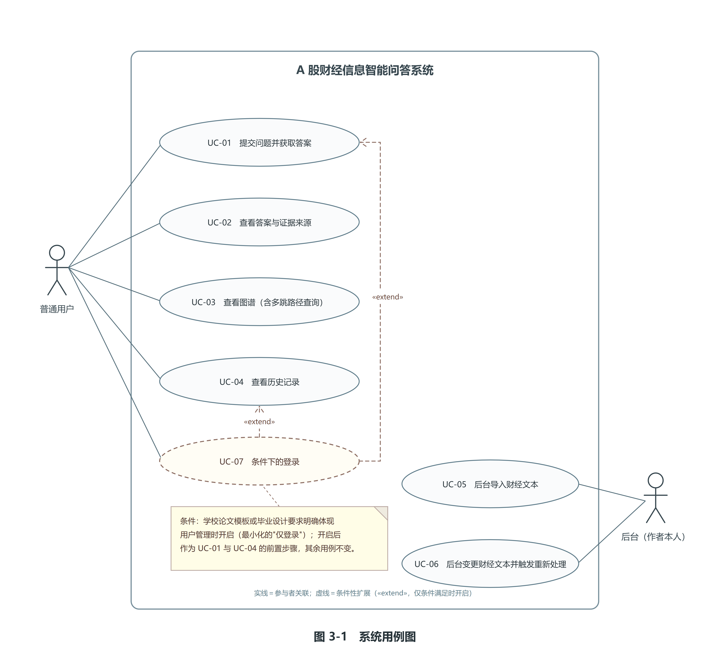

# 第3章 系统需求分析

## 3.1 用户角色分析

本系统只设置一个业务角色——普通用户。不设置第二种业务角色，不设置组织机构与审批流程，不做细粒度权限控制。这样收敛的原因是：本课题要验证的是知识图谱在财经问答检索中的作用，把开发精力集中在数据、图谱与检索方法上，比分散到用户体系上更有价值。

普通用户的职责范围包含四项：以自然语言提出财经信息问题并查看系统给出的答案；查看答案对应的来源与证据，包括新闻来源、公告来源与相关事件；查看事件知识图谱，包括实体、事件以及实体之间的路径；查看本会话此前的问答历史记录。

以下内容不属于普通用户的职责，而归后台：文本数据的导入、删除与更新；抽取规则与提示词的维护；图谱写入与向量索引更新；实验配置与评分。划分依据是统一的判定口径——凡是会改变数据、图谱与索引内容，或会改变实验配置的动作，全部归后台。后台的具体执行者是作者本人，通过脚本或受控后台入口完成，不以前台角色的形式出现。

关于注册与登录，本系统的执行决策是：第一版不启用注册与登录，用户直接进入系统即可使用上述四项功能。理由是系统面向的是公开的财经文本信息，不涉及个人隐私数据与敏感业务数据；在毕业设计的演示与实验场景下，登录环节只会增加联调工作量，而对本文的核心研究问题没有贡献。需要明确的是，不启用登录不等于匿名用户之间的历史记录互相可见：前端在首次访问时生成一个会话标识并保存在浏览器本地，问答记录携带该标识，历史记录按该标识过滤，从而把不同匿名会话的问答历史隔离开。

与这一决策配套的数据设计口径有三条。第一，用户表在数据模型中始终建立，第一版不写入数据，以保证表数量恒为六张、数据结构稳定。第二，问答相关表保留用户标识字段，登录未启用时该字段可以为空，以便后续启用登录时不需要改动问答主流程的数据结构。第三，表数量恒为六张，不新增表，也不因"不启用登录"而少建表。

这是条件性决策而非永久删除用户功能：若学校论文模板或毕业设计要求明确体现用户管理功能，则最小化开启"仅登录"——只提供登录入口与会话管理，不做注册、不做找回密码、不做多角色与细粒度权限。此时只需在现有用户表与后端接口上做最小改动即可满足。

## 3.2 功能需求

本系统的功能需求按六个模块组织，分别编号为 FR-01 至 FR-06。

FR-01 财经信息管理。该模块是后台系统能力，不对普通用户开放。由作者通过脚本或受控后台入口实现财经新闻、公告、政策等文本数据的导入、分类、清洗、查询、删除与更新。导入时记录标题、正文、发布时间、来源、URL、涉及公司与入库时间等字段，保证后续向量化与事件抽取有统一的数据入口。文档新增、修改或删除后，触发一次重新处理流程，使图谱与向量索引与文本内容保持一致。文档变更与重新处理的核心输出是统一入库的文档与文本块数据，以及重新处理后的图谱、向量索引与一致性检查结果。

FR-02 财经事件抽取。该模块同样属于后台数据加工环节，不向普通用户开放入口。系统从文本中识别公司、人物、行业、机构、政策五类实体以及时间与关系，并将抽取结果写入知识图谱。抽取结果需要保留证据来源，便于在问答环节回溯到原文：除证据关系外，其余八条核心语义关系都需要记录来源文档编号、来源文本块编号与置信度；证据关系本身即事件到文档的证据关系，不重复携带这三项属性。事件同样需要记录来源文档编号与置信度。抽取完成后进入实体消歧与事件去重环节。该模块的核心输出为四类抽取结果、带证据属性的图谱写入内容以及消歧与去重结果。

FR-03 事件知识图谱。该模块对普通用户开放查询与可视化，对后台开放写入与维护。系统支持实体查询、事件查询、关系查询、时间查询、多跳路径查询与图谱可视化。用户既可以直接检索某个实体或某类事件，也可以查看实体之间的路径，并查看路径上每条关系的方向、对端节点标识与证据属性。该模块的验证依据来自已有的图谱增强检索与多跳推理研究：图谱检索的价值主要体现在"语义相似度无法覆盖的关系路径"上，因此需求中必须包含多跳路径查询这一能力[10][11]。

FR-04 智能问答。普通用户输入自然语言问题，系统依次完成问题分析、文本检索、图谱检索、时间过滤、证据排序与大模型生成，返回自然语言回答。回答必须同时给出判定区间与数据截止时间说明，以及本次回答所依据的证据集合；对使用了图谱扩展的回答，还要给出对应的图谱路径。问题中的"最近""最新""近期"等相对时间表述一律按事件发生时间判定，并以数据截止时间为基准解释，而不是以系统运行当天为基准。

FR-05 证据追溯。答案下方展示回答来源、新闻来源、公告来源与相关事件，以及使用了图谱扩展时的图谱路径；若本次回答未使用图谱扩展，则显式标注"本次回答未使用图谱扩展"，不留空、不虚构路径。用户可以从答案直接定位到具体文档、文本块与图谱关系。该模块是本文的重点展示功能，也是现有工作在"答案能否同时回溯到具体文本块与具体图谱路径"这一方向上仍不充分的直接回应[12][21]。

FR-06 历史问答。系统保存用户问题、提问时间、回答与引用证据，支持后续查看，同时为实验统计提供数据来源。第一版不启用登录时，历史记录按浏览器生成的会话标识过滤，不同匿名会话之间不互相可见；启用登录后可把会话关联到用户标识。历史记录不需要独立的表：问题表记录问题，回答表记录回答，证据关联表记录答案引用的证据，三者通过编号关联即可还原完整的问答历史。该模块的输出是按会话标识过滤的历史问答列表，含问题、提问时间、回答与引用证据。

三个功能模块（FR-03、FR-04、FR-05）是本系统对普通用户开放的核心能力，FR-01 与 FR-02 是支撑这三个模块的数据生产环节，FR-06 是记录与回看环节。

## 3.3 用例分析

系统的参与者有两类：普通用户，以及作者本人。作者不在前台出现，通过脚本或受控后台入口在后台执行数据处理，本文简称为"后台"——这是一个操作位置，不是一个独立的系统角色。

普通用户的用例有五个，后台的用例有两个，此外还有一个条件性的登录用例。合并表述后，普通用户的用例为四条：提交问题并获取答案、查看答案与证据来源、查看图谱（含多跳路径查询）、查看历史记录；后台用例为两条：后台导入财经文本、后台变更财经文本并触发重新处理；条件性用例为一条：条件下的登录。之所以把"提交问题"与"查看答案"合并，"查看答案"与"查看来源"合并，是因为这两组动作在一次交互中连续完成、且在同一区域呈现。

用例关系可以概括为：普通用户提交问题，系统返回答案、判定区间说明与证据；普通用户查看来源，系统返回来源分类、图谱路径或未使用图谱扩展的标注；普通用户查看图谱，系统返回实体、事件与多跳路径；普通用户查看历史记录，系统返回按其会话标识过滤的问答历史；后台导入财经文本，系统完成统一入库；后台变更财经文本，系统触发重新处理与一致性检查。

图 3-1 给出系统用例图：两类参与者（普通用户与后台）、七个用例，以及条件性登录用例（UC-07）以 «extend» 关系对 UC-01（提交问题并获取答案）与 UC-04（查看历史记录）的扩展——仅当条件满足时开启（开启后作为两者的前置步骤，其余用例不变）。

图 3-1　系统用例图（PNG 路径：`交付物/09-图表/第3阶段图/图3-1-系统用例图.png`）

在主要流程之外，系统需要处理若干异常分支。以"提交问题并获取答案"为例，异常分支包括：输入为空或长度超出限制；缺少必填字段；参数格式错误或取值越界；图谱服务不可用；模型接口超时或返回异常；上游守卫触发而拒绝生成。这些分支在界面上必须给出明确提示，且不得出现未捕获异常导致的页面失效。

第一版不启用登录时，上述用例全部对匿名用户开放，但历史记录按会话标识过滤。若条件下开启"仅登录"，则在提交问题与查看历史记录之前增加一个登录步骤，其余用例不变。财经信息管理不在普通用户的用例中，属于后台系统能力。

## 3.4 非功能需求

本系统的非功能需求按六项编号，每项包含需求说明、可量化或可验证的验收口径与验证方法。验证方法明确对应本文第6章的测试类型，以避免需求与测试脱节。

NFR-01 响应时间。需求说明：问答请求需要在可接受的时间内返回，检索与生成的耗时要能分段统计，便于定位性能瓶颈。验收口径：在统一的测试环境下记录平均回答耗时与 P95 耗时，并分别记录向量检索、图谱查询与大模型生成的耗时。验证方法：对应 6.6 性能测试。该口径与系统指标与本文第6章性能测试保持一致。已有研究指出，端到端系统的评测应当把"参数配置—质量指标—性能指标"三者联动起来记录，而不是只报一个总体时延；本文的分段耗时设计即遵循这一原则[22]。

NFR-02 并发能力。需求说明：系统需支持小规模并发访问，不因并发请求出现崩溃或数据错乱。验收口径包含两项并列要求：一是 10 个用户并发发起问答请求时，系统不崩溃、不出现数据错乱，接口成功率不低于 95%；二是连续 100 次请求的成功率不低于 95%。两项口径在测试中使用同一套记录方式，且**不得只报告其中较高的那一个**。验证方法：对应 6.6 性能测试。

NFR-03 可维护性。需求说明：采用前后端分离与模块化设计，模块边界清晰；模型接口地址、数据库连接、检索参数等集中在配置文件中管理。验收口径：更换大模型接口或 Embedding 模型时不需要修改前端代码；按部署说明可在新环境中完成一次完整部署。验证方法：对应 6.4 功能测试，配合 6.1 测试环境与实验配置。

NFR-04 数据一致性。需求说明：系统不做实时同步；文档新增、修改或删除后，由系统触发重新处理并更新图数据库，必要时重建或增量更新向量索引，并提供一致性检查手段。验收口径：文档变更后通过一次重新处理流程完成图谱与向量索引更新，不残留失效数据；提供一致性检查手段，可核对抽取结果与图谱节点数量、文本块数与向量条数。本项有一处明确的限度：**不承诺**关系数据库、图数据库与向量索引之间的实时同步——三者承担不同职责，实时同步超出本科阶段可实现与可验证的范围，也会引入与课题核心问题无关的工程复杂度。相关研究在讨论多存储协同的系统实现时，同样采用"保留异构存储、通过统一编排协同"的路线，而不追求强一致[21]。验证方法：对应 6.4 功能测试，配合 6.1 测试环境与实验配置。

NFR-05 异常处理。需求说明：对模型接口超时、图谱查询为空、输入为空、文件格式错误等异常给出明确提示。验收口径：构造不少于 6 类异常场景逐一测试，系统不出现未捕获异常导致的页面失效或服务中断，错误提示不泄露密钥与内部堆栈信息。验证方法：对应 6.4 功能测试。其中"文件格式错误"的判定依据是允许的文件格式清单，该清单在实现阶段固定并与测试环境一同记录，以保证该场景可以构造、可以判定。

NFR-06 系统安全性。需求说明：接口密钥不写入前端代码，接口做输入校验与请求频率限制；口令加密存储的要求仅在启用登录功能的条件下适用。验收口径：密钥仅保存在后端环境变量或配置文件中；问答接口具备输入长度与请求频率的基本限制；若启用登录，则口令以摘要形式存储，不保存明文口令。验证方法：对应 6.5 接口测试，配合配置与代码核查。

非功能需求中出现的具体数值目标在系统首次测试后固化，并保证在系统指标与本文第6章性能测试中使用同一口径，避免出现前后不一致的表述。

## 3.5 可行性分析

本节是项目总体方案中可行性分析的展开，把已有结论落到需求层面：技术可行性对应技术需求边界，数据可行性对应数据来源与规模需求，时间可行性对应阶段工期与需求范围，风险与对策对应需求阶段需要防范的范围蔓延与验收风险。

技术可行性。本课题所用技术栈均为成熟方案：前端采用 Vue 3 负责页面，后端采用 Python 与 FastAPI 负责接口，关系数据库采用 MySQL 存储业务数据与文档元数据，图数据库采用 Neo4j 提供图存储与多跳查询，向量索引采用 FAISS 完成语义检索，Embedding 模型与大语言模型通过接口调用，Docker 用于统一运行环境。在需求层面的展开有三点：其一，检索、图谱扩展、时间过滤与证据排序由后端代码直接实现，不依赖额外的检索框架，模块边界清晰，调试时容易定位问题环节，与 FR-04 的分步需求一致；其二，数据规模按梯度逐步扩展，单台个人计算机即可承载向量索引与图数据库，因此 FR-01 的数据导入与重新处理需求、FR-03 的图谱查询需求在既定部署规模内可以满足；其三，技术选型不引入额外的高学习成本组件，需求分析阶段不提出任何新增技术需求。

数据可行性。数据来源选取公开可访问的信息——上市公司公告、监管机构公开信息、政策文件与正规财经新闻，并遵循相应网站的访问规范、使用条款与学校毕业设计的相关要求；系统与论文仅用于毕业设计的研究与演示，保留原始来源、来源类型与发布时间等元数据，不提供任何投资建议，不涉及个人隐私数据。在需求层面的展开有四点。第一，数据准备按"先小后大"三版推进：第一版约 10 家公司、100 篇文本，用于跑通数据导入、清洗、事件抽取、图谱写入、向量检索与问答的完整流程；第二版扩展到 50 家公司、500 篇文本；第三版扩展到 100 家以上公司、1000 篇以上文本，用于对比实验与消融实验。这与 FR-01 的统一入库需求、FR-02 的抽取需求相互支撑。第二，第一版不使用论坛类非正规来源数据，该类来源仅列为后续可扩展方向。第三，数据截止时间是数据集版本级属性，与数据集版本号成对记录在数据集元信息中，不由任何单篇文档携带，也不采用"取所有文档最晚时间"的推导口径；每篇文档入库时记录入库时间，并保留发布时间。第四，系统对外统一显示"数据截至"及日期，"最近""最新""近期"等相对时间表述一律以该版本属性为基准、并按事件发生时间判定。由此可以判断：数据的来源范围、规模梯度与元数据口径，足以支撑六个功能模块与后续实验的需求，不需要引入边界之外的数据来源。

时间可行性。本课题总周期约为四到五个月，按十二个阶段与四个里程碑推进，每个阶段都有明确产出物，论文写作与开发同步进行。需要特别说明的是，数据准备与事件抽取阶段的工期中已包含抽取评测集的标注工作以及实体消歧与事件去重的实现与核查，这两项工作不在时间压缩范围之内；时间紧张时可以削减功能扩展，但优先保证普通 RAG 与知识图谱增强问答跑通，因为它们决定了论文实验能否成立。需求分析阶段按既定工期产出的需求条目不超出该工期；后续如遇时间紧张，取舍原则仍是优先保证两项核心技术，而不是扩大需求范围。

风险与对策。第一，数据获取与合规风险：可能出现数据源页面结构变化、访问受限或抓取频率被限制等情况。对策是只使用公开可访问的四类来源，遵循访问规范与使用条款，控制抓取频率，保存来源与发布时间等元数据，仅在毕业设计的研究与演示范围内使用。该风险直接影响 FR-01 的前置条件，本系统不引入边界之外的数据来源。第二，事件抽取质量风险：可能出现实体漏抽、事件类型判断错误与时间抽取错误，导致图谱质量下降并通过检索环节传播到最终答案。对策是按"先小后大"策略先在小规模数据上核查抽取结果，整理高频错误清单并迭代抽取方案，用两段式抽取评测集量化迭代效果与最终抽取质量；同时在问答环节以原始文本证据为主、图谱关系为辅，并在失败案例分析中把抽取错误单列为一类归因。第三，知识图谱未带来增益的风险：可能出现知识图谱增强 RAG 与普通向量 RAG 的指标接近甚至更差的情况。对策是**把这本身当作可报告的实验结论**：按预设判定规则如实报告结果，做失败案例分析并按抽取错误、实体消歧错误、检索漏召回、时间判断错误与生成不忠实五类归因统计，把结论表述为"在什么条件下提供额外价值"，而不是预设知识图谱一定更强。因此本节**不把"图谱必然提升效果"写成需求或验收标准**，只把图谱扩展、时间过滤与证据追溯写成功能条目。第四，时间不足导致范围蔓延的风险：对策是按四个里程碑推进，优先保证两项核心技术；测试集规模可按预登记规则缩减，但标签体系与各类问题必须覆盖，且任何统计量都要注明统计范围；不增加超出边界的扩展功能。第五，大模型接口成本与稳定性风险：可能出现接口限流或超时、费用超出预算、生成结果不稳定等情况。对策是统一封装模型调用并设置超时与重试，对相同问题缓存结果，实验期间固定同一套模型配置并批量执行、保存原始输出，并在演示前验证接口可用性。

需要说明的是，以上第三、五两条风险在本课题的执行过程中均已被实际触发并有了明确处置结果。第三条风险（知识图谱未带来增益）**确实出现**：在 30 题预实验集上，知识图谱增强组与普通向量 RAG 组的四项检索指标完全持平，方法组最终证据集合中的图谱侧新增块一度为 0——这正是本节预先写下的"把这本身当作可报告的实验结论"的情形。据此本文按预登记规则完成了两件事：一是做加厚干预实验检验负结果是否源于图谱稀疏（把含两个以上公司参与方的事件由 16 个加厚到 286 个，约 18 倍），**结论没有翻转**，方法组的最终证据集合在加厚前后逐题相同；二是在正式 120 题全量实验上按预登记判定规则给出正式结论，**知识图谱在正式集上确实带来额外检索价值**（核心 108 题 Complete Evidence Recall@K 由 0.715686 提高到 0.809524）。这一"预实验持平、正式集提升"的方向差异已如实登记在第6章 6.7 至 6.10 四节，两套读数分别标注落点、并存而不可混引。第五条风险（接口成本与稳定性）同样被触发：正式全量实验共需约 720 次模型调用，通过统一封装、超时重试、批量执行与原始留痕得到控制，调用账已登记在第6章。
