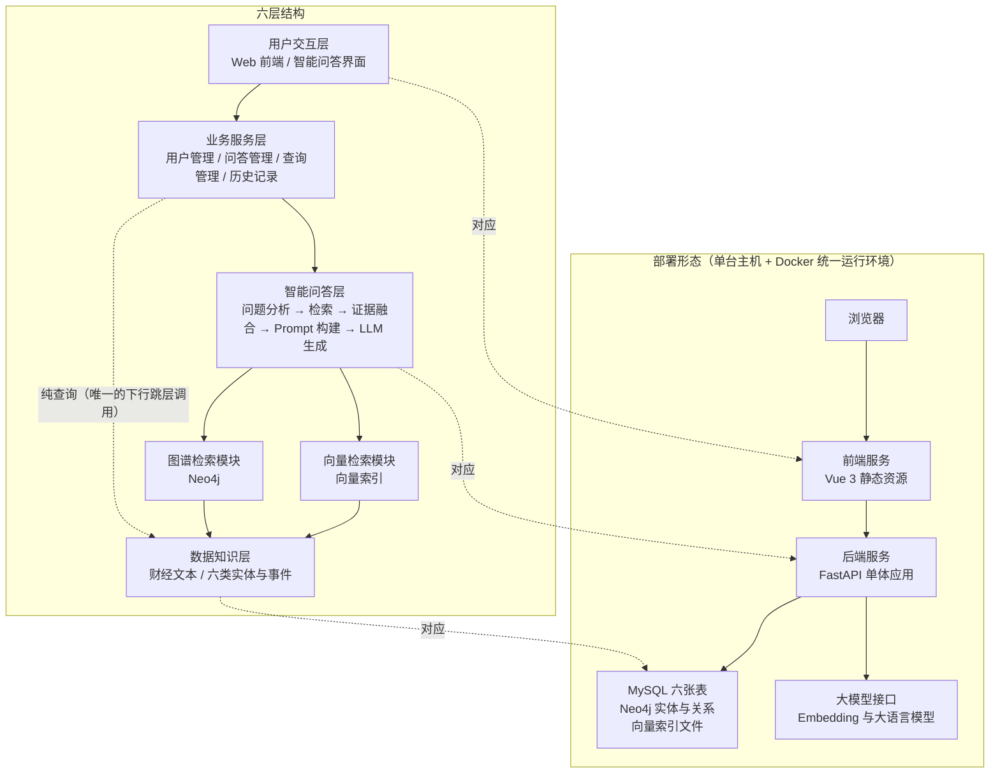
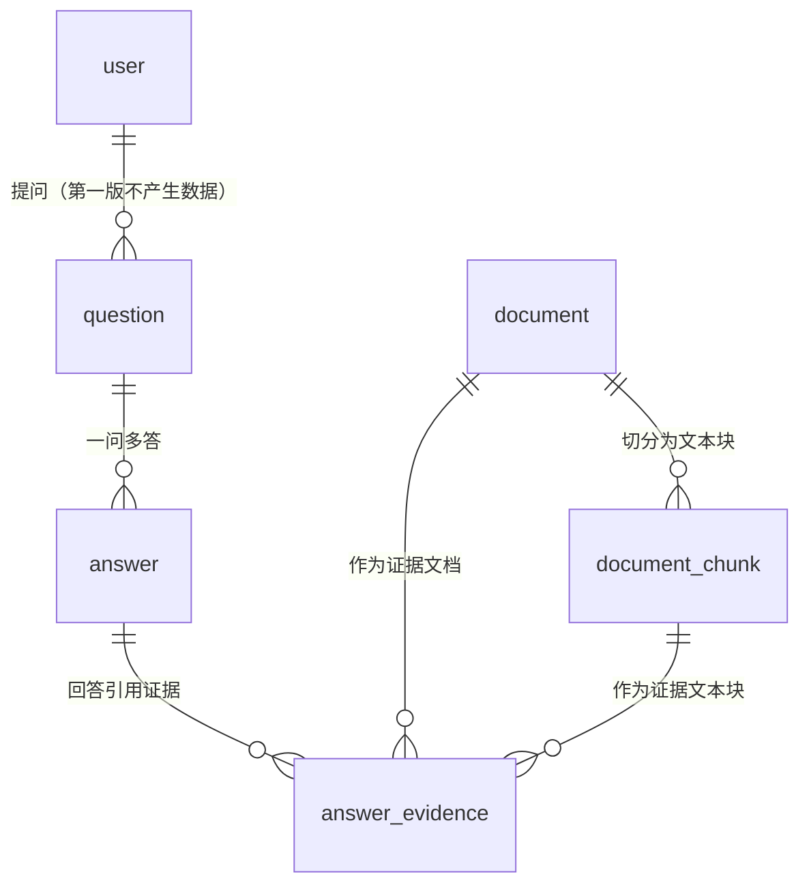
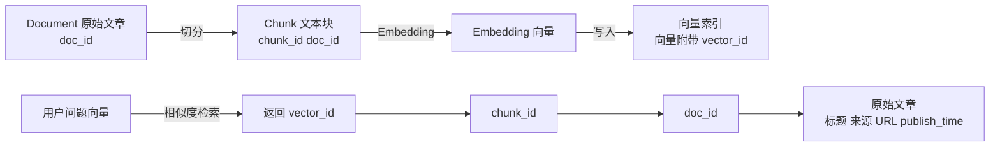
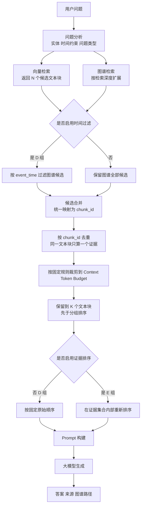
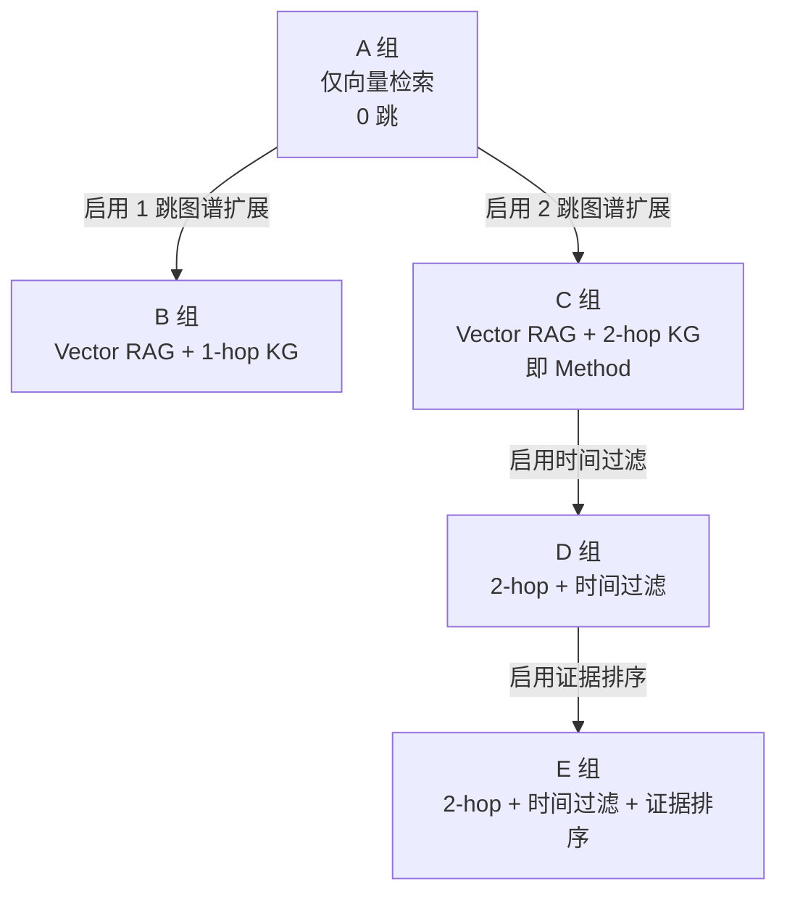

# 源文件：交付物/07-设计与需求/总体设计/10-系统总体设计（第四阶段）.md
# 提取方式：按 Markdown 标题匹配（整节含子节，至同级或更高级标题为止）

====================================================================================================
## 节标题：### 4.1 系统总体架构
## 原文行号：第 55 行 至 第 147 行
====================================================================================================
### 4.1 系统总体架构

本节给出系统的整体结构：六层架构与各层职责（《02》第8.1节、第8.2节 冻结）、层间调用关系、部署形态与技术栈（《02》第8.3节、第8.4节 冻结），并说明架构对《07》NFR-01 与 NFR-03 的支撑方式。本节的层次名称、层次顺序与技术选型不得改动；本节不引入《02》第8.4节 清单之外的任何组件。

#### 4.1.1 六层架构图与部署形态

系统采用六层结构（图 4-1）。层次顺序与名称与《02》第8.1节 一致：用户交互层 → 业务服务层 → 智能问答层 → 向量检索模块 ‖ 图谱检索模块 → 数据知识层。其中第三层之下并行存在两个检索模块，二者互不调用，均向智能问答层提供候选证据，并在第四层之下由数据知识层统一提供数据来源。同图右侧给出部署形态：系统按**单体后端 ＋ 前后端分离**的方式部署在一台机器上，不采用微服务架构、不引入容器编排系统，Docker 只用于**统一运行环境**（《02》第8.4节 冻结）。



<p align="center">图 4-1　六层架构与部署形态（层次顺序与《02》第8.1节 一致）</p>

图 4-1 中除了"用户交互层 → 业务服务层 → 智能问答层 → 两个检索模块 → 数据知识层"这条主链，还有一条**虚线箭头**：**业务服务层 ⇢ 数据知识层（纯查询）**。它是 4.1.2 表 4-1 中"业务服务层 → 数据知识层"那条唯一的下行跳层调用在架构图上的表示，用于历史记录查询与证据明细查询——这两类请求是纯读操作，经过问答层不会产生任何增值处理。虚线同时标明它**不参与智能问答检索链路**：检索链路上的数据访问只发生在两个检索模块与数据知识层之间。

数据知识层的完整内容包括：原始财经信息（新闻、公告、政策）与从文本中抽取的结构化知识（事件、公司、行业、机构、人物、政策六类实体）。**时间信息不作为独立实体列出**：它以 Event 节点的 event_time、关系属性 valid_from／valid_to 与数据集版本级属性 data_cutoff_time 三种形式表达（《02》第10.1节 冻结，判定规则见 4.4 与 4.5）。

关于部署形态的四条说明。第一，**前端与后端分离**：前端为 Vue 3 构建的静态资源，后端为 FastAPI 单体应用，二者通过 REST 接口通信（4.7）。第二，**后端为单体应用**：问答、数据、图谱与历史记录接口由同一个后端进程提供，检索、图谱扩展、时间过滤与证据排序流程由后端代码直接实现，不引入框架封装（《02》第8.4节）。第三，**两个存储与一个索引并列**：MySQL 负责业务数据与文档元数据，是文本内容的唯一权威来源；Neo4j 负责实体、事件与关系，支撑多跳路径与时间查询；向量索引只负责文本语义相似度检索，不保存权威文本，只保存向量与索引结构（《02》第9.3节）。第四，**模型通过接口调用**：Embedding 模型与大语言模型均通过后端配置项接入的外部接口调用，不在本地训练与部署大模型；接口地址与凭据保存在后端配置中，不出现在前端代码里（对应 4.7 的 NFR-06）。本文件不展开容器编排、持续集成、监控告警与备份恢复方案——这些属于部署运维细节，不是本阶段的设计内容（《09》第六节 非目标 3）。

需要特别说明一处术语口径：图中"向量检索模块"在实现上对应《02》第9.3节 的向量索引，FAISS 是向量相似度检索库（索引库），提供向量索引构建与相似度检索能力，**不提供独立服务进程、分布式部署、数据持久化与事务管理等数据库特性**，因此本文件统一表述为"向量索引"或"向量检索组件"，不按"…[此处原文为《12》检查 P 的禁用词，本报告不写出；已标注截断]…"表述（《02》第9.3节）。

#### 4.1.2 各层职责与层间调用关系

表 4-1 把各层职责、输入输出与层间调用关系合并给出。职责描述与《02》第8.2节 一致；输入输出是为使接口契约可核查而补充的说明，来源是《07》FR-01～FR-06 的输入与输出字段。

**表 4-1　各层职责、输入输出与层间调用关系**

| 层次 | 主要职责 | 输入 | 输出 | 被谁调用 → 调用谁 | 对应需求 |
| --- | --- | --- | --- | --- | --- |
| 用户交互层 | 提供问答输入、答案展示、来源与证据查看、图谱可视化与历史记录等页面；只负责界面与交互逻辑，**不直接访问数据库与模型** | 用户输入的问题、图谱查询条件、页面操作 | 提交给业务服务层的请求；展示给用户的答案、证据列表、图谱可视化数据与历史记录 | 用户 → 本层；本层 → 业务服务层（只此一条出口） | FR-03、FR-04、FR-05、FR-06 |
| 业务服务层 | 用户管理、问答管理、查询管理与历史记录；接收前端请求、校验参数、组织业务流程并返回结果；每一次提问、回答与引用证据都由该层落库 | 用户交互层的请求；智能问答层返回的答案、证据集合与图谱路径 | 面向用户交互层的响应体；写入 MySQL 的 question、answer 与 answer_evidence 记录 | 用户交互层 → 本层；本层 → 智能问答层；本层 → 数据知识层（纯查询，唯一的下行跳层调用） | FR-04、FR-05、FR-06 |
| 智能问答层 | 系统的核心处理单元，依次完成问题分析、检索、证据融合、Prompt 构建与大模型生成；问题分析判定问题类型与是否需要图谱扩展，证据融合把两路检索结果合并排序 | 问题文本、实体与时间约束；两路检索模块返回的候选文本块、图谱路径与事件属性 | 自然语言答案；最终证据集合；使用了图谱扩展时的图谱路径 | 业务服务层 → 本层；本层 → 两个检索模块；本层 → 大模型接口 | FR-04 |
| 向量检索模块 | 基于 FAISS 完成文本语义检索，输入是问题的向量表示，输出是候选文本块及其对应文档编号，用于提供原始文本证据 | 用户问题向量；候选数量 N 与裁剪上限 K（《02》第12.4节、第12.7节） | 候选文本块及其 doc_id、chunk_id 与向量检索的原始排名 | 智能问答层 → 本层；本层 → 数据知识层（只读） | FR-04 |
| 图谱检索模块 | 基于 Neo4j 完成实体、事件与关系的多跳查询，输出实体路径、事件属性与关联关系，用于补充文本检索难以覆盖的关系信息与时间信息 | 问题中的实体、时间约束与检索深度（0／1／2 跳） | 实体与事件节点、关系路径（含 role 与证据属性）、事件六项核心属性 | 智能问答层 → 本层；本层 → 数据知识层（只读） | FR-03、FR-04 |
| 数据知识层 | 统一管理新闻、公告、政策等原始财经信息，以及抽取出的六类实体、事件与关系等结构化知识；是向量检索与图谱检索共同的数据来源 | 后台导入的财经文本；抽取与消歧去重结果；重新处理指令 | MySQL 中的文档与文本块；Neo4j 中的实体、事件与关系；向量索引中的向量与三级编号 | 两个检索模块 → 本层（只读）；业务服务层 → 本层（只读）；后台脚本 → 本层（写入） | FR-01、FR-02 |

层间调用遵循两条约束，二者都是可核查的设计约束而不是实现建议。第一，**逐层向下调用，不跨层访问**：用户交互层只调用业务服务层；业务服务层只调用智能问答层；智能问答层调用两个检索模块；两个检索模块只访问数据知识层。用户交互层不得直连 MySQL、Neo4j 或向量索引，也不得直接调用大模型接口。第二，**两个检索模块互不调用**：向量检索的候选文本块与图谱检索的路径在智能问答层汇聚，由证据融合环节统一处理。这样划分的作用是使消融实验的变量可控制——A 组（仅向量检索）与 B／C 组（叠加图谱扩展）的差别只在于是否启用图谱检索模块，而不是在于某个模块内部的分支。

表 4-1 中"业务服务层 → 数据知识层"是**唯一的下行跳层调用**：历史记录与证据明细是纯查询，经过问答层不会产生任何增值处理，因此由业务服务层直接查询。该例外在 4.2 的模块间依赖中同样标注，以保证两处口径一致。第一版不启用登录时，业务服务层的用户管理模块保留最小形态（仅按《07》UC-07 的条件性决策保留接口位置），问答管理、查询管理与历史记录正常提供（《02》第8.2节）。

#### 4.1.3 技术栈

技术栈与《02》第8.3节 的技术栈固定表一致，模块、选型、用途与理由均不新增、不替换；此处以正文列出，避免与《02》形成两处需要同步维护的表。

- **前端 —— Vue 3**：实现智能问答界面、知识图谱可视化、来源与证据查看与历史记录页面。选型理由：组件化开发，上手成本低，适合单人完成界面部分。
- **后端 —— Python + FastAPI**：提供问答、数据、图谱、历史记录等接口，串联检索与生成流程。选型理由：Python 与数据处理、AI 生态一致，FastAPI 轻量且接口定义清晰、便于调试与测试。
- **关系数据库 —— MySQL**：存储用户、文档元数据、文本块、问题、回答与证据关联。选型理由：关系模型适合结构化业务数据，增删改查与事务处理成熟。
- **图数据库 —— Neo4j**：存储实体、事件与关系，支持多跳路径查询。选型理由：原生图存储与 Cypher 查询语言适合表达多跳关系与路径检索。
- **向量索引 —— FAISS**：保存文本块向量并完成相似度检索。选型理由：FAISS 本质是向量相似度检索库（索引库），轻量、可本地运行、不依赖额外服务，适合本科阶段的数据规模。
- **模型 —— Embedding 模型 + 大语言模型 API**：Embedding 模型负责文本与问题的向量化，大语言模型 API 负责基于证据生成答案。选型理由：不本地训练与部署大模型，把精力集中在系统设计与检索方法上；**Embedding 模型及其 revision 已在《02》第12.4节 与《13-数据准备（第五阶段）》第四节（向量化口径）中固化——`BAAI/bge-small-zh-v1.5`，HuggingFace revision `7999e1d3359715c523056ef9478215996d62a620`，512 维，L2 归一化，FAISS `IndexFlatIP`（内积＝余弦相似度）；大语言模型的名称与版本仍 TBD（选型后固化）**。
- **数据处理 —— Python**：数据清洗、文本切分、实体识别、事件抽取、实体消歧、事件去重与图谱写入。选型理由：与后端语言一致，脚本可复用，便于长期维护。
- **部署 —— Docker**：统一运行环境，打包后端与依赖服务。选型理由：降低环境差异带来的部署问题，便于答辩现场快速启动。

模型一项的版本链需要写明：本文件编写时，Embedding 模型与大语言模型在《02》第12.4节 的实验配置固定表中均标注"选型后固化"，因此本节只给出接入方式、**不写死型号**；此后《02》v2.6 已把 **Embedding 模型及其 revision 固化**——`BAAI/bge-small-zh-v1.5`，HuggingFace revision `7999e1d3359715c523056ef9478215996d62a620`，512 维，L2 归一化，FAISS `IndexFlatIP`（内积＝余弦相似度），落点见《02》第12.4节 与《13-数据准备（第五阶段）》第四节；**只剩大语言模型的名称与版本保持 TBD（选型后固化）**。本文件只登记"该值已在 v2.6 固化"这一事实，不做选型。系统支持多模型切换，两种模型都通过配置项接入，更换模型不需要修改前端代码。技术栈的边界同样固定：本课题不引入 LangChain 与 LlamaIndex，不引入 Milvus、Qdrant、Weaviate 等独立…[此处原文为《12》检查 P 的禁用词，本报告不写出；已标注截断]…系统，不引入 Elasticsearch 等独立检索引擎，不引入 Kafka、微服务架构与 Kubernetes，也不引入 Agent 框架与多智能体编排、多模态与语音能力、实时行情与实时推送（《02》第8.4节 冻结）。

#### 4.1.4 架构对非功能需求的支撑

**对 NFR-01（响应时间）的支撑**：分层结构使一次问答的耗时可以被分段记录。图 4-1 中"智能问答层 → 向量检索模块"与"智能问答层 → 图谱检索模块"是两条独立的调用路径，各自返回后进入证据融合，因此向量检索耗时与图谱查询耗时可以分别计时；大模型生成耗时在"智能问答层 → 大模型接口"这一步记录。**三个计时点分别是向量检索调用处、图谱查询调用处与大模型调用处**，三段耗时相加得到单次问答的总耗时，业务服务层按《02》第7节 的口径记录平均回答耗时与 P95 耗时。架构上的要求是三个计时点必须落在层间调用边界上，而不是落在某个函数内部，这样计时口径与论文第 6 章的测试口径一致。

**对 NFR-03（可维护性）的支撑**：三条设计约束共同支撑可维护性。一是**前后端分离**：前端只通过 REST 接口与后端交互，模型接口地址、数据库连接与检索参数集中在后端配置文件中管理，因此更换大模型 API 或 Embedding 模型时不需要修改前端代码。二是**逐层向下调用**：更换向量检索实现（例如调整 FAISS 索引类型）只影响向量检索模块内部，不波及业务服务层与用户交互层；更换图谱数据组织方式只影响图谱检索模块与数据知识层。三是**模块边界清晰**：六个功能模块与层次的对应关系在 4.2 给出，每个模块的职责与输入输出在表 4-2 中逐条列出，便于按模块维护与测试。

---

====================================================================================================
## 节标题：#### 4.1.1 六层架构图与部署形态
## 原文行号：第 59 行 至 第 105 行
====================================================================================================
#### 4.1.1 六层架构图与部署形态

系统采用六层结构（图 4-1）。层次顺序与名称与《02》第8.1节 一致：用户交互层 → 业务服务层 → 智能问答层 → 向量检索模块 ‖ 图谱检索模块 → 数据知识层。其中第三层之下并行存在两个检索模块，二者互不调用，均向智能问答层提供候选证据，并在第四层之下由数据知识层统一提供数据来源。同图右侧给出部署形态：系统按**单体后端 ＋ 前后端分离**的方式部署在一台机器上，不采用微服务架构、不引入容器编排系统，Docker 只用于**统一运行环境**（《02》第8.4节 冻结）。


<p align="center">图 4-1　六层架构与部署形态（层次顺序与《02》第8.1节 一致）</p>

图 4-1 中除了"用户交互层 → 业务服务层 → 智能问答层 → 两个检索模块 → 数据知识层"这条主链，还有一条**虚线箭头**：**业务服务层 ⇢ 数据知识层（纯查询）**。它是 4.1.2 表 4-1 中"业务服务层 → 数据知识层"那条唯一的下行跳层调用在架构图上的表示，用于历史记录查询与证据明细查询——这两类请求是纯读操作，经过问答层不会产生任何增值处理。虚线同时标明它**不参与智能问答检索链路**：检索链路上的数据访问只发生在两个检索模块与数据知识层之间。

数据知识层的完整内容包括：原始财经信息（新闻、公告、政策）与从文本中抽取的结构化知识（事件、公司、行业、机构、人物、政策六类实体）。**时间信息不作为独立实体列出**：它以 Event 节点的 event_time、关系属性 valid_from／valid_to 与数据集版本级属性 data_cutoff_time 三种形式表达（《02》第10.1节 冻结，判定规则见 4.4 与 4.5）。

关于部署形态的四条说明。第一，**前端与后端分离**：前端为 Vue 3 构建的静态资源，后端为 FastAPI 单体应用，二者通过 REST 接口通信（4.7）。第二，**后端为单体应用**：问答、数据、图谱与历史记录接口由同一个后端进程提供，检索、图谱扩展、时间过滤与证据排序流程由后端代码直接实现，不引入框架封装（《02》第8.4节）。第三，**两个存储与一个索引并列**：MySQL 负责业务数据与文档元数据，是文本内容的唯一权威来源；Neo4j 负责实体、事件与关系，支撑多跳路径与时间查询；向量索引只负责文本语义相似度检索，不保存权威文本，只保存向量与索引结构（《02》第9.3节）。第四，**模型通过接口调用**：Embedding 模型与大语言模型均通过后端配置项接入的外部接口调用，不在本地训练与部署大模型；接口地址与凭据保存在后端配置中，不出现在前端代码里（对应 4.7 的 NFR-06）。本文件不展开容器编排、持续集成、监控告警与备份恢复方案——这些属于部署运维细节，不是本阶段的设计内容（《09》第六节 非目标 3）。

需要特别说明一处术语口径：图中"向量检索模块"在实现上对应《02》第9.3节 的向量索引，FAISS 是向量相似度检索库（索引库），提供向量索引构建与相似度检索能力，**不提供独立服务进程、分布式部署、数据持久化与事务管理等数据库特性**，因此本文件统一表述为"向量索引"或"向量检索组件"，不按"…[此处原文为《12》检查 P 的禁用词，本报告不写出；已标注截断]…"表述（《02》第9.3节）。

====================================================================================================
## 节标题：#### 4.1.2 各层职责与层间调用关系
## 原文行号：第 106 行 至 第 124 行
====================================================================================================
#### 4.1.2 各层职责与层间调用关系

表 4-1 把各层职责、输入输出与层间调用关系合并给出。职责描述与《02》第8.2节 一致；输入输出是为使接口契约可核查而补充的说明，来源是《07》FR-01～FR-06 的输入与输出字段。

**表 4-1　各层职责、输入输出与层间调用关系**

| 层次 | 主要职责 | 输入 | 输出 | 被谁调用 → 调用谁 | 对应需求 |
| --- | --- | --- | --- | --- | --- |
| 用户交互层 | 提供问答输入、答案展示、来源与证据查看、图谱可视化与历史记录等页面；只负责界面与交互逻辑，**不直接访问数据库与模型** | 用户输入的问题、图谱查询条件、页面操作 | 提交给业务服务层的请求；展示给用户的答案、证据列表、图谱可视化数据与历史记录 | 用户 → 本层；本层 → 业务服务层（只此一条出口） | FR-03、FR-04、FR-05、FR-06 |
| 业务服务层 | 用户管理、问答管理、查询管理与历史记录；接收前端请求、校验参数、组织业务流程并返回结果；每一次提问、回答与引用证据都由该层落库 | 用户交互层的请求；智能问答层返回的答案、证据集合与图谱路径 | 面向用户交互层的响应体；写入 MySQL 的 question、answer 与 answer_evidence 记录 | 用户交互层 → 本层；本层 → 智能问答层；本层 → 数据知识层（纯查询，唯一的下行跳层调用） | FR-04、FR-05、FR-06 |
| 智能问答层 | 系统的核心处理单元，依次完成问题分析、检索、证据融合、Prompt 构建与大模型生成；问题分析判定问题类型与是否需要图谱扩展，证据融合把两路检索结果合并排序 | 问题文本、实体与时间约束；两路检索模块返回的候选文本块、图谱路径与事件属性 | 自然语言答案；最终证据集合；使用了图谱扩展时的图谱路径 | 业务服务层 → 本层；本层 → 两个检索模块；本层 → 大模型接口 | FR-04 |
| 向量检索模块 | 基于 FAISS 完成文本语义检索，输入是问题的向量表示，输出是候选文本块及其对应文档编号，用于提供原始文本证据 | 用户问题向量；候选数量 N 与裁剪上限 K（《02》第12.4节、第12.7节） | 候选文本块及其 doc_id、chunk_id 与向量检索的原始排名 | 智能问答层 → 本层；本层 → 数据知识层（只读） | FR-04 |
| 图谱检索模块 | 基于 Neo4j 完成实体、事件与关系的多跳查询，输出实体路径、事件属性与关联关系，用于补充文本检索难以覆盖的关系信息与时间信息 | 问题中的实体、时间约束与检索深度（0／1／2 跳） | 实体与事件节点、关系路径（含 role 与证据属性）、事件六项核心属性 | 智能问答层 → 本层；本层 → 数据知识层（只读） | FR-03、FR-04 |
| 数据知识层 | 统一管理新闻、公告、政策等原始财经信息，以及抽取出的六类实体、事件与关系等结构化知识；是向量检索与图谱检索共同的数据来源 | 后台导入的财经文本；抽取与消歧去重结果；重新处理指令 | MySQL 中的文档与文本块；Neo4j 中的实体、事件与关系；向量索引中的向量与三级编号 | 两个检索模块 → 本层（只读）；业务服务层 → 本层（只读）；后台脚本 → 本层（写入） | FR-01、FR-02 |

层间调用遵循两条约束，二者都是可核查的设计约束而不是实现建议。第一，**逐层向下调用，不跨层访问**：用户交互层只调用业务服务层；业务服务层只调用智能问答层；智能问答层调用两个检索模块；两个检索模块只访问数据知识层。用户交互层不得直连 MySQL、Neo4j 或向量索引，也不得直接调用大模型接口。第二，**两个检索模块互不调用**：向量检索的候选文本块与图谱检索的路径在智能问答层汇聚，由证据融合环节统一处理。这样划分的作用是使消融实验的变量可控制——A 组（仅向量检索）与 B／C 组（叠加图谱扩展）的差别只在于是否启用图谱检索模块，而不是在于某个模块内部的分支。

表 4-1 中"业务服务层 → 数据知识层"是**唯一的下行跳层调用**：历史记录与证据明细是纯查询，经过问答层不会产生任何增值处理，因此由业务服务层直接查询。该例外在 4.2 的模块间依赖中同样标注，以保证两处口径一致。第一版不启用登录时，业务服务层的用户管理模块保留最小形态（仅按《07》UC-07 的条件性决策保留接口位置），问答管理、查询管理与历史记录正常提供（《02》第8.2节）。

====================================================================================================
## 节标题：#### 4.1.3 技术栈
## 原文行号：第 125 行 至 第 139 行
====================================================================================================
#### 4.1.3 技术栈

技术栈与《02》第8.3节 的技术栈固定表一致，模块、选型、用途与理由均不新增、不替换；此处以正文列出，避免与《02》形成两处需要同步维护的表。

- **前端 —— Vue 3**：实现智能问答界面、知识图谱可视化、来源与证据查看与历史记录页面。选型理由：组件化开发，上手成本低，适合单人完成界面部分。
- **后端 —— Python + FastAPI**：提供问答、数据、图谱、历史记录等接口，串联检索与生成流程。选型理由：Python 与数据处理、AI 生态一致，FastAPI 轻量且接口定义清晰、便于调试与测试。
- **关系数据库 —— MySQL**：存储用户、文档元数据、文本块、问题、回答与证据关联。选型理由：关系模型适合结构化业务数据，增删改查与事务处理成熟。
- **图数据库 —— Neo4j**：存储实体、事件与关系，支持多跳路径查询。选型理由：原生图存储与 Cypher 查询语言适合表达多跳关系与路径检索。
- **向量索引 —— FAISS**：保存文本块向量并完成相似度检索。选型理由：FAISS 本质是向量相似度检索库（索引库），轻量、可本地运行、不依赖额外服务，适合本科阶段的数据规模。
- **模型 —— Embedding 模型 + 大语言模型 API**：Embedding 模型负责文本与问题的向量化，大语言模型 API 负责基于证据生成答案。选型理由：不本地训练与部署大模型，把精力集中在系统设计与检索方法上；**Embedding 模型及其 revision 已在《02》第12.4节 与《13-数据准备（第五阶段）》第四节（向量化口径）中固化——`BAAI/bge-small-zh-v1.5`，HuggingFace revision `7999e1d3359715c523056ef9478215996d62a620`，512 维，L2 归一化，FAISS `IndexFlatIP`（内积＝余弦相似度）；大语言模型的名称与版本仍 TBD（选型后固化）**。
- **数据处理 —— Python**：数据清洗、文本切分、实体识别、事件抽取、实体消歧、事件去重与图谱写入。选型理由：与后端语言一致，脚本可复用，便于长期维护。
- **部署 —— Docker**：统一运行环境，打包后端与依赖服务。选型理由：降低环境差异带来的部署问题，便于答辩现场快速启动。

模型一项的版本链需要写明：本文件编写时，Embedding 模型与大语言模型在《02》第12.4节 的实验配置固定表中均标注"选型后固化"，因此本节只给出接入方式、**不写死型号**；此后《02》v2.6 已把 **Embedding 模型及其 revision 固化**——`BAAI/bge-small-zh-v1.5`，HuggingFace revision `7999e1d3359715c523056ef9478215996d62a620`，512 维，L2 归一化，FAISS `IndexFlatIP`（内积＝余弦相似度），落点见《02》第12.4节 与《13-数据准备（第五阶段）》第四节；**只剩大语言模型的名称与版本保持 TBD（选型后固化）**。本文件只登记"该值已在 v2.6 固化"这一事实，不做选型。系统支持多模型切换，两种模型都通过配置项接入，更换模型不需要修改前端代码。技术栈的边界同样固定：本课题不引入 LangChain 与 LlamaIndex，不引入 Milvus、Qdrant、Weaviate 等独立…[此处原文为《12》检查 P 的禁用词，本报告不写出；已标注截断]…系统，不引入 Elasticsearch 等独立检索引擎，不引入 Kafka、微服务架构与 Kubernetes，也不引入 Agent 框架与多智能体编排、多模态与语音能力、实时行情与实时推送（《02》第8.4节 冻结）。

====================================================================================================
## 节标题：#### 4.1.4 架构对非功能需求的支撑
## 原文行号：第 140 行 至 第 147 行
====================================================================================================
#### 4.1.4 架构对非功能需求的支撑

**对 NFR-01（响应时间）的支撑**：分层结构使一次问答的耗时可以被分段记录。图 4-1 中"智能问答层 → 向量检索模块"与"智能问答层 → 图谱检索模块"是两条独立的调用路径，各自返回后进入证据融合，因此向量检索耗时与图谱查询耗时可以分别计时；大模型生成耗时在"智能问答层 → 大模型接口"这一步记录。**三个计时点分别是向量检索调用处、图谱查询调用处与大模型调用处**，三段耗时相加得到单次问答的总耗时，业务服务层按《02》第7节 的口径记录平均回答耗时与 P95 耗时。架构上的要求是三个计时点必须落在层间调用边界上，而不是落在某个函数内部，这样计时口径与论文第 6 章的测试口径一致。

**对 NFR-03（可维护性）的支撑**：三条设计约束共同支撑可维护性。一是**前后端分离**：前端只通过 REST 接口与后端交互，模型接口地址、数据库连接与检索参数集中在后端配置文件中管理，因此更换大模型 API 或 Embedding 模型时不需要修改前端代码。二是**逐层向下调用**：更换向量检索实现（例如调整 FAISS 索引类型）只影响向量检索模块内部，不波及业务服务层与用户交互层；更换图谱数据组织方式只影响图谱检索模块与数据知识层。三是**模块边界清晰**：六个功能模块与层次的对应关系在 4.2 给出，每个模块的职责与输入输出在表 4-2 中逐条列出，便于按模块维护与测试。

---

====================================================================================================
## 节标题：#### 4.2.3 各模块的边界与不做的事
## 原文行号：第 221 行 至 第 236 行
====================================================================================================
#### 4.2.3 各模块的边界与不做的事

以下逐模块给出边界。这些边界与 4.3 的异常分支、4.7 的接口错误码一一对应，是"设计不越界"的检查依据。

**模块一（FR-01）**：本模块是后台系统能力，**不对普通用户开放，不在普通用户用例中**；不包含预测与投资决策类的任何处理；**不承诺 MySQL、Neo4j 与向量索引之间的实时同步**，只承诺"变更后重新处理 ＋ 一致性检查"；删除与修改操作都受 4.4 的历史证据保护规则约束（已被 answer_evidence 引用的文档禁止物理删除，也禁止原地修改，修改须以新 doc_id 重新导入，见 4.4.2 的规则 3）。

**模块二（FR-02）**：Product（产品）与 Location（地点）不进入第一版本体、抽取规则与评测范围；标注过程中发现的本体边界问题记录在标注说明中，不临时增加关系类型；图谱关系只表示公开信息中出现的关联，不得表述为因果关系（《02》第9.2.1节、第12.3节、第5.3节）。本模块的抽取质量由《02》第12.3节 的两段式抽取评测集衡量：Dev 集 50～100 条（建议 60 条）用于规则与 Prompt 的迭代核查，Test 集 200 条在规则冻结后一次性评测，两集合不重叠，分别计算实体、事件、关系、时间四类任务的 Precision、Recall 与 F1；本文件只引用该评测口径，不重新论证（《09》第六节 非目标 7）。

**模块三（FR-03）**：不做预测类分析，不提供投资决策结论；图谱中的关系只表示公开信息中出现的关联，不能表述为因果关系，也不能由两家公司之间存在供应链关系直接推导出其中一方必然受到影响；查询涉及的关系不在 9 条核心关系之内时，不临时增加关系类型，按本体适用边界记录并提示（《02》第5.3节、第12.3节）。本模块的检索深度（1 跳／2 跳）是**实验自变量**，与 question 表的 gold_hop_depth（**问题的金标准属性**）不是同一概念，不得使用同一字段、同一术语或同一统计口径（《02》第12.2节）。

**模块四（FR-04）**：不提供预测与投资决策类回答；定量实验只使用可核验的事实型问题，开放式分析问题只用于 Demo 展示与案例分析、最多保留 1～2 例、必须在页面与答案中同屏标注"模型分析（非公开事实）"、不作为核心准确率依据、不参与图谱增强效果的判定、不计入任何指标；"最新／最近／近期"一律以 event_time 判定，不以 publish_time 判定，也不以系统运行当天为基准（《02》第12.9节、第10.3节）。

**模块五（FR-05）**：0 跳问题（仅凭文本检索即可回答）以及未启用图谱扩展的实验组（Baseline 1、Baseline 2 与消融 A 组）客观上不存在图谱路径，**不得强行生成或展示虚构的图谱路径**；图谱关联只表示公开信息中出现的关联，不得表述为因果结论；本模块不新增证据类型，不引入独立于 answer_evidence 的证据来源（《02》第13节、第5.3节）。

**模块六（FR-06）**：历史记录不需要独立的表——question 记录问题、answer 记录回答、answer_evidence 记录答案引用的证据，三者通过 question_id 与 answer_id 关联即可还原完整的问答历史，**表数量恒为六张**；不做多角色与细粒度权限，第一版不启用登录时也不提供跨会话或跨用户的全局历史；历史记录不涉及个人隐私数据（《02》第6.2节 功能 6、第9.1节、第6.1节）。

====================================================================================================
## 节标题：### 4.4 数据库设计
## 原文行号：第 432 行 至 第 598 行
====================================================================================================
### 4.4 数据库设计

本节给出 MySQL 六张表的字段级设计、索引与外键的口径、ER 图，以及 session_id、data_cutoff_time 与 answer.graph_path 三处需要特别说明的内容。表的数量与职责沿用《02》第9.1节：**恒为六张**——user、document、document_chunk、question、answer、answer_evidence，不新增表；history 表已删除、不复活。本节不写完整建表语句，仅在必要处给出关键约束的等价 SQL 片段；建表语句属实现内容，在论文第五章给出。

#### 4.4.1 字段级设计

**六张表全部建立**：user 表在第一版不启用登录业务时**保持为空、不写入数据**，**不采用"按条件决定是否建表"的做法**，这样表数量、外键关系与 schema 在任何情况下都一致，论文口径与答辩口径统一为"六张表"（《02》第9.1节）。

表 4-6 按"表—字段"两栏给出六张表的全部字段设计，"键"一列同时给出主键、外键、唯一约束与索引的落点，因此本节不再另设索引与外键清单表。类型按 MySQL 8 的通用类型给出，属于设计层面的选择，实现阶段可在不改变语义的前提下微调；**字段名与字段职责以《02》第9.1节 为准**，本表不新增字段。

**表 4-6　六张表的字段级设计（表—字段综合表，含键与索引落点）**

| 表（用途） | 字段名 | 类型 | 可空 | 键 | 说明 |
| --- | --- | --- | --- | --- | --- |
| user（存储账号与登录信息；仅在启用登录功能时使用；第一版保持为空） | user_id | BIGINT | 否 | 主键 | 用户标识；第一版不写入数据 |
| user | username | VARCHAR(64) | 否 | 唯一索引 uk_user_username | 登录名；仅启用登录时使用 |
| user | password_hash | VARCHAR(255) | 否 | — | 口令摘要，不保存明文口令；仅启用登录时使用 |
| user | create_time | DATETIME | 否 | — | 记录创建时间 |
| document（存储导入的财经文本及其元数据，是向量化与事件抽取的数据来源） | doc_id | BIGINT | 否 | 主键 | 文档标识，是向量—原文映射链路的终点编号 |
| document | title | VARCHAR(512) | 否 | — | 文档标题 |
| document | content | LONGTEXT | 否 | — | 文档正文，是文本内容的权威来源 |
| document | source | VARCHAR(128) | 否 | — | 来源类型，用于区分公告、新闻与政策文件（与 category 共同区分来源） |
| document | url | VARCHAR(1024) | 是 | — | 原文链接；访问受限时保留其余元数据 |
| document | publish_time | DATETIME | 否 | 普通索引 idx_doc_publish_time | 文档发布时间，归属 Document 节点一侧 |
| document | ingest_time | DATETIME | 否 | 普通索引 idx_doc_ingest_time | 入库时间，由导入环节写入 |
| document | category | VARCHAR(64) | 是 | 普通索引 idx_doc_category | 文档分类，与 source 共同区分来源类型 |
| document | company_list | VARCHAR(512) | 是 | — | 涉及公司的代码或名称列表，供检索与统计使用 |
| document | create_time | DATETIME | 否 | — | 记录创建时间 |
| document_chunk（存储文档切分后的文本块，是向量检索与证据定位之间的中间层） | chunk_id | BIGINT | 否 | 主键 | 文本块标识，是证据的最小单位（一个文本块只算一个证据） |
| document_chunk | doc_id | BIGINT | 否 | 外键 fk_chunk_doc → document.doc_id（级联删除）；普通索引 idx_chunk_doc_id | 所属文档 |
| document_chunk | chunk_index | INT | 否 | 唯一键 uk_chunk_doc_index(doc_id, chunk_index) | 文本块在文档内的序号 |
| document_chunk | content | TEXT | 否 | — | 文本块内容 |
| document_chunk | token_count | INT | 否 | — | 文本块 token 数，用于上下文预算裁剪 |
| document_chunk | vector_id | BIGINT | 是 | 唯一索引 uk_chunk_vector_id | 向量在索引中的编号；未向量化时为空；由 vector_id 反查 chunk_id 是向量—原文反向定位链路的中间一步 |
| question（存储用户提交的问题；task_type、gold_hop_depth、time_constraint 为测试集标注字段，非测试集题目留空） | question_id | BIGINT | 否 | 主键 | 问题标识 |
| question | user_id | BIGINT | 是 | 外键 fk_question_user → user.user_id（置空） | 提问用户；登录未启用时为空 |
| question | session_id | CHAR(36) | 是 | 联合索引 idx_q_session_time(session_id, ask_time) | 浏览器生成的 UUID，用于按会话隔离历史记录 |
| question | question_text | TEXT | 否 | — | 问题正文 |
| question | task_type | VARCHAR(16) | 是 | 普通索引 idx_q_task_type | 测试集标注字段：事实型／事件型／关系型；非测试集题目留空 |
| question | gold_hop_depth | TINYINT | 是 | 普通索引 idx_q_gold_hop_depth | 测试集标注字段：标注路径深度 0／1／2；非测试集题目留空 |
| question | time_constraint | TINYINT | 是 | 普通索引 idx_q_time_constraint | 测试集标注字段：是否有时间约束 0／1；非测试集题目留空 |
| question | ask_time | DATETIME | 否 | 同上联合索引 | 提问时间 |
| answer（存储系统生成的回答及其生成信息） | answer_id | BIGINT | 否 | 主键 | 回答标识 |
| answer | question_id | BIGINT | 否 | 外键 fk_answer_question → question.question_id（级联删除）；普通索引 idx_a_question_id | 对应问题 |
| answer | answer_text | LONGTEXT | 否 | — | 回答正文 |
| answer | graph_path | JSON | 是 | — | 使用的图谱路径，第一版以 JSON 文本存储；未使用图谱扩展时为空 |
| answer | model_name | VARCHAR(128) | 否 | — | 生成模型标识，用于实验期间固定模型 |
| answer | prompt_version | VARCHAR(16) | 否 | — | Prompt 版本号，用于实验期间固定提示词 |
| answer | is_graph_extended | TINYINT | 否 | — | 本次回答是否使用了图谱扩展，0／1；决定证据区域显示路径还是显式标注 |
| answer | create_time | DATETIME | 否 | 普通索引 idx_a_create_time | 回答生成时间 |
| answer_evidence（存储答案与证据文档、证据文本块之间的关联，是证据追溯的核心表） | answer_id | BIGINT | 否 | 主键之一；外键 fk_ae_answer → answer.answer_id（级联删除）；普通索引 idx_ae_answer_id | 所属回答 |
| answer_evidence | chunk_id | BIGINT | 否 | 主键之一；外键 fk_ae_chunk → document_chunk.chunk_id（**禁止删除 RESTRICT**） | 证据文本块 |
| answer_evidence | doc_id | BIGINT | 否 | 外键 fk_ae_doc → document.doc_id（**禁止删除 RESTRICT**）；普通索引 idx_ae_doc_id | 证据所属文档，与 chunk_id 冗余以支持按文档聚合展示 |
| answer_evidence | rank | INT | 否 | — | 该证据在最终证据集合中的序号，用于按顺序展示与诊断 |
| answer_evidence | evidence_type | VARCHAR(32) | 否 | 普通索引 idx_ae_evidence_type | 证据类型，用于按来源类型分类展示（回答来源、新闻来源、公告来源、相关事件） |

表 4-6 的索引设计目标是支撑三条高频查询路径：**按文档取文本块**（idx_chunk_doc_id）、**按会话取历史记录**（idx_q_session_time，对应 M6-2 子功能）、**按回答取证据明细**（idx_ae_answer_id）。外键共六条，全部在同一数据库内，MySQL 负责关系完整性；其中 fk_ae_chunk 与 fk_ae_doc 采用 RESTRICT 而非级联删除，原因见 4.4.2。

三处需要与 4.2 呼应：一是 **session_id 是 question 表的字段而不是新表**；二是 **data_cutoff_time 不属于任何表**（见 4.4.4）；三是 answer_evidence 以 (answer_id, chunk_id) 为联合主键，这与《02》第12.7节 第二步"同一个文本块无论被哪一路命中都只算一个证据"是同一条约束在数据层的表达——同一答案下的同一文本块只能有一条记录，重复命中既不重复计数、也不合并加权。doc_id 与 chunk_id 并存是因为两类展示需求不同：按文本块排序展示证据条目用 chunk_id，按文档聚合展示来源用 doc_id。

#### 4.4.2 历史证据保护与关键约束

**历史证据保护规则（本节的核心口径，与 4.3.4 的流程四一致）**：`fk_ae_chunk` 与 `fk_ae_doc` 采用 RESTRICT 而非级联删除。若采用级联删除，会产生一条真实且不可接受的失败路径：某次历史回答引用了文本块 1001，后台随后删除该文档，级联删除会把 document_chunk 与 answer_evidence 一并删掉，历史回答的引用证据随即残缺，而 FR-06 明确要求历史问答能够还原此前的回答与引用证据（《07》第3.7节）。因此对外键行为、后台删除语义与后台修改语义做三条规定：

1. **已被 answer_evidence 引用的 document 与 document_chunk 禁止物理删除**。后台删除请求（对应 UC-06）遇到这种文档时不予执行，只允许使该文档进入"**不可再用于新检索**"的处理状态——即从向量索引中移除、不再进入后续检索的候选集合，但 MySQL 中的 document 与 document_chunk 记录与图谱中的 Document 节点一并保留，使历史回答的引用证据仍然完整可回溯（对应 4.3.6 表 4-5 的异常分支 F4，以及 4.7 接口的 2003 错误码）。
2. **未被任何历史回答引用的 document 与 document_chunk 按普通删除处理**，其文本块从索引中移除、图谱中的 Document 节点一并清理，不残留失效数据。
3. **已被 answer_evidence 引用的 document 同样禁止原地修改**。后台修改请求（对应 UC-06）遇到这种文档时不予执行原地更新：若就地改写 document.content 并按其重新切分，历史回答引用的旧文本块会被新文本块取代，历史证据所指向的"字节来源"随即失真，重新切分还会改变 chunk_index 与 chunk_id 的对应关系。正确做法是**以新 doc_id 重新导入该文档的新版本**（走导入支路，生成新的 document 与 document_chunk 记录并触发一次完整的重新处理），同时把旧记录置为"**不可再用于新检索**"——即旧文本块从向量索引中移除、不再进入后续检索的候选集合，而 MySQL 中的旧记录与图谱中的 Document 节点一并保留，历史回答的引用证据仍然完整可回溯（对应 4.3.4 的流程四与 4.7 接口的 2003 错误码）。

这样处理在"表数量恒为六张、不新增字段"的约束下即可完成，不需要引入 `status` 或 `deleted` 一类的字段：删除与修改共用同一条判断依据，即"是否被 answer_evidence 引用"这一**由既有表即可导出的条件**（`answer_evidence` 中是否存在指向该 doc_id 或 chunk_id 的记录）；"不可再用于新检索"这一处理状态由"从向量索引中移除"这一动作表达；新旧版本由既有主键 doc_id 区分。三者都不依赖新增的状态列。若实现阶段为便于运维而需要显式的状态字段，必须在论文的数据库设计章节同步说明，并按 4.4.1 的口径登记。

三条关键约束的等价 SQL 片段如下，用于说明"六张表 ＋ 联合主键 ＋ 去重 ＋ 历史证据保护"这一组合在数据层的表达方式：

```sql
-- user 表始终建立；第一版不写入数据，因此不写入该表的任何记录
CREATE TABLE `user` ( ... ) ENGINE=InnoDB;

-- 同一答案下的同一文本块只允许一条记录（对应《02》第12.7节 第二步的按 chunk_id 去重）
ALTER TABLE answer_evidence ADD PRIMARY KEY (answer_id, chunk_id);
-- 同一文档内的文本块序号唯一，避免重复切分产生重复块
ALTER TABLE document_chunk ADD UNIQUE KEY uk_chunk_doc_index (doc_id, chunk_index);
-- 历史证据保护：被回答引用过的文档与文本块不允许删除；被引用文档的修改改为以新 doc_id 重新导入（对应 4.4.2 的规则 1 与规则 3）
ALTER TABLE answer_evidence ADD CONSTRAINT fk_ae_doc
      FOREIGN KEY (doc_id) REFERENCES document(doc_id) ON DELETE RESTRICT;
ALTER TABLE answer_evidence ADD CONSTRAINT fk_ae_chunk
      FOREIGN KEY (chunk_id) REFERENCES document_chunk(chunk_id) ON DELETE RESTRICT;
```

#### 4.4.3 ER 图

图 4-4 给出六张表的实体联系图。图中共出现 6 个实体，与表数量一致；user 与 question 之间的联系在第一版不产生实际数据（user 表为空），但约束预先建立。**session_id 与 data_cutoff_time 都不在图中作为独立实体出现**，原因见 4.4.4。



<p align="center">图 4-4　六张表的 ER 图</p>

**图中共 6 条联系，其中不包含 user 与 answer 之间的联系**：answer 表没有 user_id 字段，"回答属于哪个用户"由 answer → question → user 的路径推出（answer.question_id → question.question_id，question.user_id → user.user_id）。这一点必须与图一致，否则会出现"图上有一对多联系、表里却没有对应外键字段"的不一致。

图 4-4 中的联系基数说明：**question 与 answer 为一对多关系**——第一版正常业务流程下一个问题对应一次回答，但实验重跑、同一问题重复提交等场景可以产生多条回答记录，因此保留一对多的基数，不写成"一问一答"；answer 与 answer_evidence 之间是一对多；document 与 document_chunk 之间是一对多；document_chunk 与 answer_evidence 之间是一对多（同一文本块可被多次回答引用）。图中 answer_evidence 与 document、document_chunk 的两条联系即 4.4.2 的历史证据保护规则所保护的对象。

#### 4.4.4 session_id 与 data_cutoff_time 的归属

**session_id 的归属**：session_id 是 **question 表的字段，不是新表**。前端在首次访问时生成 session_id = UUID 并存于浏览器，每次提问时随请求提交，question 表记录该 session_id，历史记录按 session_id 过滤，从而把不同匿名会话的问答历史隔离开（《02》第6.1节、第9.1节）。这一设计有三点含义：一是表数量仍为六张，不需要新增会话表；二是历史记录的过滤条件是 question 表的字段而不是独立表的连接条件，查询路径最短；三是"会话"这一概念在系统中只以标识的形式存在，不承载超时、续期等会话管理语义（第一版不启用登录，会话管理与登录一并作为条件性功能）。

**data_cutoff_time 的归属**：data_cutoff_time 是**数据集版本级属性，不属于任何表**。它与 dataset_version 成对记录在数据集元信息中（配置文件 ＋ 数据集说明文档），第一版取 dataset_version = v1.0、data_cutoff_time = 2026-09-25；document 表不存放该字段，只记录每篇文档的入库时间 ingest_time。数据集边界是构建数据集时人为确定的版本属性，不采用"取所有文档中的最晚时间"的推导口径（《02》第10.3节）。本设计阶段曾以 YYYY-MM-DD 占位并约定"在最终数据集确认后填入"；第 5 阶段封版的数据集 v1.0 已经确认，故此处按实测值填入，落点见《13-数据准备（第五阶段）》第六节。

data_cutoff_time 的三处消费点必须写清楚，以保证相对时间口径一致：一是**问题分析环节**用它把"最新／最近／近期"解释为具体的时间区间（判定规则见表 4-7）；二是**Prompt 构建环节**把它与 dataset_version 一起写入提示词，要求模型不使用数据截止时间之后的信息，也不得在证据不足时用训练语料中的时间信息补全答案；三是**页面展示**：回答页面固定显示"数据截至：YYYY-MM-DD"。

#### 4.4.5 四种时间的落点与相对时间判定

《02》第10.1节 把时间信息分为**四种**：事件发生时间（Event 节点的 event_time）、文档发布时间（Document 节点的 publish_time）、关系有效时间（关系属性 valid_from、valid_to）与数据截止时间（数据集版本级属性 data_cutoff_time）。表 4-7 汇总这四种时间的落点及其实验与展示用途，并把 document.ingest_time 作为**文档入库时间**列入表末——它是 document 表的普通属性、用于统计与一致性检查，不参与相对时间判定，也不属于《02》第10.1节 的四种时间。

**表 4-7　四种时间的落点与相对时间判定**

| 时间类型 | 归属 | 数据层落点 | 主要用途 |
| --- | --- | --- | --- |
| 事件发生时间 | Event 节点 | Neo4j 的 event_time；测试集以 gold 证据与参考答案记录 | 按事件时间做时间范围过滤；作为"最新／最近／近期"的判定依据 |
| 文档发布时间 | Document 节点 | document.publish_time | 判断信息何时进入公开渠道；多来源排序与去重时确定主要来源 |
| 关系有效时间 | 关系属性 | 关系属性 valid_from、valid_to（目前用于 BELONGS_TO） | 判断关系在查询时间点是否有效 |
| 数据截止时间 | 数据集版本级属性 | 不属于任何表；与 dataset_version 成对记录在配置与数据集说明中 | 作为"最新／最近／近期"等相对时间表述的基准 |
| （附）文档入库时间 | Document 节点 | document.ingest_time | 统计与一致性检查；**不作为相对时间的判定依据**，不属于《02》第10.1节 的四种时间 |

时间信息按层级分开存放的好处是：同一份文档可以支撑多个事件，同一个事件也可以挂多份文档，事件时间不再被压成单值，文档发布时间也不会被误当作事件发生时间。相对时间表述的判定规则照抄《02》第10.3节，不允许改写：**最新** ＝ 符合条件的、event_time 最大的事件（并列时全部返回）；**最近** ＝ event_time ∈ [data_cutoff_time − 30 天, data_cutoff_time]；**近期** ＝ event_time ∈ [data_cutoff_time − 90 天, data_cutoff_time]。

三条约束必须与表 4-7 一起理解：一是"最新／最近／近期"**一律以 event_time 判定**，不以 publish_time 判定，也不以系统运行当天为基准；二是答案中须注明所用判定区间与数据截止时间；三是"某份材料何时公开"按 publish_time 判断，两者不得混用（《02》第10.2节、第10.3节）。因此表 4-6 中的 publish_time、ingest_time 都不是相对时间的判定依据，它们服务于来源展示与统计。

#### 4.4.6 向量—原文三级映射链路

向量检索与原文之间的映射链路是证据追溯的数据基础。图 4-5 给出写入方向与检索方向两条链路。



<p align="center">图 4-5　向量—原文三级映射链路（写入方向与检索方向）</p>

链路的三级编号是 vector_id、chunk_id、doc_id：vector_id 在 document_chunk 表中以字段形式记录（表 4-6 的 uk_chunk_vector_id），因此由向量反查文本块只经过一次表查询；文本块到文档由 document_chunk.doc_id 直接给出。**向量索引中不保存权威文本，只保存向量与索引结构**——权威文本在 MySQL 的 document 表中，这是三个存储分工的关键：MySQL 负责业务数据与文档元数据，是文本内容的唯一权威来源；Neo4j 负责实体、事件与关系，支撑多跳路径与时间查询；向量索引只负责文本语义相似度检索（《02》第9.3节）。

证据追溯据此成立：answer_evidence 表中的每条记录包含 doc_id 与 chunk_id，因此答案中的每一条文本证据都可以沿图 4-5 的检索方向一路定位到原始文章的标题、来源、URL 与发布时间（对应 4.2 的 M5-3 子功能）。4.4.2 的历史证据保护规则正是为了让这条链路在文档变更之后**仍然成立**：被引用的文本块不被物理删除，链路的下游端不会断。

#### 4.4.7 answer.graph_path 的存储形式与局限

**存储形式**：图谱路径第一版以 JSON 文本存储在 answer.graph_path 字段中，并在 answer.is_graph_extended 中同时记录本次回答是否使用了图谱扩展。JSON 的结构为路径列表，每条路径由起点节点、关系序列与终点节点组成；关系项记录关系名、方向与对端节点标识，除 EVIDENCED_BY 外的 8 条核心语义关系另记录 source_doc_id、source_chunk_id 与 confidence。**未使用图谱扩展时（0 跳问题、Baseline 1、Baseline 2 与消融 A 组），graph_path 为空，is_graph_extended 为 0**，页面据此显示"本次回答未使用图谱扩展"。

**四点局限必须写明，不能作为已知缺陷隐去**：

1. **不建立独立路径表**：图谱路径存于 answer.graph_path 字段，不建独立表，因此表数量恒为六张；这也意味着路径的节点与关系不参与关系完整性约束，路径内容以 JSON 文本为准。
2. **历史回看不重新渲染路径**：回看一条历史记录时，系统只还原 question、answer 与 answer_evidence 三表的内容；graph_path 随 answer 一并存储，但**不重新渲染**当时展示的路径视图，如需要查看相关图谱关系，回到图谱查看流程（4.3.2）重新查询（《07》第3.7节 处理步骤 6）。
3. **JSON 不利于按路径查询**：JSON 文本无法直接支持"按关系类型统计路径"或"按路径深度聚合"一类查询。本课题的路径深度与关系类型统计在检索环节直接记录，因此这一局限不影响《02》第12节 的实验口径。
4. **后续可归一化**：若后续需要按路径维度统计分析，可将 graph_path 归一化为独立的路径表与路径关系表；《02》第9.1节 已登记该字段"后续可归一化为独立表"这一方向，但**第一版不新增表**。

---

====================================================================================================
## 节标题：#### 4.4.1 字段级设计
## 原文行号：第 436 行 至 第 491 行
====================================================================================================
#### 4.4.1 字段级设计

**六张表全部建立**：user 表在第一版不启用登录业务时**保持为空、不写入数据**，**不采用"按条件决定是否建表"的做法**，这样表数量、外键关系与 schema 在任何情况下都一致，论文口径与答辩口径统一为"六张表"（《02》第9.1节）。

表 4-6 按"表—字段"两栏给出六张表的全部字段设计，"键"一列同时给出主键、外键、唯一约束与索引的落点，因此本节不再另设索引与外键清单表。类型按 MySQL 8 的通用类型给出，属于设计层面的选择，实现阶段可在不改变语义的前提下微调；**字段名与字段职责以《02》第9.1节 为准**，本表不新增字段。

**表 4-6　六张表的字段级设计（表—字段综合表，含键与索引落点）**

| 表（用途） | 字段名 | 类型 | 可空 | 键 | 说明 |
| --- | --- | --- | --- | --- | --- |
| user（存储账号与登录信息；仅在启用登录功能时使用；第一版保持为空） | user_id | BIGINT | 否 | 主键 | 用户标识；第一版不写入数据 |
| user | username | VARCHAR(64) | 否 | 唯一索引 uk_user_username | 登录名；仅启用登录时使用 |
| user | password_hash | VARCHAR(255) | 否 | — | 口令摘要，不保存明文口令；仅启用登录时使用 |
| user | create_time | DATETIME | 否 | — | 记录创建时间 |
| document（存储导入的财经文本及其元数据，是向量化与事件抽取的数据来源） | doc_id | BIGINT | 否 | 主键 | 文档标识，是向量—原文映射链路的终点编号 |
| document | title | VARCHAR(512) | 否 | — | 文档标题 |
| document | content | LONGTEXT | 否 | — | 文档正文，是文本内容的权威来源 |
| document | source | VARCHAR(128) | 否 | — | 来源类型，用于区分公告、新闻与政策文件（与 category 共同区分来源） |
| document | url | VARCHAR(1024) | 是 | — | 原文链接；访问受限时保留其余元数据 |
| document | publish_time | DATETIME | 否 | 普通索引 idx_doc_publish_time | 文档发布时间，归属 Document 节点一侧 |
| document | ingest_time | DATETIME | 否 | 普通索引 idx_doc_ingest_time | 入库时间，由导入环节写入 |
| document | category | VARCHAR(64) | 是 | 普通索引 idx_doc_category | 文档分类，与 source 共同区分来源类型 |
| document | company_list | VARCHAR(512) | 是 | — | 涉及公司的代码或名称列表，供检索与统计使用 |
| document | create_time | DATETIME | 否 | — | 记录创建时间 |
| document_chunk（存储文档切分后的文本块，是向量检索与证据定位之间的中间层） | chunk_id | BIGINT | 否 | 主键 | 文本块标识，是证据的最小单位（一个文本块只算一个证据） |
| document_chunk | doc_id | BIGINT | 否 | 外键 fk_chunk_doc → document.doc_id（级联删除）；普通索引 idx_chunk_doc_id | 所属文档 |
| document_chunk | chunk_index | INT | 否 | 唯一键 uk_chunk_doc_index(doc_id, chunk_index) | 文本块在文档内的序号 |
| document_chunk | content | TEXT | 否 | — | 文本块内容 |
| document_chunk | token_count | INT | 否 | — | 文本块 token 数，用于上下文预算裁剪 |
| document_chunk | vector_id | BIGINT | 是 | 唯一索引 uk_chunk_vector_id | 向量在索引中的编号；未向量化时为空；由 vector_id 反查 chunk_id 是向量—原文反向定位链路的中间一步 |
| question（存储用户提交的问题；task_type、gold_hop_depth、time_constraint 为测试集标注字段，非测试集题目留空） | question_id | BIGINT | 否 | 主键 | 问题标识 |
| question | user_id | BIGINT | 是 | 外键 fk_question_user → user.user_id（置空） | 提问用户；登录未启用时为空 |
| question | session_id | CHAR(36) | 是 | 联合索引 idx_q_session_time(session_id, ask_time) | 浏览器生成的 UUID，用于按会话隔离历史记录 |
| question | question_text | TEXT | 否 | — | 问题正文 |
| question | task_type | VARCHAR(16) | 是 | 普通索引 idx_q_task_type | 测试集标注字段：事实型／事件型／关系型；非测试集题目留空 |
| question | gold_hop_depth | TINYINT | 是 | 普通索引 idx_q_gold_hop_depth | 测试集标注字段：标注路径深度 0／1／2；非测试集题目留空 |
| question | time_constraint | TINYINT | 是 | 普通索引 idx_q_time_constraint | 测试集标注字段：是否有时间约束 0／1；非测试集题目留空 |
| question | ask_time | DATETIME | 否 | 同上联合索引 | 提问时间 |
| answer（存储系统生成的回答及其生成信息） | answer_id | BIGINT | 否 | 主键 | 回答标识 |
| answer | question_id | BIGINT | 否 | 外键 fk_answer_question → question.question_id（级联删除）；普通索引 idx_a_question_id | 对应问题 |
| answer | answer_text | LONGTEXT | 否 | — | 回答正文 |
| answer | graph_path | JSON | 是 | — | 使用的图谱路径，第一版以 JSON 文本存储；未使用图谱扩展时为空 |
| answer | model_name | VARCHAR(128) | 否 | — | 生成模型标识，用于实验期间固定模型 |
| answer | prompt_version | VARCHAR(16) | 否 | — | Prompt 版本号，用于实验期间固定提示词 |
| answer | is_graph_extended | TINYINT | 否 | — | 本次回答是否使用了图谱扩展，0／1；决定证据区域显示路径还是显式标注 |
| answer | create_time | DATETIME | 否 | 普通索引 idx_a_create_time | 回答生成时间 |
| answer_evidence（存储答案与证据文档、证据文本块之间的关联，是证据追溯的核心表） | answer_id | BIGINT | 否 | 主键之一；外键 fk_ae_answer → answer.answer_id（级联删除）；普通索引 idx_ae_answer_id | 所属回答 |
| answer_evidence | chunk_id | BIGINT | 否 | 主键之一；外键 fk_ae_chunk → document_chunk.chunk_id（**禁止删除 RESTRICT**） | 证据文本块 |
| answer_evidence | doc_id | BIGINT | 否 | 外键 fk_ae_doc → document.doc_id（**禁止删除 RESTRICT**）；普通索引 idx_ae_doc_id | 证据所属文档，与 chunk_id 冗余以支持按文档聚合展示 |
| answer_evidence | rank | INT | 否 | — | 该证据在最终证据集合中的序号，用于按顺序展示与诊断 |
| answer_evidence | evidence_type | VARCHAR(32) | 否 | 普通索引 idx_ae_evidence_type | 证据类型，用于按来源类型分类展示（回答来源、新闻来源、公告来源、相关事件） |

表 4-6 的索引设计目标是支撑三条高频查询路径：**按文档取文本块**（idx_chunk_doc_id）、**按会话取历史记录**（idx_q_session_time，对应 M6-2 子功能）、**按回答取证据明细**（idx_ae_answer_id）。外键共六条，全部在同一数据库内，MySQL 负责关系完整性；其中 fk_ae_chunk 与 fk_ae_doc 采用 RESTRICT 而非级联删除，原因见 4.4.2。

三处需要与 4.2 呼应：一是 **session_id 是 question 表的字段而不是新表**；二是 **data_cutoff_time 不属于任何表**（见 4.4.4）；三是 answer_evidence 以 (answer_id, chunk_id) 为联合主键，这与《02》第12.7节 第二步"同一个文本块无论被哪一路命中都只算一个证据"是同一条约束在数据层的表达——同一答案下的同一文本块只能有一条记录，重复命中既不重复计数、也不合并加权。doc_id 与 chunk_id 并存是因为两类展示需求不同：按文本块排序展示证据条目用 chunk_id，按文档聚合展示来源用 doc_id。

====================================================================================================
## 节标题：#### 4.4.2 历史证据保护与关键约束
## 原文行号：第 492 行 至 第 518 行
====================================================================================================
#### 4.4.2 历史证据保护与关键约束

**历史证据保护规则（本节的核心口径，与 4.3.4 的流程四一致）**：`fk_ae_chunk` 与 `fk_ae_doc` 采用 RESTRICT 而非级联删除。若采用级联删除，会产生一条真实且不可接受的失败路径：某次历史回答引用了文本块 1001，后台随后删除该文档，级联删除会把 document_chunk 与 answer_evidence 一并删掉，历史回答的引用证据随即残缺，而 FR-06 明确要求历史问答能够还原此前的回答与引用证据（《07》第3.7节）。因此对外键行为、后台删除语义与后台修改语义做三条规定：

1. **已被 answer_evidence 引用的 document 与 document_chunk 禁止物理删除**。后台删除请求（对应 UC-06）遇到这种文档时不予执行，只允许使该文档进入"**不可再用于新检索**"的处理状态——即从向量索引中移除、不再进入后续检索的候选集合，但 MySQL 中的 document 与 document_chunk 记录与图谱中的 Document 节点一并保留，使历史回答的引用证据仍然完整可回溯（对应 4.3.6 表 4-5 的异常分支 F4，以及 4.7 接口的 2003 错误码）。
2. **未被任何历史回答引用的 document 与 document_chunk 按普通删除处理**，其文本块从索引中移除、图谱中的 Document 节点一并清理，不残留失效数据。
3. **已被 answer_evidence 引用的 document 同样禁止原地修改**。后台修改请求（对应 UC-06）遇到这种文档时不予执行原地更新：若就地改写 document.content 并按其重新切分，历史回答引用的旧文本块会被新文本块取代，历史证据所指向的"字节来源"随即失真，重新切分还会改变 chunk_index 与 chunk_id 的对应关系。正确做法是**以新 doc_id 重新导入该文档的新版本**（走导入支路，生成新的 document 与 document_chunk 记录并触发一次完整的重新处理），同时把旧记录置为"**不可再用于新检索**"——即旧文本块从向量索引中移除、不再进入后续检索的候选集合，而 MySQL 中的旧记录与图谱中的 Document 节点一并保留，历史回答的引用证据仍然完整可回溯（对应 4.3.4 的流程四与 4.7 接口的 2003 错误码）。

这样处理在"表数量恒为六张、不新增字段"的约束下即可完成，不需要引入 `status` 或 `deleted` 一类的字段：删除与修改共用同一条判断依据，即"是否被 answer_evidence 引用"这一**由既有表即可导出的条件**（`answer_evidence` 中是否存在指向该 doc_id 或 chunk_id 的记录）；"不可再用于新检索"这一处理状态由"从向量索引中移除"这一动作表达；新旧版本由既有主键 doc_id 区分。三者都不依赖新增的状态列。若实现阶段为便于运维而需要显式的状态字段，必须在论文的数据库设计章节同步说明，并按 4.4.1 的口径登记。

三条关键约束的等价 SQL 片段如下，用于说明"六张表 ＋ 联合主键 ＋ 去重 ＋ 历史证据保护"这一组合在数据层的表达方式：

```sql
-- user 表始终建立；第一版不写入数据，因此不写入该表的任何记录
CREATE TABLE `user` ( ... ) ENGINE=InnoDB;

-- 同一答案下的同一文本块只允许一条记录（对应《02》第12.7节 第二步的按 chunk_id 去重）
ALTER TABLE answer_evidence ADD PRIMARY KEY (answer_id, chunk_id);
-- 同一文档内的文本块序号唯一，避免重复切分产生重复块
ALTER TABLE document_chunk ADD UNIQUE KEY uk_chunk_doc_index (doc_id, chunk_index);
-- 历史证据保护：被回答引用过的文档与文本块不允许删除；被引用文档的修改改为以新 doc_id 重新导入（对应 4.4.2 的规则 1 与规则 3）
ALTER TABLE answer_evidence ADD CONSTRAINT fk_ae_doc
      FOREIGN KEY (doc_id) REFERENCES document(doc_id) ON DELETE RESTRICT;
ALTER TABLE answer_evidence ADD CONSTRAINT fk_ae_chunk
      FOREIGN KEY (chunk_id) REFERENCES document_chunk(chunk_id) ON DELETE RESTRICT;
```

====================================================================================================
## 节标题：#### 4.4.5 四种时间的落点与相对时间判定
## 原文行号：第 547 行 至 第 564 行
====================================================================================================
#### 4.4.5 四种时间的落点与相对时间判定

《02》第10.1节 把时间信息分为**四种**：事件发生时间（Event 节点的 event_time）、文档发布时间（Document 节点的 publish_time）、关系有效时间（关系属性 valid_from、valid_to）与数据截止时间（数据集版本级属性 data_cutoff_time）。表 4-7 汇总这四种时间的落点及其实验与展示用途，并把 document.ingest_time 作为**文档入库时间**列入表末——它是 document 表的普通属性、用于统计与一致性检查，不参与相对时间判定，也不属于《02》第10.1节 的四种时间。

**表 4-7　四种时间的落点与相对时间判定**

| 时间类型 | 归属 | 数据层落点 | 主要用途 |
| --- | --- | --- | --- |
| 事件发生时间 | Event 节点 | Neo4j 的 event_time；测试集以 gold 证据与参考答案记录 | 按事件时间做时间范围过滤；作为"最新／最近／近期"的判定依据 |
| 文档发布时间 | Document 节点 | document.publish_time | 判断信息何时进入公开渠道；多来源排序与去重时确定主要来源 |
| 关系有效时间 | 关系属性 | 关系属性 valid_from、valid_to（目前用于 BELONGS_TO） | 判断关系在查询时间点是否有效 |
| 数据截止时间 | 数据集版本级属性 | 不属于任何表；与 dataset_version 成对记录在配置与数据集说明中 | 作为"最新／最近／近期"等相对时间表述的基准 |
| （附）文档入库时间 | Document 节点 | document.ingest_time | 统计与一致性检查；**不作为相对时间的判定依据**，不属于《02》第10.1节 的四种时间 |

时间信息按层级分开存放的好处是：同一份文档可以支撑多个事件，同一个事件也可以挂多份文档，事件时间不再被压成单值，文档发布时间也不会被误当作事件发生时间。相对时间表述的判定规则照抄《02》第10.3节，不允许改写：**最新** ＝ 符合条件的、event_time 最大的事件（并列时全部返回）；**最近** ＝ event_time ∈ [data_cutoff_time − 30 天, data_cutoff_time]；**近期** ＝ event_time ∈ [data_cutoff_time − 90 天, data_cutoff_time]。

三条约束必须与表 4-7 一起理解：一是"最新／最近／近期"**一律以 event_time 判定**，不以 publish_time 判定，也不以系统运行当天为基准；二是答案中须注明所用判定区间与数据截止时间；三是"某份材料何时公开"按 publish_time 判断，两者不得混用（《02》第10.2节、第10.3节）。因此表 4-6 中的 publish_time、ingest_time 都不是相对时间的判定依据，它们服务于来源展示与统计。

====================================================================================================
## 节标题：#### 4.4.6 向量—原文三级映射链路
## 原文行号：第 565 行 至 第 585 行
====================================================================================================
#### 4.4.6 向量—原文三级映射链路

向量检索与原文之间的映射链路是证据追溯的数据基础。图 4-5 给出写入方向与检索方向两条链路。


<p align="center">图 4-5　向量—原文三级映射链路（写入方向与检索方向）</p>

链路的三级编号是 vector_id、chunk_id、doc_id：vector_id 在 document_chunk 表中以字段形式记录（表 4-6 的 uk_chunk_vector_id），因此由向量反查文本块只经过一次表查询；文本块到文档由 document_chunk.doc_id 直接给出。**向量索引中不保存权威文本，只保存向量与索引结构**——权威文本在 MySQL 的 document 表中，这是三个存储分工的关键：MySQL 负责业务数据与文档元数据，是文本内容的唯一权威来源；Neo4j 负责实体、事件与关系，支撑多跳路径与时间查询；向量索引只负责文本语义相似度检索（《02》第9.3节）。

证据追溯据此成立：answer_evidence 表中的每条记录包含 doc_id 与 chunk_id，因此答案中的每一条文本证据都可以沿图 4-5 的检索方向一路定位到原始文章的标题、来源、URL 与发布时间（对应 4.2 的 M5-3 子功能）。4.4.2 的历史证据保护规则正是为了让这条链路在文档变更之后**仍然成立**：被引用的文本块不被物理删除，链路的下游端不会断。

====================================================================================================
## 节标题：#### 4.4.7 answer.graph_path 的存储形式与局限
## 原文行号：第 586 行 至 第 598 行
====================================================================================================
#### 4.4.7 answer.graph_path 的存储形式与局限

**存储形式**：图谱路径第一版以 JSON 文本存储在 answer.graph_path 字段中，并在 answer.is_graph_extended 中同时记录本次回答是否使用了图谱扩展。JSON 的结构为路径列表，每条路径由起点节点、关系序列与终点节点组成；关系项记录关系名、方向与对端节点标识，除 EVIDENCED_BY 外的 8 条核心语义关系另记录 source_doc_id、source_chunk_id 与 confidence。**未使用图谱扩展时（0 跳问题、Baseline 1、Baseline 2 与消融 A 组），graph_path 为空，is_graph_extended 为 0**，页面据此显示"本次回答未使用图谱扩展"。

**四点局限必须写明，不能作为已知缺陷隐去**：

1. **不建立独立路径表**：图谱路径存于 answer.graph_path 字段，不建独立表，因此表数量恒为六张；这也意味着路径的节点与关系不参与关系完整性约束，路径内容以 JSON 文本为准。
2. **历史回看不重新渲染路径**：回看一条历史记录时，系统只还原 question、answer 与 answer_evidence 三表的内容；graph_path 随 answer 一并存储，但**不重新渲染**当时展示的路径视图，如需要查看相关图谱关系，回到图谱查看流程（4.3.2）重新查询（《07》第3.7节 处理步骤 6）。
3. **JSON 不利于按路径查询**：JSON 文本无法直接支持"按关系类型统计路径"或"按路径深度聚合"一类查询。本课题的路径深度与关系类型统计在检索环节直接记录，因此这一局限不影响《02》第12节 的实验口径。
4. **后续可归一化**：若后续需要按路径维度统计分析，可将 graph_path 归一化为独立的路径表与路径关系表；《02》第9.1节 已登记该字段"后续可归一化为独立表"这一方向，但**第一版不新增表**。

---

====================================================================================================
## 节标题：### 4.6 RAG 检索架构
## 原文行号：第 736 行 至 第 910 行
====================================================================================================
### 4.6 RAG 检索架构

本节给出检索管线的组件与数据流、Method 的配置、0／1／2 跳与时间过滤的四级策略、Top-K 证据集合的五步契约与 A～E 五组的配置开关、上下文预算与固定裁剪规则的执行位置、证据融合与排序、Prompt 结构与版本管理，以及图谱路径的输出条件。本节的实验配置口径照抄《02》第12.1节、第12.4节、第12.5节、第12.6节、第12.7节，本文件不重新论证实验方案（《09》第六节 非目标 7）。

#### 4.6.1 检索管线的组件与数据流

图 4-7 给出检索管线的组件与数据流。管线分为三段：**候选生成与过滤**（两路候选 → 时间过滤）、**统一处理**（合并去重 → 预算裁剪 → 保留 K 个）、**分组执行与生成**（证据排序 → Prompt → 生成）。



<p align="center">图 4-7　检索管线的组件与数据流（对应《02》第11.3节 的执行骨架）</p>

管线各组件与 4.2 表 4-3 的模块四子功能对应：问题分析对应 M4-1，向量检索对应 M4-2，图谱检索对应 M4-3，时间过滤对应 M4-4，证据融合与裁剪对应 M4-5（即图中的"合并去重—预算裁剪—保留 K 个"三步），证据排序对应 M4-6，Prompt 构建对应 M4-7，大模型生成对应 M4-8。

**时间过滤必须先于候选合并与去重**。图 4-7 中时间过滤位于"候选合并"之前，这一位置是本节的第一个关键约束，原因有两条。第一，它决定 H3 是否可测：H3 由 C 组与 D 组的对比回答，若时间过滤发生在"保留到 K 个文本块"之后，C 与 D 的最终证据集合将恒等，四项检索指标也随之恒等，C→D 的对比就不再包含任何可观察的差异。第二，它与 D／E 的单变量关系并不冲突：C 与 D 的差别是"是否启用时间过滤"，D 与 E 的差别是"是否启用证据排序"，而"保留到 K 个文本块"始终发生在 D／E 分组排序之前，因此 D 与 E 的最终证据集合仍然完全相同，E 只改变集合内部的顺序。

#### 4.6.2 Method 的配置

**Method ＝ 消融 C 组 ＝ Vector RAG + 2-hop Event KG，不启用时间过滤、不启用 E 组的证据排序。**

本课题方法（Method）的配置就是上述一句话，它由《02》第12.5节 与 第12.6节 共同确定：为使 Baseline 2（普通 Vector RAG，即 A 组）与 Method 的对比只改变"是否使用事件知识图谱"这一个变量，Method 采用 2-hop 图谱扩展，但不启用时间过滤、也不启用 E 组的证据排序。系统本身支持 D／E 两组的配置，那两组作为消融与进一步优化实验单独报告，**不计入 Method 的定义**。

由此给出的三条对应关系必须一起阅读，否则 Method 与各组的关系会被误读：

1. **Baseline 2 ＝ A 组**（Vector RAG），**Method ＝ C 组**（Vector RAG + 2-hop KG）。因此 Baseline 2 与 Method 的对比等价于 A 与 C 的对比，唯一变量是"是否使用事件知识图谱"，它为 RQ2／H1 提供主要证据。
2. 在 C 之上再加时间过滤得到 D、再加证据排序得到 E，那两步的贡献分别由 C→D 与 D→E 回答，不混入 H1 的判定。H3 由 C 与 D 的对比回答，因为这一对比的唯一变量是时间过滤，且两组的系统检索深度都固定为 2-hop。
3. **Baseline 1（闭卷 LLM）仅作辅助基线**：它直接调用大模型、不接入检索，依赖参数化知识且与数据集的时间边界不一致，不作为"KG-RAG 有效"的主要证据。

三组设置（Baseline 1、Baseline 2、Method）与五组消融（A～E）使用同一套测试集（《02》第12.2节）、同一大模型、同一 Prompt 模板、同一 Context Token Budget 与同一裁剪规则、同一评分标准，结果都按 第12.2节 的多标签子集分别统计，而不是只给一个总体平均值。

#### 4.6.3 四级检索策略与预算相关的三个量

表 4-10 给出四级检索策略的定义、主要对应的问题类型与适用组别（策略定义照抄《02》第12.1节），同表给出四项检索指标的定义——两项内容合并在一张表中，因为它们共同构成"检索怎么分级、分级之后怎么量化"这一件事。

**表 4-10　四级检索策略、适用组别与四项检索指标**

| 策略／指标 | 定义 | 主要对应的问题类型／适用组别 |
| --- | --- | --- |
| 0跳 | 只进行文本检索 | 事实型问题；A 组、Baseline 2 |
| 1跳 | 文本检索 + 一跳图谱关系 | 公司直接关系问题，如供应商、客户、竞争对手、高管；B 组 |
| 2跳 | 文本检索 + 两跳图谱关系 | 关联方事件、上下游间接关系问题；C 组（Method）、D 组、E 组 |
| 时间过滤 | 文本检索 + 图谱 + 时间约束 | 时序问题与"某时间之后"的问题；D 组、E 组 |
| Recall@K | Top-K 中命中的 gold 证据文本块数 ÷ 该问题 gold 证据文本块总数，按问题取平均 | 四项检索指标，主口径统一为**文本块级**（document_chunk） |
| Precision@K | Top-K 中属于 gold 证据的文本块数 ÷ K，按问题取平均 | 同上；**候选不足 K 时分母仍为 K**，空缺位置记为未命中 |
| MRR | 第一个 gold 证据文本块所在排名的倒数，按问题取平均；前 K 内无 gold 证据则该问题记 0 | 同上 |
| Complete Evidence Recall@K | 该问题的 gold 证据文本块**全部**出现在 Top-K 中记 1，否则记 0，按问题取平均 | 同上 |

**1 跳与 2 跳的口径必须写清楚**：这里的 1 跳指查询目标实体的直接关系，例如从 A 公司出发沿一条关系边找到其供应商；2 跳指允许沿两条关系边扩展，例如从 A 公司出发先找到供应商，再沿第二条关系边找到供应商参与的事件或其他关联企业。**2 跳的检索结果包含 1 跳的结果**——C 组是在 B 组的基础上继续扩展，而不是把 B 组的结果排除之后只看第二条边新引入的部分。这一口径决定了 B 组与 C 组的指标差异表示"在直接关系基础上继续扩展两跳带来的变化"，而不是"两跳独有的关系带来的变化"。

**两个容易混淆的"深度"必须分开**：B／C 组的 1 跳／2 跳是**实验自变量**（系统的检索深度），与 question 表的 gold_hop_depth（**标注路径深度**，问题的金标准属性，记录该问题在客观上最少需要沿几条图谱关系才能完整得到答案）不是同一概念，不得使用同一字段、同一术语或同一统计口径。前者由本次请求的检索配置决定，后者由问题本身的标注决定；两者在界面上、在数据库字段上、在论文用词上都保持分离。

与 K 一起在预实验中固定的另外两个量是：**N**（向量检索返回的候选文本块数量，保证 N ≥ K）与 **Context Token Budget**（每次送入大模型的证据上下文——文本块 ＋ 图谱路径 ＋ 事件三元组——合计不超过同一 token 上限）。K、N 与 Context Token Budget 三者在预实验中一起固定，实验期间保持不变（见 4.6.7 表 4-11）。

#### 4.6.4 Top-K 证据集合的五步契约

**Top-K 证据集合的形成规则必须固定，四项检索指标（Recall@K、Precision@K、MRR、Complete Evidence Recall@K）都在这个集合上计算。** K 的定义是：**每个问题最终证据集合的文本块数量上限**，同时就是四项检索指标里的 K；向量检索的候选数量 N（N ≥ K）与 Context Token Budget 与 K 在预实验中一起固定，实验期间保持不变。规则共五步。

**第一步：两路候选生成与时间过滤（按组启用）。** 文本候选来自两路——向量检索按配置项返回候选文本块（候选数量记为 N），图谱扩展按关系的 source_chunk_id 指向的文本块并入候选。**在候选进入合并之前，启用了时间过滤的组（D、E）先按 event_time 过滤图谱侧的事件节点与关系，被过滤掉的路径所携带的 source_chunk_id 随之不再进入候选**；未启用的组（A、B、C）保留图谱侧全部候选。N 与 K 在预实验中一起固定，且保证 N ≥ K。这一步是 H3 得以测量的支点：**C 组与 D 组的候选集合可能因此不同**，而两组在图谱检索深度（均为 2-hop）与向量检索侧的配置上完全一致，差异只来自时间过滤这一个开关。

**第二步：统一映射并去重。** 两路候选统一映射到 chunk_id 并按 chunk_id 去重：**同一个文本块无论被哪一路命中都只算一个证据**，重复命中既不重复计数、也不合并加权，避免同一个 chunk 在 Precision 与 Recall 中被算两次。

**第三步：按固定规则裁剪到 Context Token Budget。** 去重后的候选集合按 4.6.5 的固定裁剪规则裁剪到预算之内；该规则与 K 的关系是——"先裁剪与问题实体无关的远端图谱路径"作用于图谱路径与事件三元组部分，"再按向量检索的原始排名从后往前裁剪文本块"就是本节的"按向量原始排名保留文本块"，其保留上限即 K。

**第四步：保留到 K 个文本块，且这一步必须发生在 D／E 分组排序之前。** 因此 D 组与 E 组得到**完全相同**的最终证据集合（大小不超过 K），E 组只改变该集合内部的顺序。若在排序之后才截取到 K，D 与 E 截出的前 K 个就可能不同，"E 只改变顺序"将不再成立。这一条是实验可复现与 E 组单变量的前提，不得改写。**注意第四步与第一步的分工**：第一步保证 C 与 D 的候选可以不同（否则 H3 不可测），第四步保证 D 与 E 的最终集合必然相同（否则 E 不再只改变顺序）——两条约束作用在不同的组对上，互不冲突。

**第五步：最终证据集合即指标对象与模型上下文。** 最终证据集合既是四项检索指标的计算对象，也是送入大模型的文本证据上下文；图谱路径与事件三元组计入 Context Token Budget，但**不计入检索指标的 K**（检索指标只统计文本块级证据）。

关于候选数量不足 K 的情形，两条规则必须一起执行，且**二者作用在实验的不同阶段**：

1. **测试集构建阶段**：每道测试题标注的 gold 证据文本块数量不得超过 K。若某题的原始 gold 证据数量超过 K，则在测试集构建阶段合并相邻证据块或重新定义证据粒度，使 Complete Evidence Recall@K 在定义上可达；**不得保留 gold 证据数大于 K 的题目**，否则该题的这一指标必然为 0，会系统性压低指标并造成误判（《02》第12.2节、第12.7节）。
2. **实验运行阶段**：题目一旦入库，**不得因该题的实际候选证据数少于 K 而将其排除**。某题实际只返回 M 个候选（M < K）时，保留该题，空缺的 K − M 个位置记为未命中，按四项指标的原有定义继续计算（对 Precision@K 而言分母仍为 K）。这一条是防止选择偏差的硬约束：若允许"系统没搜到 5 个就把题删掉"，正式测试集就会因为系统表现差而变简单，评测结果不再可信。候选充分性只在**测试集构建阶段**作为调题依据，绝不在实验运行阶段作为删题依据。

#### 4.6.5 上下文预算与固定裁剪规则的执行位置

**裁剪规则（固定，不得改写）**：证据总量超出预算时，按固定优先级裁剪——**先裁剪与问题实体无关的远端图谱路径，再按向量检索的原始排名从后往前裁剪文本块**。

**执行位置（关键约束）**：裁剪必须发生在"证据排序"这一实验变量**之前**，且裁剪依据**不得使用 E 组的证据排序结果**；否则 D 组与 E 组最终送入模型的证据集合会不同，"E 只改变顺序"就不再成立。正确顺序是：候选证据生成 → 按固定规则裁剪到预算之内 → 得到 D 组与 E 组**完全相同**的证据集合 → D 组按固定的原始顺序送入大模型，E 组只在这一集合内部重新排序。

把裁剪位置放在管线图上看，对应图 4-7 中"按固定规则裁剪到 Context Token Budget"与"保留到 K 个文本块"两步都位于"是否启用证据排序"这一分支之前。**裁剪不改变 C 与 D 之间的可测性**：C 与 D 的候选差异由第一步的时间过滤产生，裁剪只是把两组的候选各自缩到预算与 K 之内；只要按同一规则、同一预算执行，两组的最终证据集合仍然可能不同，四项检索指标之差仍然反映时间过滤的作用。

所有对比组与消融组使用同一预算与同一裁剪规则。这条约束有两个理由：若不控制上下文预算，KG-RAG 会天然获得更多 token，无法把效果差异归因到"图谱结构"这一变量；若只规定不超过同一 token 上限而不规定超限时裁掉什么，不同组的裁剪结果同样不可比。

#### 4.6.6 证据融合与排序

**证据融合**在图 4-7 的"候选合并—去重"两步完成，融合规则是集合语义而不是加权求和：两路候选统一到 chunk_id 后取并集，同一文本块只保留一条证据，不因被两路同时命中而提升权重。之所以不采用加权融合，是因为加权会引入权重参数，而本课题的实验设计只允许"是否使用事件知识图谱"及其后续开关发生变化，任何额外的权重参数都会成为无法归因的变量。

**D 组的固定顺序**：D 组按"固定的原始顺序"送入大模型，即向量检索的原始排名在前（按排名升序），图谱侧新引入的文本块按其在路径上的出现顺序追加在后。该顺序在裁剪与截取之前即已确定，因此与 E 组的排序结果无关。

**E 组的排序**：E 组在 D 组完全相同的证据集合内部重新排序，排序依据可以包括问题实体匹配度、证据类型、来源发布时间与图谱关系类型等可解释因素，排序结果只改变集合内部的顺序与呈现顺序，**不改变证据集合本身**、不改变图谱检索路径的深度、也不改变时间约束是否启用。E 组单独列为"进一步优化实验"，不归入 RQ3。

**四项检索指标的计算对象**即 4.6.4 第五步的最终证据集合，指标定义照抄《02》第12.7节，主口径统一为文本块级，其定义已列在表 4-10 的后四行，本节不再重复。**两项召回类指标的分工必须写明**："召回了多少"由 Recall@K 承担，"是否全部召回"由 Complete Evidence Recall@K 承担，因此不再另设同义指标——这也是本节不保留独立的"召回指标分工"表的原因，该分工并入本段与表 4-10。文档级只在需要诊断时作为辅助口径使用，且必须在论文中单独标注，不得与 chunk 级混算。

问答指标三项（Answer Accuracy、Completeness、Faithfulness）与系统指标两项（响应时间、并发能力与请求成功率）不在本节重新定义，一律沿用《02》第12.7节 的口径；本节只给出检索指标，因为检索指标的计算对象是本节的最终证据集合。

#### 4.6.7 A～E 五组的配置开关

表 4-11 把五组消融配置落实为三个配置开关（图谱扩展深度、时间过滤、证据排序），使"继承关系 C ⊆ D ⊆ E"在实现层面可以直接对应到配置项。组定义照抄《02》第12.6节；三个开关的作用环节与影响范围不再另设表，分别列在表 4-11 的"配置开关"列与表后的说明中。

**表 4-11　A～E 五组的配置、配置开关与作用范围**

| 组 | 向量检索 | 图谱扩展深度 | 时间过滤 | 证据排序 | 继承关系与配置开关 | 目的与作用范围 |
| --- | --- | --- | --- | --- | --- | --- |
| A | 启用 | 0 跳（不扩展） | 不启用 | 不启用 | 基线（消融基线，同时是 Baseline 2） | 作为消融基线；**开关全关**，不启用图谱扩展 |
| B | 启用 | 1 跳 | 不启用 | 不启用 | A ＋ 1-hop 图谱扩展（**开：图谱扩展深度＝1**） | 观察一跳图谱关系的贡献；打开该开关只改变图谱侧候选与路径的来源范围，不改变向量检索候选与 K、N、Context Token Budget |
| C | 启用 | 2 跳（含 1 跳结果） | 不启用 | 不启用 | A ＋ 2-hop 图谱扩展（**开：图谱扩展深度＝2**） | 观察两跳关系扩展的贡献；**同时是 Method**，开关状态与 B 只差一个深度取值 |
| D | 启用 | 2 跳 | **启用** | 不启用 | D = C ＋ 时间过滤，其余不变（**开：时间过滤**） | 观察时间约束的贡献（C→D 即 H3 的检验）。该开关作用于 4.3.1 流程一步骤 6，位于候选合并与去重**之前**，改变图谱侧候选集合的**成员**：超出时间范围的事件与关系被过滤，其携带的文本块不再进入候选，因此 **C 与 D 的最终证据集合可以不同**；它不改变向量检索侧候选、图谱检索深度、K、N、Context Token Budget 与裁剪规则 |
| E | 启用 | 2 跳 | 启用 | **启用** | E = D ＋ 证据排序，其余不变（**开：证据排序**） | 观察证据融合与排序的贡献。该开关作用于 4.3.1 流程一步骤 10，位于**保留到 K 个文本块之后**，只改变最终证据集合**内部**的顺序与呈现顺序，**不改变证据集合本身**、不改变图谱路径深度、也不改变时间约束是否启用 |

三个开关的口径可以概括为一句：**图谱扩展深度改变候选的来源范围，时间过滤改变候选的成员，证据排序只改变集合内部的顺序**；三者中只有证据排序位于"保留到 K 个"之后，前两者都位于其之前。

三组对比实验与五组消融的对应关系按《02》第12.5节、第12.6节 的口径确定：**回答 RQ2／H1 的主要证据是 Baseline 2（＝A 组）与 Method（＝C 组）的对比**；B 与 C 观察系统检索深度的影响（对应 H2）；H3 由 C 与 D 的对比回答；E 组作为独立的进一步优化实验，不归入 RQ3。图 4-8 把表 4-11 的三个开关串成五组的配置路径，用于说明"逐项增加一个开关"如何得到 A→E。



<p align="center">图 4-8　A～E 五组的配置路径（每个箭头只增加一个开关）</p>

图谱增强效果的判定按《02》第12.8节 进行：对关系型子集、多跳型子集（gold_hop_depth ≥ 1）与时序型子集分别独立应用同一条规则，若 KG-RAG 在该子集上的 Complete Evidence Recall@K 高于 Vector RAG 且该子集的 Answer Accuracy 不下降，则判定知识图谱在该类问题上提供了额外检索价值；三个子集允许重叠，不得合并成一个整体来判定。

#### 4.6.8 Prompt 结构与版本管理

表 4-12 给出 Prompt 的固定结构。模板统一编号为 **v1.0**，实验中所有对比组使用同一版本；Prompt 版本号随 answer.prompt_version 字段落库，便于实验期间核对与复现。

**表 4-12　Prompt 的固定结构（v1.0）**

| 顺序 | 区块 | 内容 | 约束 |
| --- | --- | --- | --- |
| 1 | 系统角色与任务边界 | 说明系统是面向 A 股财经信息的问答系统，只依据给定证据作答，不作预测与投资建议 | 不得因实验组不同而改变措辞 |
| 2 | 数据版本与时间边界 | dataset_version 与 data_cutoff_time；要求模型不得使用数据截止时间之后的信息，也不得在证据不足时用训练语料中的时间信息补全答案 | 每次请求都注入，不允许省略 |
| 3 | 问题 | 用户问题原文 | 不做改写与扩写 |
| 4 | 文本证据 | 最终证据集合中的文本块，按各组确定的顺序排列，每条附 doc_id 与 chunk_id | 顺序是实验变量（D 组固定顺序／E 组重排），内容不是 |
| 5 | 图谱路径与事件三元组 | 使用了图谱扩展时给出路径与事件属性；未使用时该区块缺省 | 计入 Context Token Budget，不计入检索指标的 K |
| 6 | 相对时间判定说明 | 本次问题所用相对时间的判定区间与数据截止时间 | "最新／最近／近期"按 event_time 判定 |
| 7 | 输出格式要求 | 答案主体；引用证据的呈现；图谱关联与模型分析的区分要求 | 开放式分析问题须标注"模型分析（非公开事实）" |

Prompt 的版本管理有三条规则：一是**模板与版本号绑定**，任何措辞调整都产生新版本号，旧版本留档，实验中使用的版本号必须能从 answer.prompt_version 反查；二是**模板与配置分离**，模板文本与 K、N、Context Token Budget 等配置项分开放置，便于按实验组切换配置而不改动模板；三是**模板不承担事实判断**，模型不得使用数据截止时间之后的信息，也不得在证据不足时用训练语料中的时间信息补全答案，这两条要求以指令形式写在第 2 区块，属于 Prompt 的固定部分。

#### 4.6.9 图谱路径的输出条件

图谱路径的输出规则按"是否使用了图谱扩展"二分，判定依据是 answer.is_graph_extended 字段，**不依据是否有关系被检索到**：

1. **使用了图谱扩展时**（1 跳或 2 跳，即 B、C、D、E 组）：答案必须同时展示对应的图谱路径。路径上的每条关系回溯到 4.5.2 的 9 条核心关系之一，其中**除 EVIDENCED_BY 外**给出 source_doc_id、source_chunk_id 与 confidence；EVIDENCED_BY 的证据为其指向的 Document 节点。
2. **未使用图谱扩展时**（0 跳问题，以及 Baseline 1、Baseline 2 与消融 A 组）：客观上不存在图谱路径，此时页面与答案中**显式标注"本次回答未使用图谱扩展"**，**不得强行生成或展示虚构的图谱路径**，也不留空。
3. **图谱查询为空时**（《07》UC-01 A3）：返回文本检索得到的证据并说明图谱侧无匹配，此时按未使用图谱扩展处理并显式标注。

本文件不重新渲染历史图谱路径：历史回看只还原 question、answer 与 answer_evidence 三表的内容，图谱路径以 JSON 文本存放在 answer.graph_path 中但不重新渲染，其局限见 4.4.7。

---

====================================================================================================
## 节标题：#### 4.6.1 检索管线的组件与数据流
## 原文行号：第 740 行 至 第 772 行
====================================================================================================
#### 4.6.1 检索管线的组件与数据流

图 4-7 给出检索管线的组件与数据流。管线分为三段：**候选生成与过滤**（两路候选 → 时间过滤）、**统一处理**（合并去重 → 预算裁剪 → 保留 K 个）、**分组执行与生成**（证据排序 → Prompt → 生成）。


<p align="center">图 4-7　检索管线的组件与数据流（对应《02》第11.3节 的执行骨架）</p>

管线各组件与 4.2 表 4-3 的模块四子功能对应：问题分析对应 M4-1，向量检索对应 M4-2，图谱检索对应 M4-3，时间过滤对应 M4-4，证据融合与裁剪对应 M4-5（即图中的"合并去重—预算裁剪—保留 K 个"三步），证据排序对应 M4-6，Prompt 构建对应 M4-7，大模型生成对应 M4-8。

**时间过滤必须先于候选合并与去重**。图 4-7 中时间过滤位于"候选合并"之前，这一位置是本节的第一个关键约束，原因有两条。第一，它决定 H3 是否可测：H3 由 C 组与 D 组的对比回答，若时间过滤发生在"保留到 K 个文本块"之后，C 与 D 的最终证据集合将恒等，四项检索指标也随之恒等，C→D 的对比就不再包含任何可观察的差异。第二，它与 D／E 的单变量关系并不冲突：C 与 D 的差别是"是否启用时间过滤"，D 与 E 的差别是"是否启用证据排序"，而"保留到 K 个文本块"始终发生在 D／E 分组排序之前，因此 D 与 E 的最终证据集合仍然完全相同，E 只改变集合内部的顺序。

====================================================================================================
## 节标题：#### 4.6.2 Method 的配置
## 原文行号：第 773 行 至 第 786 行
====================================================================================================
#### 4.6.2 Method 的配置

**Method ＝ 消融 C 组 ＝ Vector RAG + 2-hop Event KG，不启用时间过滤、不启用 E 组的证据排序。**

本课题方法（Method）的配置就是上述一句话，它由《02》第12.5节 与 第12.6节 共同确定：为使 Baseline 2（普通 Vector RAG，即 A 组）与 Method 的对比只改变"是否使用事件知识图谱"这一个变量，Method 采用 2-hop 图谱扩展，但不启用时间过滤、也不启用 E 组的证据排序。系统本身支持 D／E 两组的配置，那两组作为消融与进一步优化实验单独报告，**不计入 Method 的定义**。

由此给出的三条对应关系必须一起阅读，否则 Method 与各组的关系会被误读：

1. **Baseline 2 ＝ A 组**（Vector RAG），**Method ＝ C 组**（Vector RAG + 2-hop KG）。因此 Baseline 2 与 Method 的对比等价于 A 与 C 的对比，唯一变量是"是否使用事件知识图谱"，它为 RQ2／H1 提供主要证据。
2. 在 C 之上再加时间过滤得到 D、再加证据排序得到 E，那两步的贡献分别由 C→D 与 D→E 回答，不混入 H1 的判定。H3 由 C 与 D 的对比回答，因为这一对比的唯一变量是时间过滤，且两组的系统检索深度都固定为 2-hop。
3. **Baseline 1（闭卷 LLM）仅作辅助基线**：它直接调用大模型、不接入检索，依赖参数化知识且与数据集的时间边界不一致，不作为"KG-RAG 有效"的主要证据。

三组设置（Baseline 1、Baseline 2、Method）与五组消融（A～E）使用同一套测试集（《02》第12.2节）、同一大模型、同一 Prompt 模板、同一 Context Token Budget 与同一裁剪规则、同一评分标准，结果都按 第12.2节 的多标签子集分别统计，而不是只给一个总体平均值。

====================================================================================================
## 节标题：#### 4.6.3 四级检索策略与预算相关的三个量
## 原文行号：第 787 行 至 第 809 行
====================================================================================================
#### 4.6.3 四级检索策略与预算相关的三个量

表 4-10 给出四级检索策略的定义、主要对应的问题类型与适用组别（策略定义照抄《02》第12.1节），同表给出四项检索指标的定义——两项内容合并在一张表中，因为它们共同构成"检索怎么分级、分级之后怎么量化"这一件事。

**表 4-10　四级检索策略、适用组别与四项检索指标**

| 策略／指标 | 定义 | 主要对应的问题类型／适用组别 |
| --- | --- | --- |
| 0跳 | 只进行文本检索 | 事实型问题；A 组、Baseline 2 |
| 1跳 | 文本检索 + 一跳图谱关系 | 公司直接关系问题，如供应商、客户、竞争对手、高管；B 组 |
| 2跳 | 文本检索 + 两跳图谱关系 | 关联方事件、上下游间接关系问题；C 组（Method）、D 组、E 组 |
| 时间过滤 | 文本检索 + 图谱 + 时间约束 | 时序问题与"某时间之后"的问题；D 组、E 组 |
| Recall@K | Top-K 中命中的 gold 证据文本块数 ÷ 该问题 gold 证据文本块总数，按问题取平均 | 四项检索指标，主口径统一为**文本块级**（document_chunk） |
| Precision@K | Top-K 中属于 gold 证据的文本块数 ÷ K，按问题取平均 | 同上；**候选不足 K 时分母仍为 K**，空缺位置记为未命中 |
| MRR | 第一个 gold 证据文本块所在排名的倒数，按问题取平均；前 K 内无 gold 证据则该问题记 0 | 同上 |
| Complete Evidence Recall@K | 该问题的 gold 证据文本块**全部**出现在 Top-K 中记 1，否则记 0，按问题取平均 | 同上 |

**1 跳与 2 跳的口径必须写清楚**：这里的 1 跳指查询目标实体的直接关系，例如从 A 公司出发沿一条关系边找到其供应商；2 跳指允许沿两条关系边扩展，例如从 A 公司出发先找到供应商，再沿第二条关系边找到供应商参与的事件或其他关联企业。**2 跳的检索结果包含 1 跳的结果**——C 组是在 B 组的基础上继续扩展，而不是把 B 组的结果排除之后只看第二条边新引入的部分。这一口径决定了 B 组与 C 组的指标差异表示"在直接关系基础上继续扩展两跳带来的变化"，而不是"两跳独有的关系带来的变化"。

**两个容易混淆的"深度"必须分开**：B／C 组的 1 跳／2 跳是**实验自变量**（系统的检索深度），与 question 表的 gold_hop_depth（**标注路径深度**，问题的金标准属性，记录该问题在客观上最少需要沿几条图谱关系才能完整得到答案）不是同一概念，不得使用同一字段、同一术语或同一统计口径。前者由本次请求的检索配置决定，后者由问题本身的标注决定；两者在界面上、在数据库字段上、在论文用词上都保持分离。

与 K 一起在预实验中固定的另外两个量是：**N**（向量检索返回的候选文本块数量，保证 N ≥ K）与 **Context Token Budget**（每次送入大模型的证据上下文——文本块 ＋ 图谱路径 ＋ 事件三元组——合计不超过同一 token 上限）。K、N 与 Context Token Budget 三者在预实验中一起固定，实验期间保持不变（见 4.6.7 表 4-11）。

====================================================================================================
## 节标题：#### 4.6.4 Top-K 证据集合的五步契约
## 原文行号：第 810 行 至 第 828 行
====================================================================================================
#### 4.6.4 Top-K 证据集合的五步契约

**Top-K 证据集合的形成规则必须固定，四项检索指标（Recall@K、Precision@K、MRR、Complete Evidence Recall@K）都在这个集合上计算。** K 的定义是：**每个问题最终证据集合的文本块数量上限**，同时就是四项检索指标里的 K；向量检索的候选数量 N（N ≥ K）与 Context Token Budget 与 K 在预实验中一起固定，实验期间保持不变。规则共五步。

**第一步：两路候选生成与时间过滤（按组启用）。** 文本候选来自两路——向量检索按配置项返回候选文本块（候选数量记为 N），图谱扩展按关系的 source_chunk_id 指向的文本块并入候选。**在候选进入合并之前，启用了时间过滤的组（D、E）先按 event_time 过滤图谱侧的事件节点与关系，被过滤掉的路径所携带的 source_chunk_id 随之不再进入候选**；未启用的组（A、B、C）保留图谱侧全部候选。N 与 K 在预实验中一起固定，且保证 N ≥ K。这一步是 H3 得以测量的支点：**C 组与 D 组的候选集合可能因此不同**，而两组在图谱检索深度（均为 2-hop）与向量检索侧的配置上完全一致，差异只来自时间过滤这一个开关。

**第二步：统一映射并去重。** 两路候选统一映射到 chunk_id 并按 chunk_id 去重：**同一个文本块无论被哪一路命中都只算一个证据**，重复命中既不重复计数、也不合并加权，避免同一个 chunk 在 Precision 与 Recall 中被算两次。

**第三步：按固定规则裁剪到 Context Token Budget。** 去重后的候选集合按 4.6.5 的固定裁剪规则裁剪到预算之内；该规则与 K 的关系是——"先裁剪与问题实体无关的远端图谱路径"作用于图谱路径与事件三元组部分，"再按向量检索的原始排名从后往前裁剪文本块"就是本节的"按向量原始排名保留文本块"，其保留上限即 K。

**第四步：保留到 K 个文本块，且这一步必须发生在 D／E 分组排序之前。** 因此 D 组与 E 组得到**完全相同**的最终证据集合（大小不超过 K），E 组只改变该集合内部的顺序。若在排序之后才截取到 K，D 与 E 截出的前 K 个就可能不同，"E 只改变顺序"将不再成立。这一条是实验可复现与 E 组单变量的前提，不得改写。**注意第四步与第一步的分工**：第一步保证 C 与 D 的候选可以不同（否则 H3 不可测），第四步保证 D 与 E 的最终集合必然相同（否则 E 不再只改变顺序）——两条约束作用在不同的组对上，互不冲突。

**第五步：最终证据集合即指标对象与模型上下文。** 最终证据集合既是四项检索指标的计算对象，也是送入大模型的文本证据上下文；图谱路径与事件三元组计入 Context Token Budget，但**不计入检索指标的 K**（检索指标只统计文本块级证据）。

关于候选数量不足 K 的情形，两条规则必须一起执行，且**二者作用在实验的不同阶段**：

1. **测试集构建阶段**：每道测试题标注的 gold 证据文本块数量不得超过 K。若某题的原始 gold 证据数量超过 K，则在测试集构建阶段合并相邻证据块或重新定义证据粒度，使 Complete Evidence Recall@K 在定义上可达；**不得保留 gold 证据数大于 K 的题目**，否则该题的这一指标必然为 0，会系统性压低指标并造成误判（《02》第12.2节、第12.7节）。
2. **实验运行阶段**：题目一旦入库，**不得因该题的实际候选证据数少于 K 而将其排除**。某题实际只返回 M 个候选（M < K）时，保留该题，空缺的 K − M 个位置记为未命中，按四项指标的原有定义继续计算（对 Precision@K 而言分母仍为 K）。这一条是防止选择偏差的硬约束：若允许"系统没搜到 5 个就把题删掉"，正式测试集就会因为系统表现差而变简单，评测结果不再可信。候选充分性只在**测试集构建阶段**作为调题依据，绝不在实验运行阶段作为删题依据。

====================================================================================================
## 节标题：#### 4.6.5 上下文预算与固定裁剪规则的执行位置
## 原文行号：第 829 行 至 第 838 行
====================================================================================================
#### 4.6.5 上下文预算与固定裁剪规则的执行位置

**裁剪规则（固定，不得改写）**：证据总量超出预算时，按固定优先级裁剪——**先裁剪与问题实体无关的远端图谱路径，再按向量检索的原始排名从后往前裁剪文本块**。

**执行位置（关键约束）**：裁剪必须发生在"证据排序"这一实验变量**之前**，且裁剪依据**不得使用 E 组的证据排序结果**；否则 D 组与 E 组最终送入模型的证据集合会不同，"E 只改变顺序"就不再成立。正确顺序是：候选证据生成 → 按固定规则裁剪到预算之内 → 得到 D 组与 E 组**完全相同**的证据集合 → D 组按固定的原始顺序送入大模型，E 组只在这一集合内部重新排序。

把裁剪位置放在管线图上看，对应图 4-7 中"按固定规则裁剪到 Context Token Budget"与"保留到 K 个文本块"两步都位于"是否启用证据排序"这一分支之前。**裁剪不改变 C 与 D 之间的可测性**：C 与 D 的候选差异由第一步的时间过滤产生，裁剪只是把两组的候选各自缩到预算与 K 之内；只要按同一规则、同一预算执行，两组的最终证据集合仍然可能不同，四项检索指标之差仍然反映时间过滤的作用。

所有对比组与消融组使用同一预算与同一裁剪规则。这条约束有两个理由：若不控制上下文预算，KG-RAG 会天然获得更多 token，无法把效果差异归因到"图谱结构"这一变量；若只规定不超过同一 token 上限而不规定超限时裁掉什么，不同组的裁剪结果同样不可比。

====================================================================================================
## 节标题：#### 4.6.6 证据融合与排序
## 原文行号：第 839 行 至 第 850 行
====================================================================================================
#### 4.6.6 证据融合与排序

**证据融合**在图 4-7 的"候选合并—去重"两步完成，融合规则是集合语义而不是加权求和：两路候选统一到 chunk_id 后取并集，同一文本块只保留一条证据，不因被两路同时命中而提升权重。之所以不采用加权融合，是因为加权会引入权重参数，而本课题的实验设计只允许"是否使用事件知识图谱"及其后续开关发生变化，任何额外的权重参数都会成为无法归因的变量。

**D 组的固定顺序**：D 组按"固定的原始顺序"送入大模型，即向量检索的原始排名在前（按排名升序），图谱侧新引入的文本块按其在路径上的出现顺序追加在后。该顺序在裁剪与截取之前即已确定，因此与 E 组的排序结果无关。

**E 组的排序**：E 组在 D 组完全相同的证据集合内部重新排序，排序依据可以包括问题实体匹配度、证据类型、来源发布时间与图谱关系类型等可解释因素，排序结果只改变集合内部的顺序与呈现顺序，**不改变证据集合本身**、不改变图谱检索路径的深度、也不改变时间约束是否启用。E 组单独列为"进一步优化实验"，不归入 RQ3。

**四项检索指标的计算对象**即 4.6.4 第五步的最终证据集合，指标定义照抄《02》第12.7节，主口径统一为文本块级，其定义已列在表 4-10 的后四行，本节不再重复。**两项召回类指标的分工必须写明**："召回了多少"由 Recall@K 承担，"是否全部召回"由 Complete Evidence Recall@K 承担，因此不再另设同义指标——这也是本节不保留独立的"召回指标分工"表的原因，该分工并入本段与表 4-10。文档级只在需要诊断时作为辅助口径使用，且必须在论文中单独标注，不得与 chunk 级混算。

问答指标三项（Answer Accuracy、Completeness、Faithfulness）与系统指标两项（响应时间、并发能力与请求成功率）不在本节重新定义，一律沿用《02》第12.7节 的口径；本节只给出检索指标，因为检索指标的计算对象是本节的最终证据集合。

====================================================================================================
## 节标题：#### 4.6.7 A～E 五组的配置开关
## 原文行号：第 851 行 至 第 880 行
====================================================================================================
#### 4.6.7 A～E 五组的配置开关

表 4-11 把五组消融配置落实为三个配置开关（图谱扩展深度、时间过滤、证据排序），使"继承关系 C ⊆ D ⊆ E"在实现层面可以直接对应到配置项。组定义照抄《02》第12.6节；三个开关的作用环节与影响范围不再另设表，分别列在表 4-11 的"配置开关"列与表后的说明中。

**表 4-11　A～E 五组的配置、配置开关与作用范围**

| 组 | 向量检索 | 图谱扩展深度 | 时间过滤 | 证据排序 | 继承关系与配置开关 | 目的与作用范围 |
| --- | --- | --- | --- | --- | --- | --- |
| A | 启用 | 0 跳（不扩展） | 不启用 | 不启用 | 基线（消融基线，同时是 Baseline 2） | 作为消融基线；**开关全关**，不启用图谱扩展 |
| B | 启用 | 1 跳 | 不启用 | 不启用 | A ＋ 1-hop 图谱扩展（**开：图谱扩展深度＝1**） | 观察一跳图谱关系的贡献；打开该开关只改变图谱侧候选与路径的来源范围，不改变向量检索候选与 K、N、Context Token Budget |
| C | 启用 | 2 跳（含 1 跳结果） | 不启用 | 不启用 | A ＋ 2-hop 图谱扩展（**开：图谱扩展深度＝2**） | 观察两跳关系扩展的贡献；**同时是 Method**，开关状态与 B 只差一个深度取值 |
| D | 启用 | 2 跳 | **启用** | 不启用 | D = C ＋ 时间过滤，其余不变（**开：时间过滤**） | 观察时间约束的贡献（C→D 即 H3 的检验）。该开关作用于 4.3.1 流程一步骤 6，位于候选合并与去重**之前**，改变图谱侧候选集合的**成员**：超出时间范围的事件与关系被过滤，其携带的文本块不再进入候选，因此 **C 与 D 的最终证据集合可以不同**；它不改变向量检索侧候选、图谱检索深度、K、N、Context Token Budget 与裁剪规则 |
| E | 启用 | 2 跳 | 启用 | **启用** | E = D ＋ 证据排序，其余不变（**开：证据排序**） | 观察证据融合与排序的贡献。该开关作用于 4.3.1 流程一步骤 10，位于**保留到 K 个文本块之后**，只改变最终证据集合**内部**的顺序与呈现顺序，**不改变证据集合本身**、不改变图谱路径深度、也不改变时间约束是否启用 |

三个开关的口径可以概括为一句：**图谱扩展深度改变候选的来源范围，时间过滤改变候选的成员，证据排序只改变集合内部的顺序**；三者中只有证据排序位于"保留到 K 个"之后，前两者都位于其之前。

三组对比实验与五组消融的对应关系按《02》第12.5节、第12.6节 的口径确定：**回答 RQ2／H1 的主要证据是 Baseline 2（＝A 组）与 Method（＝C 组）的对比**；B 与 C 观察系统检索深度的影响（对应 H2）；H3 由 C 与 D 的对比回答；E 组作为独立的进一步优化实验，不归入 RQ3。图 4-8 把表 4-11 的三个开关串成五组的配置路径，用于说明"逐项增加一个开关"如何得到 A→E。


<p align="center">图 4-8　A～E 五组的配置路径（每个箭头只增加一个开关）</p>

图谱增强效果的判定按《02》第12.8节 进行：对关系型子集、多跳型子集（gold_hop_depth ≥ 1）与时序型子集分别独立应用同一条规则，若 KG-RAG 在该子集上的 Complete Evidence Recall@K 高于 Vector RAG 且该子集的 Answer Accuracy 不下降，则判定知识图谱在该类问题上提供了额外检索价值；三个子集允许重叠，不得合并成一个整体来判定。

====================================================================================================
## 节标题：#### 4.6.8 Prompt 结构与版本管理
## 原文行号：第 881 行 至 第 898 行
====================================================================================================
#### 4.6.8 Prompt 结构与版本管理

表 4-12 给出 Prompt 的固定结构。模板统一编号为 **v1.0**，实验中所有对比组使用同一版本；Prompt 版本号随 answer.prompt_version 字段落库，便于实验期间核对与复现。

**表 4-12　Prompt 的固定结构（v1.0）**

| 顺序 | 区块 | 内容 | 约束 |
| --- | --- | --- | --- |
| 1 | 系统角色与任务边界 | 说明系统是面向 A 股财经信息的问答系统，只依据给定证据作答，不作预测与投资建议 | 不得因实验组不同而改变措辞 |
| 2 | 数据版本与时间边界 | dataset_version 与 data_cutoff_time；要求模型不得使用数据截止时间之后的信息，也不得在证据不足时用训练语料中的时间信息补全答案 | 每次请求都注入，不允许省略 |
| 3 | 问题 | 用户问题原文 | 不做改写与扩写 |
| 4 | 文本证据 | 最终证据集合中的文本块，按各组确定的顺序排列，每条附 doc_id 与 chunk_id | 顺序是实验变量（D 组固定顺序／E 组重排），内容不是 |
| 5 | 图谱路径与事件三元组 | 使用了图谱扩展时给出路径与事件属性；未使用时该区块缺省 | 计入 Context Token Budget，不计入检索指标的 K |
| 6 | 相对时间判定说明 | 本次问题所用相对时间的判定区间与数据截止时间 | "最新／最近／近期"按 event_time 判定 |
| 7 | 输出格式要求 | 答案主体；引用证据的呈现；图谱关联与模型分析的区分要求 | 开放式分析问题须标注"模型分析（非公开事实）" |

Prompt 的版本管理有三条规则：一是**模板与版本号绑定**，任何措辞调整都产生新版本号，旧版本留档，实验中使用的版本号必须能从 answer.prompt_version 反查；二是**模板与配置分离**，模板文本与 K、N、Context Token Budget 等配置项分开放置，便于按实验组切换配置而不改动模板；三是**模板不承担事实判断**，模型不得使用数据截止时间之后的信息，也不得在证据不足时用训练语料中的时间信息补全答案，这两条要求以指令形式写在第 2 区块，属于 Prompt 的固定部分。

====================================================================================================
## 节标题：#### 4.6.9 图谱路径的输出条件
## 原文行号：第 899 行 至 第 910 行
====================================================================================================
#### 4.6.9 图谱路径的输出条件

图谱路径的输出规则按"是否使用了图谱扩展"二分，判定依据是 answer.is_graph_extended 字段，**不依据是否有关系被检索到**：

1. **使用了图谱扩展时**（1 跳或 2 跳，即 B、C、D、E 组）：答案必须同时展示对应的图谱路径。路径上的每条关系回溯到 4.5.2 的 9 条核心关系之一，其中**除 EVIDENCED_BY 外**给出 source_doc_id、source_chunk_id 与 confidence；EVIDENCED_BY 的证据为其指向的 Document 节点。
2. **未使用图谱扩展时**（0 跳问题，以及 Baseline 1、Baseline 2 与消融 A 组）：客观上不存在图谱路径，此时页面与答案中**显式标注"本次回答未使用图谱扩展"**，**不得强行生成或展示虚构的图谱路径**，也不留空。
3. **图谱查询为空时**（《07》UC-01 A3）：返回文本检索得到的证据并说明图谱侧无匹配，此时按未使用图谱扩展处理并显式标注。

本文件不重新渲染历史图谱路径：历史回看只还原 question、answer 与 answer_evidence 三表的内容，图谱路径以 JSON 文本存放在 answer.graph_path 中但不重新渲染，其局限见 4.4.7。

---
