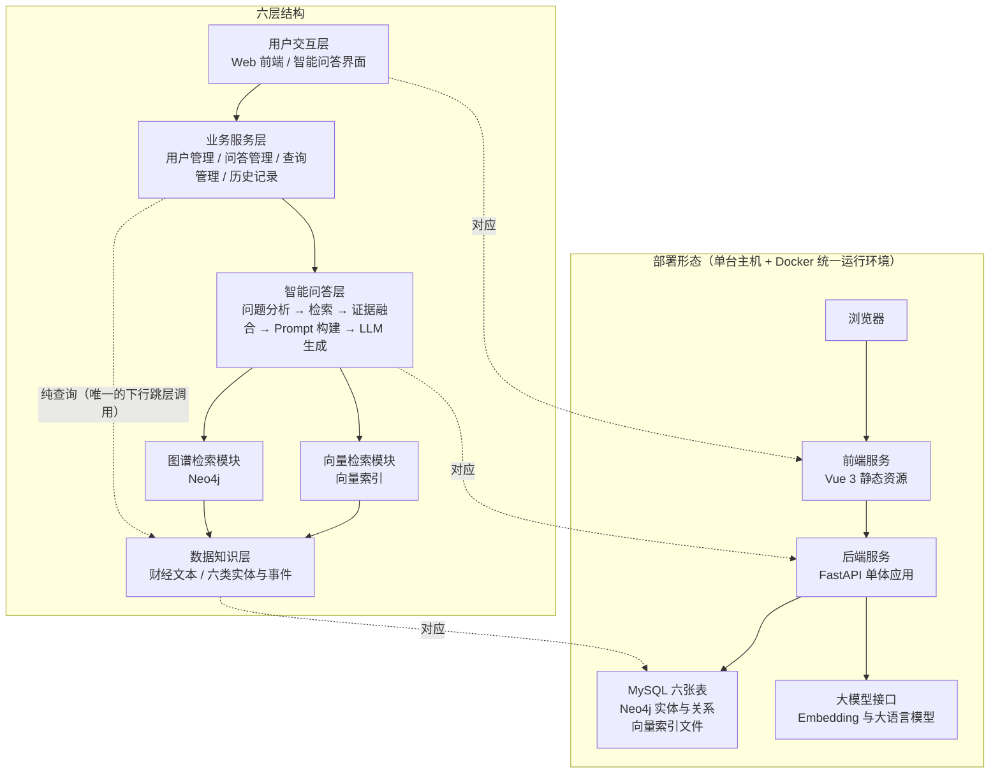
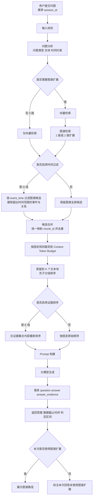
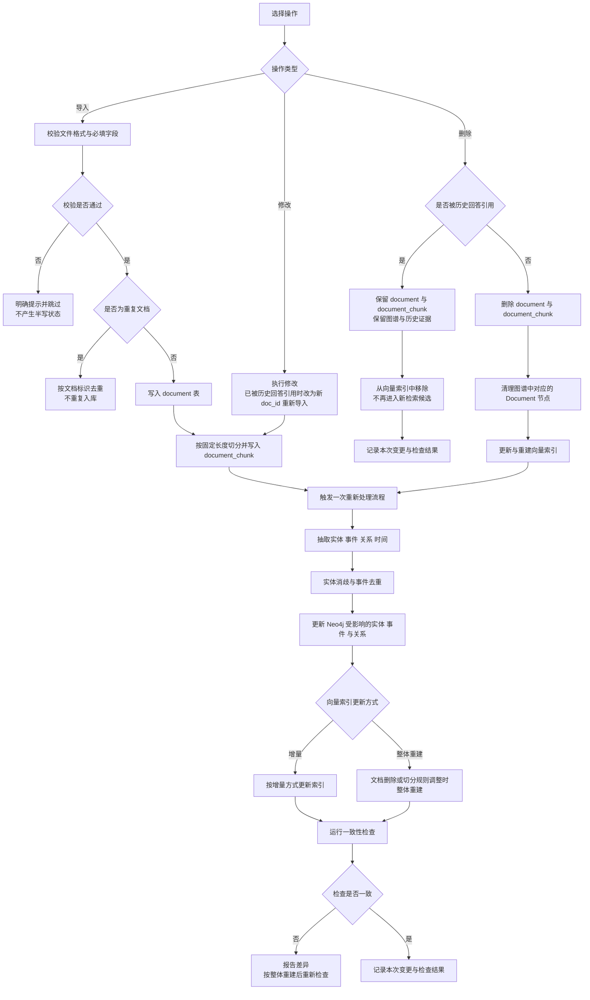
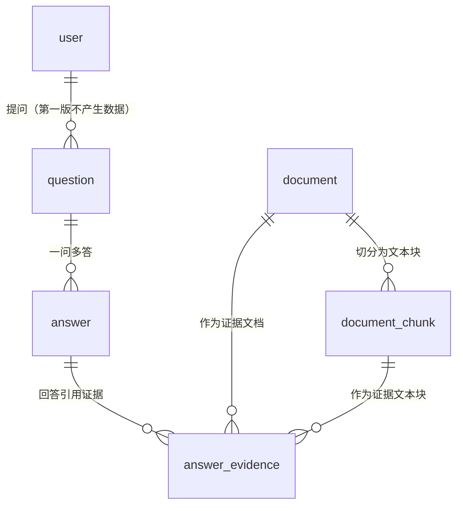
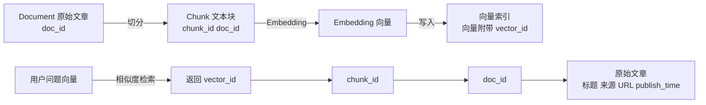
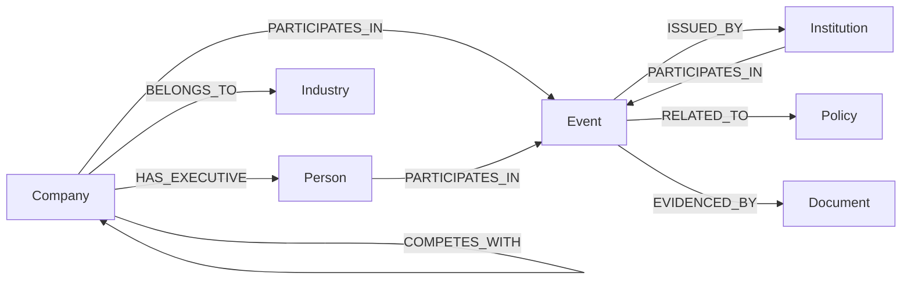
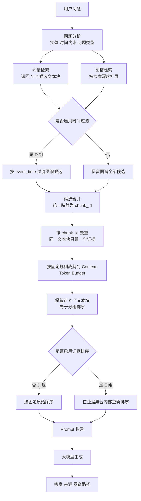
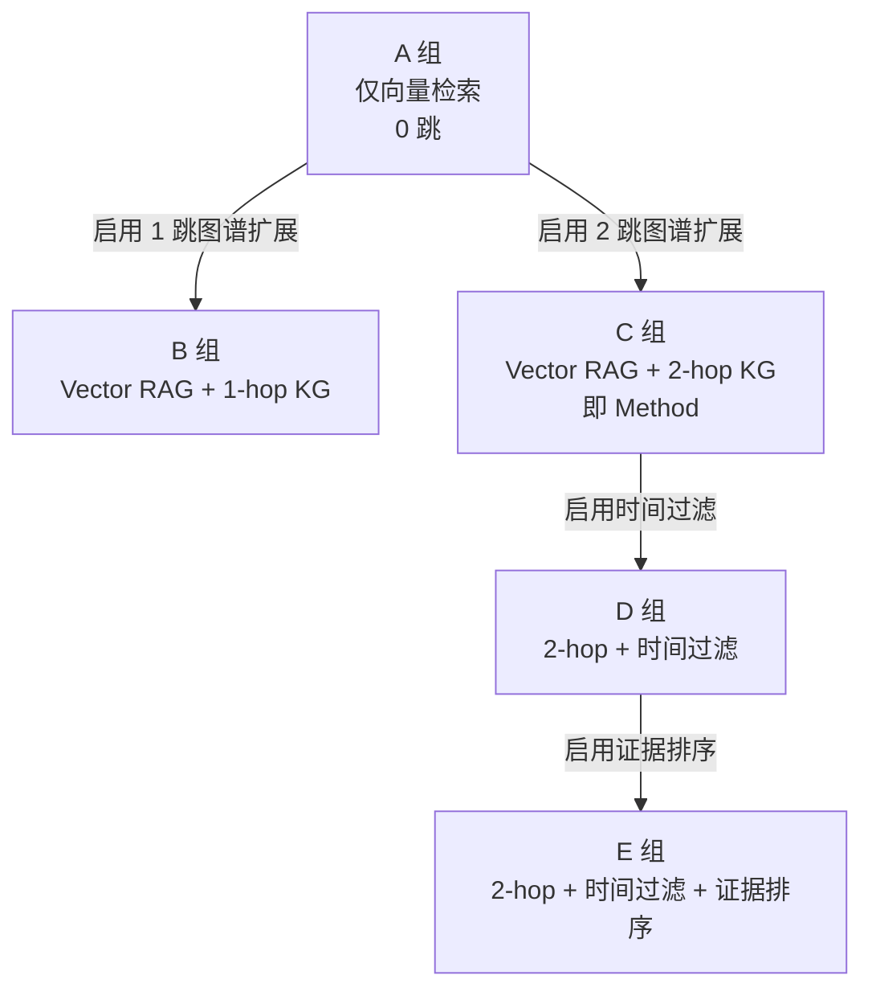

# 基于事件知识图谱与RAG的A股财经信息智能问答系统设计与实现 —— 系统总体设计（第 4 阶段交付物）

| 项目 | 内容 |
| --- | --- |
| 阶段 | 第 4 阶段 系统总体设计 |
| 对应论文章节 | **第四章 系统设计**，含 4.1～4.7 七个小节（节标题与《02》第15节 第四章逐字一致） |
| 上级依据 | 《02-项目执行总控文档》**v2.7**（版本链：编写本文件时依据 v2.5；v2.6 已固化 Embedding 模型与数据集版本级属性；v2.7 为前五阶段审核后的问题修复登记，其中 第9.1节 补登记 answer.is_graph_extended，与本文件 4.4.1 的字段表一致）：第6.2节 六个功能模块、第7节 非功能需求、第8节 系统总体架构与不引入的技术、第9节 数据设计概要（六张表／本体／向量索引）、第10节 时间维度、第11节 技术路线、第12节 混合检索策略与实验方案、第13节 最终回答形态与证据追溯、第15节 第四章目录 |
| 需求依据 | 《07-需求分析（第三阶段）》（已经本人确认）：FR-01～FR-06、UC-01～UC-07、NFR-01～NFR-06 及其验收口径 |
| 任务依据 | 《09-第4阶段任务书（系统总体设计）》：产出清单（第三节）、13 条硬约束（第四节）、三项格式决策（第五节）、非目标（第六节）、验收标准（第七节）、T1～T8 执行顺序（第八节） |
| 复核依据 | 《11-第4阶段复审判定与修订决议（2026-09-23）》：第 2 轮 2 项 P0（时间过滤位置、图表数量）与 6 项 P1／P2、第 3 轮 6 项 P1／P2 的逐项判定与落点 |
| 本阶段性质 | **设计**，不是实现：给出结构、职责、流程、数据结构与接口契约，不给出可运行代码 |
| 状态 | 第 4 阶段产出（经第 2、3 两轮复审修订），作为第 5 阶段（数据准备）起各阶段的输入与论文第四章的底稿；本文件只描述设计，不描述开发活动的完成情况 |
| 日期 | 2026-09-23 |
| 核验方式 | 机器核验《工具\跨文档核验.py》按当时的检查项全部通过（退出码 0）；另按《09》第七节 的验收标准逐项做包含检查与排除检查，结果在交付回复中列出 |

---

## 导言：本文件的结构与编号约定

### 0.1 本文件与其它文档的关系

本文件是第 4 阶段的唯一产出，它**不重新论证**任何已冻结的口径，只把《07》的需求条目与《02》已冻结的架构、数据、本体、时间、技术路线与实验配置**落成设计**。三条阅读约定：

1. **口径以《02》为准**。本文件出现的六层名称、六个模块名称、6 类实体／8 种核心事件类型／9 条核心关系、六张表、9 条关系的证据属性、四级检索策略、Method 与 A～E 的配置、Top-K 五步契约、指标定义、时间判定规则，全部照抄《02》对应小节并在每处标注节号；如本文件与《02》冲突，以《02》为准。
2. **需求以《07》为准**。4.2 节的模块内部结构与 4.3 节的流程步骤逐条对应《07》的 FR 条目处理步骤与 UC 步骤；4.7.6 给出接口与需求、用例的对照。本文件不引入《07》没有的需求，也不新增表、字段或模块。
3. **本文件不进入第 5、6 阶段的领域**：不写数据采集与清洗口径、不写抽取规则与提示词内容、不做标注方案、不写建表语句、不选模型型号、不做界面设计、不做部署运维细节（《09》第六节）。
4. **时间过滤与 K 的先后关系是本文件的关键约束**：时间过滤必须发生在候选合并之前（否则 H3 不可测），保留到 K 个文本块必须发生在 D／E 分组排序之前（否则 E 组不再只改变顺序）。两条约束的作用对象不同，不得混为一谈，详见 4.6.1 与 4.6.4。

### 0.2 编号约定

本文件内的图与表按章内顺序连续编号：**图 4-1～图 4-8** 共 8 张，**表 4-1～表 4-13** 共 13 张。小节编号与《02》第15节 第四章的七个小节逐字一致（4.1 系统总体架构、4.2 系统功能模块设计、4.3 系统业务流程、4.4 数据库设计、4.5 知识图谱本体设计、4.6 RAG 检索架构、4.7 接口设计），七节之下按 4.x.y 细分。

图一律以 Mermaid 源码块嵌在正文中，表一律以 Markdown 表格给出；需要进入 Word 时再导出为 PNG 插图。子功能编号（M1-1、M2-3……）与错误码（1001、2002……）是本文件内部的引用编号，不参与跨文档引用。

**关于图表数量的说明**：图 8 张、表 13 张，符合《09》第九节 范围守卫的"图 ≤ 8 张、表 ≤ 13 张"。《10》第一版曾出现图 12 张、表 55 张，第二轮复审指出"设计过度细化且与上限冲突"后按"同类合并为一表、能写成段落的不占表"做了压缩，第三轮复审再次指出表数仍然偏多，遂压缩到现在的 13 张：六个模块的职责与子功能合为一张、四条流程的主流程与全部异常分支各合一张、六张表的字段与键／索引落点合为一张、9 条关系的 schema 与证据属性合为一张、四级检索策略与四项指标合为一张、A～E 五组的配置与三个开关的作用范围合为一张；模块依赖、索引与外键清单、Neo4j 约束与索引、时间属性落点、错误码清单、召回指标分工、图谱路径输出条件等原本独立成表的内容改为正文段落。压缩前后**没有删除任何设计要求**：字段、约束、开关、接口与指标一项未减。

**第 13 张表的来源**：表 4-13（REST 接口清单）是《09》第三节 对 4.7 的硬性要求——接口清单必须含方法／路径／请求字段／响应字段／错误码并覆盖六个模块。它已从最初的 11 张接口表压到 1 张（28 行）；再压就必须删掉请求字段或响应字段，而那正是接口契约本身。因此本文件把章内上限定为表 ≤ 13 张，并在此写明这一处 1 张的超出，而不是继续删内容。

### 0.3 本文件的章节与需求对应

表 0-1 给出七个小节与《07》需求条目、《02》来源小节的对应关系，作为通读与对账的入口索引。各节的详细来源标注在正文各处，本表只给出一级对应。本表不计入表 4-N 的章内编号。

| 本节小节 | 标题 | 主要对应需求 | 主要《02》来源 |
| --- | --- | --- | --- |
| 4.1 | 系统总体架构 | NFR-01、NFR-03 | 第8.1节、第8.2节、第8.3节、第8.4节、第9.3节 |
| 4.2 | 系统功能模块设计 | FR-01～FR-06 | 第6.2节、第6.3节、第5.3节 |
| 4.3 | 系统业务流程 | UC-01～UC-07、FR-01～FR-06 | 第11.1节、第11.2节、第11.3节、第12.6节、第13节 |
| 4.4 | 数据库设计 | FR-01、FR-04、FR-05、FR-06、NFR-04 | 第9.1节、第10.1节、第10.3节、第12.7节 |
| 4.5 | 知识图谱本体设计 | FR-02、FR-03 | 第9.2.1节～第9.2.5节、第10.1节 |
| 4.6 | RAG 检索架构 | FR-04、FR-05、RQ2／RQ3 | 第12.1节、第12.4节、第12.5节、第12.6节、第12.7节、第13节 |
| 4.7 | 接口设计 | FR-01～FR-06、NFR-06 | 第6.2节、第7节、第13节 |

---

### 4.1 系统总体架构

本节给出系统的整体结构：六层架构与各层职责（《02》第8.1节、第8.2节 冻结）、层间调用关系、部署形态与技术栈（《02》第8.3节、第8.4节 冻结），并说明架构对《07》NFR-01 与 NFR-03 的支撑方式。本节的层次名称、层次顺序与技术选型不得改动；本节不引入《02》第8.4节 清单之外的任何组件。

#### 4.1.1 六层架构图与部署形态

系统采用六层结构（图 4-1）。层次顺序与名称与《02》第8.1节 一致：用户交互层 → 业务服务层 → 智能问答层 → 向量检索模块 ‖ 图谱检索模块 → 数据知识层。其中第三层之下并行存在两个检索模块，二者互不调用，均向智能问答层提供候选证据，并在第四层之下由数据知识层统一提供数据来源。同图右侧给出部署形态：系统按**单体后端 ＋ 前后端分离**的方式部署在一台机器上，不采用微服务架构、不引入容器编排系统，Docker 只用于**统一运行环境**（《02》第8.4节 冻结）。



<p align="center">图 4-1　六层架构与部署形态（层次顺序与《02》第8.1节 一致）</p>

图 4-1 中除了"用户交互层 → 业务服务层 → 智能问答层 → 两个检索模块 → 数据知识层"这条主链，还有一条**虚线箭头**：**业务服务层 ⇢ 数据知识层（纯查询）**。它是 4.1.2 表 4-1 中"业务服务层 → 数据知识层"那条唯一的下行跳层调用在架构图上的表示，用于历史记录查询与证据明细查询——这两类请求是纯读操作，经过问答层不会产生任何增值处理。虚线同时标明它**不参与智能问答检索链路**：检索链路上的数据访问只发生在两个检索模块与数据知识层之间。

数据知识层的完整内容包括：原始财经信息（新闻、公告、政策）与从文本中抽取的结构化知识（事件、公司、行业、机构、人物、政策六类实体）。**时间信息不作为独立实体列出**：它以 Event 节点的 event_time、关系属性 valid_from／valid_to 与数据集版本级属性 data_cutoff_time 三种形式表达（《02》第10.1节 冻结，判定规则见 4.4 与 4.5）。

关于部署形态的四条说明。第一，**前端与后端分离**：前端为 Vue 3 构建的静态资源，后端为 FastAPI 单体应用，二者通过 REST 接口通信（4.7）。第二，**后端为单体应用**：问答、数据、图谱与历史记录接口由同一个后端进程提供，检索、图谱扩展、时间过滤与证据排序流程由后端代码直接实现，不引入框架封装（《02》第8.4节）。第三，**两个存储与一个索引并列**：MySQL 负责业务数据与文档元数据，是文本内容的唯一权威来源；Neo4j 负责实体、事件与关系，支撑多跳路径与时间查询；向量索引只负责文本语义相似度检索，不保存权威文本，只保存向量与索引结构（《02》第9.3节）。第四，**模型通过接口调用**：Embedding 模型与大语言模型均通过后端配置项接入的外部接口调用，不在本地训练与部署大模型；接口地址与凭据保存在后端配置中，不出现在前端代码里（对应 4.7 的 NFR-06）。本文件不展开容器编排、持续集成、监控告警与备份恢复方案——这些属于部署运维细节，不是本阶段的设计内容（《09》第六节 非目标 3）。

需要特别说明一处术语口径：图中"向量检索模块"在实现上对应《02》第9.3节 的向量索引，FAISS 是向量相似度检索库（索引库），提供向量索引构建与相似度检索能力，**不提供独立服务进程、分布式部署、数据持久化与事务管理等数据库特性**，因此本文件统一表述为"向量索引"或"向量检索组件"，不按"向量数据库"表述（《02》第9.3节）。

#### 4.1.2 各层职责与层间调用关系

表 4-1 把各层职责、输入输出与层间调用关系合并给出。职责描述与《02》第8.2节 一致；输入输出是为使接口契约可核查而补充的说明，来源是《07》FR-01～FR-06 的输入与输出字段。

**表 4-1　各层职责、输入输出与层间调用关系**

| 层次 | 主要职责 | 输入 | 输出 | 被谁调用 → 调用谁 | 对应需求 |
| --- | --- | --- | --- | --- | --- |
| 用户交互层 | 提供问答输入、答案展示、来源与证据查看、图谱可视化与历史记录等页面；只负责界面与交互逻辑，**不直接访问数据库与模型** | 用户输入的问题、图谱查询条件、页面操作 | 提交给业务服务层的请求；展示给用户的答案、证据列表、图谱可视化数据与历史记录 | 用户 → 本层；本层 → 业务服务层（只此一条出口） | FR-03、FR-04、FR-05、FR-06 |
| 业务服务层 | 用户管理、问答管理、查询管理与历史记录；接收前端请求、校验参数、组织业务流程并返回结果；每一次提问、回答与引用证据都由该层落库 | 用户交互层的请求；智能问答层返回的答案、证据集合与图谱路径 | 面向用户交互层的响应体；写入 MySQL 的 question、answer 与 answer_evidence 记录 | 用户交互层 → 本层；本层 → 智能问答层；本层 → 数据知识层（纯查询，唯一的下行跳层调用） | FR-04、FR-05、FR-06 |
| 智能问答层 | 系统的核心处理单元，依次完成问题分析、检索、证据融合、Prompt 构建与大模型生成；问题分析判定问题类型与是否需要图谱扩展，证据融合把两路检索结果合并排序 | 问题文本、实体与时间约束；两路检索模块返回的候选文本块、图谱路径与事件属性 | 自然语言答案；最终证据集合；使用了图谱扩展时的图谱路径 | 业务服务层 → 本层；本层 → 两个检索模块；本层 → 大模型接口 | FR-04 |
| 向量检索模块 | 基于 FAISS 完成文本语义检索，输入是问题的向量表示，输出是候选文本块及其对应文档编号，用于提供原始文本证据 | 用户问题向量；候选数量 N 与裁剪上限 K（《02》第12.4节、第12.7节） | 候选文本块及其 doc_id、chunk_id 与向量检索的原始排名 | 智能问答层 → 本层；本层 → 数据知识层（只读） | FR-04 |
| 图谱检索模块 | 基于 Neo4j 完成实体、事件与关系的多跳查询，输出实体路径、事件属性与关联关系，用于补充文本检索难以覆盖的关系信息与时间信息 | 问题中的实体、时间约束与检索深度（0／1／2 跳） | 实体与事件节点、关系路径（含 role 与证据属性）、事件六项核心属性 | 智能问答层 → 本层；本层 → 数据知识层（只读） | FR-03、FR-04 |
| 数据知识层 | 统一管理新闻、公告、政策等原始财经信息，以及抽取出的六类实体、事件与关系等结构化知识；是向量检索与图谱检索共同的数据来源 | 后台导入的财经文本；抽取与消歧去重结果；重新处理指令 | MySQL 中的文档与文本块；Neo4j 中的实体、事件与关系；向量索引中的向量与三级编号 | 两个检索模块 → 本层（只读）；业务服务层 → 本层（只读）；后台脚本 → 本层（写入） | FR-01、FR-02 |

层间调用遵循两条约束，二者都是可核查的设计约束而不是实现建议。第一，**逐层向下调用，不跨层访问**：用户交互层只调用业务服务层；业务服务层只调用智能问答层；智能问答层调用两个检索模块；两个检索模块只访问数据知识层。用户交互层不得直连 MySQL、Neo4j 或向量索引，也不得直接调用大模型接口。第二，**两个检索模块互不调用**：向量检索的候选文本块与图谱检索的路径在智能问答层汇聚，由证据融合环节统一处理。这样划分的作用是使消融实验的变量可控制——A 组（仅向量检索）与 B／C 组（叠加图谱扩展）的差别只在于是否启用图谱检索模块，而不是在于某个模块内部的分支。

表 4-1 中"业务服务层 → 数据知识层"是**唯一的下行跳层调用**：历史记录与证据明细是纯查询，经过问答层不会产生任何增值处理，因此由业务服务层直接查询。该例外在 4.2 的模块间依赖中同样标注，以保证两处口径一致。第一版不启用登录时，业务服务层的用户管理模块保留最小形态（仅按《07》UC-07 的条件性决策保留接口位置），问答管理、查询管理与历史记录正常提供（《02》第8.2节）。

#### 4.1.3 技术栈

技术栈与《02》第8.3节 的技术栈固定表一致，模块、选型、用途与理由均不新增、不替换；此处以正文列出，避免与《02》形成两处需要同步维护的表。

- **前端 —— Vue 3**：实现智能问答界面、知识图谱可视化、来源与证据查看与历史记录页面。选型理由：组件化开发，上手成本低，适合单人完成界面部分。
- **后端 —— Python + FastAPI**：提供问答、数据、图谱、历史记录等接口，串联检索与生成流程。选型理由：Python 与数据处理、AI 生态一致，FastAPI 轻量且接口定义清晰、便于调试与测试。
- **关系数据库 —— MySQL**：存储用户、文档元数据、文本块、问题、回答与证据关联。选型理由：关系模型适合结构化业务数据，增删改查与事务处理成熟。
- **图数据库 —— Neo4j**：存储实体、事件与关系，支持多跳路径查询。选型理由：原生图存储与 Cypher 查询语言适合表达多跳关系与路径检索。
- **向量索引 —— FAISS**：保存文本块向量并完成相似度检索。选型理由：FAISS 本质是向量相似度检索库（索引库），轻量、可本地运行、不依赖额外服务，适合本科阶段的数据规模。
- **模型 —— Embedding 模型 + 大语言模型 API**：Embedding 模型负责文本与问题的向量化，大语言模型 API 负责基于证据生成答案。选型理由：不本地训练与部署大模型，把精力集中在系统设计与检索方法上；**Embedding 模型及其 revision 已在《02》第12.4节 与《13-数据准备（第五阶段）》第四节（向量化口径）中固化——`BAAI/bge-small-zh-v1.5`，HuggingFace revision `7999e1d3359715c523056ef9478215996d62a620`，512 维，L2 归一化，FAISS `IndexFlatIP`（内积＝余弦相似度）；大语言模型的名称与版本仍 TBD（选型后固化）**。
- **数据处理 —— Python**：数据清洗、文本切分、实体识别、事件抽取、实体消歧、事件去重与图谱写入。选型理由：与后端语言一致，脚本可复用，便于长期维护。
- **部署 —— Docker**：统一运行环境，打包后端与依赖服务。选型理由：降低环境差异带来的部署问题，便于答辩现场快速启动。

模型一项的版本链需要写明：本文件编写时，Embedding 模型与大语言模型在《02》第12.4节 的实验配置固定表中均标注"选型后固化"，因此本节只给出接入方式、**不写死型号**；此后《02》v2.6 已把 **Embedding 模型及其 revision 固化**——`BAAI/bge-small-zh-v1.5`，HuggingFace revision `7999e1d3359715c523056ef9478215996d62a620`，512 维，L2 归一化，FAISS `IndexFlatIP`（内积＝余弦相似度），落点见《02》第12.4节 与《13-数据准备（第五阶段）》第四节；**只剩大语言模型的名称与版本保持 TBD（选型后固化）**。本文件只登记"该值已在 v2.6 固化"这一事实，不做选型。系统支持多模型切换，两种模型都通过配置项接入，更换模型不需要修改前端代码。技术栈的边界同样固定：本课题不引入 LangChain 与 LlamaIndex，不引入 Milvus、Qdrant、Weaviate 等独立向量数据库系统，不引入 Elasticsearch 等独立检索引擎，不引入 Kafka、微服务架构与 Kubernetes，也不引入 Agent 框架与多智能体编排、多模态与语音能力、实时行情与实时推送（《02》第8.4节 冻结）。

#### 4.1.4 架构对非功能需求的支撑

**对 NFR-01（响应时间）的支撑**：分层结构使一次问答的耗时可以被分段记录。图 4-1 中"智能问答层 → 向量检索模块"与"智能问答层 → 图谱检索模块"是两条独立的调用路径，各自返回后进入证据融合，因此向量检索耗时与图谱查询耗时可以分别计时；大模型生成耗时在"智能问答层 → 大模型接口"这一步记录。**三个计时点分别是向量检索调用处、图谱查询调用处与大模型调用处**，三段耗时相加得到单次问答的总耗时，业务服务层按《02》第7节 的口径记录平均回答耗时与 P95 耗时。架构上的要求是三个计时点必须落在层间调用边界上，而不是落在某个函数内部，这样计时口径与论文第 6 章的测试口径一致。

**对 NFR-03（可维护性）的支撑**：三条设计约束共同支撑可维护性。一是**前后端分离**：前端只通过 REST 接口与后端交互，模型接口地址、数据库连接与检索参数集中在后端配置文件中管理，因此更换大模型 API 或 Embedding 模型时不需要修改前端代码。二是**逐层向下调用**：更换向量检索实现（例如调整 FAISS 索引类型）只影响向量检索模块内部，不波及业务服务层与用户交互层；更换图谱数据组织方式只影响图谱检索模块与数据知识层。三是**模块边界清晰**：六个功能模块与层次的对应关系在 4.2 给出，每个模块的职责与输入输出在表 4-2 中逐条列出，便于按模块维护与测试。

---

### 4.2 系统功能模块设计

本节把《07》第3.2节～第3.7节 的功能需求 FR-01～FR-06 落实为**六个功能模块**的内部结构。模块名称与《02》第6.2节 逐字一致：财经信息管理、财经事件抽取、事件知识图谱、智能问答、证据追溯、历史问答。六个模块与 4.1 节六层架构的对应关系不是一一对应：智能问答模块内部跨智能问答层的两个检索模块；前两个模块属于后台能力，不对普通用户开放。

#### 4.2.1 模块总览与后台能力边界

表 4-2 给出六个模块的定位、承担的功能需求、在 4.1 节层次中的落点、使用者范围（即后台能力与普通用户能力的边界）与其子功能编号区间。划分口径来自《02》第6.1节、第6.2节、第6.3节 与《07》第2.2节、第2.4节：普通用户只有四项功能，财经信息管理（文本数据的导入、删除、更新）不属于普通用户功能。

**表 4-2　六个模块总览与后台能力边界**

| 模块 | 承担需求 | 层次落点 | 使用者范围 | 入口形式 | 子功能 |
| --- | --- | --- | --- | --- | --- |
| 财经信息管理 | FR-01 | 业务服务层（后台入口）＋ 数据处理脚本 ＋ 数据知识层（写入） | **后台，不对普通用户开放** | 脚本或受控后台入口 | M1-1～M1-7 |
| 财经事件抽取 | FR-02 | 数据知识层（写入侧）＋ 数据处理脚本 | **后台，不对普通用户开放** | 数据处理脚本与后台抽取接口 | M2-1～M2-8 |
| 事件知识图谱 | FR-03 | 图谱检索模块（查询）＋ 用户交互层（可视化渲染）＋ 数据知识层（写入） | 普通用户查询与可视化；后台写入与维护 | 图谱页面；写入侧为数据处理脚本 | M3-1～M3-7 |
| 智能问答 | FR-04 | 智能问答层（调度向量检索模块与图谱检索模块） | 普通用户 | 问答页面 | M4-1～M4-10 |
| 证据追溯 | FR-05 | 业务服务层（证据明细查询）＋ 用户交互层（证据区域） | 普通用户 | 答案下方证据区域 | M5-1～M5-7 |
| 历史问答 | FR-06 | 业务服务层（历史记录）＋ 用户交互层（历史页面） | 普通用户查看；后台维护数据表 | 历史记录页面 | M6-1～M6-4 |

按表 4-2，普通用户的四项功能分别是**提问与查看答案**（智能问答）、**图谱查看**（事件知识图谱）、**来源与证据查看**（证据追溯）与**历史记录查看**（历史问答）；**财经信息管理（导入、删除、更新）与财经事件抽取不在普通用户功能之内**，由作者通过脚本或受控后台入口执行。此外，若按条件下开启"仅登录"，业务服务层的用户管理模块以最小形态提供登录入口与会话管理，**不做注册、不做找回密码、不做多角色与细粒度权限**（《02》第6.1节、《07》UC-07）。

#### 4.2.2 六个模块的内部结构与子功能

表 4-3 给出六个模块的内部结构：每个子功能的职责、输入与输出，并标注其对应的《07》处理步骤或 UC 分支。这是本节的核心表，4.3 的业务流程与 4.6 的检索管线都按本表的子功能编号引用。

**表 4-3　六个模块的子功能、职责与输入输出（M1-1～M6-4）**

| 编号 | 所属模块 | 子功能 | 职责 | 输入 | 输出 | 对应需求 |
| --- | --- | --- | --- | --- | --- | --- |
| M1-1 | 财经信息管理 | 导入校验 | 校验文件格式与必填字段，格式或字段不合法时不入库并给出明确提示；按文档标识去重，重复文档不重复入库 | 待导入文本及其元数据（标题、正文、发布时间、来源、URL、涉及公司） | 校验结论与拒绝原因 | FR-01 处理 1；UC-05 步骤 2、E1、E2、E3 |
| M1-2 | 财经信息管理 | 文档入库 | 写入 document 表，记录标题、正文、发布时间、来源、URL、涉及公司与入库时间 ingest_time | 校验通过的文本与元数据 | document 记录 | FR-01 处理 2；UC-05 步骤 3 |
| M1-3 | 财经信息管理 | 文本切分 | 按固定长度切分为文本块并写入 document_chunk 表，建立 chunk_id 与 doc_id 的对应关系 | document 记录、切分规则 | document_chunk 记录（含 chunk_index、content、token_count、vector_id） | FR-01 处理 3；UC-05 步骤 4 |
| M1-4 | 财经信息管理 | 重新处理调度 | 文档新增、修改或删除后触发一次重新处理流程，编排切分、向量化、抽取、图谱更新与索引更新 | 文档变更事件 | 各环节的执行记录与抽取日志 | FR-01 处理 4；UC-06 步骤 3 |
| M1-5 | 财经信息管理 | 索引更新 | 按增量方式更新向量索引；文档删除或切分规则调整时整体重建索引 | 文本块变更集合 | 更新后的向量索引 | FR-01 处理 5；UC-06 步骤 4 |
| M1-6 | 财经信息管理 | 图谱同步 | 同步更新 Neo4j 中受影响的实体、事件与关系 | 文本块变更集合与抽取结果 | 更新后的图谱内容 | FR-01 处理 6；UC-06 步骤 5 |
| M1-7 | 财经信息管理 | 一致性检查 | 核对抽取结果与图谱节点数量、文本块数与向量条数，输出检查结果 | 图谱与索引现状 | 一致性检查结果 | FR-01 处理 7；UC-06 步骤 6、F2 |
| M2-1 | 财经事件抽取 | 实体识别 | 按 Company、Person、Industry、Institution、Event、Policy 六类标签输出实体与来源 | document 与 document_chunk 中的文本 | 六类实体及其来源文档与文本块编号 | FR-02 处理 1 |
| M2-2 | 财经事件抽取 | 事件抽取 | 按 8 种核心事件类型输出事件节点，并填写 event_id、event_type、event_name、event_time、description、confidence 六项核心属性 | 文本与实体识别结果 | Event 节点及其六项核心属性 | FR-02 处理 2 |
| M2-3 | 财经事件抽取 | 关系抽取 | 按 9 条核心关系输出关系及其方向，其中**除 EVIDENCED_BY 外**的 8 条携带 source_doc_id、source_chunk_id 与 confidence，BELONGS_TO 另带 valid_from、valid_to | 文本、实体与事件节点 | 带证据属性的关系 | FR-02 处理 3 |
| M2-4 | 财经事件抽取 | 时间抽取 | 区分事件发生时间与文档发布时间，分别归入 Event 节点的 event_time 与 Document 节点的 publish_time | 文本中的时间表述 | 两个层级的时间属性 | FR-02 处理 4 |
| M2-5 | 财经事件抽取 | 证据挂载 | 事件与证据文档之间建立 EVIDENCED_BY 关系，一个事件可以挂多份文档 | 事件节点与来源文档 | EVIDENCED_BY 关系 | FR-02 处理 5 |
| M2-6 | 财经事件抽取 | 实体消歧 | 公司实体以 stock_code 为锚完成对齐：先与别名表匹配，匹配成功则归并到对应的 stock_code 节点，匹配失败进入待消歧列表，人工确认后再写入图谱 | 抽到的公司名称、别名表 | 归并后的 Company 节点与待消歧列表 | FR-02 处理 6 |
| M2-7 | 财经事件抽取 | 事件去重 | 按 event_type ＋ 参与主体 ＋ 时间窗口 ＋ 触发词相似度判定同一事件的多来源描述，四项条件同时满足时合并；合并后保留全部证据文档，发布时间最早的一份作为主要来源展示，合并动作记录在抽取日志中 | 事件节点及其来源文档 | 合并后的事件节点与合并日志 | FR-02 处理 7 |
| M2-8 | 财经事件抽取 | 图谱写入 | 把实体、事件、关系与时间信息写入 Neo4j | 消歧与去重后的抽取结果 | Neo4j 中的实体、事件与关系 | FR-02 处理 8 |
| M3-1 | 事件知识图谱 | 查询条件解析 | 解析查询条件，区分实体查询、事件查询、关系查询与时间查询；查询条件为空时不予受理 | 用户选择的实体、事件类型、关系类型或时间区间 | 结构化查询条件 | FR-03 处理 1 |
| M3-2 | 事件知识图谱 | 节点与关系检索 | 在 Neo4j 中按条件检索节点与关系 | 结构化查询条件 | 匹配的实体、事件与关系 | FR-03 处理 2；UC-03 步骤 3 |
| M3-3 | 事件知识图谱 | 多跳路径扩展 | 沿 PARTICIPATES_IN、RELATED_TO、ISSUED_BY、EVIDENCED_BY 等关系扩展路径，深度为 1 跳或 2 跳 | 起点实体或事件、检索深度 | 路径及其上的节点与关系 | FR-03 处理 3；UC-03 步骤 4 |
| M3-4 | 事件知识图谱 | 时间过滤 | 对带时间约束的查询按 Event 节点的 event_time 过滤 | 时间区间、事件节点 | 过滤后的事件集合 | FR-03 处理 4；UC-03 步骤 5 |
| M3-5 | 事件知识图谱 | 多来源排序与去重 | 同一事件存在多份来源时按 Document 节点的 publish_time 排序并去重，发布时间最早的一份作为主要来源 | 事件的多份证据文档 | 排序与去重后的来源列表 | FR-03 处理 5；UC-03 C2 |
| M3-6 | 事件知识图谱 | 关系证据属性返回 | 按关系类型返回证据属性：**除 EVIDENCED_BY 外**返回 source_doc_id、source_chunk_id 与 confidence；EVIDENCED_BY 本身即事件到文档的证据关系，其证据为该关系指向的 Document 节点，不返回这三项属性 | 路径上的关系 | 关系及其证据属性 | FR-03 处理 6；UC-03 步骤 7 |
| M3-7 | 事件知识图谱 | 可视化数据组装与空结果处理 | 输出节点、关系与路径的可视化数据结构；查询为空时返回明确提示并说明可调整实体名称或时间区间 | 路径查询结果 | 前端可视化数据或空结果提示 | FR-03 处理 7；UC-03 C1 |
| M4-1 | 智能问答 | 问题分析 | 判定问题类型与是否需要图谱扩展，识别问题中的实体与时间约束 | 用户问题文本 | 问题类型、实体列表、时间约束与是否启用图谱扩展的判定 | FR-04 处理 1；UC-01 步骤 4 |
| M4-2 | 智能问答 | 文本检索调度 | 用问题与实体关键词在向量索引中检索候选文本块，候选数量为 N | 问题向量、实体关键词、候选数量 N | 候选文本块及其 doc_id、chunk_id 与原始排名 | FR-04 处理 2；UC-01 步骤 5 |
| M4-3 | 智能问答 | 图谱检索调度 | 按需要执行 0 跳（只进行文本检索）、1 跳（文本检索 ＋ 一跳图谱关系）或 2 跳（文本检索 ＋ 两跳图谱关系）扩展 | 实体、时间约束、检索深度 | 图谱路径、事件属性与图谱侧候选文本块 | FR-04 处理 3；UC-01 步骤 6 |
| M4-4 | 智能问答 | 时间过滤 | 带时间约束的问题按 event_time 过滤图谱侧的事件节点与关系；"最新／最近／近期"按《02》第10.3节 的判定规则表解释 | 时间约束、图谱侧候选 | 过滤后的图谱候选与事件集合 | FR-04 处理 4；UC-01 步骤 7 |
| M4-5 | 智能问答 | 证据融合与裁剪 | 把向量检索候选与**过滤后的**图谱候选人选合并，按 chunk_id 去重；超出 Context Token Budget 时按固定裁剪规则裁剪，**裁剪发生在证据排序之前** | 两路候选证据、预算与裁剪规则 | 最终证据集合（大小不超过 K） | FR-04 处理 5；UC-01 步骤 8 |
| M4-6 | 智能问答 | 证据排序 | 在最终证据集合内部排序；D 组按固定的原始顺序送入大模型，E 组只在该集合内部重新排序 | 最终证据集合 | 送入大模型的证据顺序 | FR-04 处理 5；《02》第12.6节 |
| M4-7 | 智能问答 | Prompt 构建 | 按固定模板组装问题、证据文本块、图谱路径、事件三元组、dataset_version 与 data_cutoff_time | 最终证据集合、图谱路径、版本属性 | Prompt 文本 | FR-04 处理 6 |
| M4-8 | 智能问答 | 大模型生成 | 基于证据生成自然语言回答；模型不得使用数据截止时间之后的信息，也不得在证据不足时用训练语料中的时间信息补全答案 | Prompt | 自然语言回答 | FR-04 处理 6；UC-01 步骤 9 |
| M4-9 | 智能问答 | 相对时间解释 | 在答案中注明本次问题所用相对时间的判定区间与数据截止时间 | 时间约束类型、data_cutoff_time | 判定区间说明 | FR-04 处理 6；UC-01 步骤 11 |
| M4-10 | 智能问答 | 问答落库 | 写入 question（含 session_id 与提问时间）、answer、answer_evidence | 问题、回答、证据集合与配置快照 | 三张表的记录 | FR-04 处理 7；UC-01 步骤 10 |
| M5-1 | 证据追溯 | 证据明细读取 | 从 answer_evidence 取本次回答引用的全部证据，每条证据包含文档编号与文本块编号 | answer_id | 证据记录集合 | FR-05 处理 1 |
| M5-2 | 证据追溯 | 证据分类展示 | 按来源类型分类展示：回答来源、新闻来源、公告来源与相关事件 | 证据记录、document 元数据 | 分组的证据列表 | FR-05 处理 2；UC-02 步骤 2 |
| M5-3 | 证据追溯 | 原文定位入口 | 提供从答案到原文的定位入口，展示来源类型、发布时间与文档编号；原文访问受限时保留元数据并提示 | 证据记录与 document 的 url | 可点击的原文定位信息 | FR-05 处理 6；UC-02 步骤 4、B2 |
| M5-4 | 证据追溯 | 图谱路径区域判定 | 判断本次回答是否使用了图谱扩展 | 本次回答的扩展标记 | 两种显示状态之一 | FR-05 处理 3；UC-02 步骤 5 |
| M5-5 | 证据追溯 | 图谱路径展示 | 使用了图谱扩展时展示图谱路径，路径上的每条关系回溯到 9 条核心关系之一，其中**除 EVIDENCED_BY 外**给出 source_doc_id、source_chunk_id 与 confidence，EVIDENCED_BY 的证据为其指向的 Document 节点 | 本次回答检索到的路径 | 图谱路径及其关系证据属性 | FR-05 处理 4；UC-02 步骤 5 |
| M5-6 | 证据追溯 | 未使用图谱扩展的显式标注 | 未使用图谱扩展时，在该区域显式标注"本次回答未使用图谱扩展"，不留空，也不展示虚构路径 | 未使用图谱扩展的判定 | 显式标注文本 | FR-05 处理 5；UC-02 B1 |
| M5-7 | 证据追溯 | 模型分析标注 | 开放式分析问题在页面与答案中同屏标注"模型分析（非公开事实）"，与公开事实分区展示 | 问题类型标记 | 标注文本与分区展示 | UC-02 B3；《02》第12.9节 |
| M6-1 | 历史问答 | 会话标识管理 | 前端首次访问时生成 session_id = UUID 并存于浏览器，随每次提问提交；session_id 缺失时生成新的标识 | 浏览器存储 | session_id | FR-06 处理 1；UC-04 D1 |
| M6-2 | 历史问答 | 历史记录筛选 | 后端按 session_id 过滤 question（启用登录后可按 user_id 关联）；历史为空时给出明确提示 | session_id 或 user_id | 命中的 question 记录 | FR-06 处理 4；UC-04 步骤 3、D3 |
| M6-3 | 历史问答 | 历史记录还原 | 通过 question_id 与 answer_id 关联还原完整的问答历史与引用证据，并按提问时间展示 | question、answer、answer_evidence | 历史问答列表 | FR-06 处理 5；UC-04 步骤 4、5 |
| M6-4 | 历史问答 | 历史回看 | 用户选择其中一条记录时回看该次回答及其引用证据；回看只还原 question、answer 与 answer_evidence 三表的内容，**不重新渲染**当时展示的图谱路径视图 | 历史记录标识 | 该次问答的答案与证据 | FR-06 处理 6；UC-04 步骤 6 |

#### 4.2.3 各模块的边界与不做的事

以下逐模块给出边界。这些边界与 4.3 的异常分支、4.7 的接口错误码一一对应，是"设计不越界"的检查依据。

**模块一（FR-01）**：本模块是后台系统能力，**不对普通用户开放，不在普通用户用例中**；不包含预测与投资决策类的任何处理；**不承诺 MySQL、Neo4j 与向量索引之间的实时同步**，只承诺"变更后重新处理 ＋ 一致性检查"；删除与修改操作都受 4.4 的历史证据保护规则约束（已被 answer_evidence 引用的文档禁止物理删除，也禁止原地修改，修改须以新 doc_id 重新导入，见 4.4.2 的规则 3）。

**模块二（FR-02）**：Product（产品）与 Location（地点）不进入第一版本体、抽取规则与评测范围；标注过程中发现的本体边界问题记录在标注说明中，不临时增加关系类型；图谱关系只表示公开信息中出现的关联，不得表述为因果关系（《02》第9.2.1节、第12.3节、第5.3节）。本模块的抽取质量由《02》第12.3节 的两段式抽取评测集衡量：Dev 集 50～100 条（建议 60 条）用于规则与 Prompt 的迭代核查，Test 集 200 条在规则冻结后一次性评测，两集合不重叠，分别计算实体、事件、关系、时间四类任务的 Precision、Recall 与 F1；本文件只引用该评测口径，不重新论证（《09》第六节 非目标 7）。

**模块三（FR-03）**：不做预测类分析，不提供投资决策结论；图谱中的关系只表示公开信息中出现的关联，不能表述为因果关系，也不能由两家公司之间存在供应链关系直接推导出其中一方必然受到影响；查询涉及的关系不在 9 条核心关系之内时，不临时增加关系类型，按本体适用边界记录并提示（《02》第5.3节、第12.3节）。本模块的检索深度（1 跳／2 跳）是**实验自变量**，与 question 表的 gold_hop_depth（**问题的金标准属性**）不是同一概念，不得使用同一字段、同一术语或同一统计口径（《02》第12.2节）。

**模块四（FR-04）**：不提供预测与投资决策类回答；定量实验只使用可核验的事实型问题，开放式分析问题只用于 Demo 展示与案例分析、最多保留 1～2 例、必须在页面与答案中同屏标注"模型分析（非公开事实）"、不作为核心准确率依据、不参与图谱增强效果的判定、不计入任何指标；"最新／最近／近期"一律以 event_time 判定，不以 publish_time 判定，也不以系统运行当天为基准（《02》第12.9节、第10.3节）。

**模块五（FR-05）**：0 跳问题（仅凭文本检索即可回答）以及未启用图谱扩展的实验组（Baseline 1、Baseline 2 与消融 A 组）客观上不存在图谱路径，**不得强行生成或展示虚构的图谱路径**；图谱关联只表示公开信息中出现的关联，不得表述为因果结论；本模块不新增证据类型，不引入独立于 answer_evidence 的证据来源（《02》第13节、第5.3节）。

**模块六（FR-06）**：历史记录不需要独立的表——question 记录问题、answer 记录回答、answer_evidence 记录答案引用的证据，三者通过 question_id 与 answer_id 关联即可还原完整的问答历史，**表数量恒为六张**；不做多角色与细粒度权限，第一版不启用登录时也不提供跨会话或跨用户的全局历史；历史记录不涉及个人隐私数据（《02》第6.2节 功能 6、第9.1节、第6.1节）。

#### 4.2.4 模块间依赖关系

六个模块的依赖按"数据准备侧在前、查询服务侧在后"分成两段，两侧通过数据知识层解耦，**没有跨段的直接调用**。

数据准备侧的依赖是：**财经信息管理 → 财经事件抽取**（触发）——文档新增、修改或删除后触发一次重新处理流程，抽取环节随之运行；**财经信息管理 → 数据知识层**（写入）——写入 document 与 document_chunk，并更新向量索引；**财经事件抽取 → 数据知识层**（写入）——写入实体、事件、关系与时间信息（实体为 Company／Person／Industry／Institution／Event／Policy 六类，事件类型取自 8 种核心事件类型，关系取自 9 条核心关系）。

查询服务侧的依赖是：**智能问答 → 数据知识层**（只读，向量检索路径）——在向量索引中检索候选文本块；**智能问答 → 事件知识图谱**（调用）——按检索深度执行 0／1／2 跳图谱扩展，取得图谱路径与图谱侧候选文本块；**智能问答 → 证据追溯**（产出）——一次问答产生答案与最终证据集合，供证据区域展示；**证据追溯 → 数据知识层**（只读）——从 answer_evidence 关联 document 与 document_chunk 取证据明细；**历史问答 → 数据知识层**（只读）——以 question_id 与 answer_id 关联还原历史问答。**事件知识图谱 ← 财经事件抽取** 是数据来源关系而非调用：图谱模块的查询对象来自抽取模块的写入结果，两个模块之间没有直接调用。

**两条不存在的依赖需要显式声明**：一是智能问答模块与财经信息管理、财经事件抽取之间没有调用关系——问答运行时只读数据知识层，不触发任何写入或重新处理；二是证据追溯与历史问答之间只有数据关联（answer_evidence 与 question、answer 通过 answer_id 与 question_id 关联），没有调用关系，证据区域的数据来源是 answer_evidence，不依赖历史模块。

---

### 4.3 系统业务流程

本节把《02》第11节 的技术路线落实到系统层面，给出四条业务流程：提问问答（以《02》第11.3节 为主干）、图谱查看、历史回看、后台导入与重新处理。每条流程给出步骤、状态流转、涉及的用例编号与异常分支。四条流程覆盖《07》UC-01～UC-07：UC-01 与 UC-02 落在流程一，UC-03 落在流程二，UC-04 落在流程三，UC-05 与 UC-06 落在流程四，UC-07 是条件性开启的登录步骤，只影响流程一与流程三的入口。表 4-4 与表 4-5 分别给出四条流程的主流程与全部异常分支。

#### 4.3.1 流程一：提问问答（含答案与证据返回）

本流程是系统的核心流程，以《02》第11.3节 的"一次用户提问的完整执行流程"为主干，对应 FR-04、FR-05 与 FR-06，涉及用例 UC-01 与 UC-02。图 4-2 给出该流程。



<p align="center">图 4-2　提问问答的完整业务流程（主干与《02》第11.3节 一致）</p>

**时间过滤的位置**：图 4-2 中时间过滤（第 6 步）位于"候选合并与去重"（第 7 步）**之前**，因此 D 组与 C 组得到的候选集合可以不同——这是 H3 可测的前提。而"保留到 K 个文本块"（第 9 步）位于证据排序（第 10 步）**之前**，因此 D 组与 E 组的最终证据集合完全相同，E 组只改变集合内部的顺序。两条位置约束各自保证一个实验变量的单一性，缺一不可，其口径依据见 4.6.4。

流程一的状态机可以归纳为：**空闲 → 提交中 → 已受理 → 已定策略 → 候选就绪 → 已过滤 → 候选集合定稿 → 顺序确定 → 答案就绪 → 已持久化**。其中"候选就绪"之后的分支由实验配置开关决定（是否启用图谱扩展、是否启用时间过滤、是否启用证据排序），三种开关的组合即《02》第12.6节 的消融 A～E 组：A 组为 0 跳、不启用时间过滤、不启用证据排序；B 组为 1 跳；C 组为 2 跳；D 组为 C 组 ＋ 时间过滤；E 组为 D 组 ＋ 证据排序。系统本身支持全部组合，Method 取 C 组的配置。

#### 4.3.2 流程二：图谱查看

本流程对应 FR-03，涉及用例 UC-03。流程从用户选择查询条件（实体、事件、关系或时间区间）开始，依次完成条件解析、Neo4j 检索、按需的多跳扩展、按 event_time 的时间过滤、同一事件多来源按 publish_time 排序与去重、关系证据属性组装与可视化数据输出；前端渲染实体、事件与路径。状态机为：**空闲 → 条件已选 → 已提交 → 已解析 → 已命中 → 路径就绪 → 已过滤 → 来源定稿 → 可渲染**。流程二与流程一的区别有两点：一是只读，不写库；二是多跳扩展由用户在页面上直接指定深度，不经过问题分析（问题分析只在流程一中出现）。

#### 4.3.3 流程三：历史回看

本流程对应 FR-06，涉及用例 UC-04。流程从用户打开历史记录页面开始，依次完成会话标识获取（缺失时生成新的 session_id）、按 session_id 过滤 question、以 question_id 关联 answer、以 answer_id 关联 answer_evidence、按提问时间展示历史问答列表，最后回看选中的一条记录。状态机为：**空闲 → 已进入 → 标识就绪 → 已筛选 → 已还原 → 已展示 → 已回看**。

**两条硬约束在本流程中体现**：一是历史记录按 session_id 过滤，**不同匿名会话之间互不可见**，因此本会话的列表只能包含本会话的记录；二是回看只还原 question、answer 与 answer_evidence 三表的内容，**不重新渲染**当时展示的图谱路径视图——图谱路径存于 answer.graph_path 字段、不建立独立路径表，表数量恒为六张，因此历史回看不涉及"是否展示虚构路径"的问题（其存储形式与局限见 4.4.7）；如需查看相关图谱关系，回到流程二重新查询。

#### 4.3.4 流程四：后台导入与重新处理

本流程对应 FR-01，涉及用例 UC-05（导入）与 UC-06（变更并触发重新处理），重新处理过程同时涉及 FR-02 与 FR-03。该流程是后台系统能力，不对普通用户开放。图 4-3 给出该流程。

**三种操作走三条不同的支路**：导入走"校验 → 入库 → 切分"；修改走"修改 → 重新切分"；**删除不经过切分，而是先判断是否被历史回答引用**，再决定是"保留原文档与文本块、仅从新检索中移除"还是"删除文档与文本块、清理图谱、更新索引"。三条支路在"触发重新处理"处汇合（删除支路中被引用的情形除外，它只记录结果、不触发重新处理）。**修改与删除受同一条历史证据保护规则约束**：文档一旦被 answer_evidence 引用，既不执行物理删除，也不执行原地修改；已被引用的修改改为**以新 doc_id 重新导入其新版本**并触发完整重新处理，旧记录的文本块从向量索引中移除、不再进入新检索候选（数据库层规则见 4.4.2，接口见 4.7 表 4-13 的 PUT 与 DELETE 行）。



<p align="center">图 4-3　后台导入、修改与删除的三条支路及重新处理流程（对应《02》第6.2节 功能 1）</p>

流程四的状态机为：**空闲 → 任务已选 → 已校验 → 已写入 → 已切分 → 处理中 → 图谱已更新 → 索引已更新 → 已检查 → 已记录**；删除支路中被引用的情形走 **空闲 → 任务已选 → 已校验 → 检索移除 → 已记录**，跳过重新处理。图 4-3 中"是否被历史回答引用"这一判断的数据库层依据见 4.4.2：被引用的文档禁止物理删除、也禁止原地修改，只从新检索候选中移除；被引用的修改以新 doc_id 重新导入，新文档走完整的重新处理，旧记录走"检索移除"。

**本流程的口径边界**：本条口径为"变更后重新处理 ＋ 一致性检查"，**不承诺 MySQL、Neo4j 与向量索引之间的实时同步**；三者承担不同职责，实时同步既超出本科阶段可实现与可验证的范围，也会引入与课题核心问题无关的工程复杂度（《02》第7节 数据一致性）。

#### 4.3.5 四条流程的主流程综合表

表 4-4 按"流程—步骤"两栏给出四条流程的主流程步骤、输入输出与状态流转，并与《07》的 UC 步骤对齐。步骤编号在每条流程内独立计数，与图 4-2、图 4-3 的节点顺序一致。

**表 4-4　四条流程的主流程综合表**

| 流程与步骤 | 动作 | 输入 | 输出 | 状态流转 | 对应 UC 步骤 |
| --- | --- | --- | --- | --- | --- |
| 流程一·1 | 用户提交问题 | 问题文本、浏览器 session_id | 待校验请求 | 空闲 → 提交中 | UC-01 步骤 1、2 |
| 流程一·2 | 输入校验 | 待校验请求 | 校验通过的请求 | 提交中 → 已受理 | UC-01 步骤 3 |
| 流程一·3 | 问题分析 | 校验通过的请求 | 问题类型、实体列表、时间约束、是否启用图谱扩展 | 已受理 → 已定策略 | UC-01 步骤 4 |
| 流程一·4 | 文本检索 | 问题向量、实体关键词、候选数量 N | 候选文本块及其 doc_id、chunk_id 与原始排名 | 已定策略 → 候选就绪 | UC-01 步骤 5 |
| 流程一·5 | 图谱检索与扩展 | 实体、时间约束、检索深度 | 图谱路径、事件属性、图谱侧候选文本块 | 已定策略 → 候选就绪 | UC-01 步骤 6 |
| 流程一·6 | 时间过滤（D 组启用） | 图谱侧候选、时间约束 | 按 event_time 过滤后的图谱候选与事件集合 | 候选就绪 → 已过滤 | UC-01 步骤 7 |
| 流程一·7 | 候选合并与去重 | 向量候选 ＋ 过滤后的图谱候选 | 按 chunk_id 去重的候选集合 | 已过滤 → 已去重 | UC-01 步骤 8（前半） |
| 流程一·8 | 预算裁剪 | 去重后的候选集合、Context Token Budget | 预算内的候选集合 | 已去重 → 已裁剪 | UC-01 步骤 8（前半） |
| 流程一·9 | 保留到 K 个 | 预算内的候选集合、K | 最终证据集合 | 已裁剪 → 候选集合定稿 | UC-01 步骤 8（前半） |
| 流程一·10 | 证据排序（E 组启用） | 最终证据集合 | 集合内部的顺序 | 候选集合定稿 → 顺序确定 | UC-01 步骤 8（后半） |
| 流程一·11 | Prompt 构建与大模型生成 | 证据集合、图谱路径、dataset_version、data_cutoff_time | 自然语言回答 | 顺序确定 → 答案就绪 | UC-01 步骤 9 |
| 流程一·12 | 落库与返回 | 问题、回答、证据集合、判定区间 | question、answer、answer_evidence 记录；页面响应 | 答案就绪 → 已持久化 | UC-01 步骤 10、11 |
| 流程二·1 | 选择查询条件 | 实体、事件类型、关系类型或时间区间 | 查询条件 | 空闲 → 条件已选 | UC-03 步骤 1 |
| 流程二·2 | 提交并解析查询条件 | 查询条件 | 结构化查询条件（区分实体、事件、关系与时间四类） | 条件已选 → 已解析 | UC-03 步骤 2、3（前半） |
| 流程二·3 | 节点与关系检索 | 结构化查询条件 | 匹配的实体、事件与关系 | 已解析 → 已命中 | UC-03 步骤 3（后半） |
| 流程二·4 | 多跳路径扩展 | 起点实体或事件、检索深度 | 路径及其上的节点与关系 | 已命中 → 路径就绪 | UC-03 步骤 4 |
| 流程二·5 | 时间过滤 | 时间区间、事件节点 | 过滤后的事件集合 | 路径就绪 → 已过滤 | UC-03 步骤 5 |
| 流程二·6 | 多来源排序与去重 | 事件的多份证据文档 | 按 publish_time 排序后的来源列表 | 已过滤 → 来源定稿 | UC-03 C2 |
| 流程二·7 | 证据属性组装与可视化输出 | 路径上的关系 | 关系及其证据属性、可视化数据结构 | 来源定稿 → 可渲染 | UC-03 步骤 6、7 |
| 流程三·1 | 打开历史记录页面 | 用户操作 | 页面请求 | 空闲 → 已进入 | UC-04 步骤 1 |
| 流程三·2 | 会话标识获取 | 浏览器中的 session_id | 带标识的请求 | 已进入 → 标识就绪 | UC-04 步骤 2 |
| 流程三·3 | 历史记录筛选 | session_id（或启用登录后的 user_id） | 命中的 question 记录 | 标识就绪 → 已筛选 | UC-04 步骤 3 |
| 流程三·4 | 记录关联还原 | question、answer、answer_evidence | 完整问答记录（问题、提问时间、回答与引用证据） | 已筛选 → 已还原 | UC-04 步骤 4 |
| 流程三·5 | 列表展示 | 完整问答记录 | 按提问时间排序的历史列表 | 已还原 → 已展示 | UC-04 步骤 5 |
| 流程三·6 | 单条回看 | 历史记录标识 | 该次回答及其引用证据 | 已展示 → 已回看 | UC-04 步骤 6 |
| 流程四·1 | 选择操作与目标文档 | 待导入文本；或已入库文档的修改、删除指令 | 待处理任务 | 空闲 → 任务已选 | UC-05 步骤 1；UC-06 步骤 1 |
| 流程四·2 | 导入校验 | 文件格式与必填字段 | 校验结论与拒绝原因 | 任务已选 → 已校验 | UC-05 步骤 2 |
| 流程四·3 | 文档写入、修改或删除 | 校验通过的文本与元数据；或修改、删除指令 | document 记录（或删除/保留的处置结果） | 已校验 → 已写入 | UC-05 步骤 3；UC-06 步骤 2 |
| 流程四·4 | 文本切分（导入与修改支路） | document 记录、切分规则 | document_chunk 记录 | 已写入 → 已切分 | UC-05 步骤 4 |
| 流程四·5 | 触发重新处理（导入、修改与未被引用的删除支路） | 文档变更事件 | 各环节的执行记录 | 已切分 → 处理中 | UC-05 步骤 5；UC-06 步骤 3 |
| 流程四·6 | 抽取与图谱更新 | 文本块变更集合 | 实体、事件、关系与时间信息；受影响节点的更新 | 处理中 → 图谱已更新 | UC-06 步骤 5 |
| 流程四·7 | 索引更新 | 文本块变更集合 | 更新后的向量索引 | 图谱已更新 → 索引已更新 | UC-06 步骤 4 |
| 流程四·8 | 一致性检查 | 图谱与索引现状 | 一致性检查结果 | 索引已更新 → 已检查 | UC-05 步骤 6；UC-06 步骤 6 |
| 流程四·9 | 记录结果 | 本次变更与检查结果 | 变更记录与检查记录 | 已检查 → 已记录 | UC-06 步骤 7 |

#### 4.3.6 四条流程的异常分支总表

表 4-5 汇总四条流程的全部异常分支（共 24 条：流程一 A1～A7 与 B1～B3 共 10 条、流程二 C1～C4 共 4 条、流程三 D1～D3 共 3 条、流程四 E1～E3 与 F1～F4 共 7 条）。分支编号与《07》UC 的备选流程一一对应（A＝UC-01、B＝UC-02、C＝UC-03、D＝UC-04、E＝UC-05、F＝UC-06）。

**表 4-5　四条流程的异常分支总表**

| 所属流程 | 分支 | 触发条件 | 系统行为 | 状态影响 | 对应 UC 分支 |
| --- | --- | --- | --- | --- | --- |
| 流程一 提问问答 | A1 | 提交内容为空或长度超出接口限制 | 提示用户输入问题，**不调用检索与模型接口** | 提交中 → 已受理 失败，回到空闲 | UC-01 A1 |
| 流程一 提问问答 | A2 | 统一封装的超时与重试仍失败 | 给出明确提示，页面不失效，错误提示不泄露密钥与内部堆栈信息；对相同问题可使用缓存结果 | 顺序确定 → 答案就绪 失败，保留已生成的证据集合 | UC-01 A2 |
| 流程一 提问问答 | A3 | 图谱侧无匹配节点或路径 | 返回文本检索得到的证据并说明图谱侧无匹配；**按未使用图谱扩展处理并显式标注** | 图谱候选就绪 → 图谱候选为空，流程继续 | UC-01 A3 |
| 流程一 提问问答 | A4 | 问题中的时间超出数据边界 | 按数据截止时间解释判定基准并说明数据边界，**不编造数据截止时间之后的事实** | 已定策略 时确定判定区间，流程继续 | UC-01 A4 |
| 流程一 提问问答 | A5 | 问题分析判定为 0 跳，或该组配置不启用图谱扩展 | 正常返回文本证据，并在图谱路径区域标注"本次回答未使用图谱扩展"，**不展示虚构路径** | 已定策略 时跳过图谱检索 | UC-01 A5 |
| 流程一 提问问答 | A6 | 问题不属于可核验的事实型、事件型、关系型或时序型问题 | 在页面与答案中同屏标注"模型分析（非公开事实）"；只用于答辩演示、页面展示与失败案例分析，不计入任何指标 | 答案就绪 时附加标注 | UC-01 A6 |
| 流程一 提问问答 | A7 | 向量索引不可用或图谱服务不可用 | 返回对应错误码（3003／3001）并给出明确提示，页面不失效；**不返回半成品答案** | 已定策略 → 候选就绪 失败 | 本节新增（与 4.7 的错误码对应） |
| 流程一 提问问答 | B1 | 本次回答未使用图谱扩展 | 在图谱路径区域显示"本次回答未使用图谱扩展"，不留空，也不展示虚构路径（《02》第13节） | 答案就绪 时确定图谱路径区域的显示状态，流程继续 | UC-02 B1 |
| 流程一 提问问答 | B2 | 证据对应的原文访问受限 | 保留来源类型、发布时间与文档编号，并提示原文访问受限 | 已展示 时保留证据元数据并提示，流程继续 | UC-02 B2 |
| 流程一 提问问答 | B3 | 开放式分析问题 | 页面已同屏标注"模型分析（非公开事实）"，与公开事实分区展示（《02》第12.9节） | 答案就绪 时附加标注，流程继续 | UC-02 B3 |
| 流程二 图谱查看 | C1 | 无匹配的实体、事件或路径 | 提示未检索到匹配的实体、事件或路径，并说明可调整实体名称或时间区间 | 已解析 → 已命中 失败，回到空闲 | UC-03 C1 |
| 流程二 图谱查看 | C2 | 一个事件挂多份证据文档 | 按 publish_time 排序展示，发布时间最早的一份作为主要来源，其余作为补充证据 | 来源定稿 时确定主要来源 | UC-03 C2 |
| 流程二 图谱查看 | C3 | 关系无法归入本体定义的 9 条核心关系 | 不临时增加关系类型，按本体适用边界记录并提示 | 已解析 时收窄查询范围 | UC-03 C3 |
| 流程二 图谱查看 | C4 | 未选择任何条件即提交 | 提示查询条件不能为空，不进入 Neo4j 查询 | 已提交 → 已解析 失败 | 《07》第3.4节 前置条件 |
| 流程三 历史回看 | D1 | 浏览器存储被清空或首次访问 | 生成新的 session_id，历史记录为空，**不展示其他匿名会话的记录** | 标识就绪 时重新生成 | UC-04 D1 |
| 流程三 历史回看 | D2 | 模板或毕业设计要求明确体现用户管理 | 先完成登录，历史记录按 user_id 关联 | 已进入 前插入登录步骤 | UC-04 D2、UC-07 |
| 流程三 历史回看 | D3 | 本会话此前提问为空或无记录 | 给出明确提示，不显示空白页面 | 已筛选 → 已还原 为空，给出提示 | UC-04 D3 |
| 流程四 后台处理 | E1 | 文件不属于允许格式清单 | 给出明确提示并跳过该文件，**不产生半写状态**；允许格式清单在实现阶段固定并与论文测试环境记录 | 已校验 → 已写入 失败，跳过 | UC-05 E1 |
| 流程四 后台处理 | E2 | 标题、正文、发布时间、来源等必填字段缺失 | 提示缺失字段并**拒绝入库** | 已校验 → 已写入 失败，拒绝 | UC-05 E2 |
| 流程四 后台处理 | E3 | 按文档标识判定为已入库文档 | 按文档标识去重处理，不重复入库 | 已校验 时判定为重复，流程结束 | UC-05 E3 |
| 流程四 后台处理 | F1 | 处理过程中断 | 记录中断位置，重新运行后按同一流程完成，避免残留失效数据 | 处理中 → 中断，可续跑 | UC-06 F1 |
| 流程四 后台处理 | F2 | 抽取结果与图谱节点数量或文本块数与向量条数不匹配 | 报告差异，并按整体重建方式重新构建索引后再检查 | 已检查 → 不一致，回到索引更新 | UC-06 F2 |
| 流程四 后台处理 | F3 | 一次变更涉及多个事件的合并或拆分 | 按实体消歧与事件去重的既有规则处理，合并动作写入抽取日志 | 图谱已更新 时按既有规则处理 | UC-06 F3 |
| 流程四 后台处理 | F4 | 待删除文档已被 answer_evidence 引用 | **不执行物理删除**，只使该文档进入"不可再用于新检索"的处理状态，并给出说明 | 已校验 → 已写入 受限，历史证据保持不变 | 本节新增（依据 FR-06 的历史可回溯要求，见 4.3.4、4.4.2） |

#### 4.3.7 四条流程与用例的对应关系

按《02》第6.3节 的口径：**财经信息管理（导入、删除、更新）不在普通用户的用例中**；若按条件下开启"仅登录"，则在提交问题（流程一）与查看历史记录（流程三）之前增加一个登录步骤，其余用例与流程不变。

四条流程与用例、功能需求的对应关系为：**流程一（提问问答）** 对应 UC-01、UC-02，承担 FR-04、FR-05、FR-06，触发图谱扩展时同时涉及 FR-03，使用者为普通用户，视问题与实验配置决定是否使用图谱扩展，**写库**（question、answer、answer_evidence）；**流程二（图谱查看）** 对应 UC-03，承担 FR-03，查看关系证据属性时涉及 FR-02，使用者为普通用户，使用图谱扩展（1 跳或 2 跳），**只读**；**流程三（历史回看）** 对应 UC-04，承担 FR-06，使用者为普通用户，不使用图谱扩展，**只读**；**流程四（后台导入与重新处理）** 对应 UC-05、UC-06，承担 FR-01，重新处理涉及 FR-02 与 FR-03，使用者为后台，**写库**（document、document_chunk 及图谱与索引）；**条件性登录** 对应 UC-07，承担 FR-06 的历史记录归属，仅在前置步骤出现，不写库。

---

### 4.4 数据库设计

本节给出 MySQL 六张表的字段级设计、索引与外键的口径、ER 图，以及 session_id、data_cutoff_time 与 answer.graph_path 三处需要特别说明的内容。表的数量与职责沿用《02》第9.1节：**恒为六张**——user、document、document_chunk、question、answer、answer_evidence，不新增表；history 表已删除、不复活。本节不写完整建表语句，仅在必要处给出关键约束的等价 SQL 片段；建表语句属实现内容，在论文第五章给出。

#### 4.4.1 字段级设计

**六张表全部建立**：user 表在第一版不启用登录业务时**保持为空、不写入数据**，**不采用"按条件决定是否建表"的做法**，这样表数量、外键关系与 schema 在任何情况下都一致，论文口径与答辩口径统一为"六张表"（《02》第9.1节）。

表 4-6 按"表—字段"两栏给出六张表的全部字段设计，"键"一列同时给出主键、外键、唯一约束与索引的落点，因此本节不再另设索引与外键清单表。类型按 MySQL 8 的通用类型给出，属于设计层面的选择，实现阶段可在不改变语义的前提下微调；**字段名与字段职责以《02》第9.1节 为准**，本表不新增字段。

**表 4-6　六张表的字段级设计（表—字段综合表，含键与索引落点）**

| 表（用途） | 字段名 | 类型 | 可空 | 键 | 说明 |
| --- | --- | --- | --- | --- | --- |
| user（存储账号与登录信息；仅在启用登录功能时使用；第一版保持为空） | user_id | BIGINT | 否 | 主键 | 用户标识；第一版不写入数据 |
| user | username | VARCHAR(64) | 否 | 唯一索引 uk_user_username | 登录名；仅启用登录时使用 |
| user | password_hash | VARCHAR(255) | 否 | — | 口令摘要，不保存明文口令；仅启用登录时使用 |
| user | create_time | DATETIME | 否 | — | 记录创建时间 |
| document（存储导入的财经文本及其元数据，是向量化与事件抽取的数据来源） | doc_id | BIGINT | 否 | 主键 | 文档标识，是向量—原文映射链路的终点编号 |
| document | title | VARCHAR(512) | 否 | — | 文档标题 |
| document | content | LONGTEXT | 否 | — | 文档正文，是文本内容的权威来源 |
| document | source | VARCHAR(128) | 否 | — | 来源类型，用于区分公告、新闻与政策文件（与 category 共同区分来源） |
| document | url | VARCHAR(1024) | 是 | — | 原文链接；访问受限时保留其余元数据 |
| document | publish_time | DATETIME | 否 | 普通索引 idx_doc_publish_time | 文档发布时间，归属 Document 节点一侧 |
| document | ingest_time | DATETIME | 否 | 普通索引 idx_doc_ingest_time | 入库时间，由导入环节写入 |
| document | category | VARCHAR(64) | 是 | 普通索引 idx_doc_category | 文档分类，与 source 共同区分来源类型 |
| document | company_list | VARCHAR(512) | 是 | — | 涉及公司的代码或名称列表，供检索与统计使用 |
| document | create_time | DATETIME | 否 | — | 记录创建时间 |
| document_chunk（存储文档切分后的文本块，是向量检索与证据定位之间的中间层） | chunk_id | BIGINT | 否 | 主键 | 文本块标识，是证据的最小单位（一个文本块只算一个证据） |
| document_chunk | doc_id | BIGINT | 否 | 外键 fk_chunk_doc → document.doc_id（级联删除）；普通索引 idx_chunk_doc_id | 所属文档 |
| document_chunk | chunk_index | INT | 否 | 唯一键 uk_chunk_doc_index(doc_id, chunk_index) | 文本块在文档内的序号 |
| document_chunk | content | TEXT | 否 | — | 文本块内容 |
| document_chunk | token_count | INT | 否 | — | 文本块 token 数，用于上下文预算裁剪 |
| document_chunk | vector_id | BIGINT | 是 | 唯一索引 uk_chunk_vector_id | 向量在索引中的编号；未向量化时为空；由 vector_id 反查 chunk_id 是向量—原文反向定位链路的中间一步 |
| question（存储用户提交的问题；task_type、gold_hop_depth、time_constraint 为测试集标注字段，非测试集题目留空） | question_id | BIGINT | 否 | 主键 | 问题标识 |
| question | user_id | BIGINT | 是 | 外键 fk_question_user → user.user_id（置空） | 提问用户；登录未启用时为空 |
| question | session_id | CHAR(36) | 是 | 联合索引 idx_q_session_time(session_id, ask_time) | 浏览器生成的 UUID，用于按会话隔离历史记录 |
| question | question_text | TEXT | 否 | — | 问题正文 |
| question | task_type | VARCHAR(16) | 是 | 普通索引 idx_q_task_type | 测试集标注字段：事实型／事件型／关系型；非测试集题目留空 |
| question | gold_hop_depth | TINYINT | 是 | 普通索引 idx_q_gold_hop_depth | 测试集标注字段：标注路径深度 0／1／2；非测试集题目留空 |
| question | time_constraint | TINYINT | 是 | 普通索引 idx_q_time_constraint | 测试集标注字段：是否有时间约束 0／1；非测试集题目留空 |
| question | ask_time | DATETIME | 否 | 同上联合索引 | 提问时间 |
| answer（存储系统生成的回答及其生成信息） | answer_id | BIGINT | 否 | 主键 | 回答标识 |
| answer | question_id | BIGINT | 否 | 外键 fk_answer_question → question.question_id（级联删除）；普通索引 idx_a_question_id | 对应问题 |
| answer | answer_text | LONGTEXT | 否 | — | 回答正文 |
| answer | graph_path | JSON | 是 | — | 使用的图谱路径，第一版以 JSON 文本存储；未使用图谱扩展时为空 |
| answer | model_name | VARCHAR(128) | 否 | — | 生成模型标识，用于实验期间固定模型 |
| answer | prompt_version | VARCHAR(16) | 否 | — | Prompt 版本号，用于实验期间固定提示词 |
| answer | is_graph_extended | TINYINT | 否 | — | 本次回答是否使用了图谱扩展，0／1；决定证据区域显示路径还是显式标注 |
| answer | create_time | DATETIME | 否 | 普通索引 idx_a_create_time | 回答生成时间 |
| answer_evidence（存储答案与证据文档、证据文本块之间的关联，是证据追溯的核心表） | answer_id | BIGINT | 否 | 主键之一；外键 fk_ae_answer → answer.answer_id（级联删除）；普通索引 idx_ae_answer_id | 所属回答 |
| answer_evidence | chunk_id | BIGINT | 否 | 主键之一；外键 fk_ae_chunk → document_chunk.chunk_id（**禁止删除 RESTRICT**） | 证据文本块 |
| answer_evidence | doc_id | BIGINT | 否 | 外键 fk_ae_doc → document.doc_id（**禁止删除 RESTRICT**）；普通索引 idx_ae_doc_id | 证据所属文档，与 chunk_id 冗余以支持按文档聚合展示 |
| answer_evidence | rank | INT | 否 | — | 该证据在最终证据集合中的序号，用于按顺序展示与诊断 |
| answer_evidence | evidence_type | VARCHAR(32) | 否 | 普通索引 idx_ae_evidence_type | 证据类型，用于按来源类型分类展示（回答来源、新闻来源、公告来源、相关事件） |

表 4-6 的索引设计目标是支撑三条高频查询路径：**按文档取文本块**（idx_chunk_doc_id）、**按会话取历史记录**（idx_q_session_time，对应 M6-2 子功能）、**按回答取证据明细**（idx_ae_answer_id）。外键共六条，全部在同一数据库内，MySQL 负责关系完整性；其中 fk_ae_chunk 与 fk_ae_doc 采用 RESTRICT 而非级联删除，原因见 4.4.2。

三处需要与 4.2 呼应：一是 **session_id 是 question 表的字段而不是新表**；二是 **data_cutoff_time 不属于任何表**（见 4.4.4）；三是 answer_evidence 以 (answer_id, chunk_id) 为联合主键，这与《02》第12.7节 第二步"同一个文本块无论被哪一路命中都只算一个证据"是同一条约束在数据层的表达——同一答案下的同一文本块只能有一条记录，重复命中既不重复计数、也不合并加权。doc_id 与 chunk_id 并存是因为两类展示需求不同：按文本块排序展示证据条目用 chunk_id，按文档聚合展示来源用 doc_id。

#### 4.4.2 历史证据保护与关键约束

**历史证据保护规则（本节的核心口径，与 4.3.4 的流程四一致）**：`fk_ae_chunk` 与 `fk_ae_doc` 采用 RESTRICT 而非级联删除。若采用级联删除，会产生一条真实且不可接受的失败路径：某次历史回答引用了文本块 1001，后台随后删除该文档，级联删除会把 document_chunk 与 answer_evidence 一并删掉，历史回答的引用证据随即残缺，而 FR-06 明确要求历史问答能够还原此前的回答与引用证据（《07》第3.7节）。因此对外键行为、后台删除语义与后台修改语义做三条规定：

1. **已被 answer_evidence 引用的 document 与 document_chunk 禁止物理删除**。后台删除请求（对应 UC-06）遇到这种文档时不予执行，只允许使该文档进入"**不可再用于新检索**"的处理状态——即从向量索引中移除、不再进入后续检索的候选集合，但 MySQL 中的 document 与 document_chunk 记录与图谱中的 Document 节点一并保留，使历史回答的引用证据仍然完整可回溯（对应 4.3.6 表 4-5 的异常分支 F4，以及 4.7 接口的 2003 错误码）。
2. **未被任何历史回答引用的 document 与 document_chunk 按普通删除处理**，其文本块从索引中移除、图谱中的 Document 节点一并清理，不残留失效数据。
3. **已被 answer_evidence 引用的 document 同样禁止原地修改**。后台修改请求（对应 UC-06）遇到这种文档时不予执行原地更新：若就地改写 document.content 并按其重新切分，历史回答引用的旧文本块会被新文本块取代，历史证据所指向的"字节来源"随即失真，重新切分还会改变 chunk_index 与 chunk_id 的对应关系。正确做法是**以新 doc_id 重新导入该文档的新版本**（走导入支路，生成新的 document 与 document_chunk 记录并触发一次完整的重新处理），同时把旧记录置为"**不可再用于新检索**"——即旧文本块从向量索引中移除、不再进入后续检索的候选集合，而 MySQL 中的旧记录与图谱中的 Document 节点一并保留，历史回答的引用证据仍然完整可回溯（对应 4.3.4 的流程四与 4.7 接口的 2003 错误码）。

这样处理在"表数量恒为六张、不新增字段"的约束下即可完成，不需要引入 `status` 或 `deleted` 一类的字段：删除与修改共用同一条判断依据，即"是否被 answer_evidence 引用"这一**由既有表即可导出的条件**（`answer_evidence` 中是否存在指向该 doc_id 或 chunk_id 的记录）；"不可再用于新检索"这一处理状态由"从向量索引中移除"这一动作表达；新旧版本由既有主键 doc_id 区分。三者都不依赖新增的状态列。若实现阶段为便于运维而需要显式的状态字段，必须在论文的数据库设计章节同步说明，并按 4.4.1 的口径登记。

三条关键约束的等价 SQL 片段如下，用于说明"六张表 ＋ 联合主键 ＋ 去重 ＋ 历史证据保护"这一组合在数据层的表达方式：

```sql
-- user 表始终建立；第一版不写入数据，因此不写入该表的任何记录
CREATE TABLE `user` ( ... ) ENGINE=InnoDB;

-- 同一答案下的同一文本块只允许一条记录（对应《02》第12.7节 第二步的按 chunk_id 去重）
ALTER TABLE answer_evidence ADD PRIMARY KEY (answer_id, chunk_id);
-- 同一文档内的文本块序号唯一，避免重复切分产生重复块
ALTER TABLE document_chunk ADD UNIQUE KEY uk_chunk_doc_index (doc_id, chunk_index);
-- 历史证据保护：被回答引用过的文档与文本块不允许删除；被引用文档的修改改为以新 doc_id 重新导入（对应 4.4.2 的规则 1 与规则 3）
ALTER TABLE answer_evidence ADD CONSTRAINT fk_ae_doc
      FOREIGN KEY (doc_id) REFERENCES document(doc_id) ON DELETE RESTRICT;
ALTER TABLE answer_evidence ADD CONSTRAINT fk_ae_chunk
      FOREIGN KEY (chunk_id) REFERENCES document_chunk(chunk_id) ON DELETE RESTRICT;
```

#### 4.4.3 ER 图

图 4-4 给出六张表的实体联系图。图中共出现 6 个实体，与表数量一致；user 与 question 之间的联系在第一版不产生实际数据（user 表为空），但约束预先建立。**session_id 与 data_cutoff_time 都不在图中作为独立实体出现**，原因见 4.4.4。



<p align="center">图 4-4　六张表的 ER 图</p>

**图中共 6 条联系，其中不包含 user 与 answer 之间的联系**：answer 表没有 user_id 字段，"回答属于哪个用户"由 answer → question → user 的路径推出（answer.question_id → question.question_id，question.user_id → user.user_id）。这一点必须与图一致，否则会出现"图上有一对多联系、表里却没有对应外键字段"的不一致。

图 4-4 中的联系基数说明：**question 与 answer 为一对多关系**——第一版正常业务流程下一个问题对应一次回答，但实验重跑、同一问题重复提交等场景可以产生多条回答记录，因此保留一对多的基数，不写成"一问一答"；answer 与 answer_evidence 之间是一对多；document 与 document_chunk 之间是一对多；document_chunk 与 answer_evidence 之间是一对多（同一文本块可被多次回答引用）。图中 answer_evidence 与 document、document_chunk 的两条联系即 4.4.2 的历史证据保护规则所保护的对象。

#### 4.4.4 session_id 与 data_cutoff_time 的归属

**session_id 的归属**：session_id 是 **question 表的字段，不是新表**。前端在首次访问时生成 session_id = UUID 并存于浏览器，每次提问时随请求提交，question 表记录该 session_id，历史记录按 session_id 过滤，从而把不同匿名会话的问答历史隔离开（《02》第6.1节、第9.1节）。这一设计有三点含义：一是表数量仍为六张，不需要新增会话表；二是历史记录的过滤条件是 question 表的字段而不是独立表的连接条件，查询路径最短；三是"会话"这一概念在系统中只以标识的形式存在，不承载超时、续期等会话管理语义（第一版不启用登录，会话管理与登录一并作为条件性功能）。

**data_cutoff_time 的归属**：data_cutoff_time 是**数据集版本级属性，不属于任何表**。它与 dataset_version 成对记录在数据集元信息中（配置文件 ＋ 数据集说明文档），第一版取 dataset_version = v1.0、data_cutoff_time = 2026-09-25；document 表不存放该字段，只记录每篇文档的入库时间 ingest_time。数据集边界是构建数据集时人为确定的版本属性，不采用"取所有文档中的最晚时间"的推导口径（《02》第10.3节）。本设计阶段曾以 YYYY-MM-DD 占位并约定"在最终数据集确认后填入"；第 5 阶段封版的数据集 v1.0 已经确认，故此处按实测值填入，落点见《13-数据准备（第五阶段）》第六节。

data_cutoff_time 的三处消费点必须写清楚，以保证相对时间口径一致：一是**问题分析环节**用它把"最新／最近／近期"解释为具体的时间区间（判定规则见表 4-7）；二是**Prompt 构建环节**把它与 dataset_version 一起写入提示词，要求模型不使用数据截止时间之后的信息，也不得在证据不足时用训练语料中的时间信息补全答案；三是**页面展示**：回答页面固定显示"数据截至：YYYY-MM-DD"。

#### 4.4.5 四种时间的落点与相对时间判定

《02》第10.1节 把时间信息分为**四种**：事件发生时间（Event 节点的 event_time）、文档发布时间（Document 节点的 publish_time）、关系有效时间（关系属性 valid_from、valid_to）与数据截止时间（数据集版本级属性 data_cutoff_time）。表 4-7 汇总这四种时间的落点及其实验与展示用途，并把 document.ingest_time 作为**文档入库时间**列入表末——它是 document 表的普通属性、用于统计与一致性检查，不参与相对时间判定，也不属于《02》第10.1节 的四种时间。

**表 4-7　四种时间的落点与相对时间判定**

| 时间类型 | 归属 | 数据层落点 | 主要用途 |
| --- | --- | --- | --- |
| 事件发生时间 | Event 节点 | Neo4j 的 event_time；测试集以 gold 证据与参考答案记录 | 按事件时间做时间范围过滤；作为"最新／最近／近期"的判定依据 |
| 文档发布时间 | Document 节点 | document.publish_time | 判断信息何时进入公开渠道；多来源排序与去重时确定主要来源 |
| 关系有效时间 | 关系属性 | 关系属性 valid_from、valid_to（目前用于 BELONGS_TO） | 判断关系在查询时间点是否有效 |
| 数据截止时间 | 数据集版本级属性 | 不属于任何表；与 dataset_version 成对记录在配置与数据集说明中 | 作为"最新／最近／近期"等相对时间表述的基准 |
| （附）文档入库时间 | Document 节点 | document.ingest_time | 统计与一致性检查；**不作为相对时间的判定依据**，不属于《02》第10.1节 的四种时间 |

时间信息按层级分开存放的好处是：同一份文档可以支撑多个事件，同一个事件也可以挂多份文档，事件时间不再被压成单值，文档发布时间也不会被误当作事件发生时间。相对时间表述的判定规则照抄《02》第10.3节，不允许改写：**最新** ＝ 符合条件的、event_time 最大的事件（并列时全部返回）；**最近** ＝ event_time ∈ [data_cutoff_time − 30 天, data_cutoff_time]；**近期** ＝ event_time ∈ [data_cutoff_time − 90 天, data_cutoff_time]。

三条约束必须与表 4-7 一起理解：一是"最新／最近／近期"**一律以 event_time 判定**，不以 publish_time 判定，也不以系统运行当天为基准；二是答案中须注明所用判定区间与数据截止时间；三是"某份材料何时公开"按 publish_time 判断，两者不得混用（《02》第10.2节、第10.3节）。因此表 4-6 中的 publish_time、ingest_time 都不是相对时间的判定依据，它们服务于来源展示与统计。

#### 4.4.6 向量—原文三级映射链路

向量检索与原文之间的映射链路是证据追溯的数据基础。图 4-5 给出写入方向与检索方向两条链路。



<p align="center">图 4-5　向量—原文三级映射链路（写入方向与检索方向）</p>

链路的三级编号是 vector_id、chunk_id、doc_id：vector_id 在 document_chunk 表中以字段形式记录（表 4-6 的 uk_chunk_vector_id），因此由向量反查文本块只经过一次表查询；文本块到文档由 document_chunk.doc_id 直接给出。**向量索引中不保存权威文本，只保存向量与索引结构**——权威文本在 MySQL 的 document 表中，这是三个存储分工的关键：MySQL 负责业务数据与文档元数据，是文本内容的唯一权威来源；Neo4j 负责实体、事件与关系，支撑多跳路径与时间查询；向量索引只负责文本语义相似度检索（《02》第9.3节）。

证据追溯据此成立：answer_evidence 表中的每条记录包含 doc_id 与 chunk_id，因此答案中的每一条文本证据都可以沿图 4-5 的检索方向一路定位到原始文章的标题、来源、URL 与发布时间（对应 4.2 的 M5-3 子功能）。4.4.2 的历史证据保护规则正是为了让这条链路在文档变更之后**仍然成立**：被引用的文本块不被物理删除，链路的下游端不会断。

#### 4.4.7 answer.graph_path 的存储形式与局限

**存储形式**：图谱路径第一版以 JSON 文本存储在 answer.graph_path 字段中，并在 answer.is_graph_extended 中同时记录本次回答是否使用了图谱扩展。JSON 的结构为路径列表，每条路径由起点节点、关系序列与终点节点组成；关系项记录关系名、方向与对端节点标识，除 EVIDENCED_BY 外的 8 条核心语义关系另记录 source_doc_id、source_chunk_id 与 confidence。**未使用图谱扩展时（0 跳问题、Baseline 1、Baseline 2 与消融 A 组），graph_path 为空，is_graph_extended 为 0**，页面据此显示"本次回答未使用图谱扩展"。

**四点局限必须写明，不能作为已知缺陷隐去**：

1. **不建立独立路径表**：图谱路径存于 answer.graph_path 字段，不建独立表，因此表数量恒为六张；这也意味着路径的节点与关系不参与关系完整性约束，路径内容以 JSON 文本为准。
2. **历史回看不重新渲染路径**：回看一条历史记录时，系统只还原 question、answer 与 answer_evidence 三表的内容；graph_path 随 answer 一并存储，但**不重新渲染**当时展示的路径视图，如需要查看相关图谱关系，回到图谱查看流程（4.3.2）重新查询（《07》第3.7节 处理步骤 6）。
3. **JSON 不利于按路径查询**：JSON 文本无法直接支持"按关系类型统计路径"或"按路径深度聚合"一类查询。本课题的路径深度与关系类型统计在检索环节直接记录，因此这一局限不影响《02》第12节 的实验口径。
4. **后续可归一化**：若后续需要按路径维度统计分析，可将 graph_path 归一化为独立的路径表与路径关系表；《02》第9.1节 已登记该字段"后续可归一化为独立表"这一方向，但**第一版不新增表**。

---

### 4.5 知识图谱本体设计

本节给出 Neo4j 中的节点标签与属性定义、9 条核心关系的 schema、约束与索引、实体消歧与事件去重规则、证据属性口径与时间属性的落点。本体口径全部照抄《02》第9.2节，本文件不新增实体类型、事件类型或关系类型，**也不给出 Cypher 查询语句**——除本节 4.5.2 的关系 schema 与 4.5.3 的约束语句这类本体定义的必要示意之外，查询语句属实现内容，在论文第五章给出（《09》第六节 非目标 1）。

#### 4.5.1 节点标签、属性与事件类型

图 4-6 给出本体总览：**6 类实体**（Company、Person、Industry、Institution、Event、Policy）与 **9 条核心关系**。Event 是图的核心知识单元，既通过 PARTICIPATES_IN 与 ISSUED_BY 连接参与主体，又通过 RELATED_TO 连接政策、通过 EVIDENCED_BY 连接证据文档。



<p align="center">图 4-6　知识图谱本体总览（6 类实体与 9 条核心关系）</p>

表 4-8 给出六类实体的标签、中文名称、唯一标识与属性定义，同表给出 Document 标签与 8 种核心事件类型；Event 的六项核心属性在该行中逐项列出。标签统一使用英文命名，便于在 Neo4j 与 Cypher 中直接使用。

**表 4-8　节点标签、属性与核心事件类型**

| 类别 | 名称 | 唯一标识 | 属性 | 说明 |
| --- | --- | --- | --- | --- |
| 实体类型 1 | Company（公司） | stock_code | stock_code、company_name、short_name、aliases（数组，含历史名称）、exchange | 上市公司及在财经信息中出现的其他企业主体，是图谱的核心节点 |
| 实体类型 2 | Person（人物） | person_id | person_id、person_name、aliases（数组）、role_title | 公司高管、监管机构人员等与事件相关的人物 |
| 实体类型 3 | Industry（行业） | industry_code | industry_code、industry_name、level | 公司所属行业以及事件涉及的行业 |
| 实体类型 4 | Institution（机构） | institution_id | institution_id、institution_name、institution_type | 监管机构、交易所、中介机构等 |
| 实体类型 5 | Event（事件） | event_id | **六项核心属性**：event_id（事件唯一标识，如 EVT-0001）、event_type（事件类型，取值来自 8 种核心事件类型，如"监管事件"）、event_name（事件名称，如"某公司因信息披露违规被出具警示函"）、event_time（事件发生时间）、description（事件描述，一句话说明事件经过）、confidence（抽取置信度，0.0～1.0） | 财经事件，本课题的核心知识单元 |
| 实体类型 6 | Policy（政策） | policy_id | policy_id、policy_name、issuer、publish_date | 与公司或行业相关的政策文件及其主题 |
| 证据文档标签（**不作为第七类实体**） | Document（文档） | doc_id | doc_id、title、source、url、publish_time、category | EVIDENCED_BY 关系的终点，与 MySQL 的 document 表一一对应；不进入实体类型清单，不参与实体识别与消歧，也不计入抽取评测集的实体标注（《02》第9.2.1节、第12.3节） |
| 核心事件类型 1～4 | **业绩事件、监管事件、股权事件、投资并购事件** | — | — | 第一版固定为 8 种核心事件类型，作为抽取、标注与评测唯一的 schema |
| 核心事件类型 5～8 | **重大合同事件、产品事件、政策事件、重大经营事件** | — | — | 同上；事件类型与实体类型不同：实体类型收敛为 6 类，事件类型固定为 8 种 |

**8 种事件类型固定不变的理由**：人工标注、抽取 Precision／Recall／F1 与分组统计都需要固定 schema，浮动范围会使标注与评测口径不可复现。之所以事件类型比实体类型更细，是因为财经问答中的问题大多围绕"发生了什么"展开，事件类型的细分直接决定问题分类与检索策略是否能够命中。**Product（产品）与 Location（地点）列为可扩展类型**，不进入第一版的本体、抽取规则与评测范围；收敛的理由是工作量控制：每增加一类实体，都需要配套的抽取规则、消歧策略、数据来源与评测工作量，产品名称的边界尤其模糊，地点在财经事件中也往往不是回答问题的必要信息。

事件必须作为带属性的知识单元存在：如果图谱中只写成"A 公司 → 监管处罚"，系统无法回答事件发生的时间、涉及哪些主体、由哪个机构发布、依据什么来源，也无法进行时间约束检索，更无法追溯到原始公告。以"监管处罚事件"为例，事件节点的展开形式是：事件主体为 A 公司（PARTICIPATES_IN，role = 主体）；处罚机构为某监管机构（ISSUED_BY，本事件属监管事件，该机构为处罚作出方，不再重复写 PARTICIPATES_IN）；事件时间、事件类型与事件描述取自事件节点属性；证据文档为公告（EVIDENCED_BY → document.doc_id）。事件中的具体日期在最终数据集确认后填写，本文件不提前填入未经核实的数字；confidence 用于标记抽取结果的可靠程度，在问答与实验分析中可以据此过滤低置信度事件。

除六项核心属性外，trigger（触发词）作为**可选辅助字段**保留，仅用于抽取调试与错误分析，不作为查询依据，也不进入检索与实验的判定逻辑。两点曾经出现在 v1.0 中、现已移除的属性必须说明其替代关系：**participants** 由 PARTICIPATES_IN 关系（含 role 属性）与 ISSUED_BY 关系共同表达，不再以数组形式存放；**publish_time** 与 source、url 一起归属 Document 节点，事件与文档之间用 EVIDENCED_BY 关系表达，从而支持一个事件挂多份文档。这样处理后事件节点的属性数量可控，属性与关系各司其职，同一信息不会在图谱中出现两个互相矛盾的副本。

#### 4.5.2 核心关系的 schema

9 条核心关系由 v1.0 的 9 条中文关系改写为英文命名并完成去重，是图谱路径回溯的唯一依据。其 schema（含方向与属性）如下。

```cypher
(Company)-[:BELONGS_TO {valid_from, valid_to, source_doc_id, source_chunk_id, confidence}]->(Industry)
(Company)-[:SUPPLIES {source_doc_id, source_chunk_id, confidence}]->(Company)
(Company)-[:CUSTOMER_OF {source_doc_id, source_chunk_id, confidence}]->(Company)
(Company)-[:COMPETES_WITH {source_doc_id, source_chunk_id, confidence}]->(Company)
(Company)-[:HAS_EXECUTIVE {source_doc_id, source_chunk_id, confidence}]->(Person)
(Company | Person | Institution)-[:PARTICIPATES_IN {role, source_doc_id, source_chunk_id, confidence}]->(Event)
(Event)-[:ISSUED_BY {source_doc_id, source_chunk_id, confidence}]->(Institution)
(Event)-[:RELATED_TO {source_doc_id, source_chunk_id, confidence}]->(Policy)
(Event)-[:EVIDENCED_BY]->(Document)
```

表 4-9 逐条给出关系的方向、属性、含义与证据属性配置，**不再另设"证据属性配置"表**：每条关系的证据属性直接在该行的"属性"列与"说明"列中给出。role 的取值范围为 {主体, 合作方, 涉及方, 监管方, 受影响方}；ISSUED_BY 仅用于政策事件与监管事件。

**表 4-9　9 条核心关系的方向、属性与证据属性**

| 关系 | 方向 | 属性 | 说明 |
| --- | --- | --- | --- |
| BELONGS_TO | Company → Industry | valid_from、valid_to、source_doc_id、source_chunk_id、confidence（**三项证据属性均必需**，另带有效时间区间） | 公司所属行业，带有效时间区间，用于判断关系在查询时间点是否成立；若行业归属来自外部行业分类而非文本抽取，该分类文件同样作为一份 Document 入库，source_doc_id 指向它，保证证据链不断 |
| SUPPLIES | Company → Company | source_doc_id、source_chunk_id、confidence（**三项均必需**） | 供应商关系，A 公司向 B 公司供货；方向按信息来源标注，不做双向冗余存储 |
| CUSTOMER_OF | Company → Company | source_doc_id、source_chunk_id、confidence（**三项均必需**） | 客户关系，与供应商关系互为反向，本课题按抽取结果确定方向，避免同一条关系存两份 |
| COMPETES_WITH | Company → Company | source_doc_id、source_chunk_id、confidence（**三项均必需**） | 竞争关系，通常为对称关系，第一版按抽取方向存一条 |
| HAS_EXECUTIVE | Company → Person | source_doc_id、source_chunk_id、confidence（**三项均必需**） | 公司高管任职关系，必须带齐证据三元组，人物与公司之间的职务信息记录在文档与事件中 |
| PARTICIPATES_IN | Company／Person／Institution → Event | role、source_doc_id、source_chunk_id、confidence（**三项均必需**，另带 role） | 公司、人物或机构参与事件；同一机构为发布／作出方时只写 ISSUED_BY，不重复写本关系 |
| ISSUED_BY | Event → Institution | source_doc_id、source_chunk_id、confidence（**三项均必需**） | 政策事件与监管事件中政策的发布机构或监管处罚的作出机构，表示该机构是发布／作出方；其他事件类型不产生该关系 |
| RELATED_TO | Event → Policy | source_doc_id、source_chunk_id、confidence（**三项均必需**） | 事件与相关政策之间的关联，必须带齐证据三元组 |
| EVIDENCED_BY | Event → Document | **无** | 事件与其证据文档之间的关联，一个事件可以对应多份文档；**不携带 source_doc_id／source_chunk_id／confidence，其证据即该关系指向的 Document 节点** |

**证据属性口径（不得改写）**：**除 EVIDENCED_BY 外**，其余 8 条核心语义关系统一携带 source_doc_id、source_chunk_id 与 confidence 三项证据属性，三项证据属性是**必需属性**而不是可选补充；EVIDENCED_BY 本身承担事件与文档之间的证据关系，其证据就是该关系指向的 Document 节点，因此不再重复携带 source_doc_id。这样处理之后，图谱从"关系图"变为"有证据的关系图"：系统对任意一条事实都能回答"来自哪篇文档、哪个文本块、置信度多少"，而不是只给出一个无法核查的结论。事件同样记录来源文档编号与 confidence（事件六项核心属性中的 confidence 即抽取置信度），事件与文档之间的关联由 EVIDENCED_BY 承担。

**一条已删除的关系必须登记，避免实现阶段复活**：v1.0 中的 (Event)-[:INVOLVES]->(Company) 已删除。删除理由是它与 PARTICIPATES_IN 表达同一信息，只是在方向上相反；同时保留两条方向相反的关系意味着同一条事实需要在图谱中写入两份，任何一次修正都必须同时修改两个位置，容易出现更新不一致，而且会让路径计数、事件参与主体统计与去重逻辑出现重复计算。**反向查询不需要额外的关系**：需要查找"某个事件涉及哪些主体"时，从 Event 节点反向遍历 PARTICIPATES_IN 关系即可得到，无需新增 INVOLVES 关系——这一条只作为设计结论登记，本文件不给出查询语句。

事件参与主体不再限定为公司：PARTICIPATES_IN 的定义域为 Company | Person | Institution → Event，participants 不再作为事件属性存储，事件参与主体统一由 PARTICIPATES_IN 关系与 ISSUED_BY 关系表达，角色信息写在关系属性 role 中。为避免同一条事实写两份，去重规则为：同一机构既是政策或监管事件的发布／作出方又参与该事件时，**只写 ISSUED_BY，不再重复写 PARTICIPATES_IN**；"监管方"这一 role 仅用于"参与事件但不是发布／作出方"的机构。

#### 4.5.3 约束与索引

Neo4j 侧共 7 条唯一性约束与 3 条索引，语句如下。约束的作用是保证同一实体、同一事件在图谱中只出现一次，索引的作用是支撑按标识与时间的高频查询。**本节不另设"约束与索引"表**：语句本身就是最精确的登记形式，逐条作用在语句之后以正文说明。

```cypher
CREATE CONSTRAINT uk_company_stock FOR (c:Company) REQUIRE c.stock_code IS UNIQUE
CREATE CONSTRAINT uk_person FOR (p:Person) REQUIRE p.person_id IS UNIQUE
CREATE CONSTRAINT uk_industry FOR (i:Industry) REQUIRE i.industry_code IS UNIQUE
CREATE CONSTRAINT uk_institution FOR (n:Institution) REQUIRE n.institution_id IS UNIQUE
CREATE CONSTRAINT uk_event FOR (e:Event) REQUIRE e.event_id IS UNIQUE
CREATE CONSTRAINT uk_policy FOR (p:Policy) REQUIRE p.policy_id IS UNIQUE
CREATE CONSTRAINT uk_document FOR (d:Document) REQUIRE d.doc_id IS UNIQUE
CREATE INDEX idx_event_time FOR (e:Event) ON (e.event_time)
CREATE INDEX idx_event_type FOR (e:Event) ON (e.event_type)
CREATE INDEX idx_doc_publish FOR (d:Document) ON (d.publish_time)
```

各条约束与索引的作用是：**uk_company_stock** 以 stock_code 作为公司的唯一标识，防止更名后出现两个节点；uk_person、uk_industry 与 uk_institution 分别保证人物、行业与机构唯一；**uk_event** 保证事件唯一；uk_policy 保证政策唯一；**uk_document** 保证证据文档唯一，与 MySQL 的 document 表一一对应。索引方面：**idx_event_time** 支撑时间约束检索与"最新／最近／近期"的事件筛选；**idx_event_type** 支撑按事件类型查询与分组统计；**idx_doc_publish** 支撑同一事件多来源的按发布时间排序。

两条约束的落点需要与 4.4 区分：**MySQL 侧**的约束服务于业务数据的完整性（如 document_chunk 内 (doc_id, chunk_index) 唯一、vector_id 唯一）；**Neo4j 侧**的约束服务于实体身份的唯一性（如 Company.stock_code 唯一）。两侧通过编号对应：Document.doc_id 对应 document.doc_id，Company.stock_code 对应 document.company_list 中记录的公司标识。

#### 4.5.4 实体消歧与事件去重

**实体消歧**解决两类问题：同一个实体被抽成多个节点、不同实体被合并成一个节点。财经文本中，同一家公司在不同来源中可能以全称、简称、别名或历史名称出现（例如公司更名前后两个名称同时出现在数据集中）；反过来，不同公司也可能因为简称相似而被误判为同一家企业。

本课题的实体对齐**以 stock_code 为锚**：Company 节点以 stock_code 作为稳定业务唯一标识，属性包括 stock_code、company_name、short_name、aliases（数组，含历史名称）与 exchange。抽到的公司名称先与别名表匹配，匹配成功则归并到对应的 stock_code 节点；匹配失败进入待消歧列表，人工确认后再写入图谱。

之所以必须用股票代码而不是名称作为唯一标识，是因为 A 股公司存在更名、简称变化、同名与全称／简称不一致的情况：名称会随时间变化，而股票代码在数据集覆盖的时间范围内保持稳定。若直接用公司名称当主键，一旦公司更名，图谱中旧名称节点与新名称节点会同时存在，供应商、客户、事件参与主体等关系会被拆到两个节点上，多跳查询与事件统计都会出现遗漏或重复。图谱内部以股票代码定位公司，名称与别名作为属性用于展示与匹配，这直接影响实体对齐、去重、图谱准确性与检索准确性。

**事件去重**解决同一个事件被抽成多个事件节点的问题。同一件事通常同时出现在公告与多篇报道中，如果不去重，图谱中会出现多个描述相同、时间相近、参与主体相同的事件节点，导致事件数量统计虚高、检索结果重复、多跳路径出现多条等价路径，最终影响实验结论。本课题的事件去重规则是：按 **event_type ＋ 参与主体 ＋ 时间窗口 ＋ 触发词相似度**判定同一事件的多来源描述，**四项条件同时满足**时判定为同一事件并合并；合并后保留全部证据文档，通过 EVIDENCED_BY 关系全部挂在合并后的事件节点上，发布时间最早的一份作为主要来源展示，其余来源作为补充证据保留；合并动作记录在抽取日志中，便于失败案例分析时核查。

两步处理的位置与工作量需要明确：实体消歧与事件去重是财经知识图谱构建中必须单独处理的一环，**不能寄希望于后续查询阶段自动解决**；这一环节的工作量计入第 6 阶段"事件抽取与知识图谱"的工期，评价方式与《02》第12.3节 的抽取评测集共用同一套人工标注数据——Dev 集（50～100 条，建议 60 条）用于迭代核查，Test 集（200 条）在规则冻结后一次性评测；实体层面检查是否合并正确，事件层面检查是否多抽或漏并。

#### 4.5.5 证据链的结构与时间归一化

一个事件可以对应多份文档：公告、多篇报道与政策文件都通过 EVIDENCED_BY 挂在同一个事件节点上。由此完成的另一项工作是**时间归一化**：事件发生时间存放在 Event 节点，公告、媒体报道与政策文件的发布时间统一存放在各自 Document 节点的 publish_time 上，来源类型由 Document.source 与 category 区分，不再单独定义"信息发布时间"；事件不再被压缩到一个文档上，也不再只保留一个时间字段。同一事件的多篇文档可以按发布时间排序，用户看到的是"事件发生时间 ＋ 各来源的发布时间"这一组完整的时间信息。

#### 4.5.6 时间属性的落点

时间信息在知识图谱侧以三种形式存在，与 4.4.5 表 4-7 一致：**Event 节点的 event_time** 是事件实际发生的时间，它是"最新／最近／近期"的判定依据，也是时间约束检索的过滤字段（4.5.3 的 idx_event_time）；**关系属性 valid_from、valid_to** 是关系成立与失效的时间区间，目前用于 BELONGS_TO 这类随时间变化的关系，用于判断关系在查询时间点是否有效；**Document 节点的 publish_time** 是公告、媒体报道或政策文件的发布时间，用于判断信息何时进入公开渠道，并在同一事件存在多份来源时确定主要来源。

三种形式之外的第四种时间——**data_cutoff_time（数据截止时间）**——是数据集版本级属性，不属于任何表，也不存放在图谱节点或关系上，其归属与消费点见 4.4.4（即《02》第10.3节 的归属说明）。这一区分是必要的：把数据截止时间写进图谱会让"数据集换版本"变成一次图谱写入操作，而它本质上是配置侧的一条版本声明。

---

### 4.6 RAG 检索架构

本节给出检索管线的组件与数据流、Method 的配置、0／1／2 跳与时间过滤的四级策略、Top-K 证据集合的五步契约与 A～E 五组的配置开关、上下文预算与固定裁剪规则的执行位置、证据融合与排序、Prompt 结构与版本管理，以及图谱路径的输出条件。本节的实验配置口径照抄《02》第12.1节、第12.4节、第12.5节、第12.6节、第12.7节，本文件不重新论证实验方案（《09》第六节 非目标 7）。

#### 4.6.1 检索管线的组件与数据流

图 4-7 给出检索管线的组件与数据流。管线分为三段：**候选生成与过滤**（两路候选 → 时间过滤）、**统一处理**（合并去重 → 预算裁剪 → 保留 K 个）、**分组执行与生成**（证据排序 → Prompt → 生成）。



<p align="center">图 4-7　检索管线的组件与数据流（对应《02》第11.3节 的执行骨架）</p>

管线各组件与 4.2 表 4-3 的模块四子功能对应：问题分析对应 M4-1，向量检索对应 M4-2，图谱检索对应 M4-3，时间过滤对应 M4-4，证据融合与裁剪对应 M4-5（即图中的"合并去重—预算裁剪—保留 K 个"三步），证据排序对应 M4-6，Prompt 构建对应 M4-7，大模型生成对应 M4-8。

**时间过滤必须先于候选合并与去重**。图 4-7 中时间过滤位于"候选合并"之前，这一位置是本节的第一个关键约束，原因有两条。第一，它决定 H3 是否可测：H3 由 C 组与 D 组的对比回答，若时间过滤发生在"保留到 K 个文本块"之后，C 与 D 的最终证据集合将恒等，四项检索指标也随之恒等，C→D 的对比就不再包含任何可观察的差异。第二，它与 D／E 的单变量关系并不冲突：C 与 D 的差别是"是否启用时间过滤"，D 与 E 的差别是"是否启用证据排序"，而"保留到 K 个文本块"始终发生在 D／E 分组排序之前，因此 D 与 E 的最终证据集合仍然完全相同，E 只改变集合内部的顺序。

#### 4.6.2 Method 的配置

**Method ＝ 消融 C 组 ＝ Vector RAG + 2-hop Event KG，不启用时间过滤、不启用 E 组的证据排序。**

本课题方法（Method）的配置就是上述一句话，它由《02》第12.5节 与 第12.6节 共同确定：为使 Baseline 2（普通 Vector RAG，即 A 组）与 Method 的对比只改变"是否使用事件知识图谱"这一个变量，Method 采用 2-hop 图谱扩展，但不启用时间过滤、也不启用 E 组的证据排序。系统本身支持 D／E 两组的配置，那两组作为消融与进一步优化实验单独报告，**不计入 Method 的定义**。

由此给出的三条对应关系必须一起阅读，否则 Method 与各组的关系会被误读：

1. **Baseline 2 ＝ A 组**（Vector RAG），**Method ＝ C 组**（Vector RAG + 2-hop KG）。因此 Baseline 2 与 Method 的对比等价于 A 与 C 的对比，唯一变量是"是否使用事件知识图谱"，它为 RQ2／H1 提供主要证据。
2. 在 C 之上再加时间过滤得到 D、再加证据排序得到 E，那两步的贡献分别由 C→D 与 D→E 回答，不混入 H1 的判定。H3 由 C 与 D 的对比回答，因为这一对比的唯一变量是时间过滤，且两组的系统检索深度都固定为 2-hop。
3. **Baseline 1（闭卷 LLM）仅作辅助基线**：它直接调用大模型、不接入检索，依赖参数化知识且与数据集的时间边界不一致，不作为"KG-RAG 有效"的主要证据。

三组设置（Baseline 1、Baseline 2、Method）与五组消融（A～E）使用同一套测试集（《02》第12.2节）、同一大模型、同一 Prompt 模板、同一 Context Token Budget 与同一裁剪规则、同一评分标准，结果都按 第12.2节 的多标签子集分别统计，而不是只给一个总体平均值。

#### 4.6.3 四级检索策略与预算相关的三个量

表 4-10 给出四级检索策略的定义、主要对应的问题类型与适用组别（策略定义照抄《02》第12.1节），同表给出四项检索指标的定义——两项内容合并在一张表中，因为它们共同构成"检索怎么分级、分级之后怎么量化"这一件事。

**表 4-10　四级检索策略、适用组别与四项检索指标**

| 策略／指标 | 定义 | 主要对应的问题类型／适用组别 |
| --- | --- | --- |
| 0跳 | 只进行文本检索 | 事实型问题；A 组、Baseline 2 |
| 1跳 | 文本检索 + 一跳图谱关系 | 公司直接关系问题，如供应商、客户、竞争对手、高管；B 组 |
| 2跳 | 文本检索 + 两跳图谱关系 | 关联方事件、上下游间接关系问题；C 组（Method）、D 组、E 组 |
| 时间过滤 | 文本检索 + 图谱 + 时间约束 | 时序问题与"某时间之后"的问题；D 组、E 组 |
| Recall@K | Top-K 中命中的 gold 证据文本块数 ÷ 该问题 gold 证据文本块总数，按问题取平均 | 四项检索指标，主口径统一为**文本块级**（document_chunk） |
| Precision@K | Top-K 中属于 gold 证据的文本块数 ÷ K，按问题取平均 | 同上；**候选不足 K 时分母仍为 K**，空缺位置记为未命中 |
| MRR | 第一个 gold 证据文本块所在排名的倒数，按问题取平均；前 K 内无 gold 证据则该问题记 0 | 同上 |
| Complete Evidence Recall@K | 该问题的 gold 证据文本块**全部**出现在 Top-K 中记 1，否则记 0，按问题取平均 | 同上 |

**1 跳与 2 跳的口径必须写清楚**：这里的 1 跳指查询目标实体的直接关系，例如从 A 公司出发沿一条关系边找到其供应商；2 跳指允许沿两条关系边扩展，例如从 A 公司出发先找到供应商，再沿第二条关系边找到供应商参与的事件或其他关联企业。**2 跳的检索结果包含 1 跳的结果**——C 组是在 B 组的基础上继续扩展，而不是把 B 组的结果排除之后只看第二条边新引入的部分。这一口径决定了 B 组与 C 组的指标差异表示"在直接关系基础上继续扩展两跳带来的变化"，而不是"两跳独有的关系带来的变化"。

**两个容易混淆的"深度"必须分开**：B／C 组的 1 跳／2 跳是**实验自变量**（系统的检索深度），与 question 表的 gold_hop_depth（**标注路径深度**，问题的金标准属性，记录该问题在客观上最少需要沿几条图谱关系才能完整得到答案）不是同一概念，不得使用同一字段、同一术语或同一统计口径。前者由本次请求的检索配置决定，后者由问题本身的标注决定；两者在界面上、在数据库字段上、在论文用词上都保持分离。

与 K 一起在预实验中固定的另外两个量是：**N**（向量检索返回的候选文本块数量，保证 N ≥ K）与 **Context Token Budget**（每次送入大模型的证据上下文——文本块 ＋ 图谱路径 ＋ 事件三元组——合计不超过同一 token 上限）。K、N 与 Context Token Budget 三者在预实验中一起固定，实验期间保持不变（见 4.6.7 表 4-11）。

#### 4.6.4 Top-K 证据集合的五步契约

**Top-K 证据集合的形成规则必须固定，四项检索指标（Recall@K、Precision@K、MRR、Complete Evidence Recall@K）都在这个集合上计算。** K 的定义是：**每个问题最终证据集合的文本块数量上限**，同时就是四项检索指标里的 K；向量检索的候选数量 N（N ≥ K）与 Context Token Budget 与 K 在预实验中一起固定，实验期间保持不变。规则共五步。

**第一步：两路候选生成与时间过滤（按组启用）。** 文本候选来自两路——向量检索按配置项返回候选文本块（候选数量记为 N），图谱扩展按关系的 source_chunk_id 指向的文本块并入候选。**在候选进入合并之前，启用了时间过滤的组（D、E）先按 event_time 过滤图谱侧的事件节点与关系，被过滤掉的路径所携带的 source_chunk_id 随之不再进入候选**；未启用的组（A、B、C）保留图谱侧全部候选。N 与 K 在预实验中一起固定，且保证 N ≥ K。这一步是 H3 得以测量的支点：**C 组与 D 组的候选集合可能因此不同**，而两组在图谱检索深度（均为 2-hop）与向量检索侧的配置上完全一致，差异只来自时间过滤这一个开关。

**第二步：统一映射并去重。** 两路候选统一映射到 chunk_id 并按 chunk_id 去重：**同一个文本块无论被哪一路命中都只算一个证据**，重复命中既不重复计数、也不合并加权，避免同一个 chunk 在 Precision 与 Recall 中被算两次。

**第三步：按固定规则裁剪到 Context Token Budget。** 去重后的候选集合按 4.6.5 的固定裁剪规则裁剪到预算之内；该规则与 K 的关系是——"先裁剪与问题实体无关的远端图谱路径"作用于图谱路径与事件三元组部分，"再按向量检索的原始排名从后往前裁剪文本块"就是本节的"按向量原始排名保留文本块"，其保留上限即 K。

**第四步：保留到 K 个文本块，且这一步必须发生在 D／E 分组排序之前。** 因此 D 组与 E 组得到**完全相同**的最终证据集合（大小不超过 K），E 组只改变该集合内部的顺序。若在排序之后才截取到 K，D 与 E 截出的前 K 个就可能不同，"E 只改变顺序"将不再成立。这一条是实验可复现与 E 组单变量的前提，不得改写。**注意第四步与第一步的分工**：第一步保证 C 与 D 的候选可以不同（否则 H3 不可测），第四步保证 D 与 E 的最终集合必然相同（否则 E 不再只改变顺序）——两条约束作用在不同的组对上，互不冲突。

**第五步：最终证据集合即指标对象与模型上下文。** 最终证据集合既是四项检索指标的计算对象，也是送入大模型的文本证据上下文；图谱路径与事件三元组计入 Context Token Budget，但**不计入检索指标的 K**（检索指标只统计文本块级证据）。

关于候选数量不足 K 的情形，两条规则必须一起执行，且**二者作用在实验的不同阶段**：

1. **测试集构建阶段**：每道测试题标注的 gold 证据文本块数量不得超过 K。若某题的原始 gold 证据数量超过 K，则在测试集构建阶段合并相邻证据块或重新定义证据粒度，使 Complete Evidence Recall@K 在定义上可达；**不得保留 gold 证据数大于 K 的题目**，否则该题的这一指标必然为 0，会系统性压低指标并造成误判（《02》第12.2节、第12.7节）。
2. **实验运行阶段**：题目一旦入库，**不得因该题的实际候选证据数少于 K 而将其排除**。某题实际只返回 M 个候选（M < K）时，保留该题，空缺的 K − M 个位置记为未命中，按四项指标的原有定义继续计算（对 Precision@K 而言分母仍为 K）。这一条是防止选择偏差的硬约束：若允许"系统没搜到 5 个就把题删掉"，正式测试集就会因为系统表现差而变简单，评测结果不再可信。候选充分性只在**测试集构建阶段**作为调题依据，绝不在实验运行阶段作为删题依据。

#### 4.6.5 上下文预算与固定裁剪规则的执行位置

**裁剪规则（固定，不得改写）**：证据总量超出预算时，按固定优先级裁剪——**先裁剪与问题实体无关的远端图谱路径，再按向量检索的原始排名从后往前裁剪文本块**。

**执行位置（关键约束）**：裁剪必须发生在"证据排序"这一实验变量**之前**，且裁剪依据**不得使用 E 组的证据排序结果**；否则 D 组与 E 组最终送入模型的证据集合会不同，"E 只改变顺序"就不再成立。正确顺序是：候选证据生成 → 按固定规则裁剪到预算之内 → 得到 D 组与 E 组**完全相同**的证据集合 → D 组按固定的原始顺序送入大模型，E 组只在这一集合内部重新排序。

把裁剪位置放在管线图上看，对应图 4-7 中"按固定规则裁剪到 Context Token Budget"与"保留到 K 个文本块"两步都位于"是否启用证据排序"这一分支之前。**裁剪不改变 C 与 D 之间的可测性**：C 与 D 的候选差异由第一步的时间过滤产生，裁剪只是把两组的候选各自缩到预算与 K 之内；只要按同一规则、同一预算执行，两组的最终证据集合仍然可能不同，四项检索指标之差仍然反映时间过滤的作用。

所有对比组与消融组使用同一预算与同一裁剪规则。这条约束有两个理由：若不控制上下文预算，KG-RAG 会天然获得更多 token，无法把效果差异归因到"图谱结构"这一变量；若只规定不超过同一 token 上限而不规定超限时裁掉什么，不同组的裁剪结果同样不可比。

#### 4.6.6 证据融合与排序

**证据融合**在图 4-7 的"候选合并—去重"两步完成，融合规则是集合语义而不是加权求和：两路候选统一到 chunk_id 后取并集，同一文本块只保留一条证据，不因被两路同时命中而提升权重。之所以不采用加权融合，是因为加权会引入权重参数，而本课题的实验设计只允许"是否使用事件知识图谱"及其后续开关发生变化，任何额外的权重参数都会成为无法归因的变量。

**D 组的固定顺序**：D 组按"固定的原始顺序"送入大模型，即向量检索的原始排名在前（按排名升序），图谱侧新引入的文本块按其在路径上的出现顺序追加在后。该顺序在裁剪与截取之前即已确定，因此与 E 组的排序结果无关。

**E 组的排序**：E 组在 D 组完全相同的证据集合内部重新排序，排序依据可以包括问题实体匹配度、证据类型、来源发布时间与图谱关系类型等可解释因素，排序结果只改变集合内部的顺序与呈现顺序，**不改变证据集合本身**、不改变图谱检索路径的深度、也不改变时间约束是否启用。E 组单独列为"进一步优化实验"，不归入 RQ3。

**四项检索指标的计算对象**即 4.6.4 第五步的最终证据集合，指标定义照抄《02》第12.7节，主口径统一为文本块级，其定义已列在表 4-10 的后四行，本节不再重复。**两项召回类指标的分工必须写明**："召回了多少"由 Recall@K 承担，"是否全部召回"由 Complete Evidence Recall@K 承担，因此不再另设同义指标——这也是本节不保留独立的"召回指标分工"表的原因，该分工并入本段与表 4-10。文档级只在需要诊断时作为辅助口径使用，且必须在论文中单独标注，不得与 chunk 级混算。

问答指标三项（Answer Accuracy、Completeness、Faithfulness）与系统指标两项（响应时间、并发能力与请求成功率）不在本节重新定义，一律沿用《02》第12.7节 的口径；本节只给出检索指标，因为检索指标的计算对象是本节的最终证据集合。

#### 4.6.7 A～E 五组的配置开关

表 4-11 把五组消融配置落实为三个配置开关（图谱扩展深度、时间过滤、证据排序），使"继承关系 C ⊆ D ⊆ E"在实现层面可以直接对应到配置项。组定义照抄《02》第12.6节；三个开关的作用环节与影响范围不再另设表，分别列在表 4-11 的"配置开关"列与表后的说明中。

**表 4-11　A～E 五组的配置、配置开关与作用范围**

| 组 | 向量检索 | 图谱扩展深度 | 时间过滤 | 证据排序 | 继承关系与配置开关 | 目的与作用范围 |
| --- | --- | --- | --- | --- | --- | --- |
| A | 启用 | 0 跳（不扩展） | 不启用 | 不启用 | 基线（消融基线，同时是 Baseline 2） | 作为消融基线；**开关全关**，不启用图谱扩展 |
| B | 启用 | 1 跳 | 不启用 | 不启用 | A ＋ 1-hop 图谱扩展（**开：图谱扩展深度＝1**） | 观察一跳图谱关系的贡献；打开该开关只改变图谱侧候选与路径的来源范围，不改变向量检索候选与 K、N、Context Token Budget |
| C | 启用 | 2 跳（含 1 跳结果） | 不启用 | 不启用 | A ＋ 2-hop 图谱扩展（**开：图谱扩展深度＝2**） | 观察两跳关系扩展的贡献；**同时是 Method**，开关状态与 B 只差一个深度取值 |
| D | 启用 | 2 跳 | **启用** | 不启用 | D = C ＋ 时间过滤，其余不变（**开：时间过滤**） | 观察时间约束的贡献（C→D 即 H3 的检验）。该开关作用于 4.3.1 流程一步骤 6，位于候选合并与去重**之前**，改变图谱侧候选集合的**成员**：超出时间范围的事件与关系被过滤，其携带的文本块不再进入候选，因此 **C 与 D 的最终证据集合可以不同**；它不改变向量检索侧候选、图谱检索深度、K、N、Context Token Budget 与裁剪规则 |
| E | 启用 | 2 跳 | 启用 | **启用** | E = D ＋ 证据排序，其余不变（**开：证据排序**） | 观察证据融合与排序的贡献。该开关作用于 4.3.1 流程一步骤 10，位于**保留到 K 个文本块之后**，只改变最终证据集合**内部**的顺序与呈现顺序，**不改变证据集合本身**、不改变图谱路径深度、也不改变时间约束是否启用 |

三个开关的口径可以概括为一句：**图谱扩展深度改变候选的来源范围，时间过滤改变候选的成员，证据排序只改变集合内部的顺序**；三者中只有证据排序位于"保留到 K 个"之后，前两者都位于其之前。

三组对比实验与五组消融的对应关系按《02》第12.5节、第12.6节 的口径确定：**回答 RQ2／H1 的主要证据是 Baseline 2（＝A 组）与 Method（＝C 组）的对比**；B 与 C 观察系统检索深度的影响（对应 H2）；H3 由 C 与 D 的对比回答；E 组作为独立的进一步优化实验，不归入 RQ3。图 4-8 把表 4-11 的三个开关串成五组的配置路径，用于说明"逐项增加一个开关"如何得到 A→E。



<p align="center">图 4-8　A～E 五组的配置路径（每个箭头只增加一个开关）</p>

图谱增强效果的判定按《02》第12.8节 进行：对关系型子集、多跳型子集（gold_hop_depth ≥ 1）与时序型子集分别独立应用同一条规则，若 KG-RAG 在该子集上的 Complete Evidence Recall@K 高于 Vector RAG 且该子集的 Answer Accuracy 不下降，则判定知识图谱在该类问题上提供了额外检索价值；三个子集允许重叠，不得合并成一个整体来判定。

#### 4.6.8 Prompt 结构与版本管理

表 4-12 给出 Prompt 的固定结构。模板统一编号为 **v1.0**，实验中所有对比组使用同一版本；Prompt 版本号随 answer.prompt_version 字段落库，便于实验期间核对与复现。

**表 4-12　Prompt 的固定结构（v1.0）**

| 顺序 | 区块 | 内容 | 约束 |
| --- | --- | --- | --- |
| 1 | 系统角色与任务边界 | 说明系统是面向 A 股财经信息的问答系统，只依据给定证据作答，不作预测与投资建议 | 不得因实验组不同而改变措辞 |
| 2 | 数据版本与时间边界 | dataset_version 与 data_cutoff_time；要求模型不得使用数据截止时间之后的信息，也不得在证据不足时用训练语料中的时间信息补全答案 | 每次请求都注入，不允许省略 |
| 3 | 问题 | 用户问题原文 | 不做改写与扩写 |
| 4 | 文本证据 | 最终证据集合中的文本块，按各组确定的顺序排列，每条附 doc_id 与 chunk_id | 顺序是实验变量（D 组固定顺序／E 组重排），内容不是 |
| 5 | 图谱路径与事件三元组 | 使用了图谱扩展时给出路径与事件属性；未使用时该区块缺省 | 计入 Context Token Budget，不计入检索指标的 K |
| 6 | 相对时间判定说明 | 本次问题所用相对时间的判定区间与数据截止时间 | "最新／最近／近期"按 event_time 判定 |
| 7 | 输出格式要求 | 答案主体；引用证据的呈现；图谱关联与模型分析的区分要求 | 开放式分析问题须标注"模型分析（非公开事实）" |

Prompt 的版本管理有三条规则：一是**模板与版本号绑定**，任何措辞调整都产生新版本号，旧版本留档，实验中使用的版本号必须能从 answer.prompt_version 反查；二是**模板与配置分离**，模板文本与 K、N、Context Token Budget 等配置项分开放置，便于按实验组切换配置而不改动模板；三是**模板不承担事实判断**，模型不得使用数据截止时间之后的信息，也不得在证据不足时用训练语料中的时间信息补全答案，这两条要求以指令形式写在第 2 区块，属于 Prompt 的固定部分。

#### 4.6.9 图谱路径的输出条件

图谱路径的输出规则按"是否使用了图谱扩展"二分，判定依据是 answer.is_graph_extended 字段，**不依据是否有关系被检索到**：

1. **使用了图谱扩展时**（1 跳或 2 跳，即 B、C、D、E 组）：答案必须同时展示对应的图谱路径。路径上的每条关系回溯到 4.5.2 的 9 条核心关系之一，其中**除 EVIDENCED_BY 外**给出 source_doc_id、source_chunk_id 与 confidence；EVIDENCED_BY 的证据为其指向的 Document 节点。
2. **未使用图谱扩展时**（0 跳问题，以及 Baseline 1、Baseline 2 与消融 A 组）：客观上不存在图谱路径，此时页面与答案中**显式标注"本次回答未使用图谱扩展"**，**不得强行生成或展示虚构的图谱路径**，也不留空。
3. **图谱查询为空时**（《07》UC-01 A3）：返回文本检索得到的证据并说明图谱侧无匹配，此时按未使用图谱扩展处理并显式标注。

本文件不重新渲染历史图谱路径：历史回看只还原 question、answer 与 answer_evidence 三表的内容，图谱路径以 JSON 文本存放在 answer.graph_path 中但不重新渲染，其局限见 4.4.7。

---

### 4.7 接口设计

本节给出第一版的 REST 接口清单：方法、路径、请求字段、响应字段与错误码，覆盖六个功能模块；每个模块给出一个代表性请求／响应示例；并说明不启用登录时的接口裁剪方式与 NFR-06（系统安全性）的对应关系。接口清单以一张总表给出（表 4-13），示例只给每个模块的代表性一条，不逐接口罗列（《09》第五节 格式决策 3）。

#### 4.7.1 接口总体约定与错误码

全部接口共用以下约定。**基础路径**：普通用户接口以 /api 开头，后台能力接口以 /api/admin 开头，与 4.2 的"后台能力不对普通用户开放"一致。**格式**：请求体与响应体均为 JSON；时间字段使用 ISO 8601 格式的字符串。**会话标识**：普通用户请求携带 session_id（浏览器首次访问时生成的 UUID）；后台接口不需要 session_id。**分页**：列表类接口接受 page 与 page_size，响应返回 total。**超时与重试**：后端对大模型接口统一封装超时与重试，超过重试次数返回超时错误码，页面不失效（对应 4.3.6 表 4-5 的异常分支 A2）。**数据版本**：涉及相对时间的响应均返回 data_cutoff_time，供页面固定显示"数据截至：YYYY-MM-DD"。

错误响应的编号规则是：1xxx 为输入类问题，2xxx 为数据与资源类，3xxx 为依赖服务类，4xxx 为鉴权类。错误响应统一包含 code、message 与 detail 三个字段，其中 message 面向用户、可展示，detail 面向调试、**仅在后端日志中保留、不返回给前端**，以保证错误提示不泄露密钥与内部堆栈信息（NFR-06、NFR-05）。

- **1001（HTTP 400）输入为空或长度超出限制**：提问为空、提问超长。
- **1002（HTTP 400）参数格式错误**：时间区间格式不合法、分页参数非法。
- **1003（HTTP 400）必填字段缺失**：后台导入时缺少标题、正文、发布时间或来源。
- **2001（HTTP 404）资源不存在**：查询的文档、文本块或历史记录不存在。
- **2002（HTTP 200）查询结果为空**：图谱查询为空、历史记录为空；**属于正常业务状态，不是错误**，由前端给出提示（对应《07》UC-03 C1、UC-04 D3）。把它当作错误码会让"未检索到匹配结果"与"接口失败"在前端难以区分。
- **3001（HTTP 503）图谱服务不可用**：Neo4j 连接失败。
- **3002（HTTP 504）大模型接口超时**：重试后仍超时。
- **3003（HTTP 500）向量索引不可用**：索引文件损坏或未构建。
- **4001（HTTP 401）凭据无效**：仅在条件下启用登录时出现。
- **4002（HTTP 403）无操作权限**：普通用户访问后台接口。

接口层还有一条与实验可复现性相关的约定：**普通用户接口不提供实验配置的切换能力，也不允许修改 A～E 组的任何参数；固定配置的元信息可以通过 `/api/config/meta` 只读查询。** 具体地说，`/api/qa/ask` 固定使用 Method 的配置（C 组：2-hop 图谱扩展、不启用时间过滤、不启用证据排序），请求体中不含任何用于切换 A～E 组的字段；消融与对比实验由**受控实验入口**驱动（表 4-13 中的 `/api/admin/experiment/ask`），该入口属于后台能力，只有实验运行器调用，普通用户不可达。这里必须把两件事分开：**"不可切换／不可修改"与"不可见"不是同一件事**——`/api/config/meta` 返回的 dataset_version、data_cutoff_time、prompt_version、K、N、Context Token Budget 与 model_name 属于**只读的元信息**，它们的用途是让页面固定显示"数据截至：YYYY-MM-DD"、让答案标注判定区间、并在实验期间核对配置是否被改动；而实验分组的切换能力只存在于受控实验入口。这样处理的作用是使论文中报告的各组结果只能由受控入口复现，避免前端参数即可改变实验配置。

#### 4.7.2 接口清单（按模块）

表 4-13 给出六个模块与条件性登录的接口清单，按 4.2 表 4-2 的模块顺序排列。表中"后台"一栏的接口全部位于 /api/admin 之下，不对普通用户开放。

**表 4-13　REST 接口清单（按模块）**

| 模块 | 方法 | 路径 | 用途 | 请求字段 | 响应字段 | 错误码 |
| --- | --- | --- | --- | --- | --- | --- |
| 财经信息管理（后台） | POST | /api/admin/documents | 导入财经文本并切分 | title、content、source、url、publish_time、category、company_list | doc_id、chunk_count、ingest_time、reprocess_task_id、status | 1002、1003 |
| 财经信息管理（后台） | GET | /api/admin/documents | 查询已入库文档 | source、category、start_time、end_time、page、page_size | total、items（doc_id、title、source、publish_time、ingest_time、chunk_count） | 1002 |
| 财经信息管理（后台） | PUT | /api/admin/documents/{doc_id} | 修改文档并触发重新处理；**已被历史回答引用时不执行原地修改，须以新 doc_id 重新导入并将旧记录置为不可再用于新检索**（见 4.4.2 的规则 3） | title、content、source、url、publish_time、category、company_list | doc_id、reprocess_task_id、status、retained_for_history（布尔） | 1003、2001、2003 |
| 财经信息管理（后台） | DELETE | /api/admin/documents/{doc_id} | 删除文档并触发重新处理；**被历史回答引用时不执行物理删除** | 路径参数 doc_id | doc_id、reprocess_task_id、status、retained_for_history（布尔） | 2001、2003 |
| 财经信息管理（后台） | POST | /api/admin/reprocess | 触发一次重新处理流程 | scope（document／chunk／all）、doc_ids（可选） | task_id、status | 1002、2001 |
| 财经信息管理（后台） | GET | /api/admin/consistency-check | 运行一致性检查 | 无 | chunk_count、vector_count、graph_node_counts、is_consistent、diff | 3001、3003 |
| 财经事件抽取（后台） | POST | /api/admin/extraction/run | 触发一次抽取任务 | scope（document／chunk／all）、doc_ids（可选）、prompt_version | task_id、status | 1002、1003、2001 |
| 财经事件抽取（后台） | GET | /api/admin/extraction/tasks/{task_id} | 查询抽取任务状态与统计 | 路径参数 task_id | status、processed_chunks、entity_count、event_count、relation_count、merge_log_count | 2001 |
| 财经事件抽取（后台） | GET | /api/admin/extraction/events | 按条件查询抽取到的事件 | event_type、start_time、end_time、confidence_min、page、page_size | total、items（event_id、event_type、event_name、event_time、confidence、evidence_doc_count） | 1002 |
| 财经事件抽取（后台） | GET | /api/admin/extraction/disambiguation | 查询待消歧列表 | page、page_size | total、items（raw_name、matched_candidates、stock_code、status） | 1002 |
| 财经事件抽取（后台） | POST | /api/admin/extraction/disambiguation/{item_id} | 人工确认消歧结果 | stock_code 或 reject（布尔） | item_id、stock_code、status | 1002、2001 |
| 事件知识图谱 | GET | /api/graph/entities | 按名称或代码查询实体 | keyword、type（Company／Person／Industry／Institution／**Event**／Policy）、page、page_size | total、items（node_id、label、name、stock_code、properties） | 1002、2002 |
| 事件知识图谱 | GET | /api/graph/entities/{node_id}/neighbors | 查询实体的一跳邻居 | node_id（路径参数）、relation（可选）、direction（可选） | nodes、edges（含证据三项或 Document 指向） | 2001、2002 |
| 事件知识图谱 | GET | /api/graph/paths | 多跳路径查询 | from_node、to_node 或 from_node ＋ relation、hop（1 或 2）、start_time、end_time | paths（节点、边、证据属性）、hop、is_graph_extended | 1002、2002 |
| 事件知识图谱 | GET | /api/graph/events | 按条件查询事件 | event_type、stock_code、start_time、end_time、page、page_size | total、items（event_id、event_type、event_name、event_time、description、confidence） | 1002、2002 |
| 事件知识图谱 | GET | /api/graph/events/{event_id} | 查询事件详情与多来源 | 路径参数 event_id | event（六项核心属性）、participants（role）、issuer、policies、evidences（按 publish_time 排序） | 2001 |
| 智能问答 | POST | /api/qa/ask | 提交问题并获取答案；**固定使用 Method（C 组）配置** | question、session_id | answer_id、question_id、answer_text、evidence、graph_path、is_graph_extended、time_interpretation、data_cutoff_time、answer_type | 1001、**3001**、3002、**3003** |
| 智能问答 | GET | /api/qa/answers/{answer_id} | 查询一次回答的完整内容 | 路径参数 answer_id | answer_text、evidence、graph_path、is_graph_extended、model_name、prompt_version、create_time | 2001 |
| 智能问答 | GET | /api/config/meta | 查询数据版本与实验配置元信息 | 无 | dataset_version、data_cutoff_time、prompt_version、k、n、context_token_budget、model_name | 3001、3003 |
| 证据追溯 | GET | /api/evidence/{answer_id} | 查询一次回答的证据列表 | 路径参数 answer_id；可选 evidence_type、group_by | groups（回答来源、新闻来源、公告来源、相关事件）、items（rank、doc_id、chunk_id、evidence_type、title、source、publish_time、url） | 2001、2002 |
| 证据追溯 | GET | /api/evidence/{answer_id}/graph-path | 查询该次回答的图谱路径 | 路径参数 answer_id | is_graph_extended、paths（含关系证据属性）、display_mode（path／not_used） | 2001 |
| 证据追溯 | GET | /api/documents/{doc_id}/chunks/{chunk_id} | 定位到具体文本块并返回原文上下文 | 路径参数 doc_id、chunk_id | chunk_content、chunk_index、neighbor_chunks、doc（title、source、publish_time、url） | 2001 |
| 历史问答 | GET | /api/history | 查询本会话的历史问答列表 | session_id、page、page_size | total、items（question_id、answer_id、question_text、ask_time、answer_summary、evidence_count） | 1002、2002 |
| 历史问答 | GET | /api/history/{question_id} | 回看一条历史问答 | 路径参数 question_id；session_id | question_text、ask_time、answer_text、evidence、graph_path_available（布尔） | 2001 |
| 条件性登录 | POST | /api/auth/login | 登录并建立会话（第一版不启用） | username、password | user_id、token、expire_at | 1001、4001 |
| 条件性登录 | POST | /api/auth/logout | 退出登录（第一版不启用） | token | status | 4001 |
| 条件性登录 | GET | /api/auth/session | 查询当前会话状态（第一版不启用） | token | user_id、expire_at、is_valid | 4001 |
| 受控实验入口（后台） | POST | /api/admin/experiment/ask | 按指定组别运行一次问答，供实验运行器调用 | question、session_id、experiment_group（A／B／C／D／E）、run_id | 同 /api/qa/ask，另返回 experiment_group 与配置快照 | 1001、1002、3002 |

表 4-13 中的 2003 是本节为历史证据保护新增的错误码：**2003（HTTP 409）文档已被历史回答引用——删除请求不执行物理删除，修改请求不执行原地修改**；响应同时返回 retained_for_history = true，并说明该文档（删除请求）或该文档的旧版本（修改请求）已进入"不可再用于新检索"的处理状态。修改这类文档的正确路径是**以新 doc_id 重新导入新版本**（POST /api/admin/documents），使历史回答继续指向生成它的原始字节；历史记录本身只有回看与列表两类操作，不提供删除（规则依据见 4.4.2 的规则 1 与规则 3，以及 4.3.4）。

#### 4.7.3 各模块的代表性请求／响应示例

**模块一（财经信息管理），对应《07》UC-05 的导入主流程**：

```http
POST /api/admin/documents
Content-Type: application/json

{
  "title": "A公司关于收到警示函的公告",
  "content": "……（公告正文）……",
  "source": "公告",
  "url": "https://example.com/notice/0001",
  "publish_time": "2025-03-05T18:30:00",
  "category": "监管处罚",
  "company_list": ["000001"]
}
```

```json
{
  "doc_id": 10231,
  "chunk_count": 7,
  "ingest_time": "2026-09-23T10:12:04",
  "reprocess_task_id": "RP-20260923-0007",
  "status": "accepted"
}
```

**模块二（财经事件抽取），对应《07》第3.3节 的处理步骤 2、3、7 与 8**：

```http
POST /api/admin/extraction/run
Content-Type: application/json

{
  "scope": "document",
  "doc_ids": [10231],
  "prompt_version": "v1.0"
}
```

```json
{
  "task_id": "EX-20260923-0012",
  "status": "running",
  "processed_chunks": 0,
  "entity_count": 0,
  "event_count": 0,
  "relation_count": 0,
  "merge_log_count": 0
}
```

抽取完成后，实体、事件、关系与时间信息写入 Neo4j；其中**除 EVIDENCED_BY 外**的 8 条核心语义关系携带 source_doc_id、source_chunk_id 与 confidence，事件与证据文档之间建立 EVIDENCED_BY 关系（一个事件可以挂多份文档）。事件去重的四项条件（event_type ＋ 参与主体 ＋ 时间窗口 ＋ 触发词相似度）与合并动作记录在抽取日志中，合并数量由 merge_log_count 体现。

**模块三（事件知识图谱）**：

```http
GET /api/graph/paths?from_node=COMPANY:000001&relation=PARTICIPATES_IN&hop=2&start_time=2025-01-01&end_time=2025-12-31
```

```json
{
  "hop": 2,
  "is_graph_extended": true,
  "paths": [
    {
      "nodes": [
        {"node_id": "COMPANY:000001", "label": "Company", "name": "A公司"},
        {"node_id": "EVT-0001", "label": "Event", "name": "某公司因信息披露违规被出具警示函"},
        {"node_id": "INST-0007", "label": "Institution", "name": "某监管机构"}
      ],
      "edges": [
        {"relation": "PARTICIPATES_IN", "role": "主体", "source_doc_id": 10231, "source_chunk_id": 71804, "confidence": 0.86},
        {"relation": "ISSUED_BY", "source_doc_id": 10231, "source_chunk_id": 71805, "confidence": 0.91}
      ]
    }
  ]
}
```

路径上的每条关系回溯到 9 条核心关系之一，其中除 EVIDENCED_BY 外返回 source_doc_id、source_chunk_id 与 confidence；若路径上出现 EVIDENCED_BY，其证据是该关系指向的 Document 节点，返回 evidence_doc_id 而不返回上述三项。查询为空时返回 200 与空 paths 数组（错误码 2002），由前端提示"未检索到匹配的实体、事件或路径，可调整实体名称或时间区间"。

**模块四（智能问答），对应《07》UC-01 的主流程与《02》第13节 的输出形态**：

```http
POST /api/qa/ask
Content-Type: application/json

{
  "question": "A公司最近发生了哪些重大事件？",
  "session_id": "2f1c8e4a-5b7d-4a91-9c3e-6d0b7f2a1e55"
}
```

```json
{
  "answer_id": 55231,
  "question_id": 41008,
  "answer_text": "A公司于XXXX年发生监管处罚事件。相关公开信息显示，A公司与B公司存在供应链关系。",
  "answer_type": "factual",
  "is_graph_extended": true,
  "time_interpretation": {"expression": "最近", "basis": "event_time", "range_start": "YYYY-MM-DD", "range_end": "YYYY-MM-DD"},
  "data_cutoff_time": "YYYY-MM-DD",
  "evidence": [
    {"rank": 1, "doc_id": 10231, "chunk_id": 71804, "evidence_type": "公告来源", "title": "A公司关于收到警示函的公告", "publish_time": "2025-03-05", "url": "https://example.com/notice/0001"}
  ],
  "graph_path": [
    {"from": "COMPANY:000001", "relation": "PARTICIPATES_IN", "to": "EVT-0001", "role": "主体", "source_doc_id": 10231, "source_chunk_id": 71804, "confidence": 0.86}
  ]
}
```

接口行为的三点约束：一是该接口固定使用 Method 的配置（C 组），请求体不含 experiment_group 一类可改变实验配置的字段；二是响应中的 evidence 数组就是 4.6.4 第五步的最终证据集合（大小不超过 K），四项检索指标即在该集合上计算；三是当 is_graph_extended 为 false 时 graph_path 为空数组，前端据此显示"本次回答未使用图谱扩展"而**不是**留空或展示虚构路径。

**模块五（证据追溯），覆盖"未使用图谱扩展"状态（对应用例 UC-02 的备选流程 B1）**：

```http
GET /api/evidence/55231/graph-path
```

```json
{
  "is_graph_extended": false,
  "display_mode": "not_used",
  "display_text": "本次回答未使用图谱扩展",
  "paths": []
}
```

display_mode 有两个取值——path（展示图谱路径）与 not_used（展示显式标注）。该字段由 answer.is_graph_extended 决定，**不由"是否有关系被检索到"决定**；0 跳问题以及 Baseline 1、Baseline 2 与消融 A 组的回答一律返回 not_used，不允许前端自行拼接路径。

**模块六（历史问答）**：

```http
GET /api/history?session_id=2f1c8e4a-5b7d-4a91-9c3e-6d0b7f2a1e55&page=1&page_size=10
```

```json
{
  "total": 3,
  "items": [
    {
      "question_id": 41008,
      "answer_id": 55231,
      "question_text": "A公司最近发生了哪些重大事件？",
      "ask_time": "2026-09-23T10:20:31",
      "answer_summary": "A公司于XXXX年发生监管处罚事件……",
      "evidence_count": 5
    }
  ]
}
```

接口行为的两点约束：一是历史记录按 session_id 过滤，**不同匿名会话之间互不可见**；session_id 缺失或无效时按新会话处理，返回空历史而不返回其他会话的记录（对应《07》UC-04 D1）。二是回看接口返回 graph_path_available 布尔值而不返回路径内容，用于提示"该次回答曾使用图谱扩展，但历史回看不重新渲染路径视图"，如需查看需回到图谱查询接口重新查询（其依据见 4.4.7）。

#### 4.7.4 条件下的登录接口与接口裁剪

第一版**不启用注册与登录**，因此表 4-13 中三个 /api/auth/* 接口**保留定义但不启用**：后端保留接口位置与 user 表的 schema，请求返回 4001 或直接不注册路由；前端不显示登录入口。仅当学校论文模板或毕业设计要求明确体现用户管理功能时，按最小化口径开启"仅登录"——只提供登录入口与会话管理，**不做注册、不做找回密码、不做多角色与细粒度权限**。开启后其余接口不变，只在提交问题与查看历史记录的调用链前增加一次登录校验。

不启用登录时的三项接口裁剪是：**登录相关接口**保留定义但不启用，前端不显示登录入口，用户直接进入提问与查看历史记录流程；**鉴权校验**在普通用户接口上不做 token 校验，历史记录以 session_id 过滤、user_id 字段为空；**权限错误码 4002** 仅用于普通用户调用后台接口（/api/admin/*）的场景，第一版由后端按路径前缀拒绝。

#### 4.7.5 接口与 NFR-06 的对应

《02》第7节 中 NFR-06 的三项要求逐条落在接口层面，三项都是二元判定条件，不需要额外固化数值。

**密钥不写入前端代码**：大模型接口与 Embedding 模型的地址与凭据只出现在后端配置文件与环境变量中；前端只调用 /api 与 /api/qa/* 等自有接口，不直接调用模型接口（对应 4.1.1 的部署形态说明）。**判定方式**：核查前端构建产物中不含任何密钥或模型接口凭据。

**输入校验与请求频率限制**：表 4-13 的 `/api/qa/ask` 校验 question 非空与长度上限（错误码 1001），并按来源做请求频率限制；后台接口同样校验必填字段（错误码 1003）。**判定方式**：构造空输入、超长输入与高频请求，核查返回 1001 与频率限制生效。

**口令以摘要形式存储**：user.password_hash 存储口令摘要，不保存明文口令；仅在启用登录时适用。**判定方式**：核查 user 表内容与登录接口实现，确认不含明文口令。

此外，错误响应不返回 detail 字段（见 4.7.1），使错误提示不泄露密钥与内部堆栈信息，这一条同时满足 NFR-05 中"错误提示不泄露密钥与内部堆栈信息"的要求。

#### 4.7.6 需求对照

本节接口与需求、用例的对应关系为：**FR-01** 对应 /api/admin/documents、/api/admin/reprocess、/api/admin/consistency-check，主要错误码 1002、1003、2001、2003、3001、3003；**FR-02** 对应 /api/admin/extraction/*，错误码 1002、1003、2001；**FR-03** 对应 /api/graph/*，错误码 1002、2001、2002；**FR-04** 对应 /api/qa/ask、/api/qa/answers/{answer_id}、/api/config/meta，错误码 1001、2001、3002；**FR-05** 对应 /api/evidence/*、/api/documents/{doc_id}/chunks/{chunk_id}，错误码 2001、2002；**FR-06** 对应 /api/history/*，错误码 1002、2001、2002；**FR-06（条件下）** 对应 /api/auth/*，错误码 1001、4001；**NFR-06** 对应全部接口的错误响应与校验约定，错误码 4001、4002。


---

## 附录：第 4 阶段交付说明

本文件是第 4 阶段的唯一产出，与其它文档的衔接关系如下。

| 项目 | 内容 |
| --- | --- |
| 上游 | 《07-需求分析（第三阶段）》：FR-01～FR-06、UC-01～UC-07、NFR-01～NFR-06 及其验收口径（已经本人确认） |
| 上游 | 《02-项目执行总控文档》v2.7（版本链：编写本文件时依据 v2.5；v2.6 固化 Embedding 模型与数据集版本级属性；v2.7 为前五阶段审核后的问题修复登记）：第6.2节、第8节、第9节、第10节、第11节、第12节、第13节、第15节 第四章（口径来源，本文件只引用、不改动） |
| 本文件 | 论文**第四章 系统设计**的底稿，7 个小节、8 张图、13 张表（经第 2、3 两轮复审修订） |
| 下游 | 第 5 阶段 数据准备（以 4.4 为结构依据）；第 6 阶段 抽取与图谱（以 4.5 为依据）；第 7、8 阶段 RAG 与问答（以 4.6 为依据）；第 9 阶段 前后端集成（以 4.7 为依据）；第 10 阶段 测试与实验（以 4.6.7 的配置开关为依据） |

**阶段边界重申**：本文件是设计，不是实现——不写可运行代码、不写建表语句、不选模型型号、不做界面设计、不做部署运维细节、不做安全专项、不进入数据采集与标注的领域（《09》第六节）。行文中的字段类型、错误码、接口路径属于设计层面的约定，实现阶段可以在不改变语义的前提下微调；若发生调整，须回到本文件登记，避免文档与实现脱节。
