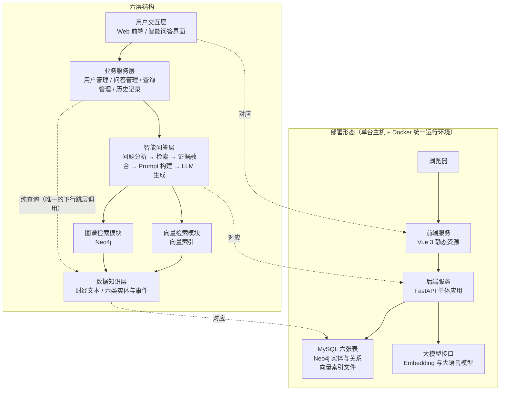

### 4.1 系统总体架构

本节给出系统的整体结构：六层架构与各层职责（《02》§8.1、§8.2 冻结）、层间调用关系、部署形态与技术栈（《02》§8.3、§8.4 冻结），并说明架构对《07》NFR-01 与 NFR-03 的支撑方式。本节的层次名称、层次顺序与技术选型不得改动；本节不引入《02》§8.4 清单之外的任何组件。

#### 4.1.1 六层架构图与部署形态

系统采用六层结构（图 4-1）。层次顺序与名称与《02》§8.1 一致：用户交互层 → 业务服务层 → 智能问答层 → 向量检索模块 ‖ 图谱检索模块 → 数据知识层。其中第三层之下并行存在两个检索模块，二者互不调用，均向智能问答层提供候选证据，并在第四层之下由数据知识层统一提供数据来源。同图右侧给出部署形态：系统按**单体后端 ＋ 前后端分离**的方式部署在一台机器上，不采用微服务架构、不引入容器编排系统，Docker 只用于**统一运行环境**（《02》§8.4 冻结）。

图 4-1　六层架构与部署形态（层次顺序与《02》§8.1 一致）

图 4-1 中除了"用户交互层 → 业务服务层 → 智能问答层 → 两个检索模块 → 数据知识层"这条主链，还有一条**虚线箭头**：**业务服务层 ⇢ 数据知识层（纯查询）**。它是 4.1.2 表 4-1 中"业务服务层 → 数据知识层"那条唯一的下行跳层调用在架构图上的表示，用于历史记录查询与证据明细查询——这两类请求是纯读操作，经过问答层不会产生任何增值处理。虚线同时标明它**不参与智能问答检索链路**：检索链路上的数据访问只发生在两个检索模块与数据知识层之间。

数据知识层的完整内容包括：原始财经信息（新闻、公告、政策）与从文本中抽取的结构化知识（事件、公司、行业、机构、人物、政策六类实体）。**时间信息不作为独立实体列出**：它以 Event 节点的 event_time、关系属性 valid_from／valid_to 与数据集版本级属性 data_cutoff_time 三种形式表达（《02》§10.1 冻结，判定规则见 4.4 与 4.5）。

关于部署形态的四条说明。第一，**前端与后端分离**：前端为 Vue 3 构建的静态资源，后端为 FastAPI 单体应用，二者通过 REST 接口通信（4.7）。第二，**后端为单体应用**：问答、数据、图谱与历史记录接口由同一个后端进程提供，检索、图谱扩展、时间过滤与证据排序流程由后端代码直接实现，不引入框架封装（《02》§8.4）。第三，**两个存储与一个索引并列**：MySQL 负责业务数据与文档元数据，是文本内容的唯一权威来源；Neo4j 负责实体、事件与关系，支撑多跳路径与时间查询；向量索引只负责文本语义相似度检索，不保存权威文本，只保存向量与索引结构（《02》§9.3）。第四，**模型通过接口调用**：Embedding 模型与大语言模型均通过后端配置项接入的外部接口调用，不在本地训练与部署大模型；接口地址与凭据保存在后端配置中，不出现在前端代码里（对应 4.7 的 NFR-06）。本文件不展开容器编排、持续集成、监控告警与备份恢复方案——这些属于部署运维细节，不是本阶段的设计内容（《09》§六 非目标 3）。

需要特别说明一处术语口径：图中"向量检索模块"在实现上对应《02》§9.3 的向量索引，FAISS 是向量相似度检索库（索引库），提供向量索引构建与相似度检索能力，**不提供独立服务进程、分布式部署、数据持久化与事务管理等数据库特性**，因此本文件统一表述为"向量索引"或"向量检索组件"，不按"向量数据库"表述（《02》§9.3）。

#### 4.1.2 各层职责与层间调用关系

表 4-1 把各层职责、输入输出与层间调用关系合并给出。职责描述与《02》§8.2 一致；输入输出是为使接口契约可核查而补充的说明，来源是《07》FR-01～FR-06 的输入与输出字段。

**表 4-1　各层职责、输入输出与层间调用关系**

| 层次 | 主要职责 | 输入 | 输出 | 被谁调用 → 调用谁 | 对应需求 |
| --- | --- | --- | --- | --- | --- |
| 用户交互层 | 提供问答输入、答案展示、来源与证据查看、图谱可视化与历史记录等页面；只负责界面与交互逻辑，**不直接访问数据库与模型** | 用户输入的问题、图谱查询条件、页面操作 | 提交给业务服务层的请求；展示给用户的答案、证据列表、图谱可视化数据与历史记录 | 用户 → 本层；本层 → 业务服务层（只此一条出口） | FR-03、FR-04、FR-05、FR-06 |
| 业务服务层 | 用户管理、问答管理、查询管理与历史记录；接收前端请求、校验参数、组织业务流程并返回结果；每一次提问、回答与引用证据都由该层落库 | 用户交互层的请求；智能问答层返回的答案、证据集合与图谱路径 | 面向用户交互层的响应体；写入 MySQL 的 question、answer 与 answer_evidence 记录 | 用户交互层 → 本层；本层 → 智能问答层；本层 → 数据知识层（纯查询，唯一的下行跳层调用） | FR-04、FR-05、FR-06 |
| 智能问答层 | 系统的核心处理单元，依次完成问题分析、检索、证据融合、Prompt 构建与大模型生成；问题分析判定问题类型与是否需要图谱扩展，证据融合把两路检索结果合并排序 | 问题文本、实体与时间约束；两路检索模块返回的候选文本块、图谱路径与事件属性 | 自然语言答案；最终证据集合；使用了图谱扩展时的图谱路径 | 业务服务层 → 本层；本层 → 两个检索模块；本层 → 大模型接口 | FR-04 |
| 向量检索模块 | 基于 FAISS 完成文本语义检索，输入是问题的向量表示，输出是候选文本块及其对应文档编号，用于提供原始文本证据 | 用户问题向量；候选数量 N 与裁剪上限 K（《02》§12.4、§12.7） | 候选文本块及其 doc_id、chunk_id 与向量检索的原始排名 | 智能问答层 → 本层；本层 → 数据知识层（只读） | FR-04 |
| 图谱检索模块 | 基于 Neo4j 完成实体、事件与关系的多跳查询，输出实体路径、事件属性与关联关系，用于补充文本检索难以覆盖的关系信息与时间信息 | 问题中的实体、时间约束与检索深度（0／1／2 跳） | 实体与事件节点、关系路径（含 role 与证据属性）、事件六项核心属性 | 智能问答层 → 本层；本层 → 数据知识层（只读） | FR-03、FR-04 |
| 数据知识层 | 统一管理新闻、公告、政策等原始财经信息，以及抽取出的六类实体、事件与关系等结构化知识；是向量检索与图谱检索共同的数据来源 | 后台导入的财经文本；抽取与消歧去重结果；重新处理指令 | MySQL 中的文档与文本块；Neo4j 中的实体、事件与关系；向量索引中的向量与三级编号 | 两个检索模块 → 本层（只读）；业务服务层 → 本层（只读）；后台脚本 → 本层（写入） | FR-01、FR-02 |

层间调用遵循两条约束，二者都是可核查的设计约束而不是实现建议。第一，**逐层向下调用，不跨层访问**：用户交互层只调用业务服务层；业务服务层只调用智能问答层；智能问答层调用两个检索模块；两个检索模块只访问数据知识层。用户交互层不得直连 MySQL、Neo4j 或向量索引，也不得直接调用大模型接口。第二，**两个检索模块互不调用**：向量检索的候选文本块与图谱检索的路径在智能问答层汇聚，由证据融合环节统一处理。这样划分的作用是使消融实验的变量可控制——A 组（仅向量检索）与 B／C 组（叠加图谱扩展）的差别只在于是否启用图谱检索模块，而不是在于某个模块内部的分支。

表 4-1 中"业务服务层 → 数据知识层"是**唯一的下行跳层调用**：历史记录与证据明细是纯查询，经过问答层不会产生任何增值处理，因此由业务服务层直接查询。该例外在 4.2 的模块间依赖中同样标注，以保证两处口径一致。第一版不启用登录时，业务服务层的用户管理模块保留最小形态（仅按《07》UC-07 的条件性决策保留接口位置），问答管理、查询管理与历史记录正常提供（《02》§8.2）。

#### 4.1.3 技术栈

技术栈与《02》§8.3 的技术栈固定表一致，模块、选型、用途与理由均不新增、不替换；此处以正文列出，避免与《02》形成两处需要同步维护的表。

- **前端 —— Vue 3**：实现智能问答界面、知识图谱可视化、来源与证据查看与历史记录页面。选型理由：组件化开发，上手成本低，适合单人完成界面部分。
- **后端 —— Python + FastAPI**：提供问答、数据、图谱、历史记录等接口，串联检索与生成流程。选型理由：Python 与数据处理、AI 生态一致，FastAPI 轻量且接口定义清晰、便于调试与测试。
- **关系数据库 —— MySQL**：存储用户、文档元数据、文本块、问题、回答与证据关联。选型理由：关系模型适合结构化业务数据，增删改查与事务处理成熟。
- **图数据库 —— Neo4j**：存储实体、事件与关系，支持多跳路径查询。选型理由：原生图存储与 Cypher 查询语言适合表达多跳关系与路径检索。
- **向量索引 —— FAISS**：保存文本块向量并完成相似度检索。选型理由：FAISS 本质是向量相似度检索库（索引库），轻量、可本地运行、不依赖额外服务，适合本科阶段的数据规模。
- **模型 —— Embedding 模型 + 大语言模型 API**：Embedding 模型负责文本与问题的向量化，大语言模型 API 负责基于证据生成答案。选型理由：不本地训练与部署大模型，把精力集中在系统设计与检索方法上；**具体模型名称与版本 TBD（选型后固化）**。
- **数据处理 —— Python**：数据清洗、文本切分、实体识别、事件抽取、实体消歧、事件去重与图谱写入。选型理由：与后端语言一致，脚本可复用，便于长期维护。
- **部署 —— Docker**：统一运行环境，打包后端与依赖服务。选型理由：降低环境差异带来的部署问题，便于答辩现场快速启动。

模型一项在本设计阶段保持 TBD：Embedding 模型与大语言模型的具体名称、版本与调用参数在《02》§12.4 的实验配置固定表中"选型后固化"，本文件不写死型号。系统支持多模型切换，两种模型都通过配置项接入，更换模型不需要修改前端代码。技术栈的边界同样固定：本课题不引入 LangChain 与 LlamaIndex，不引入 Milvus、Qdrant、Weaviate 等独立向量数据库系统，不引入 Elasticsearch 等独立检索引擎，不引入 Kafka、微服务架构与 Kubernetes，也不引入 Agent 框架与多智能体编排、多模态与语音能力、实时行情与实时推送（《02》§8.4 冻结）。

#### 4.1.4 架构对非功能需求的支撑

**对 NFR-01（响应时间）的支撑**：分层结构使一次问答的耗时可以被分段记录。图 4-1 中"智能问答层 → 向量检索模块"与"智能问答层 → 图谱检索模块"是两条独立的调用路径，各自返回后进入证据融合，因此向量检索耗时与图谱查询耗时可以分别计时；大模型生成耗时在"智能问答层 → 大模型接口"这一步记录。**三个计时点分别是向量检索调用处、图谱查询调用处与大模型调用处**，三段耗时相加得到单次问答的总耗时，业务服务层按《02》§7 的口径记录平均回答耗时与 P95 耗时。架构上的要求是三个计时点必须落在层间调用边界上，而不是落在某个函数内部，这样计时口径与论文第 6 章的测试口径一致。

**对 NFR-03（可维护性）的支撑**：三条设计约束共同支撑可维护性。一是**前后端分离**：前端只通过 REST 接口与后端交互，模型接口地址、数据库连接与检索参数集中在后端配置文件中管理，因此更换大模型 API 或 Embedding 模型时不需要修改前端代码。二是**逐层向下调用**：更换向量检索实现（例如调整 FAISS 索引类型）只影响向量检索模块内部，不波及业务服务层与用户交互层；更换图谱数据组织方式只影响图谱检索模块与数据知识层。三是**模块边界清晰**：六个功能模块与层次的对应关系在 4.2 给出，每个模块的职责与输入输出在表 4-2 中逐条列出，便于按模块维护与测试。
