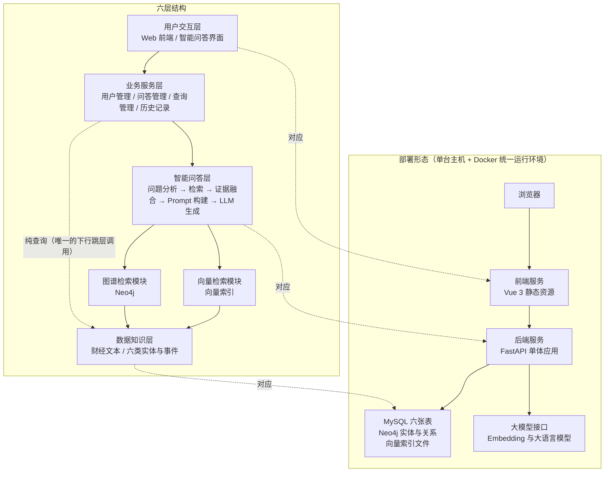

### 4.1 系统总体架构

本节给出系统的整体结构：六层架构与各层职责（《02》第8.1节、第8.2节 冻结）、层间调用关系、部署形态与技术栈（《02》第8.3节、第8.4节 冻结），并说明架构对《07》NFR-01 与 NFR-03 的支撑方式。本节的层次名称、层次顺序与技术选型不得改动；本节不引入《02》第8.4节 清单之外的任何组件。**唯一一处已登记的边界例外见 4.1.5**：第 9 阶段为演示实现的「实时数据区」是**演示增强组件、不是架构声明组件**，它不改变本节任何一处架构口径、不进任何实验组、不进证据链、不计入任何指标（登记依据：外部评审 P1-10，《02》第8.4.1节 同口径）。

#### 4.1.1 六层架构图与部署形态

系统采用六层结构（图 4-1）。层次顺序与名称与《02》第8.1节 一致：用户交互层 → 业务服务层 → 智能问答层 → 向量检索模块 ‖ 图谱检索模块 → 数据知识层。其中第三层之下并行存在两个检索模块，二者互不调用，均向智能问答层提供候选证据，并在第四层之下由数据知识层统一提供数据来源。同图右侧给出部署形态：系统按**单体后端 ＋ 前后端分离**的方式部署在一台机器上，不采用微服务架构、不引入容器编排系统，Docker 只用于**统一运行环境**（《02》第8.4节 冻结）。

```mermaid
flowchart TB
    subgraph LAYER["六层结构"]
        direction TB
        L1["用户交互层<br/>Web 前端 / 智能问答界面"]
        L2["业务服务层<br/>用户管理 / 问答管理 / 查询管理 / 历史记录"]
        L3["智能问答层<br/>问题分析 → 检索 → 证据融合 → Prompt 构建 → LLM 生成"]
        L4["向量检索模块<br/>向量索引"]
        L5["图谱检索模块<br/>Neo4j"]
        L6["数据知识层<br/>财经文本 / 六类实体与事件"]
        L1 --> L2
        L2 --> L3
        L3 --> L4
        L3 --> L5
        L4 --> L6
        L5 --> L6
        L2 -. "纯查询（唯一的下行跳层调用）" .-> L6
    end
    subgraph DEPLOY["部署形态（单台主机 + Docker 统一运行环境）"]
        direction TB
        FE["前端服务<br/>Vue 3 静态资源"]
        BE["后端服务<br/>FastAPI 单体应用"]
        ST["MySQL 六张表<br/>Neo4j 实体与关系<br/>向量索引文件"]
        BR["浏览器"] --> FE
        FE --> BE
        BE --> ST
        BE --> LLM["大模型接口<br/>Embedding 与大语言模型"]
    end
    L1 -. 对应 .-> FE
    L3 -. 对应 .-> BE
    L6 -. 对应 .-> ST
```

图 4-1　六层架构与部署形态（层次顺序与《02》第8.1节 一致）

图 4-1 中除了"用户交互层 → 业务服务层 → 智能问答层 → 两个检索模块 → 数据知识层"这条主链，还有一条**虚线箭头**：**业务服务层 ⇢ 数据知识层（纯查询）**。它是 4.1.2 表 4-1 中"业务服务层 → 数据知识层"那条唯一的下行跳层调用在架构图上的表示，用于历史记录查询与证据明细查询——这两类请求是纯读操作，经过问答层不会产生任何增值处理。虚线同时标明它**不参与智能问答检索链路**：检索链路上的数据访问只发生在两个检索模块与数据知识层之间。

数据知识层的完整内容包括：原始财经信息（新闻、公告、政策）与从文本中抽取的结构化知识（事件、公司、行业、机构、人物、政策六类实体）。**时间信息不作为独立实体列出**：它以 Event 节点的 event_time、关系属性 valid_from／valid_to 与数据集版本级属性 data_cutoff_time 三种形式表达（《02》第10.1节 冻结，判定规则见 4.4 与 4.5）。

关于部署形态的四条说明。第一，**前端与后端分离**：前端为 Vue 3 构建的静态资源，后端为 FastAPI 单体应用，二者通过 REST 接口通信（4.7）。第二，**后端为单体应用**：问答、数据、图谱与历史记录接口由同一个后端进程提供，检索、图谱扩展、时间过滤与证据排序流程由后端代码直接实现，不引入框架封装（《02》第8.4节）。第三，**两个存储与一个索引并列**：MySQL 负责业务数据与文档元数据，是文本内容的唯一权威来源；Neo4j 负责实体、事件与关系，支撑多跳路径与时间查询；向量索引只负责文本语义相似度检索，不保存权威文本，只保存向量与索引结构（《02》第9.3节）。第四，**模型通过接口调用**：Embedding 模型与大语言模型均通过后端配置项接入的外部接口调用，不在本地训练与部署大模型；接口地址与凭据保存在后端配置中，不出现在前端代码里（对应 4.7 的 NFR-06）。本文件不展开容器编排、持续集成、监控告警与备份恢复方案——这些属于部署运维细节，不是本阶段的设计内容（《09》第六节 非目标 3）。

需要特别说明一处术语口径：图中"向量检索模块"在实现上对应《02》第9.3节 的向量索引，FAISS 是向量相似度检索库（索引库），提供向量索引构建与相似度检索能力，**不提供独立服务进程、分布式部署、数据持久化与事务管理等数据库特性**，因此本文件统一表述为"向量索引"或"向量检索组件"，不按"向量数据库"表述（《02》第9.3节）。

#### 4.1.2 各层职责与层间调用关系

表 4-1 把各层职责、输入输出与层间调用关系合并给出。职责描述与《02》第8.2节 一致；输入输出是为使接口契约可核查而补充的说明，来源是《07》FR-01～FR-06 的输入与输出字段。

**表 4-1　各层职责、输入输出与层间调用关系**

| 层次 | 主要职责 | 输入 | 输出 | 被谁调用 → 调用谁 | 对应需求 |
| --- | --- | --- | --- | --- | --- |
| 用户交互层 | 提供问答输入、答案展示、来源与证据查看、图谱可视化与历史记录等页面；只负责界面与交互逻辑，**不直接访问数据库与模型** | 用户输入的问题、图谱查询条件、页面操作 | 提交给业务服务层的请求；展示给用户的答案、证据列表、图谱可视化数据与历史记录 | 用户 → 本层；本层 → 业务服务层（只此一条出口） | FR-03、FR-04、FR-05、FR-06 |
| 业务服务层 | 用户管理、问答管理、查询管理与历史记录；接收前端请求、校验参数、组织业务流程并返回结果；每一次提问、回答与引用证据都由该层落库 | 用户交互层的请求；智能问答层返回的答案、证据集合与图谱路径 | 面向用户交互层的响应体；写入 MySQL 的 question、answer 与 answer_evidence 记录 | 用户交互层 → 本层；本层 → 智能问答层；本层 → 数据知识层（纯查询，唯一的下行跳层调用） | FR-04、FR-05、FR-06 |
| 智能问答层 | 系统的核心处理单元，依次完成问题分析、检索、证据融合、Prompt 构建与大模型生成；问题分析判定问题类型与是否需要图谱扩展，证据融合把两路检索结果合并排序 | 问题文本、实体与时间约束；两路检索模块返回的候选文本块、图谱路径与事件属性 | 自然语言答案；最终证据集合；使用了图谱扩展时的图谱路径 | 业务服务层 → 本层；本层 → 两个检索模块；本层 → 大模型接口 | FR-04 |
| 向量检索模块 | 基于 FAISS 完成文本语义检索，输入是问题的向量表示，输出是候选文本块及其对应文档编号，用于提供原始文本证据 | 用户问题向量；候选数量 N 与裁剪上限 K（《02》第12.4节、第12.7节） | 候选文本块及其 doc_id、chunk_id 与向量检索的原始排名 | 智能问答层 → 本层；本层 → 数据知识层（只读） | FR-04 |
| 图谱检索模块 | 基于 Neo4j 完成实体、事件与关系的多跳查询，输出实体路径、事件属性与关联关系，用于补充文本检索难以覆盖的关系信息与时间信息 | 问题中的实体、时间约束与检索深度（0／1／2 跳） | 实体与事件节点、关系路径（含 role 与证据属性）、事件六项核心属性 | 智能问答层 → 本层；本层 → 数据知识层（只读） | FR-03、FR-04 |
| 数据知识层 | 统一管理新闻、公告、政策等原始财经信息，以及抽取出的六类实体、事件与关系等结构化知识；是向量检索与图谱检索共同的数据来源 | 后台导入的财经文本；抽取与消歧去重结果；重新处理指令 | MySQL 中的文档与文本块；Neo4j 中的实体、事件与关系；向量索引中的向量与三级编号 | 两个检索模块 → 本层（只读）；业务服务层 → 本层（只读）；后台脚本 → 本层（写入） | FR-01、FR-02 |

层间调用遵循两条约束，二者都是可核查的设计约束而不是实现建议。第一，**逐层向下调用，不跨层访问**：用户交互层只调用业务服务层；业务服务层只调用智能问答层；智能问答层调用两个检索模块；两个检索模块只访问数据知识层。用户交互层不得直连 MySQL、Neo4j 或向量索引，也不得直接调用大模型接口。第二，**两个检索模块互不调用**：向量检索的候选文本块与图谱检索的路径在智能问答层汇聚，由证据融合环节统一处理。这样划分的作用是使消融实验的变量可控制——A 组（仅向量检索）与 B／C 组（叠加图谱扩展）的差别只在于是否启用图谱检索模块，而不是在于某个模块内部的分支。

表 4-1 中"业务服务层 → 数据知识层"是**唯一的下行跳层调用**：历史记录与证据明细是纯查询，经过问答层不会产生任何增值处理，因此由业务服务层直接查询。该例外在 4.2 的模块间依赖中同样标注，以保证两处口径一致。第一版不启用登录时，业务服务层的用户管理模块保留最小形态（仅按《07》UC-07 的条件性决策保留接口位置），问答管理、查询管理与历史记录正常提供（《02》第8.2节）。

#### 4.1.3 技术栈

技术栈与《02》第8.3节 的技术栈固定表一致，模块、选型、用途与理由均不新增、不替换；此处以正文列出，避免与《02》形成两处需要同步维护的表。

- **前端 —— Vue 3**：实现智能问答界面、知识图谱可视化、来源与证据查看与历史记录页面。选型理由：组件化开发，上手成本低，适合单人完成界面部分。
- **后端 —— Python + FastAPI**：提供问答、数据、图谱、历史记录等接口，串联检索与生成流程。选型理由：Python 与数据处理、AI 生态一致，FastAPI 轻量且接口定义清晰、便于调试与测试。
- **关系数据库 —— MySQL**：存储用户、文档元数据、文本块、问题、回答与证据关联。选型理由：关系模型适合结构化业务数据，增删改查与事务处理成熟。
- **图数据库 —— Neo4j**：存储实体、事件与关系，支持多跳路径查询。选型理由：原生图存储与 Cypher 查询语言适合表达多跳关系与路径检索。
- **向量索引 —— FAISS**：保存文本块向量并完成相似度检索。选型理由：FAISS 本质是向量相似度检索库（索引库），轻量、可本地运行、不依赖额外服务，适合本科阶段的数据规模。
- **模型 —— Embedding 模型 + 大语言模型 API**：Embedding 模型负责文本与问题的向量化，大语言模型 API 负责基于证据生成答案。选型理由：不本地训练与部署大模型，把精力集中在系统设计与检索方法上；**Embedding 模型及其 revision 已在《02》第12.4节 与《13-数据准备（第五阶段）》第四节（向量化口径）中固化——`BAAI/bge-small-zh-v1.5`，HuggingFace revision `7999e1d3359715c523056ef9478215996d62a620`，512 维，L2 归一化，FAISS `IndexFlatIP`（内积＝余弦相似度）；大语言模型的名称与版本仍 TBD（选型后固化）**。
- **数据处理 —— Python**：数据清洗、文本切分、实体识别、事件抽取、实体消歧、事件去重与图谱写入。选型理由：与后端语言一致，脚本可复用，便于长期维护。
- **部署 —— Docker**：统一运行环境，打包后端与依赖服务。选型理由：降低环境差异带来的部署问题，便于答辩现场快速启动。

模型一项的版本链需要写明：本文件编写时，Embedding 模型与大语言模型在《02》第12.4节 的实验配置固定表中均标注"选型后固化"，因此本节只给出接入方式、**不写死型号**；此后《02》v2.6 已把 **Embedding 模型及其 revision 固化**——`BAAI/bge-small-zh-v1.5`，HuggingFace revision `7999e1d3359715c523056ef9478215996d62a620`，512 维，L2 归一化，FAISS `IndexFlatIP`（内积＝余弦相似度），落点见《02》第12.4节 与《13-数据准备（第五阶段）》第四节；**只剩大语言模型的名称与版本保持 TBD（选型后固化）**。本文件只登记"该值已在 v2.6 固化"这一事实，不做选型。系统支持多模型切换，两种模型都通过配置项接入，更换模型不需要修改前端代码。技术栈的边界同样固定：本课题不引入 LangChain 与 LlamaIndex，不引入 Milvus、Qdrant、Weaviate 等独立向量数据库系统，不引入 Elasticsearch 等独立检索引擎，不引入 Kafka、微服务架构与 Kubernetes，也不引入 Agent 框架与多智能体编排、多模态与语音能力、实时行情与实时推送（《02》第8.4节 冻结）。

#### 4.1.4 架构对非功能需求的支撑

**对 NFR-01（响应时间）的支撑**：分层结构使一次问答的耗时可以被分段记录。图 4-1 中"智能问答层 → 向量检索模块"与"智能问答层 → 图谱检索模块"是两条独立的调用路径，各自返回后进入证据融合，因此向量检索耗时与图谱查询耗时可以分别计时；大模型生成耗时在"智能问答层 → 大模型接口"这一步记录。**三个计时点分别是向量检索调用处、图谱查询调用处与大模型调用处**，三段耗时相加得到单次问答的总耗时，业务服务层按《02》第7节 的口径记录平均回答耗时与 P95 耗时。架构上的要求是三个计时点必须落在层间调用边界上，而不是落在某个函数内部，这样计时口径与论文第 6 章的测试口径一致。

**对 NFR-03（可维护性）的支撑**：三条设计约束共同支撑可维护性。一是**前后端分离**：前端只通过 REST 接口与后端交互，模型接口地址、数据库连接与检索参数集中在后端配置文件中管理，因此更换大模型 API 或 Embedding 模型时不需要修改前端代码。二是**逐层向下调用**：更换向量检索实现（例如调整 FAISS 索引类型）只影响向量检索模块内部，不波及业务服务层与用户交互层；更换图谱数据组织方式只影响图谱检索模块与数据知识层。三是**模块边界清晰**：六个功能模块与层次的对应关系在 4.2 给出，每个模块的职责与输入输出在表 4-2 中逐条列出，便于按模块维护与测试。

#### 4.1.5 边界例外登记：实时数据区（演示增强组件，非架构声明组件）

> **登记性质**：本小节是对外部评审 **P1-10** 的整改登记，**只登记、不改设计**——不新增层次、不新增模块、不新增表与字段、不新增接口契约条目，也不改动 4.1.1～4.1.4 的任何一处口径。原口径（4.1.3 末句与《02》第8.4节"不接入实时行情与实时推送"）**一字未改、仍为冻结口径**。

**一、例外对象与事实（先核实代码、再登记；出处是代码本身）。** 第 9 阶段为演示需要实现了页面上的「实时数据区」，物化落点是 `代码\后端\services\market_service.py`（取数服务）与 `代码\后端\api\market.py`（接口层），对外注册 **4 条只读接口**：`GET /api/market/quote`（实时行情）、`GET /api/market/announcements`（个股公告）、`GET /api/market/news`（个股新闻）、`GET /api/market/reports`（语料内近一周，**不依赖外部源**）。前三条的源是东方财富的**公开接口**（行情 `push2.eastmoney.com`、公告 `np-anotice-stock.eastmoney.com`、搜索 JSONP `search-api-web.eastmoney.com`，公告详情页 `data.eastmoney.com`），单次请求超时 **8 s**、进程内缓存 TTL **60 s**；任何外部源失败（超时／非 200／解析失败／网络不通）一律**降级**为 `connected=false` ＋ 一句简短 `reason` ＋ 空 `items`，**绝不返回编造的价格、涨跌幅或新闻**；第 4 条接口直接查库 `document` 表取语料内近一周文档，是外部源全不可用时的**降级形态**。4 条接口**全部只读、不写任何表**，每个响应体固定带 `"scope": "display_only"`；「未接入」不是错误（仍返回 HTTP 200 的业务信封，参数缺失＝1003、格式不合法＝1002 由接口层在调服务前判掉）。

**二、定性：演示增强组件，不是架构声明组件。** 本课题的架构声明、数据来源与实验口径**一律不依赖它**：

1. 它**不改变**本课题"基于离线数据集运行"的定位——问答答案仍锚定冻结语料（数据集 v2.1，数据截止 `2026-09-25T23:59:59+08:00`），相对时间表述一律以 `event_time` 判定、以数据截止时间为基准（4.1、4.4 与《02》第10.3节 的口径不变）；
2. 它**不进任何实验组**——A／B／C／D／E 五组与 Baseline 1／Baseline 2／Method 的配置（4.6.7）里没有这一项，三个开关不涉及它；
3. 它**不进证据链**——不参与向量检索、不进图谱扩展、不进最终证据集合（4.6.4 的五步契约与分层保留顺序不受影响），也不写入 `document`／`document_chunk`／`answer_evidence` 等任何一张表；
4. 它**不计入任何指标**——四项检索指标与 NFR 各项读数都在证据集合与问答链路上计算，与该组件无关。

**三、与本节架构口径的关系。** 4.1.1 的六层结构、层间调用约束、部署形态，4.1.2 的各层职责，4.1.3 的技术栈与边界，4.1.4 对 NFR 的支撑方式**均不因该组件改变**：它不属于六层中的任何一层，不是 4.2 六个功能模块中的任何一个，也不出现在 4.7 的接口契约清单（表 4-13）里——它是**实现侧的演示增强**，其接口与默认态登记在《25-第9阶段产出文档（前后端系统集成）》第 8 节与《27-第10阶段产出文档（系统测试与对比实验）》第 8 节。因此 4.1.3 末句与文首"不引入《02》第8.4节 清单之外的任何组件"这一约束**继续成立**：本组件不构成架构层面的引入，只构成一处**已登记的边界例外**。

**四、界面两态，默认态是"未接入"。** 前端把两个时间口径**分开显示**：语料口径（真实、常驻，显示"数据截至：YYYY-MM-DD"）与行情口径（默认"未接入"，可切"示意／已接入"态）。外部源不可达时页面如实显示"行情数据源未接入"＋接口实返的 `reason`，**不显示任何报价**；静态原型里的行情价格为静态**示意**并就地标注"示意：数据源接入后的形态"。

**五、不变项与引用边界。** 本小节**不改变** 4.1～4.7 的任何设计口径：六层名称与顺序、六个模块、6 类实体／8 种核心事件类型／9 条核心关系、六张表、9 条关系的证据属性、四级检索策略、Method 与 A～E 的配置、Top-K 五步契约、四项指标定义、时间判定规则、表 4-13 的 28 行接口清单，全部不变；**图仍为 8 张、表仍为 13 张**（本小节不新增图与表）。论文与答辩中如需提到该组件，一律按"**演示增强组件、只作展示、不进证据链、不计入指标**"表述，**不得**把它写成系统能力或数据来源依据。同口径登记另见《02》第8.4.1节、本文 4.8 节（修订记录）、`阶段04-系统总体设计\_分节源文件\4.1-系统总体架构.md` 文末的「修订登记（追加，不编号）」、「《25》第 8 节」、「《27》第 8 节」与 `阶段10-系统测试与对比实验\送审材料\数据来源与合规说明.md` 第 5.4 节。

### 修订登记（追加，不编号：见文末 4.8 节）

> **本节说明**：本标题**不是一个小节编号**——它是把本次登记的正文留在**物理改点**（本分节源文件）上的容器；正式的 4.8 节（`### 4.8 修订记录（P1-2 整改：8 张图导出 PNG）`）写在分节源文件 `4.7-接口设计.md` 的末尾，其中已并入本节内容。**2026-10-04 更正**：本容器原先误用 `### 4.8` 标题，与 4.7 末尾的 4.8 节**重号**，且位置落在 4.1.5 与 4.2 之间、与阅读顺序不符；现改为**不编号标题**，正文原样保留。

**修订登记（2026-10-04，外部评审 P1-10 的边界例外登记）**：落实外部评审报告《评审报告（前九阶段·七维度）》的 **P1-10**——`代码\后端\services\market_service.py` 运行时从东方财富公开接口取实时数据，与会话级口径"不接入实时行情与实时推送"存在**越界且未登记**的风险。按 Lead 裁定走**路线 ②「登记为边界例外」**（保留组件、登记定性；删除是不可逆的内容削减，登记是可逆的）。本次在本分节源文件内的落点有两处，均为**追加、未改动任何原句**：

1. **文首 4.1 引言末句之后追加一句**：把 4.1.5 明确为"唯一一处已登记的边界例外"，并说明它不改变本节的任何架构口径；4.1 引言原有的"本节不引入《02》第8.4节 清单之外的任何组件"**一字未改**。
2. **新增 `#### 4.1.5 边界例外登记：实时数据区（演示增强组件，非架构声明组件）`**（排在 4.1.4 之后，五个要点）：① 例外对象与事实（`代码\后端\services\market_service.py` ＋ `代码\后端\api\market.py`，4 条只读接口 `GET /api/market/quote`／`announcements`／`news`／`reports`，东方财富公开源，超时 8 s、进程内缓存 TTL 60 s、失败降级为 `connected=false`＋`reason`＋空 `items`、绝不编造数据，第 4 条查 `document` 表不依赖外部源，响应体恒带 `"scope": "display_only"`）；② 定性为**演示增强组件、非架构声明组件**（不改变"基于离线数据集运行"的定位、**不进任何实验组、不进证据链、不计入任何指标**）；③ 与本节架构口径的关系（不属六层中的任何一层、不是 4.2 六个模块之一、不在表 4-13 内）；④ 界面两态且默认"未接入"；⑤ 不变项与引用边界（**图仍为 8 张、表仍为 13 张**，本小节不新增图与表）。

**物理改点与生成方式**：改点是 `阶段04-系统总体设计\_分节源文件\4.1-系统总体架构.md` 本文件；《10-系统总体设计（第四阶段）》由 `工具\拼装第四阶段文档.py` **重新拼装生成，不手改交付文档**；同日复跑 `工具\验收第4阶段文档.py`，其 B-31 结构断言（76 项、4 节）与图／表编号判据（图 4-1～4-8 共 8 张、表 4-1～4-13 共 13 张）**均未变、退出码 0**。

**不变项（一刀未动）**：六层名称与顺序、六个功能模块、6 类实体／8 种核心事件类型／9 条核心关系、六张表、9 条关系的证据属性、四级检索策略、Method 与 A～E 的配置、Top-K 五步契约与分层保留顺序、四项指标定义与 Precision@K 分母恒为 K、时间判定规则、表 4-13 的 28 行清单，以及**本文其他任何一处设计口径**，全部不变。**本小节是"边界例外登记"，不是"功能新增"，也不代表本课题开始接入实时行情**；`代码\` 下本次**一个字节未改**。
