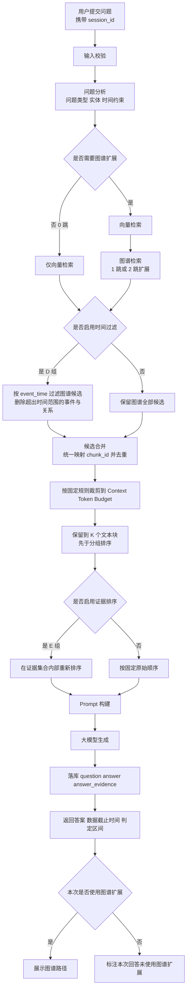
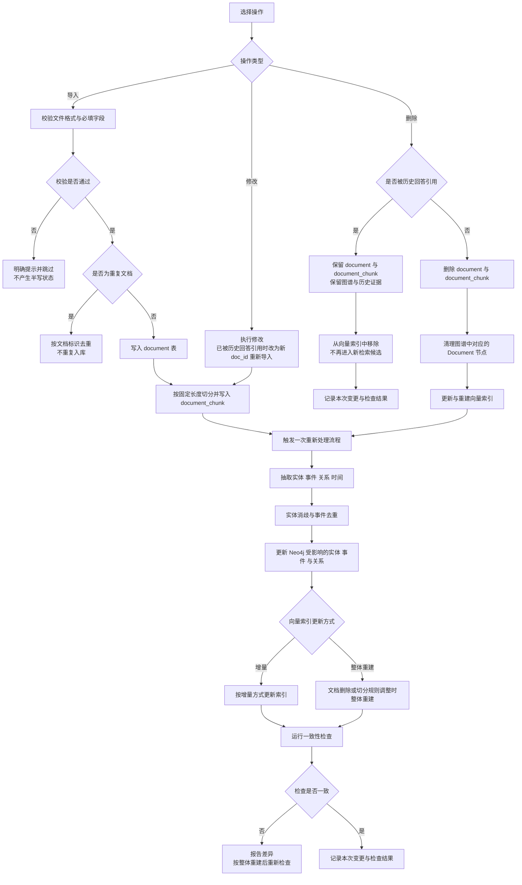

### 4.3 系统业务流程

本节把《02》第11节 的技术路线落实到系统层面，给出四条业务流程：提问问答（以《02》第11.3节 为主干）、图谱查看、历史回看、后台导入与重新处理。每条流程给出步骤、状态流转、涉及的用例编号与异常分支。四条流程覆盖《07》UC-01～UC-07：UC-01 与 UC-02 落在流程一，UC-03 落在流程二，UC-04 落在流程三，UC-05 与 UC-06 落在流程四，UC-07 是条件性开启的登录步骤，只影响流程一与流程三的入口。表 4-4 与表 4-5 分别给出四条流程的主流程与全部异常分支。

#### 4.3.1 流程一：提问问答（含答案与证据返回）

本流程是系统的核心流程，以《02》第11.3节 的"一次用户提问的完整执行流程"为主干，对应 FR-04、FR-05 与 FR-06，涉及用例 UC-01 与 UC-02。图 4-2 给出该流程。

图 4-2　提问问答的完整业务流程（主干与《02》第11.3节 一致）

**时间过滤的位置**：图 4-2 中时间过滤（第 6 步）位于"候选合并与去重"（第 7 步）**之前**，因此 D 组与 C 组得到的候选集合可以不同——这是 H3 可测的前提。而"保留到 K 个文本块"（第 9 步）位于证据排序（第 10 步）**之前**，因此 D 组与 E 组的最终证据集合完全相同，E 组只改变集合内部的顺序。两条位置约束各自保证一个实验变量的单一性，缺一不可，其口径依据见 4.6.4。

流程一的状态机可以归纳为：**空闲 → 提交中 → 已受理 → 已定策略 → 候选就绪 → 已过滤 → 候选集合定稿 → 顺序确定 → 答案就绪 → 已持久化**。其中"候选就绪"之后的分支由实验配置开关决定（是否启用图谱扩展、是否启用时间过滤、是否启用证据排序），三种开关的组合即《02》第12.6节 的消融 A～E 组：A 组为 0 跳、不启用时间过滤、不启用证据排序；B 组为 1 跳；C 组为 2 跳；D 组为 C 组 ＋ 时间过滤；E 组为 D 组 ＋ 证据排序。系统本身支持全部组合，Method 取 C 组的配置。

#### 4.3.2 流程二：图谱查看

本流程对应 FR-03，涉及用例 UC-03。流程从用户选择查询条件（实体、事件、关系或时间区间）开始，依次完成条件解析、Neo4j 检索、按需的多跳扩展、按 event_time 的时间过滤、同一事件多来源按 publish_time 排序与去重、关系证据属性组装与可视化数据输出；前端渲染实体、事件与路径。状态机为：**空闲 → 条件已选 → 已提交 → 已解析 → 已命中 → 路径就绪 → 已过滤 → 来源定稿 → 可渲染**。流程二与流程一的区别有两点：一是只读，不写库；二是多跳扩展由用户在页面上直接指定深度，不经过问题分析（问题分析只在流程一中出现）。

#### 4.3.3 流程三：历史回看

本流程对应 FR-06，涉及用例 UC-04。流程从用户打开历史记录页面开始，依次完成会话标识获取（缺失时生成新的 session_id）、按 session_id 过滤 question、以 question_id 关联 answer、以 answer_id 关联 answer_evidence、按提问时间展示历史问答列表，最后回看选中的一条记录。状态机为：**空闲 → 已进入 → 标识就绪 → 已筛选 → 已还原 → 已展示 → 已回看**。

**两条硬约束在本流程中体现**：一是历史记录按 session_id 过滤，**不同匿名会话之间互不可见**，因此本会话的列表只能包含本会话的记录；二是回看只还原 question、answer 与 answer_evidence 三表的内容，**不重新渲染**当时展示的图谱路径视图——图谱路径存于 answer.graph_path 字段、不建立独立路径表，表数量恒为六张，因此历史回看不涉及"是否展示虚构路径"的问题（其存储形式与局限见 4.4.7）；如需查看相关图谱关系，回到流程二重新查询。

#### 4.3.4 流程四：后台导入与重新处理

本流程对应 FR-01，涉及用例 UC-05（导入）与 UC-06（变更并触发重新处理），重新处理过程同时涉及 FR-02 与 FR-03。该流程是后台系统能力，不对普通用户开放。图 4-3 给出该流程。

**三种操作走三条不同的支路**：导入走"校验 → 入库 → 切分"；修改走"修改 → 重新切分"；**删除不经过切分，而是先判断是否被历史回答引用**，再决定是"保留原文档与文本块、仅从新检索中移除"还是"删除文档与文本块、清理图谱、更新索引"。三条支路在"触发重新处理"处汇合（删除支路中被引用的情形除外，它只记录结果、不触发重新处理）。**修改与删除受同一条历史证据保护规则约束**：文档一旦被 answer_evidence 引用，既不执行物理删除，也不执行原地修改；已被引用的修改改为**以新 doc_id 重新导入其新版本**并触发完整重新处理，旧记录的文本块从向量索引中移除、不再进入新检索候选（数据库层规则见 4.4.2，接口见 4.7 表 4-13 的 PUT 与 DELETE 行）。

图 4-3　后台导入、修改与删除的三条支路及重新处理流程（对应《02》第6.2节 功能 1）

流程四的状态机为：**空闲 → 任务已选 → 已校验 → 已写入 → 已切分 → 处理中 → 图谱已更新 → 索引已更新 → 已检查 → 已记录**；删除支路中被引用的情形走 **空闲 → 任务已选 → 已校验 → 检索移除 → 已记录**，跳过重新处理。图 4-3 中"是否被历史回答引用"这一判断的数据库层依据见 4.4.2：被引用的文档禁止物理删除、也禁止原地修改，只从新检索候选中移除；被引用的修改以新 doc_id 重新导入，新文档走完整的重新处理，旧记录走"检索移除"。

**本流程的口径边界**：本条口径为"变更后重新处理 ＋ 一致性检查"，**不承诺 MySQL、Neo4j 与向量索引之间的实时同步**；三者承担不同职责，实时同步既超出本科阶段可实现与可验证的范围，也会引入与课题核心问题无关的工程复杂度（《02》第7节 数据一致性）。

#### 4.3.5 四条流程的主流程综合表

表 4-4 按"流程—步骤"两栏给出四条流程的主流程步骤、输入输出与状态流转，并与《07》的 UC 步骤对齐。步骤编号在每条流程内独立计数，与图 4-2、图 4-3 的节点顺序一致。

**表 4-4　四条流程的主流程综合表**

| 流程与步骤 | 动作 | 输入 | 输出 | 状态流转 | 对应 UC 步骤 |
| --- | --- | --- | --- | --- | --- |
| 流程一·1 | 用户提交问题 | 问题文本、浏览器 session_id | 待校验请求 | 空闲 → 提交中 | UC-01 步骤 1、2 |
| 流程一·2 | 输入校验 | 待校验请求 | 校验通过的请求 | 提交中 → 已受理 | UC-01 步骤 3 |
| 流程一·3 | 问题分析 | 校验通过的请求 | 问题类型、实体列表、时间约束、是否启用图谱扩展 | 已受理 → 已定策略 | UC-01 步骤 4 |
| 流程一·4 | 文本检索 | 问题向量、实体关键词、候选数量 N | 候选文本块及其 doc_id、chunk_id 与原始排名 | 已定策略 → 候选就绪 | UC-01 步骤 5 |
| 流程一·5 | 图谱检索与扩展 | 实体、时间约束、检索深度 | 图谱路径、事件属性、图谱侧候选文本块 | 已定策略 → 候选就绪 | UC-01 步骤 6 |
| 流程一·6 | 时间过滤（D 组启用） | 图谱侧候选、时间约束 | 按 event_time 过滤后的图谱候选与事件集合 | 候选就绪 → 已过滤 | UC-01 步骤 7 |
| 流程一·7 | 候选合并与去重 | 向量候选 ＋ 过滤后的图谱候选 | 按 chunk_id 去重的候选集合 | 已过滤 → 已去重 | UC-01 步骤 8（前半） |
| 流程一·8 | 预算裁剪 | 去重后的候选集合、Context Token Budget | 预算内的候选集合 | 已去重 → 已裁剪 | UC-01 步骤 8（前半） |
| 流程一·9 | 保留到 K 个 | 预算内的候选集合、K | 最终证据集合 | 已裁剪 → 候选集合定稿 | UC-01 步骤 8（前半） |
| 流程一·10 | 证据排序（E 组启用） | 最终证据集合 | 集合内部的顺序 | 候选集合定稿 → 顺序确定 | UC-01 步骤 8（后半） |
| 流程一·11 | Prompt 构建与大模型生成 | 证据集合、图谱路径、dataset_version、data_cutoff_time | 自然语言回答 | 顺序确定 → 答案就绪 | UC-01 步骤 9 |
| 流程一·12 | 落库与返回 | 问题、回答、证据集合、判定区间 | question、answer、answer_evidence 记录；页面响应 | 答案就绪 → 已持久化 | UC-01 步骤 10、11 |
| 流程二·1 | 选择查询条件 | 实体、事件类型、关系类型或时间区间 | 查询条件 | 空闲 → 条件已选 | UC-03 步骤 1 |
| 流程二·2 | 提交并解析查询条件 | 查询条件 | 结构化查询条件（区分实体、事件、关系与时间四类） | 条件已选 → 已解析 | UC-03 步骤 2、3（前半） |
| 流程二·3 | 节点与关系检索 | 结构化查询条件 | 匹配的实体、事件与关系 | 已解析 → 已命中 | UC-03 步骤 3（后半） |
| 流程二·4 | 多跳路径扩展 | 起点实体或事件、检索深度 | 路径及其上的节点与关系 | 已命中 → 路径就绪 | UC-03 步骤 4 |
| 流程二·5 | 时间过滤 | 时间区间、事件节点 | 过滤后的事件集合 | 路径就绪 → 已过滤 | UC-03 步骤 5 |
| 流程二·6 | 多来源排序与去重 | 事件的多份证据文档 | 按 publish_time 排序后的来源列表 | 已过滤 → 来源定稿 | UC-03 C2 |
| 流程二·7 | 证据属性组装与可视化输出 | 路径上的关系 | 关系及其证据属性、可视化数据结构 | 来源定稿 → 可渲染 | UC-03 步骤 6、7 |
| 流程三·1 | 打开历史记录页面 | 用户操作 | 页面请求 | 空闲 → 已进入 | UC-04 步骤 1 |
| 流程三·2 | 会话标识获取 | 浏览器中的 session_id | 带标识的请求 | 已进入 → 标识就绪 | UC-04 步骤 2 |
| 流程三·3 | 历史记录筛选 | session_id（或启用登录后的 user_id） | 命中的 question 记录 | 标识就绪 → 已筛选 | UC-04 步骤 3 |
| 流程三·4 | 记录关联还原 | question、answer、answer_evidence | 完整问答记录（问题、提问时间、回答与引用证据） | 已筛选 → 已还原 | UC-04 步骤 4 |
| 流程三·5 | 列表展示 | 完整问答记录 | 按提问时间排序的历史列表 | 已还原 → 已展示 | UC-04 步骤 5 |
| 流程三·6 | 单条回看 | 历史记录标识 | 该次回答及其引用证据 | 已展示 → 已回看 | UC-04 步骤 6 |
| 流程四·1 | 选择操作与目标文档 | 待导入文本；或已入库文档的修改、删除指令 | 待处理任务 | 空闲 → 任务已选 | UC-05 步骤 1；UC-06 步骤 1 |
| 流程四·2 | 导入校验 | 文件格式与必填字段 | 校验结论与拒绝原因 | 任务已选 → 已校验 | UC-05 步骤 2 |
| 流程四·3 | 文档写入、修改或删除 | 校验通过的文本与元数据；或修改、删除指令 | document 记录（或删除/保留的处置结果） | 已校验 → 已写入 | UC-05 步骤 3；UC-06 步骤 2 |
| 流程四·4 | 文本切分（导入与修改支路） | document 记录、切分规则 | document_chunk 记录 | 已写入 → 已切分 | UC-05 步骤 4 |
| 流程四·5 | 触发重新处理（导入、修改与未被引用的删除支路） | 文档变更事件 | 各环节的执行记录 | 已切分 → 处理中 | UC-05 步骤 5；UC-06 步骤 3 |
| 流程四·6 | 抽取与图谱更新 | 文本块变更集合 | 实体、事件、关系与时间信息；受影响节点的更新 | 处理中 → 图谱已更新 | UC-06 步骤 5 |
| 流程四·7 | 索引更新 | 文本块变更集合 | 更新后的向量索引 | 图谱已更新 → 索引已更新 | UC-06 步骤 4 |
| 流程四·8 | 一致性检查 | 图谱与索引现状 | 一致性检查结果 | 索引已更新 → 已检查 | UC-05 步骤 6；UC-06 步骤 6 |
| 流程四·9 | 记录结果 | 本次变更与检查结果 | 变更记录与检查记录 | 已检查 → 已记录 | UC-06 步骤 7 |

#### 4.3.6 四条流程的异常分支总表

表 4-5 汇总四条流程的全部异常分支（共 24 条：流程一 A1～A7 与 B1～B3 共 10 条、流程二 C1～C4 共 4 条、流程三 D1～D3 共 3 条、流程四 E1～E3 与 F1～F4 共 7 条）。分支编号与《07》UC 的备选流程一一对应（A＝UC-01、B＝UC-02、C＝UC-03、D＝UC-04、E＝UC-05、F＝UC-06）。

**表 4-5　四条流程的异常分支总表**

| 所属流程 | 分支 | 触发条件 | 系统行为 | 状态影响 | 对应 UC 分支 |
| --- | --- | --- | --- | --- | --- |
| 流程一 提问问答 | A1 | 提交内容为空或长度超出接口限制 | 提示用户输入问题，**不调用检索与模型接口** | 提交中 → 已受理 失败，回到空闲 | UC-01 A1 |
| 流程一 提问问答 | A2 | 统一封装的超时与重试仍失败 | 给出明确提示，页面不失效，错误提示不泄露密钥与内部堆栈信息；对相同问题可使用缓存结果 | 顺序确定 → 答案就绪 失败，保留已生成的证据集合 | UC-01 A2 |
| 流程一 提问问答 | A3 | 图谱侧无匹配节点或路径 | 返回文本检索得到的证据并说明图谱侧无匹配；**按未使用图谱扩展处理并显式标注** | 图谱候选就绪 → 图谱候选为空，流程继续 | UC-01 A3 |
| 流程一 提问问答 | A4 | 问题中的时间超出数据边界 | 按数据截止时间解释判定基准并说明数据边界，**不编造数据截止时间之后的事实** | 已定策略 时确定判定区间，流程继续 | UC-01 A4 |
| 流程一 提问问答 | A5 | 问题分析判定为 0 跳，或该组配置不启用图谱扩展 | 正常返回文本证据，并在图谱路径区域标注"本次回答未使用图谱扩展"，**不展示虚构路径** | 已定策略 时跳过图谱检索 | UC-01 A5 |
| 流程一 提问问答 | A6 | 问题不属于可核验的事实型、事件型、关系型或时序型问题 | 在页面与答案中同屏标注"模型分析（非公开事实）"；只用于答辩演示、页面展示与失败案例分析，不计入任何指标 | 答案就绪 时附加标注 | UC-01 A6 |
| 流程一 提问问答 | A7 | 向量索引不可用或图谱服务不可用 | 返回对应错误码（3003／3001）并给出明确提示，页面不失效；**不返回半成品答案** | 已定策略 → 候选就绪 失败 | 本节新增（与 4.7 的错误码对应） |
| 流程一 提问问答 | B1 | 本次回答未使用图谱扩展 | 在图谱路径区域显示"本次回答未使用图谱扩展"，不留空，也不展示虚构路径（《02》第13节） | 答案就绪 时确定图谱路径区域的显示状态，流程继续 | UC-02 B1 |
| 流程一 提问问答 | B2 | 证据对应的原文访问受限 | 保留来源类型、发布时间与文档编号，并提示原文访问受限 | 已展示 时保留证据元数据并提示，流程继续 | UC-02 B2 |
| 流程一 提问问答 | B3 | 开放式分析问题 | 页面已同屏标注"模型分析（非公开事实）"，与公开事实分区展示（《02》第12.9节） | 答案就绪 时附加标注，流程继续 | UC-02 B3 |
| 流程二 图谱查看 | C1 | 无匹配的实体、事件或路径 | 提示未检索到匹配的实体、事件或路径，并说明可调整实体名称或时间区间 | 已解析 → 已命中 失败，回到空闲 | UC-03 C1 |
| 流程二 图谱查看 | C2 | 一个事件挂多份证据文档 | 按 publish_time 排序展示，发布时间最早的一份作为主要来源，其余作为补充证据 | 来源定稿 时确定主要来源 | UC-03 C2 |
| 流程二 图谱查看 | C3 | 关系无法归入本体定义的 9 条核心关系 | 不临时增加关系类型，按本体适用边界记录并提示 | 已解析 时收窄查询范围 | UC-03 C3 |
| 流程二 图谱查看 | C4 | 未选择任何条件即提交 | 提示查询条件不能为空，不进入 Neo4j 查询 | 已提交 → 已解析 失败 | 《07》第3.4节 前置条件 |
| 流程三 历史回看 | D1 | 浏览器存储被清空或首次访问 | 生成新的 session_id，历史记录为空，**不展示其他匿名会话的记录** | 标识就绪 时重新生成 | UC-04 D1 |
| 流程三 历史回看 | D2 | 模板或毕业设计要求明确体现用户管理 | 先完成登录，历史记录按 user_id 关联 | 已进入 前插入登录步骤 | UC-04 D2、UC-07 |
| 流程三 历史回看 | D3 | 本会话此前提问为空或无记录 | 给出明确提示，不显示空白页面 | 已筛选 → 已还原 为空，给出提示 | UC-04 D3 |
| 流程四 后台处理 | E1 | 文件不属于允许格式清单 | 给出明确提示并跳过该文件，**不产生半写状态**；允许格式清单在实现阶段固定并与论文测试环境记录 | 已校验 → 已写入 失败，跳过 | UC-05 E1 |
| 流程四 后台处理 | E2 | 标题、正文、发布时间、来源等必填字段缺失 | 提示缺失字段并**拒绝入库** | 已校验 → 已写入 失败，拒绝 | UC-05 E2 |
| 流程四 后台处理 | E3 | 按文档标识判定为已入库文档 | 按文档标识去重处理，不重复入库 | 已校验 时判定为重复，流程结束 | UC-05 E3 |
| 流程四 后台处理 | F1 | 处理过程中断 | 记录中断位置，重新运行后按同一流程完成，避免残留失效数据 | 处理中 → 中断，可续跑 | UC-06 F1 |
| 流程四 后台处理 | F2 | 抽取结果与图谱节点数量或文本块数与向量条数不匹配 | 报告差异，并按整体重建方式重新构建索引后再检查 | 已检查 → 不一致，回到索引更新 | UC-06 F2 |
| 流程四 后台处理 | F3 | 一次变更涉及多个事件的合并或拆分 | 按实体消歧与事件去重的既有规则处理，合并动作写入抽取日志 | 图谱已更新 时按既有规则处理 | UC-06 F3 |
| 流程四 后台处理 | F4 | 待删除文档已被 answer_evidence 引用 | **不执行物理删除**，只使该文档进入"不可再用于新检索"的处理状态，并给出说明 | 已校验 → 已写入 受限，历史证据保持不变 | 本节新增（依据 FR-06 的历史可回溯要求，见 4.3.4、4.4.2） |

#### 4.3.7 四条流程与用例的对应关系

按《02》第6.3节 的口径：**财经信息管理（导入、删除、更新）不在普通用户的用例中**；若按条件下开启"仅登录"，则在提交问题（流程一）与查看历史记录（流程三）之前增加一个登录步骤，其余用例与流程不变。

四条流程与用例、功能需求的对应关系为：**流程一（提问问答）** 对应 UC-01、UC-02，承担 FR-04、FR-05、FR-06，触发图谱扩展时同时涉及 FR-03，使用者为普通用户，视问题与实验配置决定是否使用图谱扩展，**写库**（question、answer、answer_evidence）；**流程二（图谱查看）** 对应 UC-03，承担 FR-03，查看关系证据属性时涉及 FR-02，使用者为普通用户，使用图谱扩展（1 跳或 2 跳），**只读**；**流程三（历史回看）** 对应 UC-04，承担 FR-06，使用者为普通用户，不使用图谱扩展，**只读**；**流程四（后台导入与重新处理）** 对应 UC-05、UC-06，承担 FR-01，重新处理涉及 FR-02 与 FR-03，使用者为后台，**写库**（document、document_chunk 及图谱与索引）；**条件性登录** 对应 UC-07，承担 FR-06 的历史记录归属，仅在前置步骤出现，不写库。
