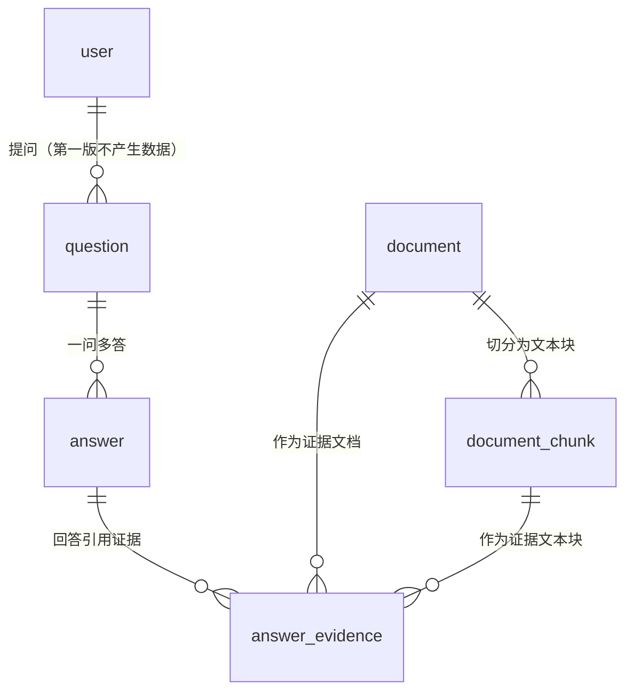
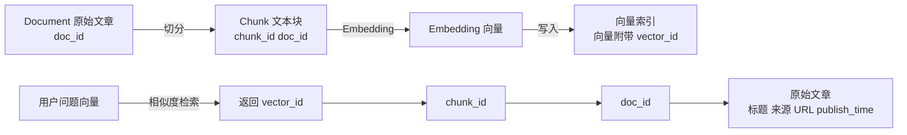

### 4.4 数据库设计

本节给出 MySQL 六张表的字段级设计、索引与外键的口径、ER 图，以及 session_id、data_cutoff_time 与 answer.graph_path 三处需要特别说明的内容。表的数量与职责沿用《02》第9.1节：**恒为六张**——user、document、document_chunk、question、answer、answer_evidence，不新增表；history 表已删除、不复活。本节不写完整建表语句，仅在必要处给出关键约束的等价 SQL 片段；建表语句属实现内容，在论文第五章给出。

#### 4.4.1 字段级设计

**六张表全部建立**：user 表在第一版不启用登录业务时**保持为空、不写入数据**，**不采用"按条件决定是否建表"的做法**，这样表数量、外键关系与 schema 在任何情况下都一致，论文口径与答辩口径统一为"六张表"（《02》第9.1节）。

表 4-6 按"表—字段"两栏给出六张表的全部字段设计，"键"一列同时给出主键、外键、唯一约束与索引的落点，因此本节不再另设索引与外键清单表。类型按 MySQL 8 的通用类型给出，属于设计层面的选择，实现阶段可在不改变语义的前提下微调；**字段名与字段职责以《02》第9.1节 为准**，本表不新增字段。

**表 4-6　六张表的字段级设计（表—字段综合表，含键与索引落点）**

| 表（用途） | 字段名 | 类型 | 可空 | 键 | 说明 |
| --- | --- | --- | --- | --- | --- |
| user（存储账号与登录信息；仅在启用登录功能时使用；第一版保持为空） | user_id | BIGINT | 否 | 主键 | 用户标识；第一版不写入数据 |
| user | username | VARCHAR(64) | 否 | 唯一索引 uk_user_username | 登录名；仅启用登录时使用 |
| user | password_hash | VARCHAR(255) | 否 | — | 口令摘要，不保存明文口令；仅启用登录时使用 |
| user | create_time | DATETIME | 否 | — | 记录创建时间 |
| document（存储导入的财经文本及其元数据，是向量化与事件抽取的数据来源） | doc_id | BIGINT | 否 | 主键 | 文档标识，是向量—原文映射链路的终点编号 |
| document | title | VARCHAR(512) | 否 | — | 文档标题 |
| document | content | LONGTEXT | 否 | — | 文档正文，是文本内容的权威来源 |
| document | source | VARCHAR(128) | 否 | — | 来源类型，用于区分公告、新闻与政策文件（与 category 共同区分来源） |
| document | url | VARCHAR(1024) | 是 | — | 原文链接；访问受限时保留其余元数据 |
| document | publish_time | DATETIME | 否 | 普通索引 idx_doc_publish_time | 文档发布时间，归属 Document 节点一侧 |
| document | ingest_time | DATETIME | 否 | 普通索引 idx_doc_ingest_time | 入库时间，由导入环节写入 |
| document | category | VARCHAR(64) | 是 | 普通索引 idx_doc_category | 文档分类，与 source 共同区分来源类型 |
| document | company_list | VARCHAR(512) | 是 | — | 涉及公司的代码或名称列表，供检索与统计使用 |
| document | create_time | DATETIME | 否 | — | 记录创建时间 |
| document_chunk（存储文档切分后的文本块，是向量检索与证据定位之间的中间层） | chunk_id | BIGINT | 否 | 主键 | 文本块标识，是证据的最小单位（一个文本块只算一个证据） |
| document_chunk | doc_id | BIGINT | 否 | 外键 fk_chunk_doc → document.doc_id（级联删除）；普通索引 idx_chunk_doc_id | 所属文档 |
| document_chunk | chunk_index | INT | 否 | 唯一键 uk_chunk_doc_index(doc_id, chunk_index) | 文本块在文档内的序号 |
| document_chunk | content | TEXT | 否 | — | 文本块内容 |
| document_chunk | token_count | INT | 否 | — | 文本块 token 数，用于上下文预算裁剪 |
| document_chunk | vector_id | BIGINT | 是 | 唯一索引 uk_chunk_vector_id | 向量在索引中的编号；未向量化时为空；由 vector_id 反查 chunk_id 是向量—原文反向定位链路的中间一步 |
| question（存储用户提交的问题；task_type、gold_hop_depth、time_constraint 为测试集标注字段，非测试集题目留空） | question_id | BIGINT | 否 | 主键 | 问题标识 |
| question | user_id | BIGINT | 是 | 外键 fk_question_user → user.user_id（置空） | 提问用户；登录未启用时为空 |
| question | session_id | CHAR(36) | 是 | 联合索引 idx_q_session_time(session_id, ask_time) | 浏览器生成的 UUID，用于按会话隔离历史记录 |
| question | question_text | TEXT | 否 | — | 问题正文 |
| question | task_type | VARCHAR(16) | 是 | 普通索引 idx_q_task_type | 测试集标注字段：事实型／事件型／关系型；非测试集题目留空 |
| question | gold_hop_depth | TINYINT | 是 | 普通索引 idx_q_gold_hop_depth | 测试集标注字段：标注路径深度 0／1／2；非测试集题目留空 |
| question | time_constraint | TINYINT | 是 | 普通索引 idx_q_time_constraint | 测试集标注字段：是否有时间约束 0／1；非测试集题目留空 |
| question | ask_time | DATETIME | 否 | 同上联合索引 | 提问时间 |
| answer（存储系统生成的回答及其生成信息） | answer_id | BIGINT | 否 | 主键 | 回答标识 |
| answer | question_id | BIGINT | 否 | 外键 fk_answer_question → question.question_id（级联删除）；普通索引 idx_a_question_id | 对应问题 |
| answer | answer_text | LONGTEXT | 否 | — | 回答正文 |
| answer | graph_path | JSON | 是 | — | 使用的图谱路径，第一版以 JSON 文本存储；未使用图谱扩展时为空 |
| answer | model_name | VARCHAR(128) | 否 | — | 生成模型标识，用于实验期间固定模型 |
| answer | prompt_version | VARCHAR(16) | 否 | — | Prompt 版本号，用于实验期间固定提示词 |
| answer | is_graph_extended | TINYINT | 否 | — | 本次回答是否使用了图谱扩展，0／1；决定证据区域显示路径还是显式标注 |
| answer | create_time | DATETIME | 否 | 普通索引 idx_a_create_time | 回答生成时间 |
| answer_evidence（存储答案与证据文档、证据文本块之间的关联，是证据追溯的核心表） | answer_id | BIGINT | 否 | 主键之一；外键 fk_ae_answer → answer.answer_id（级联删除）；普通索引 idx_ae_answer_id | 所属回答 |
| answer_evidence | chunk_id | BIGINT | 否 | 主键之一；外键 fk_ae_chunk → document_chunk.chunk_id（**禁止删除 RESTRICT**） | 证据文本块 |
| answer_evidence | doc_id | BIGINT | 否 | 外键 fk_ae_doc → document.doc_id（**禁止删除 RESTRICT**）；普通索引 idx_ae_doc_id | 证据所属文档，与 chunk_id 冗余以支持按文档聚合展示 |
| answer_evidence | rank | INT | 否 | — | 该证据在最终证据集合中的序号，用于按顺序展示与诊断 |
| answer_evidence | evidence_type | VARCHAR(32) | 否 | 普通索引 idx_ae_evidence_type | 证据类型，用于按来源类型分类展示（回答来源、新闻来源、公告来源、相关事件） |

表 4-6 的索引设计目标是支撑三条高频查询路径：**按文档取文本块**（idx_chunk_doc_id）、**按会话取历史记录**（idx_q_session_time，对应 M6-2 子功能）、**按回答取证据明细**（idx_ae_answer_id）。外键共六条，全部在同一数据库内，MySQL 负责关系完整性；其中 fk_ae_chunk 与 fk_ae_doc 采用 RESTRICT 而非级联删除，原因见 4.4.2。

三处需要与 4.2 呼应：一是 **session_id 是 question 表的字段而不是新表**；二是 **data_cutoff_time 不属于任何表**（见 4.4.4）；三是 answer_evidence 以 (answer_id, chunk_id) 为联合主键，这与《02》第12.7节 第二步"同一个文本块无论被哪一路命中都只算一个证据"是同一条约束在数据层的表达——同一答案下的同一文本块只能有一条记录，重复命中既不重复计数、也不合并加权。doc_id 与 chunk_id 并存是因为两类展示需求不同：按文本块排序展示证据条目用 chunk_id，按文档聚合展示来源用 doc_id。

#### 4.4.2 历史证据保护与关键约束

**历史证据保护规则（本节的核心口径，与 4.3.4 的流程四一致）**：`fk_ae_chunk` 与 `fk_ae_doc` 采用 RESTRICT 而非级联删除。若采用级联删除，会产生一条真实且不可接受的失败路径：某次历史回答引用了文本块 1001，后台随后删除该文档，级联删除会把 document_chunk 与 answer_evidence 一并删掉，历史回答的引用证据随即残缺，而 FR-06 明确要求历史问答能够还原此前的回答与引用证据（《07》第3.7节）。因此对外键行为、后台删除语义与后台修改语义做三条规定：

1. **已被 answer_evidence 引用的 document 与 document_chunk 禁止物理删除**。后台删除请求（对应 UC-06）遇到这种文档时不予执行，只允许使该文档进入"**不可再用于新检索**"的处理状态——即从向量索引中移除、不再进入后续检索的候选集合，但 MySQL 中的 document 与 document_chunk 记录与图谱中的 Document 节点一并保留，使历史回答的引用证据仍然完整可回溯（对应 4.3.6 表 4-5 的异常分支 F4，以及 4.7 接口的 2003 错误码）。
2. **未被任何历史回答引用的 document 与 document_chunk 按普通删除处理**，其文本块从索引中移除、图谱中的 Document 节点一并清理，不残留失效数据。
3. **已被 answer_evidence 引用的 document 同样禁止原地修改**。后台修改请求（对应 UC-06）遇到这种文档时不予执行原地更新：若就地改写 document.content 并按其重新切分，历史回答引用的旧文本块会被新文本块取代，历史证据所指向的"字节来源"随即失真，重新切分还会改变 chunk_index 与 chunk_id 的对应关系。正确做法是**以新 doc_id 重新导入该文档的新版本**（走导入支路，生成新的 document 与 document_chunk 记录并触发一次完整的重新处理），同时把旧记录置为"**不可再用于新检索**"——即旧文本块从向量索引中移除、不再进入后续检索的候选集合，而 MySQL 中的旧记录与图谱中的 Document 节点一并保留，历史回答的引用证据仍然完整可回溯（对应 4.3.4 的流程四与 4.7 接口的 2003 错误码）。

这样处理在"表数量恒为六张、不新增字段"的约束下即可完成，不需要引入 `status` 或 `deleted` 一类的字段：删除与修改共用同一条判断依据，即"是否被 answer_evidence 引用"这一**由既有表即可导出的条件**（`answer_evidence` 中是否存在指向该 doc_id 或 chunk_id 的记录）；"不可再用于新检索"这一处理状态由"从向量索引中移除"这一动作表达；新旧版本由既有主键 doc_id 区分。三者都不依赖新增的状态列。若实现阶段为便于运维而需要显式的状态字段，必须在论文的数据库设计章节同步说明，并按 4.4.1 的口径登记。

三条关键约束的等价 SQL 片段如下，用于说明"六张表 ＋ 联合主键 ＋ 去重 ＋ 历史证据保护"这一组合在数据层的表达方式：

```sql
-- user 表始终建立；第一版不写入数据，因此不写入该表的任何记录
CREATE TABLE `user` ( ... ) ENGINE=InnoDB;

-- 同一答案下的同一文本块只允许一条记录（对应《02》第12.7节 第二步的按 chunk_id 去重）
ALTER TABLE answer_evidence ADD PRIMARY KEY (answer_id, chunk_id);
-- 同一文档内的文本块序号唯一，避免重复切分产生重复块
ALTER TABLE document_chunk ADD UNIQUE KEY uk_chunk_doc_index (doc_id, chunk_index);
-- 历史证据保护：被回答引用过的文档与文本块不允许删除；被引用文档的修改改为以新 doc_id 重新导入（对应 4.4.2 的规则 1 与规则 3）
ALTER TABLE answer_evidence ADD CONSTRAINT fk_ae_doc
      FOREIGN KEY (doc_id) REFERENCES document(doc_id) ON DELETE RESTRICT;
ALTER TABLE answer_evidence ADD CONSTRAINT fk_ae_chunk
      FOREIGN KEY (chunk_id) REFERENCES document_chunk(chunk_id) ON DELETE RESTRICT;
```

#### 4.4.3 ER 图

图 4-4 给出六张表的实体联系图。图中共出现 6 个实体，与表数量一致；user 与 question 之间的联系在第一版不产生实际数据（user 表为空），但约束预先建立。**session_id 与 data_cutoff_time 都不在图中作为独立实体出现**，原因见 4.4.4。



<p align="center">图 4-4　六张表的 ER 图</p>

**图中共 6 条联系，其中不包含 user 与 answer 之间的联系**：answer 表没有 user_id 字段，"回答属于哪个用户"由 answer → question → user 的路径推出（answer.question_id → question.question_id，question.user_id → user.user_id）。这一点必须与图一致，否则会出现"图上有一对多联系、表里却没有对应外键字段"的不一致。

图 4-4 中的联系基数说明：**question 与 answer 为一对多关系**——第一版正常业务流程下一个问题对应一次回答，但实验重跑、同一问题重复提交等场景可以产生多条回答记录，因此保留一对多的基数，不写成"一问一答"；answer 与 answer_evidence 之间是一对多；document 与 document_chunk 之间是一对多；document_chunk 与 answer_evidence 之间是一对多（同一文本块可被多次回答引用）。图中 answer_evidence 与 document、document_chunk 的两条联系即 4.4.2 的历史证据保护规则所保护的对象。

#### 4.4.4 session_id 与 data_cutoff_time 的归属

**session_id 的归属**：session_id 是 **question 表的字段，不是新表**。前端在首次访问时生成 session_id = UUID 并存于浏览器，每次提问时随请求提交，question 表记录该 session_id，历史记录按 session_id 过滤，从而把不同匿名会话的问答历史隔离开（《02》第6.1节、第9.1节）。这一设计有三点含义：一是表数量仍为六张，不需要新增会话表；二是历史记录的过滤条件是 question 表的字段而不是独立表的连接条件，查询路径最短；三是"会话"这一概念在系统中只以标识的形式存在，不承载超时、续期等会话管理语义（第一版不启用登录，会话管理与登录一并作为条件性功能）。

**data_cutoff_time 的归属**：data_cutoff_time 是**数据集版本级属性，不属于任何表**。它与 dataset_version 成对记录在数据集元信息中（配置文件 ＋ 数据集说明文档），第一版取 dataset_version = v1.0、data_cutoff_time = 2026-09-25；document 表不存放该字段，只记录每篇文档的入库时间 ingest_time。数据集边界是构建数据集时人为确定的版本属性，不采用"取所有文档中的最晚时间"的推导口径（《02》第10.3节）。本设计阶段曾以 YYYY-MM-DD 占位并约定"在最终数据集确认后填入"；第 5 阶段封版的数据集 v1.0 已经确认，故此处按实测值填入，落点见《13-数据准备（第五阶段）》第六节。

data_cutoff_time 的三处消费点必须写清楚，以保证相对时间口径一致：一是**问题分析环节**用它把"最新／最近／近期"解释为具体的时间区间（判定规则见表 4-7）；二是**Prompt 构建环节**把它与 dataset_version 一起写入提示词，要求模型不使用数据截止时间之后的信息，也不得在证据不足时用训练语料中的时间信息补全答案；三是**页面展示**：回答页面固定显示"数据截至：YYYY-MM-DD"。

#### 4.4.5 四种时间的落点与相对时间判定

《02》第10.1节 把时间信息分为**四种**：事件发生时间（Event 节点的 event_time）、文档发布时间（Document 节点的 publish_time）、关系有效时间（关系属性 valid_from、valid_to）与数据截止时间（数据集版本级属性 data_cutoff_time）。表 4-7 汇总这四种时间的落点及其实验与展示用途，并把 document.ingest_time 作为**文档入库时间**列入表末——它是 document 表的普通属性、用于统计与一致性检查，不参与相对时间判定，也不属于《02》第10.1节 的四种时间。

**表 4-7　四种时间的落点与相对时间判定**

| 时间类型 | 归属 | 数据层落点 | 主要用途 |
| --- | --- | --- | --- |
| 事件发生时间 | Event 节点 | Neo4j 的 event_time；测试集以 gold 证据与参考答案记录 | 按事件时间做时间范围过滤；作为"最新／最近／近期"的判定依据 |
| 文档发布时间 | Document 节点 | document.publish_time | 判断信息何时进入公开渠道；多来源排序与去重时确定主要来源 |
| 关系有效时间 | 关系属性 | 关系属性 valid_from、valid_to（目前用于 BELONGS_TO） | 判断关系在查询时间点是否有效 |
| 数据截止时间 | 数据集版本级属性 | 不属于任何表；与 dataset_version 成对记录在配置与数据集说明中 | 作为"最新／最近／近期"等相对时间表述的基准 |
| （附）文档入库时间 | Document 节点 | document.ingest_time | 统计与一致性检查；**不作为相对时间的判定依据**，不属于《02》第10.1节 的四种时间 |

时间信息按层级分开存放的好处是：同一份文档可以支撑多个事件，同一个事件也可以挂多份文档，事件时间不再被压成单值，文档发布时间也不会被误当作事件发生时间。相对时间表述的判定规则照抄《02》第10.3节，不允许改写：**最新** ＝ 符合条件的、event_time 最大的事件（并列时全部返回）；**最近** ＝ event_time ∈ [data_cutoff_time − 30 天, data_cutoff_time]；**近期** ＝ event_time ∈ [data_cutoff_time − 90 天, data_cutoff_time]。

三条约束必须与表 4-7 一起理解：一是"最新／最近／近期"**一律以 event_time 判定**，不以 publish_time 判定，也不以系统运行当天为基准；二是答案中须注明所用判定区间与数据截止时间；三是"某份材料何时公开"按 publish_time 判断，两者不得混用（《02》第10.2节、第10.3节）。因此表 4-6 中的 publish_time、ingest_time 都不是相对时间的判定依据，它们服务于来源展示与统计。

#### 4.4.6 向量—原文三级映射链路

向量检索与原文之间的映射链路是证据追溯的数据基础。图 4-5 给出写入方向与检索方向两条链路。



<p align="center">图 4-5　向量—原文三级映射链路（写入方向与检索方向）</p>

链路的三级编号是 vector_id、chunk_id、doc_id：vector_id 在 document_chunk 表中以字段形式记录（表 4-6 的 uk_chunk_vector_id），因此由向量反查文本块只经过一次表查询；文本块到文档由 document_chunk.doc_id 直接给出。**向量索引中不保存权威文本，只保存向量与索引结构**——权威文本在 MySQL 的 document 表中，这是三个存储分工的关键：MySQL 负责业务数据与文档元数据，是文本内容的唯一权威来源；Neo4j 负责实体、事件与关系，支撑多跳路径与时间查询；向量索引只负责文本语义相似度检索（《02》第9.3节）。

证据追溯据此成立：answer_evidence 表中的每条记录包含 doc_id 与 chunk_id，因此答案中的每一条文本证据都可以沿图 4-5 的检索方向一路定位到原始文章的标题、来源、URL 与发布时间（对应 4.2 的 M5-3 子功能）。4.4.2 的历史证据保护规则正是为了让这条链路在文档变更之后**仍然成立**：被引用的文本块不被物理删除，链路的下游端不会断。

#### 4.4.7 answer.graph_path 的存储形式与局限

**存储形式**：图谱路径第一版以 JSON 文本存储在 answer.graph_path 字段中，并在 answer.is_graph_extended 中同时记录本次回答是否使用了图谱扩展。JSON 的结构为路径列表，每条路径由起点节点、关系序列与终点节点组成；关系项记录关系名、方向与对端节点标识，除 EVIDENCED_BY 外的 8 条核心语义关系另记录 source_doc_id、source_chunk_id 与 confidence。**未使用图谱扩展时（0 跳问题、Baseline 1、Baseline 2 与消融 A 组），graph_path 为空，is_graph_extended 为 0**，页面据此显示"本次回答未使用图谱扩展"。

**四点局限必须写明，不能作为已知缺陷隐去**：

1. **不建立独立路径表**：图谱路径存于 answer.graph_path 字段，不建独立表，因此表数量恒为六张；这也意味着路径的节点与关系不参与关系完整性约束，路径内容以 JSON 文本为准。
2. **历史回看不重新渲染路径**：回看一条历史记录时，系统只还原 question、answer 与 answer_evidence 三表的内容；graph_path 随 answer 一并存储，但**不重新渲染**当时展示的路径视图，如需要查看相关图谱关系，回到图谱查看流程（4.3.2）重新查询（《07》第3.7节 处理步骤 6）。
3. **JSON 不利于按路径查询**：JSON 文本无法直接支持"按关系类型统计路径"或"按路径深度聚合"一类查询。本课题的路径深度与关系类型统计在检索环节直接记录，因此这一局限不影响《02》第12节 的实验口径。
4. **后续可归一化**：若后续需要按路径维度统计分析，可将 graph_path 归一化为独立的路径表与路径关系表；《02》第9.1节 已登记该字段"后续可归一化为独立表"这一方向，但**第一版不新增表**。
