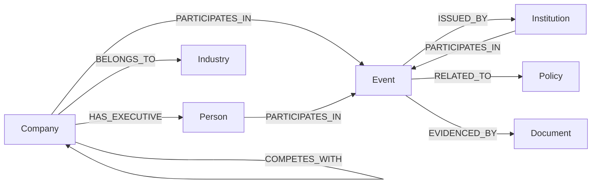

### 4.5 知识图谱本体设计

本节给出 Neo4j 中的节点标签与属性定义、9 条核心关系的 schema、约束与索引、实体消歧与事件去重规则、证据属性口径与时间属性的落点。本体口径全部照抄《02》第9.2节，本文件不新增实体类型、事件类型或关系类型，**也不给出 Cypher 查询语句**——除本节 4.5.2 的关系 schema 与 4.5.3 的约束语句这类本体定义的必要示意之外，查询语句属实现内容，在论文第五章给出（《09》第六节 非目标 1）。

#### 4.5.1 节点标签、属性与事件类型

图 4-6 给出本体总览：**6 类实体**（Company、Person、Industry、Institution、Event、Policy）与 **9 条核心关系**。Event 是图的核心知识单元，既通过 PARTICIPATES_IN 与 ISSUED_BY 连接参与主体，又通过 RELATED_TO 连接政策、通过 EVIDENCED_BY 连接证据文档。



<p align="center">图 4-6　知识图谱本体总览（6 类实体与 9 条核心关系）</p>

表 4-8 给出六类实体的标签、中文名称、唯一标识与属性定义，同表给出 Document 标签与 8 种核心事件类型；Event 的六项核心属性在该行中逐项列出。标签统一使用英文命名，便于在 Neo4j 与 Cypher 中直接使用。

**表 4-8　节点标签、属性与核心事件类型**

| 类别 | 名称 | 唯一标识 | 属性 | 说明 |
| --- | --- | --- | --- | --- |
| 实体类型 1 | Company（公司） | stock_code | stock_code、company_name、short_name、aliases（数组，含历史名称）、exchange | 上市公司及在财经信息中出现的其他企业主体，是图谱的核心节点 |
| 实体类型 2 | Person（人物） | person_id | person_id、person_name、aliases（数组）、role_title | 公司高管、监管机构人员等与事件相关的人物 |
| 实体类型 3 | Industry（行业） | industry_code | industry_code、industry_name、level | 公司所属行业以及事件涉及的行业 |
| 实体类型 4 | Institution（机构） | institution_id | institution_id、institution_name、institution_type | 监管机构、交易所、中介机构等 |
| 实体类型 5 | Event（事件） | event_id | **六项核心属性**：event_id（事件唯一标识，如 EVT-0001）、event_type（事件类型，取值来自 8 种核心事件类型，如"监管事件"）、event_name（事件名称，如"某公司因信息披露违规被出具警示函"）、event_time（事件发生时间）、description（事件描述，一句话说明事件经过）、confidence（抽取置信度，0.0～1.0） | 财经事件，本课题的核心知识单元 |
| 实体类型 6 | Policy（政策） | policy_id | policy_id、policy_name、issuer、publish_date | 与公司或行业相关的政策文件及其主题 |
| 证据文档标签（**不作为第七类实体**） | Document（文档） | doc_id | doc_id、title、source、url、publish_time、category | EVIDENCED_BY 关系的终点，与 MySQL 的 document 表一一对应；不进入实体类型清单，不参与实体识别与消歧，也不计入抽取评测集的实体标注（《02》第9.2.1节、第12.3节） |
| 核心事件类型 1～4 | **业绩事件、监管事件、股权事件、投资并购事件** | — | — | 第一版固定为 8 种核心事件类型，作为抽取、标注与评测唯一的 schema |
| 核心事件类型 5～8 | **重大合同事件、产品事件、政策事件、重大经营事件** | — | — | 同上；事件类型与实体类型不同：实体类型收敛为 6 类，事件类型固定为 8 种 |

**8 种事件类型固定不变的理由**：人工标注、抽取 Precision／Recall／F1 与分组统计都需要固定 schema，浮动范围会使标注与评测口径不可复现。之所以事件类型比实体类型更细，是因为财经问答中的问题大多围绕"发生了什么"展开，事件类型的细分直接决定问题分类与检索策略是否能够命中。**Product（产品）与 Location（地点）列为可扩展类型**，不进入第一版的本体、抽取规则与评测范围；收敛的理由是工作量控制：每增加一类实体，都需要配套的抽取规则、消歧策略、数据来源与评测工作量，产品名称的边界尤其模糊，地点在财经事件中也往往不是回答问题的必要信息。

事件必须作为带属性的知识单元存在：如果图谱中只写成"A 公司 → 监管处罚"，系统无法回答事件发生的时间、涉及哪些主体、由哪个机构发布、依据什么来源，也无法进行时间约束检索，更无法追溯到原始公告。以"监管处罚事件"为例，事件节点的展开形式是：事件主体为 A 公司（PARTICIPATES_IN，role = 主体）；处罚机构为某监管机构（ISSUED_BY，本事件属监管事件，该机构为处罚作出方，不再重复写 PARTICIPATES_IN）；事件时间、事件类型与事件描述取自事件节点属性；证据文档为公告（EVIDENCED_BY → document.doc_id）。事件中的具体日期在最终数据集确认后填写，本文件不提前填入未经核实的数字；confidence 用于标记抽取结果的可靠程度，在问答与实验分析中可以据此过滤低置信度事件。

除六项核心属性外，trigger（触发词）作为**可选辅助字段**保留，仅用于抽取调试与错误分析，不作为查询依据，也不进入检索与实验的判定逻辑。两点曾经出现在 v1.0 中、现已移除的属性必须说明其替代关系：**participants** 由 PARTICIPATES_IN 关系（含 role 属性）与 ISSUED_BY 关系共同表达，不再以数组形式存放；**publish_time** 与 source、url 一起归属 Document 节点，事件与文档之间用 EVIDENCED_BY 关系表达，从而支持一个事件挂多份文档。这样处理后事件节点的属性数量可控，属性与关系各司其职，同一信息不会在图谱中出现两个互相矛盾的副本。

#### 4.5.2 核心关系的 schema

9 条核心关系由 v1.0 的 9 条中文关系改写为英文命名并完成去重，是图谱路径回溯的唯一依据。其 schema（含方向与属性）如下。

```cypher
(Company)-[:BELONGS_TO {valid_from, valid_to, source_doc_id, source_chunk_id, confidence}]->(Industry)
(Company)-[:SUPPLIES {source_doc_id, source_chunk_id, confidence}]->(Company)
(Company)-[:CUSTOMER_OF {source_doc_id, source_chunk_id, confidence}]->(Company)
(Company)-[:COMPETES_WITH {source_doc_id, source_chunk_id, confidence}]->(Company)
(Company)-[:HAS_EXECUTIVE {source_doc_id, source_chunk_id, confidence}]->(Person)
(Company | Person | Institution)-[:PARTICIPATES_IN {role, source_doc_id, source_chunk_id, confidence}]->(Event)
(Event)-[:ISSUED_BY {source_doc_id, source_chunk_id, confidence}]->(Institution)
(Event)-[:RELATED_TO {source_doc_id, source_chunk_id, confidence}]->(Policy)
(Event)-[:EVIDENCED_BY]->(Document)
```

表 4-9 逐条给出关系的方向、属性、含义与证据属性配置，**不再另设"证据属性配置"表**：每条关系的证据属性直接在该行的"属性"列与"说明"列中给出。role 的取值范围为 {主体, 合作方, 涉及方, 监管方, 受影响方}；ISSUED_BY 仅用于政策事件与监管事件。

**表 4-9　9 条核心关系的方向、属性与证据属性**

| 关系 | 方向 | 属性 | 说明 |
| --- | --- | --- | --- |
| BELONGS_TO | Company → Industry | valid_from、valid_to、source_doc_id、source_chunk_id、confidence（**三项证据属性均必需**，另带有效时间区间） | 公司所属行业，带有效时间区间，用于判断关系在查询时间点是否成立；若行业归属来自外部行业分类而非文本抽取，该分类文件同样作为一份 Document 入库，source_doc_id 指向它，保证证据链不断 |
| SUPPLIES | Company → Company | source_doc_id、source_chunk_id、confidence（**三项均必需**） | 供应商关系，A 公司向 B 公司供货；方向按信息来源标注，不做双向冗余存储 |
| CUSTOMER_OF | Company → Company | source_doc_id、source_chunk_id、confidence（**三项均必需**） | 客户关系，与供应商关系互为反向，本课题按抽取结果确定方向，避免同一条关系存两份 |
| COMPETES_WITH | Company → Company | source_doc_id、source_chunk_id、confidence（**三项均必需**） | 竞争关系，通常为对称关系，第一版按抽取方向存一条 |
| HAS_EXECUTIVE | Company → Person | source_doc_id、source_chunk_id、confidence（**三项均必需**） | 公司高管任职关系，必须带齐证据三元组，人物与公司之间的职务信息记录在文档与事件中 |
| PARTICIPATES_IN | Company／Person／Institution → Event | role、source_doc_id、source_chunk_id、confidence（**三项均必需**，另带 role） | 公司、人物或机构参与事件；同一机构为发布／作出方时只写 ISSUED_BY，不重复写本关系 |
| ISSUED_BY | Event → Institution | source_doc_id、source_chunk_id、confidence（**三项均必需**） | 政策事件与监管事件中政策的发布机构或监管处罚的作出机构，表示该机构是发布／作出方；其他事件类型不产生该关系 |
| RELATED_TO | Event → Policy | source_doc_id、source_chunk_id、confidence（**三项均必需**） | 事件与相关政策之间的关联，必须带齐证据三元组 |
| EVIDENCED_BY | Event → Document | **无** | 事件与其证据文档之间的关联，一个事件可以对应多份文档；**不携带 source_doc_id／source_chunk_id／confidence，其证据即该关系指向的 Document 节点** |

**证据属性口径（不得改写）**：**除 EVIDENCED_BY 外**，其余 8 条核心语义关系统一携带 source_doc_id、source_chunk_id 与 confidence 三项证据属性，三项证据属性是**必需属性**而不是可选补充；EVIDENCED_BY 本身承担事件与文档之间的证据关系，其证据就是该关系指向的 Document 节点，因此不再重复携带 source_doc_id。这样处理之后，图谱从"关系图"变为"有证据的关系图"：系统对任意一条事实都能回答"来自哪篇文档、哪个文本块、置信度多少"，而不是只给出一个无法核查的结论。事件同样记录来源文档编号与 confidence（事件六项核心属性中的 confidence 即抽取置信度），事件与文档之间的关联由 EVIDENCED_BY 承担。

**一条已删除的关系必须登记，避免实现阶段复活**：v1.0 中的 (Event)-[:INVOLVES]->(Company) 已删除。删除理由是它与 PARTICIPATES_IN 表达同一信息，只是在方向上相反；同时保留两条方向相反的关系意味着同一条事实需要在图谱中写入两份，任何一次修正都必须同时修改两个位置，容易出现更新不一致，而且会让路径计数、事件参与主体统计与去重逻辑出现重复计算。**反向查询不需要额外的关系**：需要查找"某个事件涉及哪些主体"时，从 Event 节点反向遍历 PARTICIPATES_IN 关系即可得到，无需新增 INVOLVES 关系——这一条只作为设计结论登记，本文件不给出查询语句。

事件参与主体不再限定为公司：PARTICIPATES_IN 的定义域为 Company | Person | Institution → Event，participants 不再作为事件属性存储，事件参与主体统一由 PARTICIPATES_IN 关系与 ISSUED_BY 关系表达，角色信息写在关系属性 role 中。为避免同一条事实写两份，去重规则为：同一机构既是政策或监管事件的发布／作出方又参与该事件时，**只写 ISSUED_BY，不再重复写 PARTICIPATES_IN**；"监管方"这一 role 仅用于"参与事件但不是发布／作出方"的机构。

#### 4.5.3 约束与索引

Neo4j 侧共 7 条唯一性约束与 3 条索引，语句如下。约束的作用是保证同一实体、同一事件在图谱中只出现一次，索引的作用是支撑按标识与时间的高频查询。**本节不另设"约束与索引"表**：语句本身就是最精确的登记形式，逐条作用在语句之后以正文说明。

```cypher
CREATE CONSTRAINT uk_company_stock FOR (c:Company) REQUIRE c.stock_code IS UNIQUE
CREATE CONSTRAINT uk_person FOR (p:Person) REQUIRE p.person_id IS UNIQUE
CREATE CONSTRAINT uk_industry FOR (i:Industry) REQUIRE i.industry_code IS UNIQUE
CREATE CONSTRAINT uk_institution FOR (n:Institution) REQUIRE n.institution_id IS UNIQUE
CREATE CONSTRAINT uk_event FOR (e:Event) REQUIRE e.event_id IS UNIQUE
CREATE CONSTRAINT uk_policy FOR (p:Policy) REQUIRE p.policy_id IS UNIQUE
CREATE CONSTRAINT uk_document FOR (d:Document) REQUIRE d.doc_id IS UNIQUE
CREATE INDEX idx_event_time FOR (e:Event) ON (e.event_time)
CREATE INDEX idx_event_type FOR (e:Event) ON (e.event_type)
CREATE INDEX idx_doc_publish FOR (d:Document) ON (d.publish_time)
```

各条约束与索引的作用是：**uk_company_stock** 以 stock_code 作为公司的唯一标识，防止更名后出现两个节点；uk_person、uk_industry 与 uk_institution 分别保证人物、行业与机构唯一；**uk_event** 保证事件唯一；uk_policy 保证政策唯一；**uk_document** 保证证据文档唯一，与 MySQL 的 document 表一一对应。索引方面：**idx_event_time** 支撑时间约束检索与"最新／最近／近期"的事件筛选；**idx_event_type** 支撑按事件类型查询与分组统计；**idx_doc_publish** 支撑同一事件多来源的按发布时间排序。

两条约束的落点需要与 4.4 区分：**MySQL 侧**的约束服务于业务数据的完整性（如 document_chunk 内 (doc_id, chunk_index) 唯一、vector_id 唯一）；**Neo4j 侧**的约束服务于实体身份的唯一性（如 Company.stock_code 唯一）。两侧通过编号对应：Document.doc_id 对应 document.doc_id，Company.stock_code 对应 document.company_list 中记录的公司标识。

#### 4.5.4 实体消歧与事件去重

**实体消歧**解决两类问题：同一个实体被抽成多个节点、不同实体被合并成一个节点。财经文本中，同一家公司在不同来源中可能以全称、简称、别名或历史名称出现（例如公司更名前后两个名称同时出现在数据集中）；反过来，不同公司也可能因为简称相似而被误判为同一家企业。

本课题的实体对齐**以 stock_code 为锚**：Company 节点以 stock_code 作为稳定业务唯一标识，属性包括 stock_code、company_name、short_name、aliases（数组，含历史名称）与 exchange。抽到的公司名称先与别名表匹配，匹配成功则归并到对应的 stock_code 节点；匹配失败进入待消歧列表，人工确认后再写入图谱。

之所以必须用股票代码而不是名称作为唯一标识，是因为 A 股公司存在更名、简称变化、同名与全称／简称不一致的情况：名称会随时间变化，而股票代码在数据集覆盖的时间范围内保持稳定。若直接用公司名称当主键，一旦公司更名，图谱中旧名称节点与新名称节点会同时存在，供应商、客户、事件参与主体等关系会被拆到两个节点上，多跳查询与事件统计都会出现遗漏或重复。图谱内部以股票代码定位公司，名称与别名作为属性用于展示与匹配，这直接影响实体对齐、去重、图谱准确性与检索准确性。

**事件去重**解决同一个事件被抽成多个事件节点的问题。同一件事通常同时出现在公告与多篇报道中，如果不去重，图谱中会出现多个描述相同、时间相近、参与主体相同的事件节点，导致事件数量统计虚高、检索结果重复、多跳路径出现多条等价路径，最终影响实验结论。本课题的事件去重规则是：按 **event_type ＋ 参与主体 ＋ 时间窗口 ＋ 触发词相似度**判定同一事件的多来源描述，**四项条件同时满足**时判定为同一事件并合并；合并后保留全部证据文档，通过 EVIDENCED_BY 关系全部挂在合并后的事件节点上，发布时间最早的一份作为主要来源展示，其余来源作为补充证据保留；合并动作记录在抽取日志中，便于失败案例分析时核查。

两步处理的位置与工作量需要明确：实体消歧与事件去重是财经知识图谱构建中必须单独处理的一环，**不能寄希望于后续查询阶段自动解决**；这一环节的工作量计入第 6 阶段"事件抽取与知识图谱"的工期，评价方式与《02》第12.3节 的抽取评测集共用同一套人工标注数据——Dev 集（50～100 条，建议 60 条）用于迭代核查，Test 集（200 条）在规则冻结后一次性评测；实体层面检查是否合并正确，事件层面检查是否多抽或漏并。

#### 4.5.5 证据链的结构与时间归一化

一个事件可以对应多份文档：公告、多篇报道与政策文件都通过 EVIDENCED_BY 挂在同一个事件节点上。由此完成的另一项工作是**时间归一化**：事件发生时间存放在 Event 节点，公告、媒体报道与政策文件的发布时间统一存放在各自 Document 节点的 publish_time 上，来源类型由 Document.source 与 category 区分，不再单独定义"信息发布时间"；事件不再被压缩到一个文档上，也不再只保留一个时间字段。同一事件的多篇文档可以按发布时间排序，用户看到的是"事件发生时间 ＋ 各来源的发布时间"这一组完整的时间信息。

#### 4.5.6 时间属性的落点

时间信息在知识图谱侧以三种形式存在，与 4.4.5 表 4-7 一致：**Event 节点的 event_time** 是事件实际发生的时间，它是"最新／最近／近期"的判定依据，也是时间约束检索的过滤字段（4.5.3 的 idx_event_time）；**关系属性 valid_from、valid_to** 是关系成立与失效的时间区间，目前用于 BELONGS_TO 这类随时间变化的关系，用于判断关系在查询时间点是否有效；**Document 节点的 publish_time** 是公告、媒体报道或政策文件的发布时间，用于判断信息何时进入公开渠道，并在同一事件存在多份来源时确定主要来源。

三种形式之外的第四种时间——**data_cutoff_time（数据截止时间）**——是数据集版本级属性，不属于任何表，也不存放在图谱节点或关系上，其归属与消费点见 4.4.4（即《02》第10.3节 的归属说明）。这一区分是必要的：把数据截止时间写进图谱会让"数据集换版本"变成一次图谱写入操作，而它本质上是配置侧的一条版本声明。
