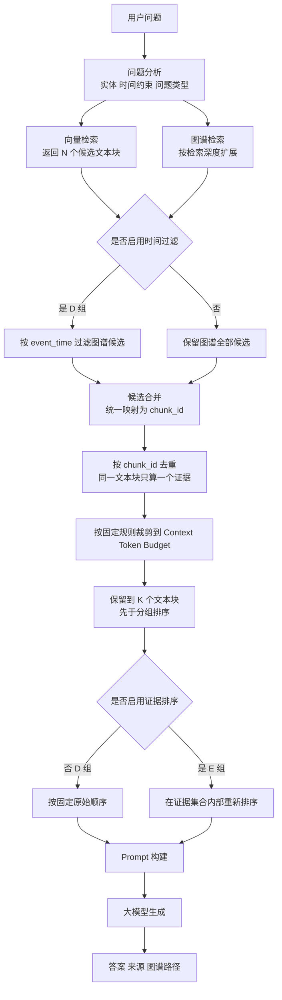
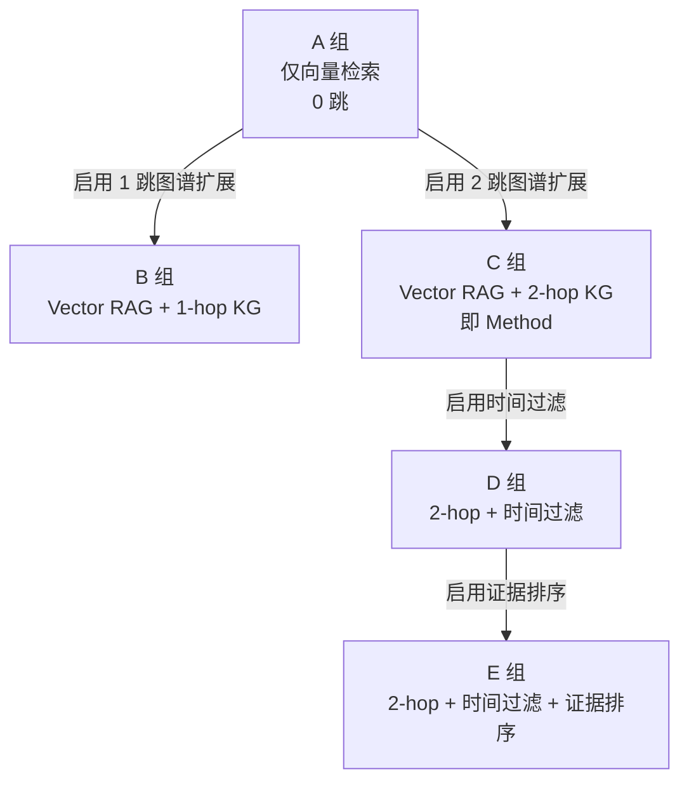

### 4.6 RAG 检索架构

本节给出检索管线的组件与数据流、Method 的配置、0／1／2 跳与时间过滤的四级策略、Top-K 证据集合的五步契约与 A～E 五组的配置开关、上下文预算与固定裁剪规则的执行位置、证据融合与排序、Prompt 结构与版本管理，以及图谱路径的输出条件。本节的实验配置口径照抄《02》第12.1节、第12.4节、第12.5节、第12.6节、第12.7节，本文件不重新论证实验方案（《09》第六节 非目标 7）。

#### 4.6.1 检索管线的组件与数据流

图 4-7 给出检索管线的组件与数据流。管线分为三段：**候选生成与过滤**（两路候选 → 时间过滤）、**统一处理**（合并去重 → 预算裁剪 → 保留 K 个）、**分组执行与生成**（证据排序 → Prompt → 生成）。

图 4-7　检索管线的组件与数据流（对应《02》第11.3节 的执行骨架）

管线各组件与 4.2 表 4-3 的模块四子功能对应：问题分析对应 M4-1，向量检索对应 M4-2，图谱检索对应 M4-3，时间过滤对应 M4-4，证据融合与裁剪对应 M4-5（即图中的"合并去重—预算裁剪—保留 K 个"三步），证据排序对应 M4-6，Prompt 构建对应 M4-7，大模型生成对应 M4-8。

**时间过滤必须先于候选合并与去重**。图 4-7 中时间过滤位于"候选合并"之前，这一位置是本节的第一个关键约束，原因有两条。第一，它决定 H3 是否可测：H3 由 C 组与 D 组的对比回答，若时间过滤发生在"保留到 K 个文本块"之后，C 与 D 的最终证据集合将恒等，四项检索指标也随之恒等，C→D 的对比就不再包含任何可观察的差异。第二，它与 D／E 的单变量关系并不冲突：C 与 D 的差别是"是否启用时间过滤"，D 与 E 的差别是"是否启用证据排序"，而"保留到 K 个文本块"始终发生在 D／E 分组排序之前，因此 D 与 E 的最终证据集合仍然完全相同，E 只改变集合内部的顺序。

#### 4.6.2 Method 的配置

**Method ＝ 消融 C 组 ＝ Vector RAG + 2-hop Event KG，不启用时间过滤、不启用 E 组的证据排序。**

本课题方法（Method）的配置就是上述一句话，它由《02》第12.5节 与 第12.6节 共同确定：为使 Baseline 2（普通 Vector RAG，即 A 组）与 Method 的对比只改变"是否使用事件知识图谱"这一个变量，Method 采用 2-hop 图谱扩展，但不启用时间过滤、也不启用 E 组的证据排序。系统本身支持 D／E 两组的配置，那两组作为消融与进一步优化实验单独报告，**不计入 Method 的定义**。

由此给出的三条对应关系必须一起阅读，否则 Method 与各组的关系会被误读：

1. **Baseline 2 ＝ A 组**（Vector RAG），**Method ＝ C 组**（Vector RAG + 2-hop KG）。因此 Baseline 2 与 Method 的对比等价于 A 与 C 的对比，唯一变量是"是否使用事件知识图谱"，它为 RQ2／H1 提供主要证据。
2. 在 C 之上再加时间过滤得到 D、再加证据排序得到 E，那两步的贡献分别由 C→D 与 D→E 回答，不混入 H1 的判定。H3 由 C 与 D 的对比回答，因为这一对比的唯一变量是时间过滤，且两组的系统检索深度都固定为 2-hop。
3. **Baseline 1（闭卷 LLM）仅作辅助基线**：它直接调用大模型、不接入检索，依赖参数化知识且与数据集的时间边界不一致，不作为"KG-RAG 有效"的主要证据。

三组设置（Baseline 1、Baseline 2、Method）与五组消融（A～E）使用同一套测试集（《02》第12.2节）、同一大模型、同一 Prompt 模板、同一 Context Token Budget 与同一裁剪规则、同一评分标准，结果都按 第12.2节 的多标签子集分别统计，而不是只给一个总体平均值。

#### 4.6.3 四级检索策略与预算相关的三个量

表 4-10 给出四级检索策略的定义、主要对应的问题类型与适用组别（策略定义照抄《02》第12.1节），同表给出四项检索指标的定义——两项内容合并在一张表中，因为它们共同构成"检索怎么分级、分级之后怎么量化"这一件事。

**表 4-10　四级检索策略、适用组别与四项检索指标**

| 策略／指标 | 定义 | 主要对应的问题类型／适用组别 |
| --- | --- | --- |
| 0跳 | 只进行文本检索 | 事实型问题；A 组、Baseline 2 |
| 1跳 | 文本检索 + 一跳图谱关系 | 公司直接关系问题，如供应商、客户、竞争对手、高管；B 组 |
| 2跳 | 文本检索 + 两跳图谱关系 | 关联方事件、上下游间接关系问题；C 组（Method）、D 组、E 组 |
| 时间过滤 | 文本检索 + 图谱 + 时间约束 | 时序问题与"某时间之后"的问题；D 组、E 组 |
| Recall@K | Top-K 中命中的 gold 证据文本块数 ÷ 该问题 gold 证据文本块总数，按问题取平均 | 四项检索指标，主口径统一为**文本块级**（document_chunk） |
| Precision@K | Top-K 中属于 gold 证据的文本块数 ÷ K，按问题取平均 | 同上；**候选不足 K 时分母仍为 K**，空缺位置记为未命中 |
| MRR | 第一个 gold 证据文本块所在排名的倒数，按问题取平均；前 K 内无 gold 证据则该问题记 0 | 同上 |
| Complete Evidence Recall@K | 该问题的 gold 证据文本块**全部**出现在 Top-K 中记 1，否则记 0，按问题取平均 | 同上 |

**1 跳与 2 跳的口径必须写清楚**：这里的 1 跳指查询目标实体的直接关系，例如从 A 公司出发沿一条关系边找到其供应商；2 跳指允许沿两条关系边扩展，例如从 A 公司出发先找到供应商，再沿第二条关系边找到供应商参与的事件或其他关联企业。**2 跳的检索结果包含 1 跳的结果**——C 组是在 B 组的基础上继续扩展，而不是把 B 组的结果排除之后只看第二条边新引入的部分。这一口径决定了 B 组与 C 组的指标差异表示"在直接关系基础上继续扩展两跳带来的变化"，而不是"两跳独有的关系带来的变化"。

**两个容易混淆的"深度"必须分开**：B／C 组的 1 跳／2 跳是**实验自变量**（系统的检索深度），与 question 表的 gold_hop_depth（**标注路径深度**，问题的金标准属性，记录该问题在客观上最少需要沿几条图谱关系才能完整得到答案）不是同一概念，不得使用同一字段、同一术语或同一统计口径。前者由本次请求的检索配置决定，后者由问题本身的标注决定；两者在界面上、在数据库字段上、在论文用词上都保持分离。

与 K 一起在预实验中固定的另外两个量是：**N**（向量检索返回的候选文本块数量，保证 N ≥ K）与 **Context Token Budget**（每次送入大模型的证据上下文——文本块 ＋ 图谱路径 ＋ 事件三元组——合计不超过同一 token 上限）。K、N 与 Context Token Budget 三者在预实验中一起固定，实验期间保持不变（见 4.6.7 表 4-11）。

#### 4.6.4 Top-K 证据集合的五步契约

**Top-K 证据集合的形成规则必须固定，四项检索指标（Recall@K、Precision@K、MRR、Complete Evidence Recall@K）都在这个集合上计算。** K 的定义是：**每个问题最终证据集合的文本块数量上限**，同时就是四项检索指标里的 K；向量检索的候选数量 N（N ≥ K）与 Context Token Budget 与 K 在预实验中一起固定，实验期间保持不变。规则共五步。

**第一步：两路候选生成与时间过滤（按组启用）。** 文本候选来自两路——向量检索按配置项返回候选文本块（候选数量记为 N），图谱扩展按关系的 source_chunk_id 指向的文本块并入候选。**在候选进入合并之前，启用了时间过滤的组（D、E）先按 event_time 过滤图谱侧的事件节点与关系，被过滤掉的路径所携带的 source_chunk_id 随之不再进入候选**；未启用的组（A、B、C）保留图谱侧全部候选。N 与 K 在预实验中一起固定，且保证 N ≥ K。这一步是 H3 得以测量的支点：**C 组与 D 组的候选集合可能因此不同**，而两组在图谱检索深度（均为 2-hop）与向量检索侧的配置上完全一致，差异只来自时间过滤这一个开关。

**第二步：统一映射并去重。** 两路候选统一映射到 chunk_id 并按 chunk_id 去重：**同一个文本块无论被哪一路命中都只算一个证据**，重复命中既不重复计数、也不合并加权，避免同一个 chunk 在 Precision 与 Recall 中被算两次。

**第三步：按固定规则裁剪到 Context Token Budget。** 去重后的候选集合按 4.6.5 的固定裁剪规则裁剪到预算之内；该规则与 K 的关系是——"先裁剪与问题实体无关的远端图谱路径"作用于图谱路径与事件三元组部分，"再按向量检索的原始排名从后往前裁剪文本块"就是本节的"按向量原始排名保留文本块"，其保留上限即 K。

**第四步：保留到 K 个文本块，且这一步必须发生在 D／E 分组排序之前。** 因此 D 组与 E 组得到**完全相同**的最终证据集合（大小不超过 K），E 组只改变该集合内部的顺序。若在排序之后才截取到 K，D 与 E 截出的前 K 个就可能不同，"E 只改变顺序"将不再成立。这一条是实验可复现与 E 组单变量的前提，不得改写。**注意第四步与第一步的分工**：第一步保证 C 与 D 的候选可以不同（否则 H3 不可测），第四步保证 D 与 E 的最终集合必然相同（否则 E 不再只改变顺序）——两条约束作用在不同的组对上，互不冲突。

**第五步：最终证据集合即指标对象与模型上下文。** 最终证据集合既是四项检索指标的计算对象，也是送入大模型的文本证据上下文；图谱路径与事件三元组计入 Context Token Budget，但**不计入检索指标的 K**（检索指标只统计文本块级证据）。

关于候选数量不足 K 的情形，两条规则必须一起执行，且**二者作用在实验的不同阶段**：

1. **测试集构建阶段**：每道测试题标注的 gold 证据文本块数量不得超过 K。若某题的原始 gold 证据数量超过 K，则在测试集构建阶段合并相邻证据块或重新定义证据粒度，使 Complete Evidence Recall@K 在定义上可达；**不得保留 gold 证据数大于 K 的题目**，否则该题的这一指标必然为 0，会系统性压低指标并造成误判（《02》第12.2节、第12.7节）。
2. **实验运行阶段**：题目一旦入库，**不得因该题的实际候选证据数少于 K 而将其排除**。某题实际只返回 M 个候选（M < K）时，保留该题，空缺的 K − M 个位置记为未命中，按四项指标的原有定义继续计算（对 Precision@K 而言分母仍为 K）。这一条是防止选择偏差的硬约束：若允许"系统没搜到 5 个就把题删掉"，正式测试集就会因为系统表现差而变简单，评测结果不再可信。候选充分性只在**测试集构建阶段**作为调题依据，绝不在实验运行阶段作为删题依据。

#### 4.6.5 上下文预算与固定裁剪规则的执行位置

**裁剪规则（固定，不得改写）**：证据总量超出预算时，按固定优先级裁剪——**先裁剪与问题实体无关的远端图谱路径，再按向量检索的原始排名从后往前裁剪文本块**。

**执行位置（关键约束）**：裁剪必须发生在"证据排序"这一实验变量**之前**，且裁剪依据**不得使用 E 组的证据排序结果**；否则 D 组与 E 组最终送入模型的证据集合会不同，"E 只改变顺序"就不再成立。正确顺序是：候选证据生成 → 按固定规则裁剪到预算之内 → 得到 D 组与 E 组**完全相同**的证据集合 → D 组按固定的原始顺序送入大模型，E 组只在这一集合内部重新排序。

把裁剪位置放在管线图上看，对应图 4-7 中"按固定规则裁剪到 Context Token Budget"与"保留到 K 个文本块"两步都位于"是否启用证据排序"这一分支之前。**裁剪不改变 C 与 D 之间的可测性**：C 与 D 的候选差异由第一步的时间过滤产生，裁剪只是把两组的候选各自缩到预算与 K 之内；只要按同一规则、同一预算执行，两组的最终证据集合仍然可能不同，四项检索指标之差仍然反映时间过滤的作用。

所有对比组与消融组使用同一预算与同一裁剪规则。这条约束有两个理由：若不控制上下文预算，KG-RAG 会天然获得更多 token，无法把效果差异归因到"图谱结构"这一变量；若只规定不超过同一 token 上限而不规定超限时裁掉什么，不同组的裁剪结果同样不可比。

#### 4.6.6 证据融合与排序

**证据融合**在图 4-7 的"候选合并—去重"两步完成，融合规则是集合语义而不是加权求和：两路候选统一到 chunk_id 后取并集，同一文本块只保留一条证据，不因被两路同时命中而提升权重。之所以不采用加权融合，是因为加权会引入权重参数，而本课题的实验设计只允许"是否使用事件知识图谱"及其后续开关发生变化，任何额外的权重参数都会成为无法归因的变量。

**D 组的固定顺序**：D 组按"固定的原始顺序"送入大模型，即向量检索的原始排名在前（按排名升序），图谱侧新引入的文本块按其在路径上的出现顺序追加在后。该顺序在裁剪与截取之前即已确定，因此与 E 组的排序结果无关。

**E 组的排序**：E 组在 D 组完全相同的证据集合内部重新排序，排序依据可以包括问题实体匹配度、证据类型、来源发布时间与图谱关系类型等可解释因素，排序结果只改变集合内部的顺序与呈现顺序，**不改变证据集合本身**、不改变图谱检索路径的深度、也不改变时间约束是否启用。E 组单独列为"进一步优化实验"，不归入 RQ3。

**四项检索指标的计算对象**即 4.6.4 第五步的最终证据集合，指标定义照抄《02》第12.7节，主口径统一为文本块级，其定义已列在表 4-10 的后四行，本节不再重复。**两项召回类指标的分工必须写明**："召回了多少"由 Recall@K 承担，"是否全部召回"由 Complete Evidence Recall@K 承担，因此不再另设同义指标——这也是本节不保留独立的"召回指标分工"表的原因，该分工并入本段与表 4-10。文档级只在需要诊断时作为辅助口径使用，且必须在论文中单独标注，不得与 chunk 级混算。

问答指标三项（Answer Accuracy、Completeness、Faithfulness）与系统指标两项（响应时间、并发能力与请求成功率）不在本节重新定义，一律沿用《02》第12.7节 的口径；本节只给出检索指标，因为检索指标的计算对象是本节的最终证据集合。

#### 4.6.7 A～E 五组的配置开关

表 4-11 把五组消融配置落实为三个配置开关（图谱扩展深度、时间过滤、证据排序），使"继承关系 C ⊆ D ⊆ E"在实现层面可以直接对应到配置项。组定义照抄《02》第12.6节；三个开关的作用环节与影响范围不再另设表，分别列在表 4-11 的"配置开关"列与表后的说明中。

**表 4-11　A～E 五组的配置、配置开关与作用范围**

| 组 | 向量检索 | 图谱扩展深度 | 时间过滤 | 证据排序 | 继承关系与配置开关 | 目的与作用范围 |
| --- | --- | --- | --- | --- | --- | --- |
| A | 启用 | 0 跳（不扩展） | 不启用 | 不启用 | 基线（消融基线，同时是 Baseline 2） | 作为消融基线；**开关全关**，不启用图谱扩展 |
| B | 启用 | 1 跳 | 不启用 | 不启用 | A ＋ 1-hop 图谱扩展（**开：图谱扩展深度＝1**） | 观察一跳图谱关系的贡献；打开该开关只改变图谱侧候选与路径的来源范围，不改变向量检索候选与 K、N、Context Token Budget |
| C | 启用 | 2 跳（含 1 跳结果） | 不启用 | 不启用 | A ＋ 2-hop 图谱扩展（**开：图谱扩展深度＝2**） | 观察两跳关系扩展的贡献；**同时是 Method**，开关状态与 B 只差一个深度取值 |
| D | 启用 | 2 跳 | **启用** | 不启用 | D = C ＋ 时间过滤，其余不变（**开：时间过滤**） | 观察时间约束的贡献（C→D 即 H3 的检验）。该开关作用于 4.3.1 流程一步骤 6，位于候选合并与去重**之前**，改变图谱侧候选集合的**成员**：超出时间范围的事件与关系被过滤，其携带的文本块不再进入候选，因此 **C 与 D 的最终证据集合可以不同**；它不改变向量检索侧候选、图谱检索深度、K、N、Context Token Budget 与裁剪规则 |
| E | 启用 | 2 跳 | 启用 | **启用** | E = D ＋ 证据排序，其余不变（**开：证据排序**） | 观察证据融合与排序的贡献。该开关作用于 4.3.1 流程一步骤 10，位于**保留到 K 个文本块之后**，只改变最终证据集合**内部**的顺序与呈现顺序，**不改变证据集合本身**、不改变图谱路径深度、也不改变时间约束是否启用 |

三个开关的口径可以概括为一句：**图谱扩展深度改变候选的来源范围，时间过滤改变候选的成员，证据排序只改变集合内部的顺序**；三者中只有证据排序位于"保留到 K 个"之后，前两者都位于其之前。

三组对比实验与五组消融的对应关系按《02》第12.5节、第12.6节 的口径确定：**回答 RQ2／H1 的主要证据是 Baseline 2（＝A 组）与 Method（＝C 组）的对比**；B 与 C 观察系统检索深度的影响（对应 H2）；H3 由 C 与 D 的对比回答；E 组作为独立的进一步优化实验，不归入 RQ3。图 4-8 把表 4-11 的三个开关串成五组的配置路径，用于说明"逐项增加一个开关"如何得到 A→E。

图 4-8　A～E 五组的配置路径（每个箭头只增加一个开关）

图谱增强效果的判定按《02》第12.8节 进行：对关系型子集、多跳型子集（gold_hop_depth ≥ 1）与时序型子集分别独立应用同一条规则，若 KG-RAG 在该子集上的 Complete Evidence Recall@K 高于 Vector RAG 且该子集的 Answer Accuracy 不下降，则判定知识图谱在该类问题上提供了额外检索价值；三个子集允许重叠，不得合并成一个整体来判定。

#### 4.6.8 Prompt 结构与版本管理

表 4-12 给出 Prompt 的固定结构。模板统一编号为 **v1.0**，实验中所有对比组使用同一版本；Prompt 版本号随 answer.prompt_version 字段落库，便于实验期间核对与复现。

**表 4-12　Prompt 的固定结构（v1.0）**

| 顺序 | 区块 | 内容 | 约束 |
| --- | --- | --- | --- |
| 1 | 系统角色与任务边界 | 说明系统是面向 A 股财经信息的问答系统，只依据给定证据作答，不作预测与投资建议 | 不得因实验组不同而改变措辞 |
| 2 | 数据版本与时间边界 | dataset_version 与 data_cutoff_time；要求模型不得使用数据截止时间之后的信息，也不得在证据不足时用训练语料中的时间信息补全答案 | 每次请求都注入，不允许省略 |
| 3 | 问题 | 用户问题原文 | 不做改写与扩写 |
| 4 | 文本证据 | 最终证据集合中的文本块，按各组确定的顺序排列，每条附 doc_id 与 chunk_id | 顺序是实验变量（D 组固定顺序／E 组重排），内容不是 |
| 5 | 图谱路径与事件三元组 | 使用了图谱扩展时给出路径与事件属性；未使用时该区块缺省 | 计入 Context Token Budget，不计入检索指标的 K |
| 6 | 相对时间判定说明 | 本次问题所用相对时间的判定区间与数据截止时间 | "最新／最近／近期"按 event_time 判定 |
| 7 | 输出格式要求 | 答案主体；引用证据的呈现；图谱关联与模型分析的区分要求 | 开放式分析问题须标注"模型分析（非公开事实）" |

Prompt 的版本管理有三条规则：一是**模板与版本号绑定**，任何措辞调整都产生新版本号，旧版本留档，实验中使用的版本号必须能从 answer.prompt_version 反查；二是**模板与配置分离**，模板文本与 K、N、Context Token Budget 等配置项分开放置，便于按实验组切换配置而不改动模板；三是**模板不承担事实判断**，模型不得使用数据截止时间之后的信息，也不得在证据不足时用训练语料中的时间信息补全答案，这两条要求以指令形式写在第 2 区块，属于 Prompt 的固定部分。

#### 4.6.9 图谱路径的输出条件

图谱路径的输出规则按"是否使用了图谱扩展"二分，判定依据是 answer.is_graph_extended 字段，**不依据是否有关系被检索到**：

1. **使用了图谱扩展时**（1 跳或 2 跳，即 B、C、D、E 组）：答案必须同时展示对应的图谱路径。路径上的每条关系回溯到 4.5.2 的 9 条核心关系之一，其中**除 EVIDENCED_BY 外**给出 source_doc_id、source_chunk_id 与 confidence；EVIDENCED_BY 的证据为其指向的 Document 节点。
2. **未使用图谱扩展时**（0 跳问题，以及 Baseline 1、Baseline 2 与消融 A 组）：客观上不存在图谱路径，此时页面与答案中**显式标注"本次回答未使用图谱扩展"**，**不得强行生成或展示虚构的图谱路径**，也不留空。
3. **图谱查询为空时**（《07》UC-01 A3）：返回文本检索得到的证据并说明图谱侧无匹配，此时按未使用图谱扩展处理并显式标注。

本文件不重新渲染历史图谱路径：历史回看只还原 question、answer 与 answer_evidence 三表的内容，图谱路径以 JSON 文本存放在 answer.graph_path 中但不重新渲染，其局限见 4.4.7。
