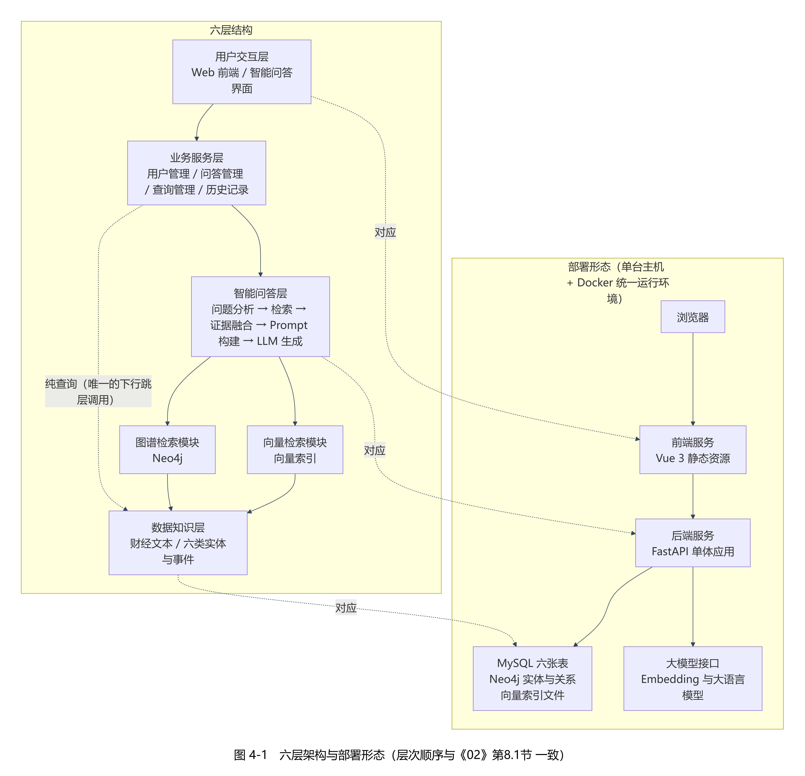

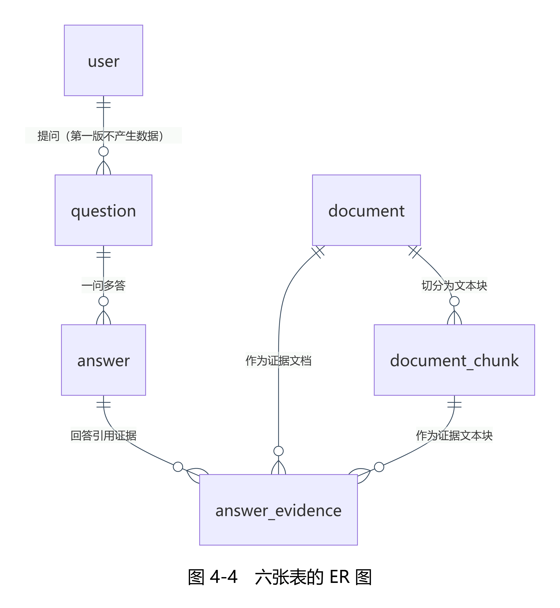
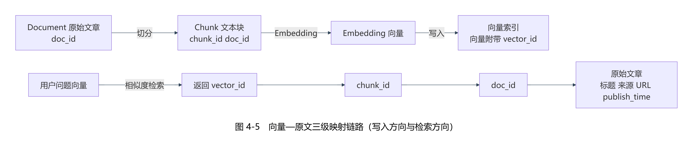
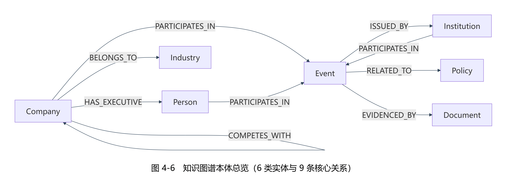
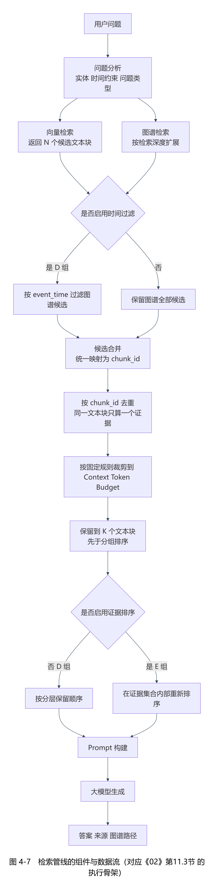
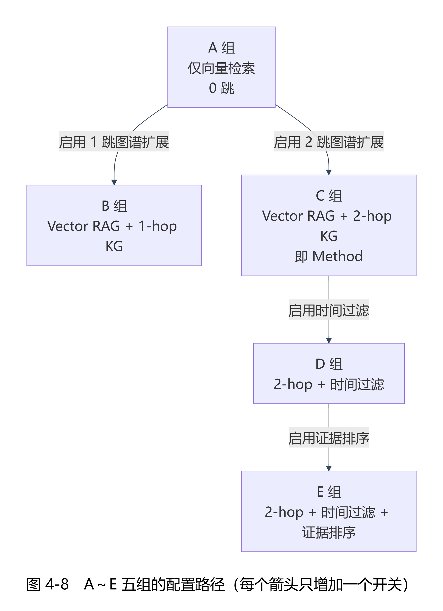

# 基于事件知识图谱与RAG的A股财经信息智能问答系统设计与实现

> 本文是第 11 阶段（论文撰写与材料整理）的**交付文档**，落点 `阶段11-论文撰写/29-第11阶段产出文档（毕业论文）.md`。
> 本文件**由 `工具/拼装第十一阶段论文.py` 按分章源文件的固定顺序生成，不得手改**；改动请改 `阶段11-论文撰写/_分章源文件/` 下的对应源文件后重跑拼装脚本。

| 项 | 取值 |
| --- | --- |
| 文档编号 | `29-`（第 11 阶段交付物；《28-第11阶段任务书（论文撰写与材料整理）》第 4 节 产出清单） |
| 所属阶段 | 第 11 阶段：论文撰写与材料整理 |
| 文档版本 | v1.0 |
| 载体形态 | Markdown 全文草稿 ＋ 分章源文件（**本次不产 Word**；格式待学校模板下发后灌入，见任务书第 6 节 格式决策） |
| 章节目录依据 | 《02-项目执行总控文档》第十五节「论文目录」（一级与二级标题逐字一致，未增删） |
| 拼装顺序 | 00 前置 → 01 第一章 → 02 第二章 → 03 第三章 → 04 第四章 → 05 第五章 → 06 第六章 → 07 第七章 → 90 参考文献 → 91 致谢 |
| 读数口径 | 抽取读数一律为「**模型参照集口径下的抽取表现**」；问答读数一律为「**模型评分口径（跨厂商模型评审）**」；正式全量实验（120 题 × 6 组）**已运行完成**，第六章 6.7～6.10 已按该落点的正式读数回填；正式集的问答质量评分（模型评分口径）**已完成**（582 条有效答案，6.8.1 已填入五组三维度均值、0／1／2 分布、跨模型一致率与调用账），《02》第12.8节 合取判定的后半句在核心 108 题的三个子集上**全部成立** |
| 术语口径 | 涉及该组件时一律写「向量索引」或「向量检索组件」；被禁的四字连写术语全文 0 命中 |

---

# 摘要

财经信息天然分散、更新频繁且表述专业。同一家上市公司的经营情况往往分别出现在交易所公告、监管机构公开信息、政策文件与财经新闻之中，用户想要回答"某公司最近发生了哪些重大事件""某公司的供应商有哪些""某公司在某个时间点之后涉及哪些政策相关事件"这类问题，通常需要跨越多篇文本，逐一完成实体对齐、关系串联与时间核对。直接向大语言模型提问存在两处明显不足：一是模型的训练语料无法覆盖最新披露的公告与新闻，二是模型的结论缺少可核验的来源，用户既无法判断答案能否采信，也无法进一步查看原始材料。

针对上述问题，本文设计并实现了一个基于事件知识图谱与 RAG 的 A 股财经信息智能问答系统。系统以"事件"作为核心知识单元，把分散在公告、新闻与政策文本中的公司、人物、行业、机构、政策五类实体与八类财经事件、九条核心关系、三类时间信息组织为可查询的事件知识图谱；同时把原始文本切分为文本块并编码为向量，建立"向量—文本块—文档"三级映射链路；在问答环节采用向量检索与图谱检索相结合的方式获取候选证据，经合并去重、上下文预算裁剪与分层保留得到最终证据集合，再由大语言模型基于证据生成回答，并按"答案＋文本证据＋图谱路径"的形态输出，对未使用图谱扩展的回答显式标注"本次回答未使用图谱扩展"。

系统按软件工程方法完成需求分析、总体设计、数据库与本体设计、模块实现、系统集成与测试评价的完整闭环。数据集最终版本 v2.1 含 709 篇文档、5018 个文本块与 5018 条 512 维向量；图谱交付口径 v2.1_v1_3 含 3607 个节点与 3614 条边，其中事件节点 1098 个。抽取侧在**模型参照集口径下的抽取表现**为：实体 F1 0.5360、事件 F1 0.0972、关系 F1 0.1202、时间 F1 0.3947（宽松配对口径下的上界分别为 0.5631、0.4348、0.4439、0.3947）。系统测试方面，集成冒烟矩阵 44 行的期望错误码与实测错误码逐行一致，异常场景 10 类 16 行在异常发生后服务存活判定全部为正常；接口测试覆盖 25 个业务接口；性能测试中，问答端到端耗时在 n=30 下均值为 14.994 秒、P95 为 37.048 秒，可用性在"按正常节奏"与"10 并发"两种口径下成功率均为 100%，在"背靠背连续 100 次"口径下成功率为 60%，失败全部来自服务端限流。

需要如实说明的是，本文第六章 6.7 至 6.10 四节所对应的正式全量实验（120 题 × 6 组）在本稿成文时尚未运行，因此本文**不给出任何 120 题口径的检索与问答指标读数，也不对知识图谱是否提供额外检索价值作出正式判定**；已取得的检索读数只建立在 30 题预实验集上，问答评分读数为**模型评分口径（跨厂商模型评审）**下的结果，均按各自的适用范围如实限定。为检验负结果是否源于图谱稀疏，本文另做了一次加厚干预实验（把含两个以上公司参与方的事件由 16 个加厚到 286 个，约 18 倍），**结论没有翻转**：方法组的最终证据集合在加厚前后逐题相同；该干预只覆盖一个维度，其适用边界已在正文中写明。（**上段为成文时点留痕，原句保留；其现行状态以紧随其后的回填登记段为准。**）

（2026-10-08 回填登记：正式全量实验 120 题 × 6 组**已经完成**，上文"本稿成文时尚未运行"一句所描述的状态**已到期**，原文保留为成文时点留痕；6.1 节该句同样保留为时点留痕，正式全量层与预实验层的读数边界、两套读数的落点与不可混引的说明，一律以 6.7 节为准；第六章 6.7 至 6.10 四节已按正式全量读数回填。）正式全量实验 120 题题集（核心 108 题、压力子集 12 题）在冻结配置 K=10、N=20、上下文预算 3600、g=2 下完成对照与消融运行。核心 108 题口径下，方法组相对向量检索基线组在四项检索指标上均提高：**Complete Evidence Recall@K 由 0.715686 提高到 0.809524**，Recall@K 由 0.776144 提高到 0.873016，Precision@K 由 0.106863 提高到 0.120000，MRR 由 0.585224 提高到 0.607551；三个子集（关系型、多跳型、时序型）上"完整证据召回高于基线"这一半条件**全部成立**。需要如实点明的是，同一指标在 30 题预实验集上五组完全持平（同为 0.566667），两处的**方向相反**——两者是不同题集、不同样本量，**并存而不可混引**。消融实验显示：加入一跳图谱扩展（A→B）四项指标一致上升，在直接关系基础上继续扩展两跳（B→C）不再带来增益且四项指标略微回退，加入时间过滤（C→D）使 Complete Evidence Recall@K 由 0.809524 降至 0.790476、Recall@K 由 0.873016 降至 0.847619，证据排序（D→E）在最终证据集合逐题相同的前提下使 MRR 由 0.604588 明显降至 0.547653。正式集的问答质量评分已按**模型评分口径（跨厂商模型评审）**完成（主评分方 `kimi-k3`、副评分方 `glm-5.3-flash`）：被评对象为正式集的 **582 条有效答案**（A 113／B 118／C 117／D 117／E 117），五组三维度均值为——Answer Accuracy 1.6903／1.8390／1.8120／1.7607／1.7863，Completeness 1.6195／1.7881／1.7692／1.6923／1.7179，Faithfulness 1.9823／1.9915／1.9573／1.9658／1.9316；跨模型一致率为 Answer Accuracy 0.9832、Completeness 0.9916、Faithfulness 0.9076（该一致率只说明两家模型判断是否相同，**不构成评分信度证据**）。据此，《02》第12.8节 判定条件的后半句「Answer Accuracy 不下降」在核心 108 题的关系型、多跳型、时序型三个子集上**全部成立**（提升 0.1015／0.1744／0.1745），与前半句共同给出"**三个子集合取判定全部成立**"的结论；**该判定是模型评分口径下的判定、不是非模型口径**，判定范围＝核心 108 题，压力子集 12 题只作附加观察。在 30 题预实验集上已取得的评分读数（Answer Accuracy 1.7333／1.6667／1.7000／1.7000／1.6333）属**范围受限的观察**，与正式集在 Answer Accuracy 上**方向相反**（预实验集 A 组最高，正式集 C 组高于 A 组、A 组为五组最低），两套读数**并存、落点分开、不可混引**。

**关键词**：事件知识图谱；检索增强生成（RAG）；A股财经信息；智能问答系统；混合检索；证据追溯

---

# Abstract

Financial information is inherently scattered, frequently updated and professionally worded. The operating conditions of a listed company usually appear separately in exchange announcements, public information released by regulators, policy documents and financial news. To answer questions such as "what major events has a company experienced recently", "who are the suppliers of a company" or "which policy-related events did a company get involved in after a certain date", a user has to span multiple documents and manually align entities, chain relations and check timestamps. Asking a large language model directly suffers from two obvious defects: its training corpus cannot cover the latest announcements and news, and its conclusions carry no verifiable source, so the user can neither judge whether an answer is trustworthy nor inspect the original material.

To address these problems, this thesis designs and implements an intelligent question answering system for A-share financial information based on an event knowledge graph and RAG. The system takes the *event* as the core knowledge unit and organizes five types of entities (company, person, industry, institution and policy), eight types of financial events, nine core relations and three types of temporal information extracted from announcements, news and policy texts into a queryable event knowledge graph. Meanwhile, the raw text is split into chunks and encoded into vectors, forming a three-level mapping chain of "vector–chunk–document". During question answering, vector retrieval and graph retrieval are combined to collect candidate evidence, which is then merged, de-duplicated, trimmed to a context token budget and retained by a layered retention order to form the final evidence set. A large language model then generates the answer from that evidence and the system returns the answer together with text evidence and, when graph expansion is applied, the graph path; answers that do not use graph expansion are explicitly labelled "本次回答未使用图谱扩展" (this answer does not use graph expansion).

The system follows a software engineering process covering requirements analysis, overall design, database and ontology design, module implementation, system integration and test evaluation. The final dataset version v2.1 contains 709 documents, 5018 chunks and 5018 vectors of 512 dimensions; the delivered graph profile v2.1_v1_3 contains 3607 nodes and 3614 edges, including 1098 event nodes. Extraction performance **under the model-reference-set criterion**（即"模型参照集口径下的抽取表现"）is: entities F1 0.5360, events F1 0.0972, relations F1 0.1202 and time F1 0.3947 (the upper bounds under the loose-pairing criterion are 0.5631, 0.4348, 0.4439 and 0.3947 respectively). In system testing, all 44 rows of the integration smoke matrix show expected error codes equal to actual error codes, and the service remained alive after each of the 10 categories (16 rows) of abnormal scenarios; interface testing covers 25 business interfaces. In performance testing, the end-to-end question answering latency over n=30 has a mean of 14.994 s and a P95 of 37.048 s; availability reaches 100% under both the "normal pace" and the "10 concurrent" criteria, and 60% under the "100 back-to-back requests" criterion, where every failure is caused by server-side rate limiting.

It must be stated honestly that the formal full-scale experiment corresponding to Sections 6.7–6.10 of Chapter 6 (120 questions × 6 groups) had not been run at the time of writing, so this thesis **reports no retrieval or question answering metric under the 120-question criterion and makes no formal judgement on whether the knowledge graph adds retrieval value**. The retrieval readings obtained so far rest only on a 30-question pre-experiment set, and the question answering scores are produced **under the model-scoring criterion (cross-vendor model review)**; both are qualified according to their scope of validity. To test whether the negative result stems from graph sparsity, an additional thickening intervention was carried out (the number of events with two or more corporate participants was raised from 16 to 286, roughly 18 times), and **the conclusion did not flip**: the method group's final evidence set was identical question by question before and after the intervention; that intervention covers only one dimension, and its scope of validity is stated in the body of this thesis. (**The paragraph above is retained verbatim as a record of the point in time at which it was written; its current status is governed by the backfill note that immediately follows.**)

(Backfill note, 2026-10-08: the formal full-scale experiment of 120 questions × 6 groups **has been completed**; the state described by the sentence "had not been run at the time of writing" above has expired, and that sentence is retained verbatim as a record of the point in time at which it was written. The same sentence in Section 6.1 is likewise retained as a point-in-time record; the boundary between the formal full-scale readings and the pre-experiment readings, where each set is filed and the rule that the two are not interchangeable are all governed by Section 6.7. Sections 6.7–6.10 of Chapter 6 have been written up from the formal full-scale readings.) Under the frozen configuration (K = 10, N = 20, context budget 3600, g = 2), the comparison and ablation runs were completed over the 120-question set (108 core questions and a 12-question stress subset). Over the core 108 questions, the method group improves on all four retrieval metrics with respect to the vector-retrieval baseline: **Complete Evidence Recall@K rises from 0.715686 to 0.809524**, Recall@K from 0.776144 to 0.873016, Precision@K from 0.106863 to 0.120000 and MRR from 0.585224 to 0.607551; the first half of the judgement condition (complete evidence recall higher than the baseline) **holds on all three subsets** (relational, multi-hop and time-constrained). It must be pointed out that on the 30-question pre-experiment set the same metric was exactly equal across all five groups (0.566667 in every group), so the two directions are **opposite**: they come from different question sets of different sizes and are **co-existent and not interchangeable**. The ablation shows that adding one-hop graph expansion (A→B) raises all four metrics, that extending further to two hops on top of direct relations (B→C) brings no further gain and slightly lowers all four, that adding the time filter (C→D) lowers Complete Evidence Recall@K from 0.809524 to 0.790476 and Recall@K from 0.873016 to 0.847619, and that evidence re-ranking (D→E), while leaving the final evidence set identical question by question, clearly lowers MRR from 0.604588 to 0.547653. The question answering quality scoring of the formal set follows the **model-scoring criterion (cross-vendor model review)** and **has been carried out**: the scored objects are the **582 valid answers** of the formal set (A 113 / B 118 / C 117 / D 117 / E 117), scored by the primary judge `kimi-k3` and cross-checked on 119 answers by the secondary judge `glm-5.3-flash`. The five-group means over the three dimensions are: Answer Accuracy 1.6903 / 1.8390 / 1.8120 / 1.7607 / 1.7863, Completeness 1.6195 / 1.7881 / 1.7692 / 1.6923 / 1.7179 and Faithfulness 1.9823 / 1.9915 / 1.9573 / 1.9658 / 1.9316; the cross-model agreement rates are 0.9832 for Answer Accuracy, 0.9916 for Completeness and 0.9076 for Faithfulness (these rates only state whether the two models judge alike and **do not constitute evidence of scoring reliability**). On this basis the second half of the judgement condition in Section 12.8 of the master document ("Answer Accuracy does not decline") **holds on all three subsets** of the core 108 questions (relational, multi-hop and time-constrained; gains of 0.1015, 0.1744 and 0.1745 respectively), so that together with the first half the conjunction is judged to **hold on all three subsets**; this judgement is made **under the model-scoring criterion and not under a human criterion**, and its scope is the core 108 questions, with the 12-question stress subset entering only as a supplementary observation. The scores already obtained on the 30-question pre-experiment set (Answer Accuracy 1.7333 / 1.6667 / 1.7000 / 1.7000 / 1.6333) are **observations of restricted scope**; on Answer Accuracy they point in the **opposite direction** to the formal set (there group A is highest, whereas on the formal set group C is above group A and group A is the lowest of the five), so the two sets of readings **co-exist, are filed separately and are not interchangeable**.

**Keywords**: Event Knowledge Graph; Retrieval-Augmented Generation (RAG); A-share Financial Information; Intelligent Question Answering System; Hybrid Retrieval; Evidence Tracing

# 第一章 绪论

## 1.1 研究背景

我国 A 股市场的信息披露体系以公开、可查为基本原则：上市公司通过交易所指定平台发布定期报告与临时公告，监管机构公开行政许可、行政处罚与监管问询信息，政府部门发布产业与监管政策文件，财经媒体则对上述信息进行报道与解读。这套体系保证了信息来源的权威性，但也带来了一个现实问题：同一家公司的经营状况被切分在大量彼此独立的文本中，信息之间缺少显式的结构化关联。

对使用者而言，这意味着一次完整的查询往往需要跨越多篇材料。以"某公司最近发生了哪些重大事件"为例，用户需要先找到该公司在最近一段时间内的全部公告与相关报道，再从中筛出真正属于"重大事件"的条目，还要核对每条事件的发生时间；若问题进一步变成"该公司的供应商最近有哪些相关事件"，还需要先在材料中确认供应商关系，再以供应商为起点重复上述过程。整个过程的瓶颈并不在于信息不可得，而在于信息之间缺少可查询的关联与统一的时间口径。

大语言模型的出现为自然语言问答提供了新的技术路线，但在财经信息场景中直接使用存在两处明显不足。其一是时效性：模型的训练语料存在明确的知识截止时间，无法覆盖最新披露的公告与新闻；即便模型"知道"某家公司的历史情况，也无法回答昨天刚发布的公告内容。其二是可核验性：模型给出的结论通常不附带来源，用户无法判断该结论是否有原文支撑、支撑它的究竟是哪一份文件的哪一段文字。对于财经信息这类高度依赖出处的场景，缺少来源的回答在可信度上是不完整的。

检索增强生成（Retrieval-Augmented Generation，RAG）通过"先检索证据、再基于证据生成"的方式缓解了上述两个问题：模型不再依赖参数化记忆，而是基于检索到的原文片段作答，来源因此可以被显式给出[1]。然而，仅依靠向量相似度检索的"普通 RAG"在财经场景中同样存在局限。向量检索衡量的是语义相似度，它能回答"哪些文本与问题语义相近"，却不能回答"这些实体之间有什么关系""某个事件发生在什么时间""某个时间之后又发生了什么"。当问题涉及多个实体、多个事件或明确的时间约束时，语义相近的文本块未必构成完整的证据集合，检索结果容易出现证据遗漏，用户拿到的答案也可能只覆盖了问题的一部分。

知识图谱以结构化的方式表达实体、关系与属性，天然适合承担"关系"与"时间"这两类信息。把事件作为核心知识单元构建面向财经事件的知识图谱，可以为向量检索补充关系路径与时间约束；把两者结合，则有望在关系型、多跳型与时序型问题上改善证据的完整性与答案的可追溯性[2][3][10]。这一思路在技术上成立，但在具体数据集、具体模型配置与具体评价口径下，知识图谱究竟能带来多少增益、在哪些类型的问题上有效，仍需要用统一的实验设置去检验，而不能预设结论。

本文正是在这一背景下展开的：以 A 股公告、监管公开信息、政策文件与正规财经新闻为语料，构建面向财经事件的事件知识图谱，设计并实现一个融合向量检索与图谱检索的智能问答系统，并通过对比实验与消融实验，用统一的指标口径观察知识图谱在财经事件多跳问答中的实际作用。

## 1.2 研究意义

本文的研究意义可以从数据与知识组织、检索方法与工程实践三个层面来说明。

在数据与知识组织层面，本文把分散在公告、新闻与政策文本中的公司、人物、行业、机构、政策五类实体，八类财经事件，九条核心关系与三类时间信息组织为可查询的事件知识图谱。与以"实体—关系"为中心的传统知识图谱组织方式相比，以事件为中心的组织方式使事件本身成为独立的知识单元：事件携带事件编号、事件类型、事件名称、事件时间、描述与置信度六项核心属性，参与主体通过关系及其角色属性表达，事件与文档之间通过证据关系关联，且一个事件可以挂接多份文档。这样组织的结果是"事件的时间、主体与来源在建模阶段就被固定下来"，从而为后续的时序检索与证据追溯提供可靠的数据基础。若时间属性与证据来源不能在建图阶段确定，下游的时序查询与"答案能否回溯到原文"这两件事都会失去依据[7][2]。

在检索方法层面，本文把向量检索与图谱检索结合，形成面向财经事件的混合检索方法：向量检索负责提供语义相近的文本证据，图谱检索负责提供关系路径与时间信息，两者在候选层合并去重，经统一的上下文预算裁剪与分层保留顺序得到最终证据集合。时间约束作为独立环节参与候选过滤，相对时间表述一律以事件时间判定、以数据截止时间为基准解释。本文并不预先假定知识图谱一定更强，而是把"是否使用事件知识图谱""图谱检索深度""是否启用时间过滤""是否启用证据排序"设置为可独立开关的实验变量，用同一套指标口径给出可检验的结论。

在工程实践层面，本文按软件工程方法完成了一个前后端分离、可运行、可演示、可评价的问答系统，覆盖需求分析、总体设计、数据库与本体设计、模块实现、系统集成、系统测试与实验分析的全部环节。系统对每一次回答保留证据文档与文本块编号，对使用了图谱扩展的回答保留图谱路径，使"答案＋文本证据＋图谱路径"三者可以联合追溯；同时以确定性脚本与逐阶段检查的方式，把数据集自洽性、图谱导出物自洽性、接口行为与关键口径做成可机器复核的检查项。

## 1.3 国内外研究现状

本节所述的国内外研究现状，其文献依据是本课题在第 2 阶段建立的精选文献库，共 22 篇。按照该文献库第十二节登记并已确认的取用口径，本节所引的 22 篇文献构成为：**英文奠基文献 6 篇 ＋ 国内进展文献 16 篇**。英文 6 篇均为相应概念的原始出处或首个基准，承担"国际前沿"的史实性论断；中文 16 篇承担"国内进展"与中文场景的支撑。撰写时的句式固定为"中文文献支撑国内进展；该工作为该概念的原始出处／首个基准（国际前沿）"，中文条目不作为英文奠基工作的等价替代。

需要同时如实声明该文献库的已知不足，以免读者对文献结构的可靠性产生误判：其一，按该库的保守口径（"顶刊"含中文权威期刊《软件学报》，arXiv 预印本不计入），顶会／顶刊占比为 4/22＝18.2%；若只按英文会议与期刊口径统计，则为 3/22＝13.6%，两个数都写出，取舍由评阅方决定。其二，ACL、NAACL、AAAI、IJCAI、SIGIR 五个会议的命中数均为 0 篇，前述英文原始工作（FinKario、Doc2EE、MAVEN-ERE、JEL、TempoQR、CronKGQA 等）已在文献替换中以中文条目承接"国内进展"，只在各条目的替换说明中留有历史记录。其三，金融自然语言处理方向共 4 篇，其中顶会／顶刊 0 篇，是本库最薄弱的一条线。其四，知识图谱方向的 8 篇文献均为"图谱构建与抽取"线，**不含**知识图谱嵌入与表示学习（如 TransE、RotatE 类）的文献，因此本文不把嵌入学习方法作为文献依据。其五，5 篇学位论文全部为硕士学位论文，博士论文 0 篇；英文预印本 3 篇。其六，出版年分布上，2021 年及以后共 20 篇，占 90.9%。以上读数的统计口径与逐项分子分母见《精选文献库（22 篇）》第十二节，本文照录其口径，不另行改写，也不新增该库之外的文献。

**（一）知识图谱与事件抽取**

以事件为基本知识单元构建中文金融知识图谱是可行的。已有工作面向应急管理场景构建了金融突发事件事理知识图谱，证明了以事件为基本单元组织财经知识的可行性[2]；面向 A 股的金融证券知识图谱构建也已有先例，但其组织方式仍以实体与关系为中心，下游落点是相关股票的发现[3]。事件关系方面，国内已有运用外部知识增强的事件共指消解方法[7]。

在事件抽取这一环节，已有工作提供了方法参照与标注体系参照。中文金融事件抽取方面，已有研究采用多维指令集微调的大语言模型完成金融事件抽取[4]；篇章级事件抽取方面，已有工作分别从跨度和网络结构[5]、自适应图神经网络[6]两个角度给出方法。这些工作共同说明：事件抽取的难点不仅在"识别出一个事件"，还在于事件类型的边界划分、论元粒度的确定以及事件之间共指、时序、因果与子事件关系的刻画[7]。

实体消歧是图谱构建中不可回避的一环。已有综述指出，中文缺少公开的标准数据集与高质量的目标知识库[8]；面向开源情报的实体链接研究综述进一步说明，按维基百科口径设计的通用实体链接器并不适配企业专有实体[9]。这两项判断共同构成本文采用"以股票代码为锚"的确定性消歧规则的直接原因：在缺少可直接套用的中文领域资源与方法的前提下，把实体身份在**建图阶段**以明确规则固定下来，比把消歧留给查询阶段更为可控。

综合来看，目前检索到的相关金融知识图谱工作主要集中于以"实体—关系"为中心组织知识，事件往往只作为关系的一条记录或一个标签出现；面向事件的时间属性、参与主体与证据来源的一体化建模仍不充分[2][3]。这是本文定位的第一条研究空白。

**（二）RAG 与混合检索**

RAG 由 Lewis 等人提出，其核心是把参数化生成模型与非参数化的外部检索结合，使模型能够基于检索到的文档片段作答并给出出处[1]。在 RAG 之上，图谱增强检索出现了两条代表性路线：一条是面向全局摘要式问答的 GraphRAG，先把文档集合构建为知识图谱并做社区划分，再以社区摘要为上下文回答"整体性"问题[10]；另一条是把图神经网络用于知识图谱多跳问答的推理路径建模，通过在多跳路径上传播信息来定位支撑答案的证据[11]。中文场景下，已有研究把混合检索用于具体领域的推荐型问答系统，说明"向量＋图谱"双路融合在工程上可行[12]。

评测方法方面，Ragas 提出了把检索质量与生成质量分离度量的指标体系，使"检索是否召回了应召回的片段"与"生成是否忠实于给定证据"两类问题可以被分别量化[13]；HotpotQA 则在多跳问答上引入了支撑事实标注，为"多跳问题需要哪些证据"提供了标注组织方式[14]；面向 AIGC 场景的幻觉识别与信任度测量工作，从幻觉分类与信任度度量的角度讨论了生成内容可信性的评估问题[15]。本文第六章的检索指标与问答指标定义，即在这类"检索—生成分离度量"的口径上确定。

综合来看，已有工作分别证明了知识图谱可以参与检索与推理，但检索到的相关工作主要集中于各自的数据域与评价口径；在统一数据集、统一模型配置与统一评价口径下，针对 A 股财经事件的多跳与时序问题的系统对比实验与消融分析仍属空白，"图谱路径深度增加会带来什么变化""加入时间约束是否减少了无关证据"这类具体问题缺少可直接对照的结论[10][11][17][18]。这是本文定位的第二条研究空白。

**（三）金融问答**

面向上市公司披露文件的金融问答已经有了公开基准，该类基准把证据链纳入标注，要求答案必须能够指向具体的披露文件段落[16]。金融知识图谱问答的时序路线也已出现：一类工作把时间区间建模引入时序知识图谱问答[17]，另一类工作在时序知识图谱推理中引入时间序列分解与时序嵌入[18]。面向金融问答的系统实现方面，已有工作把扩散模型、知识图谱与图神经网络结合，构建了面向金融领域的问答系统，并讨论了忠实度评测协议[19]。

这些工作的落点要么面向数值推理（如财报数字查询），要么面向英文披露文件与通用金融场景；本文的落点则是 A 股公告、监管公开信息、政策文件与中文财经新闻文本上的事件型、关系型与时序型问答，二者在数据形态与任务定义上并不等同[16][19]。

**（四）智能问答系统设计与实现**

系统实现方面，已有工作给出了分层架构与知识图谱增强问答系统的设计范式，说明把知识图谱与大模型结合在系统层面是成熟做法[20]；中文场景下的混合检索架构工作给出了"向量路＋图谱路"融合的工程落地方式[12]；面向特定领域的图谱路径推理检索引擎则给出了多存储协同与检索编排的实现参照[21]；端到端 RAG 基准框架的工作则从系统工程角度提出了"参数—质量—性能"联动的测试组织方式[22]。

已有工作对"答案能否同时回溯到具体文本块与具体图谱路径"的系统实现与工程经验仍不充分[16][19][21]。而在财经信息场景中，用户不仅需要知道结论，还需要知道结论来自哪一份公告、哪一段原文以及哪一条关系路径。这是本文定位的第三条研究空白。

**（五）研究现状总结与本文定位**

综合上述四方面的现状，可以归纳出三条尚未充分解决的问题：事件中心化的财经知识图谱构建不足[2][3][7]；知识图谱增强 RAG 在财经多跳与时序问答中的效果验证不足[10][11][17][18][19]；缺少"答案＋文本证据＋图谱路径"联合追溯的系统实现与工程验证[16][19][21]。

据此，本文的定位是：以事件为核心知识单元，从 A 股公告、财经新闻与政策文本构建事件知识图谱，把事件的时间属性、参与主体与证据文档在建模阶段固定下来，并以股票代码为锚的确定性规则解决公司实体消歧[8][9]；在此基础上构建向量检索与图谱检索相结合的混合检索方法，通过 0 跳、1 跳、2 跳三种图谱检索深度与时间约束的系统组合设计对比实验与消融实验，用统一口径的检索指标与问答指标观察知识图谱在关系型、多跳型与时序型问题上的作用；并实现"答案＋文本证据＋图谱路径"联合展示的问答系统，使每一条结论都可以追溯到原始文档与图谱关系。

## 1.4 研究内容

围绕 1.3 节归纳的三条研究空白，本文的研究内容包括四个方面。

第一，财经文本数据的采集、清洗与数据集构建。数据来源限定为上市公司公告、监管机构公开信息、政策文件与正规财经新闻四类公开可访问的信息，采集时保留标题、正文、发布时间、来源、URL 与涉及公司等元数据，并对采集结果做去重、清洗、切分与向量化，形成带版本号与数据截止时间的数据集。数据集采用"先小后大"的推进策略，在保证数据质量与问题覆盖的前提下逐步扩规模。

第二，面向财经事件的知识图谱构建。这一部分覆盖实体识别、事件抽取、关系抽取、时间信息抽取、实体消歧、事件去重与图谱写入七个环节。其中事件以八类核心事件类型为唯一 schema，实体以五类为核心类型，关系固定为九条核心关系；除证据关系外的八条语义关系携带来源文档编号、来源文本块编号与置信度三项证据属性；公司实体以股票代码为稳定业务唯一标识，实体消歧与事件去重保证图谱中同一实体、同一事件只出现一次。

第三，向量检索与图谱检索相结合的混合检索方法实现。检索流程按问题分类、实体识别、是否启用图谱、向量检索与图谱检索、时间过滤、证据合并与去重、上下文预算裁剪、保留 K 个文本块、证据排序的顺序组织。时间过滤作用于候选集合的成员且必须先于合并去重，保留 K 个文本块必须先于分组排序，这两条位置约束分别保证时间过滤这一变量可测、以及"证据排序只改变集合内部顺序"这一单变量条件成立。

第四，完整软件系统的设计与实现，以及功能测试、接口测试、性能测试、抽取实验、检索实验、问答对比实验与消融实验。系统按前后端分离的方式实现，包含关系数据库、图数据库与向量索引三类存储，问答服务对每一次回答保留证据与图谱路径，实验部分则通过固定配置表与逐阶段检查脚本保证口径的一致性与可复现性。

## 1.5 论文组织结构

本文共分七章，各章内容安排如下。

第一章为绪论，说明课题的研究背景与研究意义，梳理国内外研究现状并据此给出本文定位，交代研究内容与论文组织结构。

第二章为相关技术，介绍本文所依赖的关键技术，包括大语言模型、检索增强生成、向量检索、知识图谱、事件抽取、Neo4j、FastAPI 与前端相关技术，并说明各项技术在本文中的具体用法与边界。

第三章为系统需求分析，从用户角色分析入手，给出功能需求、用例分析、非功能需求与可行性分析，明确系统的能力边界与验收口径。

第四章为系统设计，给出系统总体架构、功能模块设计、业务流程、数据库设计、知识图谱本体设计、RAG 检索架构与接口设计，并给出八张设计图与十三张设计表。

第五章为系统实现，按数据处理模块、事件抽取、实体消歧与事件去重、知识图谱构建、向量索引构建、混合检索、大模型问答、证据追溯与前端页面九个小节说明实现落点与关键实现读数。

第六章为系统测试与实验分析，给出测试环境与实验配置、评价指标定义与评分标准、抽取实验、功能测试、接口测试与性能测试的实测结果，并对检索实验、问答对比实验、消融实验与失败案例分析四节说明其当前的完成状态。

第七章为总结与展望，总结本文完成的工作与取得的结论，如实说明负结果与已知不足，并给出后续可继续推进的方向。

# 第二章 相关技术

## 2.1 大语言模型

大语言模型（Large Language Model，LLM）是以 Transformer 为骨干、在海量文本上预训练得到的生成式模型，具备自然语言理解、指令跟随与文本生成能力。本文使用大语言模型承担的工作只有一项：在给定证据的前提下，把证据组织成一段面向用户的中文回答。模型的全部输入由系统拼装，模型不参与检索、不参与证据选择、也不参与图谱路径的生成。

这一分工是本文在实现中明确固定的。把模型的能力边界收窄到"基于证据写正文"，原因有三条。第一，可追溯性：如果让模型自行决定引用哪些材料，回答的来源就无法由系统保证；把证据选择交给确定性的检索管线，模型只负责组织语言，来源才能逐条回溯到文本块编号。第二，可归因性：本文的消融实验要求"三个开关只差一个变量"，若模型的输入内容或提示词措辞随实验组变化，指标差异就无法归因到图谱这一变量上；因此提示词模板中的措辞逐组相同，只有证据区块的内容随组变化。第三，可核验性：模型输出中不应出现系统专用标记（例如"本次回答未使用图谱扩展"），这类标记由代码确定性拼装，模型正文里出现即判为失败。

财经场景对生成内容还有一条额外的规范要求：必须区分"公开事实"与"模型分析"。凡能在文档中找到原文支撑的表述属于公开事实；凡需要模型进行推断、联想或猜测的表述属于模型分析，必须显式标注并与公开事实分开表述。系统不得把图谱中的关联关系直接表述为因果关系，也不得由"A 公司与 B 公司存在供应链关系"直接推导出"B 公司一定会受到影响"。这一规范既写入提示词模板的输出格式要求，也在演示页面中以固定标注的形式呈现。

在模型选型上，本文不本地训练与部署大模型，而是通过配置项接入外部模型接口：Embedding 模型负责把文本块与问题编码为向量，大语言模型负责基于证据生成答案。模型名称、版本、温度与提示词版本一并记录在实验配置固定表中，实验期间保持不变。相关研究也表明，把大语言模型用于金融领域的信息抽取与问答时，必须同时记录模型版本与提示词版本，否则结果不可复现[4][19]。

## 2.2 RAG 技术

检索增强生成（Retrieval-Augmented Generation，RAG）由 Lewis 等人提出，其基本思想是把参数化的生成模型与非参数化的外部检索结合：模型不再完全依赖训练语料中的参数化记忆，而是在每一次回答前先从外部知识源检索相关片段，再基于检索到的片段生成答案[1]。这一结构同时缓解了两个问题：时效性不足与缺少可核验来源。

RAG 的完整链路一般包括"检索—增强—生成"三段。检索段负责从外部知识源中选出与问题相关的片段，其质量决定了后续生成的上限；增强段负责把检索结果组织为模型可消费的上下文，并在上下文长度受限时做取舍；生成段负责基于上下文与问题产生回答。上游研究对这三段的度量提出了明确要求：检索质量与生成质量应当分开度量，否则无法判断一个错误答案究竟来自"没有检索到正确的片段"还是"检索到了但生成偏离了证据"[13]。本文第六章的评价指标即按这一原则组织：检索侧使用四项基于文本块粒度的指标，问答侧使用三项基于证据一致性的评分。

在本文中，RAG 有两个具体形态。其一是"普通向量 RAG"，即只使用向量检索取候选文本块，它是消融实验的基线组，也是对比实验中的 Baseline 2。其二是"知识图谱增强 RAG"，即在向量检索之上引入事件知识图谱的实体关系扩展，并按配置决定是否启用时间过滤与证据排序。本文的对比实验以"普通向量 RAG"与"知识图谱增强 RAG"的对照为主要证据，其唯一变量是"是否使用事件知识图谱"。

图谱增强 RAG 在文献中存在两条不同路线。第一条是面向全局摘要式问答的路线：先把文档集合构建为知识图谱并做社区划分，再以社区摘要作为上下文，回答"整个语料讲了什么"这类整体性问题[10]；这条路线解决的是全局性问题，与本文"面向具体事实与时序约束的查询"这一任务定位不同。第二条是把图结构用于多跳推理的路线：在知识图谱的多跳路径上传播信息，以定位支撑答案的证据[11]；本文的图谱扩展环节与这条路线更为接近，但仅保留了确定性路径枚举与证据块反查，不引入图神经网络推理。

需要说明的是，本文并不引入 LangChain、LlamaIndex 一类把检索与拼装流程封装起来的框架。这样做的理由是：本文的消融实验需要逐项控制检索管线的每一个环节，如果这些环节被框架封装成不可干预的黑盒，就无法保证"每次只改变一个变量"。

## 2.3 向量检索

向量检索的基本做法是把文本编码为稠密向量，在向量空间中用相似度度量近邻。本文的向量检索由 Embedding 模型与向量索引两部分组成。

Embedding 模型负责把文档文本块与用户问题编码为同一向量空间中的向量。本文选定 `BAAI/bge-small-zh-v1.5` 作为 Embedding 模型，固定其 revision，向量维度为 512，池化方式为 CLS，并对向量做 L2 归一化后以内积作为相似度度量（归一化后内积等价于余弦相似度）。查询侧不加指令前缀，文档与查询同向编码，最多序列长度为 512，与文本块切分的单块字符上限对齐。选定该模型的理由是：它是中文检索的常用基线，维度较小、CPU 可运行，向量索引可以全量重建，且模型已下载至本地缓存、可离线加载，符合"实验期间不得更换"的固定配置要求。

向量索引负责保存文本块向量并完成相似度检索。这里需要纠正一个常见表述：本文使用的 FAISS 并不是一类独立的数据库系统，而是**向量相似度检索库（索引库）**。它只提供索引构建与相似度检索能力，不提供独立服务进程、分布式部署、数据持久化与事务管理等数据库特性；因此本文统一把这一部分表述为"**向量索引**"或"**向量检索组件**"，技术栈表中的模块名称亦为"向量索引"。本文使用 `IndexFlatIP` 索引类型做精确检索，原因是第一版数据集规模为 5018 个文本块，精确检索的代价可以接受，而近似索引会引入额外的召回损失，干扰检索指标的可归因性。

向量检索在本文中与原文之间的对应关系由"向量—文本块—文档"三级映射链路保证：每个向量携带文本块编号，文本块编号由文档编号与块内序号按固定步长组合而成，因此从向量编号可以双向反查到文本块与原始文档。这条链路是证据追溯的数据基础——答案中的每一条文本证据都可以沿该链路一路定位到原始文章的标题、来源与发布时间。相关研究在组织多跳问答的支撑事实标注时同样强调"证据必须落到可定位的最小单位"，本文把这一最小单位定为文本块[14]。

向量检索在系统职责上是单一的：它只负责返回候选文本块并记录其原始排名与相似度，不做去重、不做时间过滤、不做预算裁剪。去重、过滤与裁剪属于检索管线的后续步骤，由统一的管线代码完成，以保证这些步骤对所有实验组使用同一套规则。

## 2.4 知识图谱

知识图谱以图结构表达现实世界中的实体、概念及其相互关系，通常由"节点—关系—属性"三要素构成。相较于关系数据库的表结构，图结构在多跳关系查询上具有天然优势：一次多跳查询在关系数据库中往往需要多次连接，而在图数据库中可以由一次路径匹配完成。

本文以"事件"作为图谱的核心知识单元。事件作为独立节点，承载事件编号、事件类型、事件名称、事件时间、描述与置信度六项核心属性；事件类型固定为八类核心事件类型，并作为抽取、标注与评测唯一的 schema；参与主体通过参与关系及其角色属性表达，政策事件与监管事件的发布／作出机构通过发布关系表达；事件与文档之间通过证据关系关联，且支持一个事件挂接多份文档。这样组织的结果是：实体、事件、关系、时间与证据被一体化表示，事件的时间、主体与来源在建模阶段即可确定。

这一组织方式有明确的文献参照。已有工作面向金融突发事件构建了以事件为基本单元的事理知识图谱，证明了事件中心化组织在中文财经场景中的可行性[2]；面向 A 股的金融证券知识图谱构建工作提供了关系粒度与实体建模的对照[3]；事件共指消解方面的研究则说明，除了识别事件本身，还需要刻画事件之间的关系，这一判断直接影响了本文事件去重环节的设计[7]。

本文的图谱本体包含五类核心实体（公司、人物、行业、机构、政策）与九条核心关系。需要说明的是，产品与地点作为可扩展类型登记在本体设计中，第一版不进入抽取与评测工作。除证据关系外的八条语义关系均携带来源文档编号、来源文本块编号与置信度三项证据属性，证据关系本身不带这三项属性，因为它的终点节点就是证据文档本身。公司实体以股票代码作为稳定业务唯一标识，使同一公司在图谱中只有一个节点，这是本文采用确定性消歧规则而非概率式实体链接的直接体现——已有综述指出中文缺少公开的标准数据集与高质量目标知识库，按通用知识库口径设计的链接器也不适配企业专有实体[8][9]。

此外，本文明确区分两类关系表述：图谱中的关系只表示公开信息中出现的关联，不表示因果关系。这一边界既体现在本体文档中，也体现在提示词与页面展示中。

## 2.5 事件抽取

事件抽取的目标是从自然语言文本中识别事件及其论元。本文的事件抽取采用"大语言模型抽取 ＋ 代码定位证据"的组合方式：由大语言模型在给定提示词的条件下输出结构化的实体、事件与关系候选，由代码负责把每一条候选定位到具体的文本块并做本地校验。

由代码而非模型负责证据定位，是本文抽取环节的一条关键设计。提示词要求模型为每一条事实给出正文中逐字出现的引文，代码则在本文档的文本块序列中查找哪个文本块包含该引文：命中多块时取块内序号最小的一块；引文跨越文本块边界或无法在正文中找到时，该条被丢弃并计入原因。这样做的好处是证据归属完全由确定性规则决定，模型无法通过自述来影响证据落点。

在提示词设计上，本文把八类事件类型的定义块一并注入提示词，使模型对事件类型的边界有统一理解。这一做法带来的效果是双向的：一方面减少了把程序性条目（例如"股东大会通知"这类元事件）误判为重大事件的概率，另一方面也收紧了事件边界，使抽取到的事件总数下降。本文在结果统计中如实报告了这一变化，并将其解释为提示词收敛的预期效果，而不是抽取失败。

本地校验环节不静默改写模型输出：校验分"拒绝"与"警告"两类，前者直接丢弃该条并计数，后者保留该条但记录原因。压缩重试用于处理模型因输出长度上限而截断的情形：当返回的结束原因为长度超限时，系统以提高压缩程度的方式重试，重试次数有上限。

事件抽取的评测需要标注体系的支持。已有工作在篇章级事件抽取上给出了跨度与网络结构的方法[5]，以及基于自适应图神经网络的金融事件抽取系统实现[6]；中文金融事件抽取方面，已有研究采用多维指令集微调的大语言模型来完成抽取任务[4]。本文在构建抽取评测集时，参考了这些工作在事件类型与论元粒度上的双层标注思路，并把评测单位定为文本块。按照本文的评测口径设计，抽取结果与参照集的对照分为开发集与测试集两段：开发集用于抽取规则与提示词的迭代调优，测试集在规则与提示词冻结后一次性评测、结果不再反馈调优。

## 2.6 Neo4j

Neo4j 是目前使用较广的原生图数据库，以属性图模型存储数据，使用 Cypher 作为声明式查询语言。其核心优势在于多跳路径查询：Cypher 的变长路径匹配语法可以用一行查询表达"从某个节点出发、沿不超过两条关系边可以到达哪些节点"，这类查询在关系数据库中需要多次自连接才能表达。

本文使用 Neo4j 存储实体、事件与关系，并支撑多跳路径查询。图谱的写入采用确定性脚本从导出物重建：导出物包含节点表、边表、图谱统计文件与一份可物化的 Cypher 脚本，脚本中先建立各标签的唯一性约束与索引，再按导出物写入节点与边。这样处理的目的是保证图谱可以被逐字节复现，而不是依赖某一次交互式写入的结果。

在检索链路中，图谱查询层实现为七个接口，与 Cypher 查询一一对应：一跳邻居、两跳邻居、按事件类型取事件、按公司取参与事件、事件到证据块、时间过滤与路径枚举。图谱侧候选的唯一入池依据是关系上的来源文本块编号，而不是事件编号或文档编号；证据关系指向文档节点、不携带来源文本块编号，因此只用于展示来源文档，不产生文本块级候选。这一边界在实现中被固化为机检断言。

本文对图谱服务化还设置了一条明确的工程边界：在开发与实验环境中，图谱查询以内存图的方式实现，接口形态与 Cypher 一一对应，但不依赖独立的图数据库服务进程。这样处理的原因是本文的实验环境不保证图数据库服务始终在线，而实验读数必须能够在"服务未启动"的条件下由落盘产物复算。上层代码（候选合并、预算裁剪、保留 K 个文本块与指标计算）与图谱查询层的后端实现解耦，将来替换为真实图数据库实例时只需替换这一层。相关研究在讨论多存储协同的系统实现时也指出，异构存储各自承担不同职责、通过统一编排协同工作，比强求实时同步更为现实[21]。

## 2.7 FastAPI

FastAPI 是基于 Python 类型注解的现代 Web 框架，其主要特点是接口定义与数据校验由类型注解驱动、自动生成 OpenAPI 文档、异步请求处理性能较好。本文选择 FastAPI 作为后端框架，主要考虑三点：一是与数据处理、抽取与检索代码同为 Python，接口层可以直接复用上游模块而不必跨语言调用；二是接口的路径参数与查询参数校验由框架统一完成，便于对非法输入做一致的错误处理；三是自动生成的接口文档便于在开发与验收阶段核对接口清单。

在接口设计上，本文的后端对全部业务接口使用统一的响应封装：成功响应体包含数据与元信息两部分，元信息中固定携带数据集版本与数据截止时间；分页响应体包含总数、条目列表、页码与每页条数；错误响应体的键集合恰为错误码与提示信息两个键，不额外携带堆栈或内部细节；空结果被定义为正常状态而非错误，以 HTTP 200 返回。未捕获异常统一映射为一个兜底错误码，堆栈只写入服务端日志、不返回给调用方。

接口的后台能力与普通用户能力有明确边界：普通用户可用的接口覆盖提问、答案与证据查看、图谱查询与历史记录；后台接口集中在统一前缀之下，用于文档的导入、修改、删除、重新处理、一致性检查与受控实验入口，不对普通用户开放。第一版不启用注册与登录，用户表在数据模型中固定保留但不写入数据；历史记录按浏览器生成的会话标识过滤，从而把不同匿名会话的问答历史隔离开。相关研究在给出分层架构的知识图谱问答系统设计时，同样把用户交互、业务服务与智能问答分层解耦，本文的层次划分与该范式一致[20]。

## 2.8 前端相关技术

前端负责与用户直接交互，本文采用 Vue 3 作为前端框架，配合前端构建工具实现单页应用。选择 Vue 3 的理由是组件化开发模式上手成本低、生态成熟，适合单人完成界面部分。

前端在本文中承担四类页面的呈现：提问页负责问题输入与提交，并在请求过程中展示加载状态、在请求失败时按错误码给出对应的提示文案；答案与证据页按固定的四个段头渲染回答正文、证据清单、知识图谱路径与数据截至与判定区间，并按来源类型对证据分组展示；图谱查看页提供实体检索、邻居查询、多跳路径查询与事件列表，并以轻量自绘矢量图形呈现路径；历史记录页按会话列出历史问答并可进入回看。

前端有三条与"可追溯"直接相关的固定约定。第一，四个段头固定，页面按固定段头渲染，四段之外不再有内容。第二，当回答未使用图谱扩展时，图谱路径区块显示固定字样"本次回答未使用图谱扩展"，不留空、不虚构路径；这一约定在实现上对应"未使用图谱扩展时该区块整体省略"的提示词处理，并由后端返回的显式标记驱动。第三，所有涉及相对时间的区域固定显示"数据截至"及日期，向用户说明"最新""最近""近期"类问题的判定基准是数据截止时间而不是系统运行当天。

此外，前端不保存任何模型密钥：密钥只保存在后端的环境变量或配置文件中，前端只调用后端接口。前端的会话标识在首次访问时生成并由浏览器本地存储，历史记录请求必须携带该标识。

需要如实说明的是，本文的开发环境中未配置浏览器自动化测试工具，因此前端验收采用"接口级冒烟加目视检查"的方式：每个页面对应的后端接口都有接口级留痕，而页面渲染、路由跳转与图形布局等界面行为没有机器可复现的留痕，仅由作者目视确认。这一边界在第六章的已知限制中逐条登记。

# 第三章 系统需求分析

## 3.1 用户角色分析

本系统只设置一个业务角色——普通用户。不设置第二种业务角色，不设置组织机构与审批流程，不做细粒度权限控制。这样收敛的原因是：本课题要验证的是知识图谱在财经问答检索中的作用，把开发精力集中在数据、图谱与检索方法上，比分散到用户体系上更有价值。

普通用户的职责范围包含四项：以自然语言提出财经信息问题并查看系统给出的答案；查看答案对应的来源与证据，包括新闻来源、公告来源与相关事件；查看事件知识图谱，包括实体、事件以及实体之间的路径；查看本会话此前的问答历史记录。

以下内容不属于普通用户的职责，而归后台：文本数据的导入、删除与更新；抽取规则与提示词的维护；图谱写入与向量索引更新；实验配置与评分。划分依据是统一的判定口径——凡是会改变数据、图谱与索引内容，或会改变实验配置的动作，全部归后台。后台的具体执行者是作者本人，通过脚本或受控后台入口完成，不以前台角色的形式出现。

关于注册与登录，本系统的执行决策是：第一版不启用注册与登录，用户直接进入系统即可使用上述四项功能。理由是系统面向的是公开的财经文本信息，不涉及个人隐私数据与敏感业务数据；在毕业设计的演示与实验场景下，登录环节只会增加联调工作量，而对本文的核心研究问题没有贡献。需要明确的是，不启用登录不等于匿名用户之间的历史记录互相可见：前端在首次访问时生成一个会话标识并保存在浏览器本地，问答记录携带该标识，历史记录按该标识过滤，从而把不同匿名会话的问答历史隔离开。

与这一决策配套的数据设计口径有三条。第一，用户表在数据模型中始终建立，第一版不写入数据，以保证表数量恒为六张、数据结构稳定。第二，问答相关表保留用户标识字段，登录未启用时该字段可以为空，以便后续启用登录时不需要改动问答主流程的数据结构。第三，表数量恒为六张，不新增表，也不因"不启用登录"而少建表。

这是条件性决策而非永久删除用户功能：若学校论文模板或毕业设计要求明确体现用户管理功能，则最小化开启"仅登录"——只提供登录入口与会话管理，不做注册、不做找回密码、不做多角色与细粒度权限。此时只需在现有用户表与后端接口上做最小改动即可满足。

## 3.2 功能需求

本系统的功能需求按六个模块组织，分别编号为 FR-01 至 FR-06。

FR-01 财经信息管理。该模块是后台系统能力，不对普通用户开放。由作者通过脚本或受控后台入口实现财经新闻、公告、政策等文本数据的导入、分类、清洗、查询、删除与更新。导入时记录标题、正文、发布时间、来源、URL、涉及公司与入库时间等字段，保证后续向量化与事件抽取有统一的数据入口。文档新增、修改或删除后，触发一次重新处理流程，使图谱与向量索引与文本内容保持一致。文档变更与重新处理的核心输出是统一入库的文档与文本块数据，以及重新处理后的图谱、向量索引与一致性检查结果。

FR-02 财经事件抽取。该模块同样属于后台数据加工环节，不向普通用户开放入口。系统从文本中识别公司、人物、行业、机构、政策五类实体以及时间与关系，并将抽取结果写入知识图谱。抽取结果需要保留证据来源，便于在问答环节回溯到原文：除证据关系外，其余八条核心语义关系都需要记录来源文档编号、来源文本块编号与置信度；证据关系本身即事件到文档的证据关系，不重复携带这三项属性。事件同样需要记录来源文档编号与置信度。抽取完成后进入实体消歧与事件去重环节。该模块的核心输出为四类抽取结果、带证据属性的图谱写入内容以及消歧与去重结果。

FR-03 事件知识图谱。该模块对普通用户开放查询与可视化，对后台开放写入与维护。系统支持实体查询、事件查询、关系查询、时间查询、多跳路径查询与图谱可视化。用户既可以直接检索某个实体或某类事件，也可以查看实体之间的路径，并查看路径上每条关系的方向、对端节点标识与证据属性。该模块的验证依据来自已有的图谱增强检索与多跳推理研究：图谱检索的价值主要体现在"语义相似度无法覆盖的关系路径"上，因此需求中必须包含多跳路径查询这一能力[10][11]。

FR-04 智能问答。普通用户输入自然语言问题，系统依次完成问题分析、文本检索、图谱检索、时间过滤、证据排序与大模型生成，返回自然语言回答。回答必须同时给出判定区间与数据截止时间说明，以及本次回答所依据的证据集合；对使用了图谱扩展的回答，还要给出对应的图谱路径。问题中的"最近""最新""近期"等相对时间表述一律按事件发生时间判定，并以数据截止时间为基准解释，而不是以系统运行当天为基准。

FR-05 证据追溯。答案下方展示回答来源、新闻来源、公告来源与相关事件，以及使用了图谱扩展时的图谱路径；若本次回答未使用图谱扩展，则显式标注"本次回答未使用图谱扩展"，不留空、不虚构路径。用户可以从答案直接定位到具体文档、文本块与图谱关系。该模块是本文的重点展示功能，也是现有工作在"答案能否同时回溯到具体文本块与具体图谱路径"这一方向上仍不充分的直接回应[12][21]。

FR-06 历史问答。系统保存用户问题、提问时间、回答与引用证据，支持后续查看，同时为实验统计提供数据来源。第一版不启用登录时，历史记录按浏览器生成的会话标识过滤，不同匿名会话之间不互相可见；启用登录后可把会话关联到用户标识。历史记录不需要独立的表：问题表记录问题，回答表记录回答，证据关联表记录答案引用的证据，三者通过编号关联即可还原完整的问答历史。该模块的输出是按会话标识过滤的历史问答列表，含问题、提问时间、回答与引用证据。

三个功能模块（FR-03、FR-04、FR-05）是本系统对普通用户开放的核心能力，FR-01 与 FR-02 是支撑这三个模块的数据生产环节，FR-06 是记录与回看环节。

## 3.3 用例分析

系统的参与者有两类：普通用户，以及作者本人。作者不在前台出现，通过脚本或受控后台入口在后台执行数据处理，本文简称为"后台"——这是一个操作位置，不是一个独立的系统角色。

普通用户的用例有五个，后台的用例有两个，此外还有一个条件性的登录用例。合并表述后，普通用户的用例为四条：提交问题并获取答案、查看答案与证据来源、查看图谱（含多跳路径查询）、查看历史记录；后台用例为两条：后台导入财经文本、后台变更财经文本并触发重新处理；条件性用例为一条：条件下的登录。之所以把"提交问题"与"查看答案"合并，"查看答案"与"查看来源"合并，是因为这两组动作在一次交互中连续完成、且在同一区域呈现。

用例关系可以概括为：普通用户提交问题，系统返回答案、判定区间说明与证据；普通用户查看来源，系统返回来源分类、图谱路径或未使用图谱扩展的标注；普通用户查看图谱，系统返回实体、事件与多跳路径；普通用户查看历史记录，系统返回按其会话标识过滤的问答历史；后台导入财经文本，系统完成统一入库；后台变更财经文本，系统触发重新处理与一致性检查。

在主要流程之外，系统需要处理若干异常分支。以"提交问题并获取答案"为例，异常分支包括：输入为空或长度超出限制；缺少必填字段；参数格式错误或取值越界；图谱服务不可用；模型接口超时或返回异常；上游守卫触发而拒绝生成。这些分支在界面上必须给出明确提示，且不得出现未捕获异常导致的页面失效。

第一版不启用登录时，上述用例全部对匿名用户开放，但历史记录按会话标识过滤。若条件下开启"仅登录"，则在提交问题与查看历史记录之前增加一个登录步骤，其余用例不变。财经信息管理不在普通用户的用例中，属于后台系统能力。

## 3.4 非功能需求

本系统的非功能需求按六项编号，每项包含需求说明、可量化或可验证的验收口径与验证方法。验证方法明确对应本文第六章的测试类型，以避免需求与测试脱节。

NFR-01 响应时间。需求说明：问答请求需要在可接受的时间内返回，检索与生成的耗时要能分段统计，便于定位性能瓶颈。验收口径：在统一的测试环境下记录平均回答耗时与 P95 耗时，并分别记录向量检索、图谱查询与大模型生成的耗时。验证方法：对应 6.6 性能测试。该口径与系统指标与本文第六章性能测试保持一致。已有研究指出，端到端系统的评测应当把"参数配置—质量指标—性能指标"三者联动起来记录，而不是只报一个总体时延；本文的分段耗时设计即遵循这一原则[22]。

NFR-02 并发能力。需求说明：系统需支持小规模并发访问，不因并发请求出现崩溃或数据错乱。验收口径包含两项并列要求：一是 10 个用户并发发起问答请求时，系统不崩溃、不出现数据错乱，接口成功率不低于 95%；二是连续 100 次请求的成功率不低于 95%。两项口径在测试中使用同一套记录方式，且**不得只报告其中较高的那一个**。验证方法：对应 6.6 性能测试。

NFR-03 可维护性。需求说明：采用前后端分离与模块化设计，模块边界清晰；模型接口地址、数据库连接、检索参数等集中在配置文件中管理。验收口径：更换大模型接口或 Embedding 模型时不需要修改前端代码；按部署说明可在新环境中完成一次完整部署。验证方法：对应 6.4 功能测试，配合 6.1 测试环境与实验配置。

NFR-04 数据一致性。需求说明：系统不做实时同步；文档新增、修改或删除后，由系统触发重新处理并更新图数据库，必要时重建或增量更新向量索引，并提供一致性检查手段。验收口径：文档变更后通过一次重新处理流程完成图谱与向量索引更新，不残留失效数据；提供一致性检查手段，可核对抽取结果与图谱节点数量、文本块数与向量条数。本项有一处明确的限度：**不承诺**关系数据库、图数据库与向量索引之间的实时同步——三者承担不同职责，实时同步超出本科阶段可实现与可验证的范围，也会引入与课题核心问题无关的工程复杂度。相关研究在讨论多存储协同的系统实现时，同样采用"保留异构存储、通过统一编排协同"的路线，而不追求强一致[21]。验证方法：对应 6.4 功能测试，配合 6.1 测试环境与实验配置。

NFR-05 异常处理。需求说明：对模型接口超时、图谱查询为空、输入为空、文件格式错误等异常给出明确提示。验收口径：构造不少于 6 类异常场景逐一测试，系统不出现未捕获异常导致的页面失效或服务中断，错误提示不泄露密钥与内部堆栈信息。验证方法：对应 6.4 功能测试。其中"文件格式错误"的判定依据是允许的文件格式清单，该清单在实现阶段固定并与测试环境一同记录，以保证该场景可以构造、可以判定。

NFR-06 系统安全性。需求说明：接口密钥不写入前端代码，接口做输入校验与请求频率限制；口令加密存储的要求仅在启用登录功能的条件下适用。验收口径：密钥仅保存在后端环境变量或配置文件中；问答接口具备输入长度与请求频率的基本限制；若启用登录，则口令以摘要形式存储，不保存明文口令。验证方法：对应 6.5 接口测试，配合配置与代码核查。

非功能需求中出现的具体数值目标在系统首次测试后固化，并保证在系统指标与本文第六章性能测试中使用同一口径，避免出现前后不一致的表述。

## 3.5 可行性分析

本节是项目总体方案中可行性分析的展开，把已有结论落到需求层面：技术可行性对应技术需求边界，数据可行性对应数据来源与规模需求，时间可行性对应阶段工期与需求范围，风险与对策对应需求阶段需要防范的范围蔓延与验收风险。

技术可行性。本课题所用技术栈均为成熟方案：前端采用 Vue 3 负责页面，后端采用 Python 与 FastAPI 负责接口，关系数据库采用 MySQL 存储业务数据与文档元数据，图数据库采用 Neo4j 提供图存储与多跳查询，向量索引采用 FAISS 完成语义检索，Embedding 模型与大语言模型通过接口调用，Docker 用于统一运行环境。在需求层面的展开有三点：其一，检索、图谱扩展、时间过滤与证据排序由后端代码直接实现，不依赖额外的检索框架，模块边界清晰，调试时容易定位问题环节，与 FR-04 的分步需求一致；其二，数据规模按梯度逐步扩展，单台个人计算机即可承载向量索引与图数据库，因此 FR-01 的数据导入与重新处理需求、FR-03 的图谱查询需求在既定部署规模内可以满足；其三，技术选型不引入额外的高学习成本组件，需求分析阶段不提出任何新增技术需求。

数据可行性。数据来源选取公开可访问的信息——上市公司公告、监管机构公开信息、政策文件与正规财经新闻，并遵循相应网站的访问规范、使用条款与学校毕业设计的相关要求；系统与论文仅用于毕业设计的研究与演示，保留原始来源、来源类型与发布时间等元数据，不提供任何投资建议，不涉及个人隐私数据。在需求层面的展开有四点。第一，数据准备按"先小后大"三版推进：第一版约 10 家公司、100 篇文本，用于跑通数据导入、清洗、事件抽取、图谱写入、向量检索与问答的完整流程；第二版扩展到 50 家公司、500 篇文本；第三版扩展到 100 家以上公司、1000 篇以上文本，用于对比实验与消融实验。这与 FR-01 的统一入库需求、FR-02 的抽取需求相互支撑。第二，第一版不使用论坛类非正规来源数据，该类来源仅列为后续可扩展方向。第三，数据截止时间是数据集版本级属性，与数据集版本号成对记录在数据集元信息中，不由任何单篇文档携带，也不采用"取所有文档最晚时间"的推导口径；每篇文档入库时记录入库时间，并保留发布时间。第四，系统对外统一显示"数据截至"及日期，"最近""最新""近期"等相对时间表述一律以该版本属性为基准、并按事件发生时间判定。由此可以判断：数据的来源范围、规模梯度与元数据口径，足以支撑六个功能模块与后续实验的需求，不需要引入边界之外的数据来源。

时间可行性。本课题总周期约为四到五个月，按十二个阶段与四个里程碑推进，每个阶段都有明确产出物，论文写作与开发同步进行。需要特别说明的是，数据准备与事件抽取阶段的工期中已包含抽取评测集的标注工作以及实体消歧与事件去重的实现与核查，这两项工作不在时间压缩范围之内；时间紧张时可以削减功能扩展，但优先保证普通 RAG 与知识图谱增强问答跑通，因为它们决定了论文实验能否成立。需求分析阶段按既定工期产出的需求条目不超出该工期；后续如遇时间紧张，取舍原则仍是优先保证两项核心技术，而不是扩大需求范围。

风险与对策。第一，数据获取与合规风险：可能出现数据源页面结构变化、访问受限或抓取频率被限制等情况。对策是只使用公开可访问的四类来源，遵循访问规范与使用条款，控制抓取频率，保存来源与发布时间等元数据，仅在毕业设计的研究与演示范围内使用。该风险直接影响 FR-01 的前置条件，本系统不引入边界之外的数据来源。第二，事件抽取质量风险：可能出现实体漏抽、事件类型判断错误与时间抽取错误，导致图谱质量下降并通过检索环节传播到最终答案。对策是按"先小后大"策略先在小规模数据上核查抽取结果，整理高频错误清单并迭代抽取方案，用两段式抽取评测集量化迭代效果与最终抽取质量；同时在问答环节以原始文本证据为主、图谱关系为辅，并在失败案例分析中把抽取错误单列为一类归因。第三，知识图谱未带来增益的风险：可能出现知识图谱增强 RAG 与普通向量 RAG 的指标接近甚至更差的情况。对策是**把这本身当作可报告的实验结论**：按预设判定规则如实报告结果，做失败案例分析并按抽取错误、实体消歧错误、检索漏召回、时间判断错误与生成不忠实五类归因统计，把结论表述为"在什么条件下提供额外价值"，而不是预设知识图谱一定更强。因此本节**不把"图谱必然提升效果"写成需求或验收标准**，只把图谱扩展、时间过滤与证据追溯写成功能条目。第四，时间不足导致范围蔓延的风险：对策是按四个里程碑推进，优先保证两项核心技术；测试集规模可按预登记规则缩减，但标签体系与各类问题必须覆盖，且任何统计量都要注明统计范围；不增加超出边界的扩展功能。第五，大模型接口成本与稳定性风险：可能出现接口限流或超时、费用超出预算、生成结果不稳定等情况。对策是统一封装模型调用并设置超时与重试，对相同问题缓存结果，实验期间固定同一套模型配置并批量执行、保存原始输出，并在演示前验证接口可用性。

需要说明的是，以上第三、五两条风险在本课题的执行过程中已被实际触发：正式全量实验因未获调用授权而未运行，因此本文**不对知识图谱是否提供额外检索价值作出正式判定**；为检验负结果是否源于图谱稀疏而做的加厚干预实验显示**结论没有翻转**。这两项在第六章 6.7 至 6.10 四节中按预登记的判定规则留出接口，暂不填入任何读数。

# 第四章 系统设计

## 4.1 系统总体架构

本系统采用六层结构，层次顺序为：用户交互层 → 业务服务层 → 智能问答层 → 向量检索模块与图谱检索模块（二者并行）→ 数据知识层。其中第三层之下并行存在两个检索模块，二者互不调用，均向智能问答层提供候选证据，并共同以数据知识层为数据来源。系统按"单体后端 ＋ 前后端分离"的方式部署在一台机器上，不采用微服务架构、不引入容器编排系统，容器技术只用于统一运行环境。

图 4-1 给出六层架构与部署形态。



<p align="center">图 4-1　六层架构与部署形态（PNG 路径：`图表/第4阶段图/图4-1-六层架构与部署形态.png`）</p>

图 4-1 中除主链之外还有一条虚线箭头，表示"业务服务层直接查询数据知识层"。这是本架构中唯一的下行跳层调用，用于历史记录查询与证据明细查询：这两类请求是纯读操作，经过智能问答层不会产生任何增值处理。虚线同时标明该调用**不参与智能问答检索链路**——检索链路上的数据访问只发生在两个检索模块与数据知识层之间。

表 4-1 把各层职责、输入输出与层间调用关系合并给出。

**表 4-1　各层职责、输入输出与层间调用关系**

| 层 | 职责 | 主要输入 | 主要输出 |
| --- | --- | --- | --- |
| 用户交互层 | 问答输入、答案展示、来源与证据查看、图谱可视化、历史记录查看 | 用户操作 | 页面渲染结果 |
| 业务服务层 | 参数校验、业务流程组织、结果落库与返回 | 前端请求 | 统一响应体 |
| 智能问答层 | 问题分析、证据融合、提示词构建、大模型生成 | 问题与两路候选 | 答案与证据集合 |
| 向量检索模块 | 文本语义检索 | 问题向量 | 候选文本块及原始排名 |
| 图谱检索模块 | 实体、事件与关系的多跳查询 | 实体标识、事件类型、时间区间 | 路径、事件属性与关系证据属性 |
| 数据知识层 | 统一管理原始财经信息与结构化知识 | 数据写入与查询 | 文本与结构化知识 |

各层的职责边界有三条硬性约定。第一，用户交互层只负责界面与交互逻辑，不直接访问数据库与模型。第二，智能问答层是核心处理单元，依次完成问题分析、检索、证据融合、提示词构建与大模型生成；问题分析负责判定问题类型与是否需要图谱扩展，证据融合负责把向量检索结果与图谱检索结果合并。第三，向量检索模块与图谱检索模块互不调用，各自只向智能问答层返回候选，以保证"是否使用图谱"这一变量可以在检索层被单独开关。

技术栈方面，前端采用 Vue 3，后端采用 Python 与 FastAPI，关系数据库采用 MySQL 存储用户（可选）、文档元数据、文本块、问题、回答与证据关联，图数据库采用 Neo4j 存储实体、事件与关系并支持多跳路径查询，向量索引采用 FAISS 保存文本块向量并完成相似度检索，Embedding 模型与大语言模型通过接口调用，数据处理采用 Python 完成清洗、切分、抽取、消歧、去重与图谱写入，部署环境用容器统一。

架构对非功能需求的支撑主要体现在响应时间的可分段上。图 4-1 中"智能问答层 → 向量检索模块"与"智能问答层 → 图谱检索模块"是两条独立调用路径，各自返回后进入证据融合，因此向量检索耗时与图谱查询耗时可以分别计时；大模型生成耗时在"智能问答层 → 大模型接口"这一步记录。**三个计时点分别落在向量检索调用处、图谱查询调用处与大模型调用处**，这是架构层面的要求——计时点必须落在层间调用边界上，而不是落在某个函数内部，这样计时口径才能与本文第六章的性能测试口径一致。

关于系统边界，本文需要登记一处边界例外。为演示需要，系统在页面上实现了一个"实时数据区"，对外提供若干只读的行情、公告、新闻与语料内近一周文档接口，默认状态为"未接入"，外部数据源不可达时如实显示"未接入"及原因、不返回任何编造的价格或新闻。该组件是**演示增强组件，不是架构声明组件**：它不改变本系统"基于离线数据集运行"的定位，不进任何实验组，不进证据链，不写入任何一张表，也不计入任何指标。本课题**没有**接入实时行情，本组件也不作为任何实验口径或数据来源依据。

## 4.2 系统功能模块设计

本系统划分为六个功能模块，分别对应第三章的六条功能需求。表 4-2 给出六个模块的定位、承担的功能需求、在架构中的落点、使用者范围与子功能编号区间。

**表 4-2　六个模块总览与后台能力边界**

| 模块 | 定位 | 对应需求 | 架构落点 | 使用者 | 子功能编号 |
| --- | --- | --- | --- | --- | --- |
| M1 财经信息管理 | 数据入口与重新处理 | FR-01 | 业务服务层＋数据知识层 | 后台 | M1-1～M1-4 |
| M2 财经事件抽取 | 数据加工与图谱构建 | FR-02 | 数据知识层 | 后台 | M2-1～M2-4 |
| M3 事件知识图谱 | 结构化知识与查询 | FR-03 | 图谱检索模块＋数据知识层 | 普通用户／后台 | M3-1～M3-4 |
| M4 智能问答 | 检索与生成 | FR-04 | 智能问答层 | 普通用户 | M4-1～M4-6 |
| M5 证据追溯 | 来源与路径呈现 | FR-05 | 业务服务层＋用户交互层 | 普通用户 | M5-1～M5-3 |
| M6 历史问答 | 记录与回看 | FR-06 | 业务服务层＋数据知识层 | 普通用户／后台 | M6-1～M6-4 |

需要强调的是，普通用户只有四项功能：提问与查看答案、图谱查看、来源与证据查看、历史记录查看。财经信息管理与财经事件抽取两个模块不向普通用户开放入口，由作者通过脚本或受控后台入口执行。

表 4-3 给出六个模块的内部结构，逐项列出每个子功能的职责、输入与输出，并标注其对应的需求处理步骤或用例分支。该表是本节的核心表，后续的业务流程与检索管线都按本表的子功能编号引用。

**表 4-3　六个模块的子功能、职责与输入输出（M1-1～M6-4）**

| 子功能 | 职责 | 输入 | 输出 |
| --- | --- | --- | --- |
| M1-1 文档导入 | 接收并校验财经文本 | 文本文件与元数据 | 统一入库的文档记录 |
| M1-2 文档变更 | 修改或删除已入库文档 | 文档编号与新内容 | 变更结果或"被历史引用"的拒绝结果 |
| M1-3 重新处理 | 重跑清洗、切分、抽取与索引更新 | 变更后的文档 | 更新后的图谱与向量索引 |
| M1-4 一致性检查 | 核对文本块数、向量条数与图谱节点数 | 三类存储 | 一致性检查结果 |
| M2-1 实体与关系抽取 | 识别五类实体与九条核心关系 | 文档正文 | 带证据的实体与关系 |
| M2-2 事件与时间抽取 | 识别八类事件及事件时间 | 文档正文 | 带证据的事件与时间 |
| M2-3 实体消歧 | 以股票代码为锚确定公司身份 | 实体提及 | 已消歧实体与待消歧清单 |
| M2-4 事件去重 | 合并同一事件的多篇证据 | 事件集合 | 合并且带证据并集的事件 |
| M3-1 实体查询 | 按名称或代码检索实体 | 关键词 | 实体列表 |
| M3-2 事件查询 | 按事件类型或公司检索事件 | 事件类型或公司标识 | 事件列表及核心属性 |
| M3-3 路径查询 | 一跳与两跳邻居、两点间路径枚举 | 节点标识与最大深度 | 路径与关系证据属性 |
| M3-4 图谱可视化 | 呈现实体、事件与路径 | 查询结果 | 图形化视图 |
| M4-1 问题分析 | 判定问题类型与是否启用图谱 | 用户问题 | 问题类型与开关取值 |
| M4-2 向量检索 | 取 N 个语义相近的候选文本块 | 问题向量 | 候选文本块与原始排名 |
| M4-3 图谱检索 | 按实体与关系取图谱侧候选 | 实体标识与图谱深度 | 路径、事件与证据块编号 |
| M4-4 时间过滤 | 按时间窗口过滤候选成员 | 候选集合与时间窗口 | 过滤后的候选集合 |
| M4-5 证据融合与裁剪 | 合并去重、预算裁剪、保留 K 个块 | 两路候选 | 最终证据集合 |
| M4-6 答案生成 | 基于证据生成回答正文 | 提示词与证据 | 回答正文 |
| M5-1 证据清单 | 逐条呈现证据及其来源类型 | 证据关联记录 | 分组后的证据清单 |
| M5-2 图谱路径呈现 | 呈现图谱路径或未使用标注 | 图谱载荷 | 路径面板或固定标注 |
| M5-3 原文定位 | 由证据定位到原始文档与文本块 | 文档编号与块编号 | 原文内容与元信息 |
| M6-1 记录写入 | 落库问题、回答与证据关联 | 一次问答的完整结果 | 三类记录 |
| M6-2 历史列表 | 按会话列出历史问答 | 会话标识 | 历史列表 |
| M6-3 历史回看 | 查看某次问答的完整内容 | 问答标识 | 回答与证据 |
| M6-4 会话隔离 | 按会话标识隔离历史 | 会话标识 | 过滤结果 |

各模块有三条明确不做的事。第一，M1 不提供普通用户入口，也不做实时同步。第二，M2 不引入本体之外的关系类型：标注或抽取过程中发现无法归入九条核心关系的情况，记录在本体边界登记中用于讨论适用边界，而不是临时增加关系类型。第三，M4 与 M5 不生成图谱路径：0 跳问题与未启用图谱扩展的实验组客观上不存在图谱路径，此时固定标注"本次回答未使用图谱扩展"，不得强行生成或展示虚构路径。

模块间依赖关系为：M1 → M2 → M3 → M4 → M5，M6 依赖 M4 与 M5 的输出。M4 同时依赖 M3 与向量检索，但两者互不调用。M5 依赖 M3 提供的路径信息。这一依赖顺序不可颠倒，尤其不能先做前端再补检索：一旦结果不正确，就无法判断问题出在检索、图谱、前端还是大模型。

## 4.3 系统业务流程

系统共有四条业务流程：提问问答、图谱查看、历史回看、后台导入与重新处理。前三条对普通用户开放，第四条为后台能力。

流程一是提问问答，也是本系统的核心流程，对应 FR-04、FR-05 与 FR-06，涉及"提交问题并获取答案"与"查看答案与证据来源"两个用例。图 4-2 给出该流程。



<p align="center">图 4-2　提问问答的完整业务流程（PNG 路径：`图表/第4阶段图/图4-2-提问问答完整业务流程.png`）</p>

流程一的主干为：接收问题并校验 → 问题分析 → 向量检索取候选 → 判定是否启用图谱扩展 → 图谱检索取候选 → 时间过滤 → 候选合并与去重 → 上下文预算裁剪 → 保留 K 个文本块 → 证据排序 → 提示词构建 → 大模型生成 → 答案与证据落库 → 返回四段答案。

这一流程中有两条位置约束必须写明，因为它们各自保证一个实验变量的单一性。第一，**时间过滤位于"候选合并与去重"之前**，因此启用时间过滤组与不启用组的候选集合可以不同，这是"时间过滤是否带来可观察差异"这一假设可检验的前提。第二，**"保留到 K 个文本块"位于证据排序之前**，因此启用证据排序组与不启用组的最终证据集合完全相同，证据排序只改变集合内部的顺序。若这两条位置约束中任意一条被违反，对应的实验变量就会失去可观察差异。

流程二是图谱查看，对应用户的"图谱查看"用例，包含实体检索、事件检索、邻居查询、多跳路径查询与图形化呈现五个步骤，数据来源为图谱检索模块与数据知识层。

流程三是历史回看，对应"查看历史记录"用例，按会话标识过滤后列出该会话下的历史问答；进入某条记录可查看其回答与引用证据。

流程四是后台导入与重新处理，对应 FR-01，涉及"后台导入财经文本"与"后台变更财经文本并触发重新处理"两个后台用例，同时涉及 FR-02 与 FR-03。该流程是后台系统能力，不对普通用户开放。图 4-3 给出该流程。


<p align="center">图 4-3　后台导入、修改与删除的三条支路及重新处理流程（PNG 路径：`图表/第4阶段图/图4-3-后台导入修改删除与重新处理流程.png`）</p>

流程四的状态流转为：空闲 → 任务已选 → 已校验 → 已写入 → 已切分 → 处理中 → 图谱已更新 → 索引已更新 → 已检查 → 已记录；删除支路中被历史回答引用的情形走"空闲 → 任务已选 → 已校验 → 检索移除 → 已记录"，跳过重新处理。图 4-3 中"是否被历史回答引用"这一判断的依据见 4.4 节：被引用的文档禁止物理删除、也禁止原地修改，只从新检索候选中移除；对被引用文档的修改以新文档编号重新导入，新文档走完整的重新处理，旧记录走"检索移除"。

表 4-4 按"流程—步骤"两栏给出四条流程的主流程步骤、输入输出与状态流转。

**表 4-4　四条流程的主流程综合表**

| 流程 | 步骤序列 | 主要输入 | 主要输出 |
| --- | --- | --- | --- |
| 一 提问问答 | 校验 → 问题分析 → 向量检索 → 图谱检索 → 时间过滤 → 合并去重 → 预算裁剪 → 保留 K → 证据排序 → 生成 → 落库 → 返回 | 用户问题 | 四段答案与证据 |
| 二 图谱查看 | 选择查询类型 → 执行查询 → 组装结果 → 图形化呈现 | 查询条件 | 实体、事件与路径 |
| 三 历史回看 | 取会话标识 → 过滤 → 列表 → 进入记录 → 呈现回答与证据 | 会话标识 | 历史列表与单条记录 |
| 四 后台导入与重新处理 | 选择任务 → 校验 → 写入 → 切分 → 处理中 → 更新图谱 → 更新索引 → 一致性检查 → 记录 | 文本文件或变更指令 | 更新后的图谱、索引与检查结果 |

表 4-5 汇总四条流程的全部异常分支，共 24 条：流程一的输入与检索类分支 10 条、流程二的查询类分支 4 条、流程三的记录类分支 3 条、流程四的导入与处理类分支 7 条。分支编号按流程顺序编排，与第三章的用例备选流程一一对应。

**表 4-5　四条流程的异常分支总表**

| 流程 | 分支编号 | 异常情形 | 处置 |
| --- | --- | --- | --- |
| 一 | A1～A7 | 输入为空、超长、缺必填字段、参数越界、参数格式错误、资源不存在、空结果 | 分别返回对应错误码或按"空结果不是错误"返回空列表 |
| 一 | B1～B3 | 图谱服务不可用、模型侧超时、模型侧失败 | 返回对应错误码，不降级、不返回部分结果 |
| 二 | C1～C4 | 节点不存在、参数非法、图谱不可用、空结果 | 返回 2001／1002／3001 或空结果 |
| 三 | D1～D3 | 缺会话标识、记录不存在、会话下无记录 | 返回 1002／2001 或空列表 |
| 四 | E1～E3 | 文件格式错误、必填字段缺失、文档被历史引用 | 拒绝写入或返回"被历史引用"的拒绝结果 |
| 四 | F1～F4 | 抽取失败、图谱写入失败、索引更新失败、一致性检查不通过 | 保留中间状态、记录失败原因、不静默跳过 |

## 4.4 数据库设计

系统收敛为六张表：用户表、文档表、文本块表、问题表、回答表与答案证据关联表。六张表全部建立；用户表在第一版不启用登录业务时保持为空、不写入数据，不采用"按条件决定是否建表"的做法，这样表数量、外键关系与结构在任何情况下都一致。

表 4-6 按"表—字段"两栏给出六张表的全部字段设计，"键"一列同时给出主键、外键、唯一约束与索引的落点。字段类型按 MySQL 8 的通用类型给出，属设计层面的选择，实现阶段可在不改变语义的前提下微调；字段名与字段职责以总体设计为准，本表不新增字段。

**表 4-6　六张表的字段级设计（表—字段综合表，含键与索引落点）**

| 表 | 关键字段 | 键与约束 |
| --- | --- | --- |
| 用户表 | 用户标识、用户名、口令摘要、创建时间 | 主键：用户标识；唯一：用户名 |
| 文档表 | 文档编号、标题、正文、发布时间、来源、URL、类目、涉及公司、入库时间、正文指纹 | 主键：文档编号；索引：发布时间、类目 |
| 文本块表 | 文本块编号、文档编号、块内序号、正文、词元数、向量编号 | 主键：文本块编号；唯一：(文档编号, 块内序号)；索引：文档编号 |
| 问题表 | 问题编号、用户标识、会话标识、问题文本、任务类型、标注路径深度、时间约束、提问时间 | 主键：问题编号；外键：用户标识（可空）；索引：(会话标识, 提问时间) |
| 回答表 | 回答编号、问题编号、回答正文、图谱路径、模型名称、提示词版本、是否使用图谱扩展、创建时间 | 主键：回答编号；外键：问题编号 |
| 答案证据关联表 | 回答编号、文本块编号、文档编号、排名、证据类型 | 主键：(回答编号, 文本块编号)；外键：回答编号、文本块编号、文档编号；索引：回答编号 |

索引设计的目标是支撑三条高频查询路径：按文档取文本块、按会话取历史记录、按回答取证据明细。外键共六条，全部在同一数据库内，由数据库负责关系完整性；其中指向文本块与文档的两条外键采用限制删除而非级联删除，原因见下。

历史证据保护是本节最关键的一条约束。被历史回答引用过的文档与文本块不允许被物理删除，也不允许被原地修改；删除请求只把该文档从"可用于新检索"的候选中移除，修改请求则要求以新文档编号重新导入新版本，使历史回答继续指向生成它的原始字节。这样处理的目的，是让 4.4 节所述的映射链路在文档变更之后**仍然成立**——被引用的文本块不被物理删除，链路的下游端就不会断。若允许原地修改或物理删除，历史回答中的证据就会指向一份已经不存在或已经改变的材料，"可追溯"这一核心承诺随之失效。数据一致性需求（NFR-04）中"不承诺实时同步"的限度，也正是以这条保护规则为前提的：系统通过一次完整的重新处理与一致性检查来保证三类存储的口径一致，而不是通过实时同步[21]。

图 4-4 给出六张表的实体联系图。



<p align="center">图 4-4　六张表的 ER 图（PNG 路径：`图表/第4阶段图/图4-4-六张表的ER图.png`）</p>

图中共出现六个实体，与表数量一致；用户表与问题表之间的联系在第一版不产生实际数据，但约束预先建立。图 4-4 中的基数说明为：问题与回答为一对多关系——第一版正常业务流程下一个问题对应一次回答，但实验重跑、同一问题重复提交等场景可以产生多条回答记录，因此保留一对多的基数，而不写成"一问一答"；回答与答案证据关联之间是一对多；文档与文本块之间是一对多；文本块与答案证据关联之间是一对多（同一文本块可以被多次回答引用）。会话标识与数据截止时间都不在图中作为独立实体出现：前者是问题表的一个字段，后者是数据集版本级属性、不属于任何表。

四种时间信息的落点需要明确区分，以避免把不同含义的时间混在同一个字段上。表 4-7 给出四种时间的落点与相对时间的判定规则。

**表 4-7　四种时间的落点与相对时间判定**

| 时间类型 | 归属层级 | 含义 | 主要用途 |
| --- | --- | --- | --- |
| 事件发生时间 | 事件节点的属性 | 事件实际发生的时间 | 时间范围过滤；"最新／最近／近期"的判定依据 |
| 文档发布时间 | 文档节点的属性 | 公告、报道或政策文件的发布时间 | 判断信息何时进入公开渠道 |
| 关系有效时间 | 关系的属性 | 关系成立与失效的时间区间 | 判断关系在查询时间点是否有效 |
| 数据截止时间 | 数据集版本级属性 | 数据集人为确定的覆盖截止边界 | 相对时间表述的基准 |

相对时间的判定规则为："最新"取符合条件的、事件时间最大的事件（并列时全部返回）；"最近"取事件时间落在数据截止时间前 30 天以内的事件；"近期"取事件时间落在数据截止时间前 90 天以内的事件。判定一律以事件发生时间进行，不以文档发布时间进行，也不以系统运行当天为基准。提示词、检索与答案生成统一以该版本属性为相对时间基准，并要求模型不得使用数据截止时间之后的信息，也不得在证据不足时用训练语料中的时间信息补全答案。

向量与原文之间的映射链路是证据追溯的数据基础。图 4-5 给出写入方向与检索方向两条链路。



<p align="center">图 4-5　向量—原文三级映射链路（写入方向与检索方向）（PNG 路径：`图表/第4阶段图/图4-5-向量原文三级映射链路.png`）</p>

写入方向为：文档正文按固定长度切分为文本块 → 文本块经 Embedding 模型编码为向量 → 向量写入向量索引并登记映射；检索方向为：问题编码为向量 → 在向量索引中检索得到向量编号 → 由映射得到文本块编号 → 由文本块编号反查文档编号。证据追溯据此成立：答案证据关联表中的每条记录都包含文档编号与文本块编号，因此答案中的每一条文本证据都可以沿检索方向一路定位到原始文章的标题、来源、URL 与发布时间。

图谱路径的存储形式需要单独说明。路径以原始结构化文本的形式存放在回答表的图谱路径字段中，不在存储时重新渲染为可读路径；其顶层包含深度、起点、终点、节点集合与关系集合，关系集合中的每一项含方向、对端节点、关系名、角色与证据信息（证据信息内含置信度、来源文本块编号与来源文档编号）。这样处理的理由是：路径的呈现形式可能与存储形式不同，把结构化原文存下来，可以保证后续任何呈现方式都不会改变路径本身；未使用图谱扩展时该字段为空，同时在答案段中输出固定标注。

## 4.5 知识图谱本体设计

本体以事件为核心知识单元。图 4-6 给出本体总览：五类核心实体（公司、人物、行业、机构、政策）与九条核心关系，另有事件与文档两类标签；事件既是图谱的核心知识单元，也是第六类实体类型，它通过参与关系与发布关系连接参与主体，通过关联关系连接政策，通过证据关系连接证据文档。



<p align="center">图 4-6　知识图谱本体总览（五类核心实体、事件标签与九条核心关系）（PNG 路径：`图表/第4阶段图/图4-6-知识图谱本体总览.png`）</p>

表 4-8 给出各类实体的标签、中文名称、唯一标识与属性定义，同表给出文档标签与八种核心事件类型；事件的六项核心属性在该行中逐项列出。标签统一使用英文命名，便于在图数据库与查询语言中直接使用。

**表 4-8　节点标签、属性与核心事件类型**

| 标签 | 中文名称 | 唯一标识 | 主要属性 |
| --- | --- | --- | --- |
| Company | 公司 | 股票代码 | 名称、简称、别名、行业 |
| Person | 人物 | 编号 | 姓名、职务（本版未落地） |
| Industry | 行业 | 编号 | 行业名称、行业代码、层级（本版未落地） |
| Institution | 机构 | 编号 | 机构名称、机构类型（本版未落地） |
| Policy | 政策 | 编号 | 政策名称、发文机关（本版未落地）、发布日期（本版未落地） |
| Event | 事件 | 编号 | 事件类型、事件名称、事件时间、描述、置信度、证据文档编号 |
| Document | 文档（证据标签） | 文档编号 | 标题、来源、URL、发布时间、类目 |

八种核心事件类型为：业绩、监管、股权、投资并购、重大合同、产品、政策、重大经营。这八种类型作为抽取、标注与评测唯一的 schema，抽取过程中发现无法归入这八类的候选作丢弃处理并记录原因，而不是临时扩展类型集合。

表 4-9 逐条给出九条核心关系的方向、属性与证据属性配置。角色属性的取值范围为"主体、合作方、涉及方、监管方、受影响方"；发布关系仅用于政策事件与监管事件。除证据关系外的八条语义关系都携带来源文档编号、来源文本块编号与置信度三项证据属性；证据关系不带这三项属性，因为它的终点节点本身就是证据文档。

**表 4-9　9 条核心关系的方向、属性与证据属性**

| 关系 | 方向 | 属性 | 说明 |
| --- | --- | --- | --- |
| BELONGS_TO | 公司 → 行业 | 三项证据属性 ＋ 有效期 | 关系可带成立与失效时间 |
| SUPPLIES | 公司 → 公司 | 三项证据属性 | 供应关系 |
| CUSTOMER_OF | 公司 → 公司 | 三项证据属性 | 客户关系 |
| COMPETES_WITH | 公司 → 公司 | 三项证据属性 | 竞争关系 |
| HAS_EXECUTIVE | 公司 → 人物 | 三项证据属性 | 高管任职 |
| PARTICIPATES_IN | 公司／人物／机构 → 事件 | 三项证据属性 ＋ 角色 | 事件参与主体 |
| ISSUED_BY | 事件 → 机构 | 三项证据属性 | 仅用于政策与监管事件 |
| RELATED_TO | 事件 → 政策 | 三项证据属性 | 事件与政策的关联 |
| EVIDENCED_BY | 事件 → 文档 | 无（终点即证据） | 事件到证据文档 |

本体层面有三条约束。第一，唯一性约束与索引在写入时一并建立，保证节点标识唯一且非空。第二，节点标识不依赖数据库自增，而按确定性排序一次性分配，使图谱可以被逐字节复现。第三，角色属性的取值必须落在冻结的枚举集合内，发布关系的起点事件类型必须是政策或监管事件，且同一机构既作为某事件的发布方又被写成该事件的参与方时，只保留发布关系。

实体消歧采用以股票代码为锚的确定性规则，共三条匹配规则。比较键先做归一化：去掉全部空白、剥掉最外层包裹字符，归一化只作匹配键使用，不改变抽取结果中的实体名。第一条规则要求书写面等于别名表中某公司的归一化全称、简称、注册全称，或等于六位股票代码。第二条规则允许书写面包含某公司的归一化书写面，但要求残余部分不含"控股、投资、实业、资本、集团控股"这五个区分性标记——残余含标记时拦住不合并，这是"母公司不等于子公司"的最小代价写法。第三条规则针对非公司标签，按"同类型加同归一化名"合并。匹配失败的公司提及进入待消歧清单，按"消歧确认后再写入图谱"的策略处理，系统不猜、不合并、也不写图。

事件去重采用四项条件必须同时满足的保守合并策略：事件类型相同；参与主体集合相等（按集合判等，不看顺序与重复）；时间窗不超过 7 天且两个日期都必须可解析；事件名称的字符二元组 Jaccard 相似度不低于 0.5。合并采用并查集单链连接方式，代表元按最早发布时间、文档编号、事件局部编号的顺序确定；合并后事件时间取成员中最早的非空值，置信度取成员最大值，证据取成员证据文档的并集。**"两个日期都必须可解析"这一条件是有意保守的设计**：事件时间为空的事件之间永远不会被合并，宁可漏合、不可错合。

## 4.6 RAG 检索架构

检索管线分为三段：候选生成与过滤（两路候选 → 时间过滤）、统一处理（合并去重 → 预算裁剪 → 保留 K 个）、分组执行与生成（证据排序 → 提示词 → 生成）。图 4-7 给出检索管线的组件与数据流。



<p align="center">图 4-7　检索管线的组件与数据流（PNG 路径：`图表/第4阶段图/图4-7-检索管线组件与数据流.png`）</p>

**时间过滤必须先于候选合并与去重**，这一位置约束有两条理由。第一，它决定"时间过滤是否带来可观察差异"这一假设是否可测：若时间过滤发生在"保留到 K 个文本块"之后，启用与不启用两组的最终证据集合将恒等，四项检索指标也随之恒等，该对比就不再包含任何可观察的差异。第二，它与"证据排序只改变顺序"这一单变量条件并不冲突：启用与不启用时间过滤两组的差别是"是否启用时间过滤"，启用与不启用排序两组的差别是"是否启用证据排序"，而"保留到 K 个文本块"始终发生在证据排序之前，因此后两组的最终证据集合仍然完全相同。

时间过滤的语义需要单独裁定：过滤时把事件时间为空的候选一并剔除。理由是"一个无法判定是否落在时间窗口内的成员不得视为通过过滤"；若把空值保留，启用与不启用时间过滤两组的最终证据集合将趋于恒等，该假设失去可观察差异。代价是启用时间过滤一组的召回可能下降，这一代价在本文第六章中如实报告。

表 4-10 给出四级检索策略的定义、主要对应的问题类型与适用组别，同表给出四项检索指标的定义。

**表 4-10　四级检索策略、适用组别与四项检索指标**

| 策略 | 定义 | 主要对应的问题类型 |
| --- | --- | --- |
| 0 跳 | 只进行文本检索 | 事实型问题 |
| 1 跳 | 文本检索 ＋ 一跳图谱关系 | 公司直接关系问题 |
| 2 跳 | 文本检索 ＋ 两跳图谱关系 | 关联方事件、上下游间接关系问题 |
| 时间过滤 | 文本检索 ＋ 图谱 ＋ 时间约束 | 时序问题与"某时间之后"的问题 |

四项检索指标的主口径统一为文本块级：Recall@K 为前 K 条中命中的证据文本块数除以该问题证据文本块总数，按问题取平均；Precision@K 为前 K 条中属于证据的文本块数除以 K，按问题取平均；MRR 为第一个证据文本块所在排名的倒数，按问题取平均，前 K 内无证据则该问题记 0；Complete Evidence Recall@K 为该问题的证据文本块全部出现在前 K 条中记 1、否则记 0，按问题取平均。"召回了多少"由 Recall@K 承担，"是否全部召回"由 Complete Evidence Recall@K 承担，因此不另设同义指标。

最终证据集合的形成规则固定为五步，四项检索指标都在这五步之后得到的集合上计算。第一步，两路取候选：向量检索按配置返回候选文本块（候选数量记为 N），图谱扩展按关系的来源文本块编号并入候选；启用时间过滤的组在本步对候选集合施加时间过滤，作用于候选集合的成员。第二步，按文本块编号合并去重：两路候选统一到文本块编号后取并集，同一文本块只算一个证据，不重复计数、不合并加权、不加分。第三步，裁剪到上下文预算：先裁剪与问题实体无关的远端图谱路径，再按分层保留顺序从尾部往前裁剪文本块，且裁剪不得使用证据排序的结果。第四步，保留 K 个文本块：按同一条分层保留顺序取前 K 个，且本步先于分组排序。第五步，得到最终证据集合：同一份集合同时用于四项指标计算与提示词装配；图谱路径与事件三元组计入预算、不计入 K。

分层保留顺序是第二步与第三步共用的同一条顺序，共三层：第一层为向量侧候选按向量检索的原始排名升序取前 K 减 g 个；第二层为图谱侧新增块（没有向量排名的那部分）按对问题的向量相似度降序、并列按文本块编号升序，至多取 g 个；第三层为前两层不足 K 个或预算未用尽时，按向量原始排名升序用向量侧剩余候选回填，尾部为未被第二层取到的图谱侧新增块。裁剪从该顺序的尾部往前裁。g 是全局固化量，全部实验组取同一值、不进任何开关、不随组变化，因此不破坏"开关只差一个变量"的单变量归因。表 4-10 与本节所述的四个量（K、N、上下文预算与 g）在实验配置固定表中一并冻结，实验期间不得更改。

证据融合采用集合语义而非加权求和：两路候选统一到文本块编号后取并集，同一文本块不因被两路同时命中而提升权重。不采用加权融合的原因是加权会引入权重参数，而本文的实验设计只允许"是否使用事件知识图谱"及其后续开关发生变化，任何额外的权重参数都会成为无法归因的变量。

表 4-11 把五组配置落实为三个配置开关，使"逐项增加一个开关"的继承关系在实现层面可以直接对应到配置项。

**表 4-11　A～E 五组的配置、配置开关与作用范围**

| 组 | 配置 | 图谱扩展深度 | 时间过滤 | 证据排序 |
| --- | --- | --- | --- | --- |
| A | 向量检索（基线） | 0 跳 | 关 | 关 |
| B | 向量检索 ＋ 一跳图谱 | 1 跳 | 关 | 关 |
| C | 向量检索 ＋ 两跳图谱（方法组） | 2 跳 | 关 | 关 |
| D | C ＋ 时间过滤 | 2 跳 | 开 | 关 |
| E | D ＋ 证据排序 | 2 跳 | 开 | 开 |

三组对比实验与五组消融的对应关系为：回答核心研究问题的主要证据是 Baseline 2（等于 A 组）与 Method（等于 C 组）的对比，唯一变量是"是否使用事件知识图谱"；B 与 C 观察系统检索深度的影响；C 与 D 的对比回答时间过滤的影响，因为这一对比的唯一变量是时间过滤且两组检索深度都固定为两跳；E 组作为独立的进一步优化实验，不并入检索策略的结论。图 4-8 把表 4-11 的三个开关串成五组的配置路径，说明"逐项增加一个开关"如何得到 A 到 E。



<p align="center">图 4-8　A～E 五组的配置路径（每个箭头只增加一个开关）（PNG 路径：`图表/第4阶段图/图4-8-A-E五组配置路径.png`）</p>

表 4-12 给出提示词的固定结构，模板统一编号为 v1.0，实验中所有对比组使用同一版本；提示词版本号随回答记录落库，便于实验期间核对与复现。

**表 4-12　Prompt 的固定结构（v1.0）**

| 区块 | 内容 | 装配位置 | 是否随组变化 |
| --- | --- | --- | --- |
| 1 | 系统角色与任务边界 | 系统消息 | 否（逐组相同） |
| 2 | 数据版本与时间边界 | 系统消息 | 否 |
| 3 | 问题 | 用户消息 | 否 |
| 4 | 文本证据 | 用户消息 | 是（证据内容随组变化） |
| 5 | 图谱路径与事件三元组 | 用户消息 | 是（未使用图谱扩展时整块省略） |
| 6 | 相对时间判定说明 | 用户消息 | 否 |
| 7 | 输出格式要求 | 用户消息 | 否 |

提示词管理有三条规则。第一，模板与版本号绑定，任何措辞调整都产生新版本号。第二，模板与配置分离，数据集版本、数据截止时间、检索定值与模型名称全部取自配置文件，模板中不出现任何配置字面量，因此切换配置不需要改动模板。第三，模板不承担事实判断，事实判断由检索管线与代码完成。

图谱路径的输出条件为：使用了图谱扩展时输出路径，路径只能由系统从图谱载荷原样透传，模型不参与路径生成；未使用图谱扩展时，图谱区块整体省略，答案段固定输出"本次回答未使用图谱扩展"。两个方向合起来构成"图谱三方一致"的机检条件：图谱载荷中的使用标记、记录中的是否使用图谱扩展字段、答案四段中的呈现三者必须一致，且模型生成的正文中不得出现系统专用字样。

## 4.7 接口设计

接口总体约定有四条。第一，路径按模块前缀划分：问答、配置、证据、文档块、历史与图谱接口面向普通用户；后台接口集中在统一的后台前缀之下，不对普通用户开放。第二，统一响应封装：成功响应体包含数据与元信息两部分，元信息固定携带数据集版本与数据截止时间；分页响应体包含总数、条目列表、页码与每页条数；错误响应体的键集合恰为错误码与提示信息两个键。第三，错误码分段：输入类错误、资源类错误、服务类错误与权限类错误分别落在不同的号段，其中"空结果"被定义为正常状态而非错误，以成功状态返回空列表。第四，历史记录类接口必须携带会话标识，否则返回参数缺失错误。

表 4-13 给出六个模块与条件性登录的接口清单，按 4.2 节的模块顺序排列。

**表 4-13　REST 接口清单（按模块）**

| 模块 | 接口 | 方法 | 说明 |
| --- | --- | --- | --- |
| 智能问答 | 提问接口 | POST | 提交问题并返回答案与证据 |
| 智能问答 | 答案查询接口 | GET | 按回答编号取答案四段 |
| 配置 | 元信息接口 | GET | 返回数据集版本、数据截止时间与检索定值 |
| 证据追溯 | 证据列表接口 | GET | 按回答编号取证据清单 |
| 证据追溯 | 图谱路径接口 | GET | 按回答编号取图谱路径 |
| 证据追溯 | 文档块接口 | GET | 按文档编号与块编号取原文 |
| 历史问答 | 历史列表接口 | GET | 按会话标识列出历史问答 |
| 历史问答 | 历史详情接口 | GET | 按问题编号取单条记录 |
| 事件知识图谱 | 实体查询接口 | GET | 按关键词检索实体 |
| 事件知识图谱 | 邻居查询接口 | GET | 取一跳或两跳邻居 |
| 事件知识图谱 | 路径查询接口 | GET | 枚举两点之间的路径 |
| 事件知识图谱 | 事件列表接口 | GET | 按事件类型取事件 |
| 事件知识图谱 | 事件详情接口 | GET | 按事件编号取事件核心属性 |
| 财经信息管理（后台） | 文档新增／列表接口 | POST／GET | 新增文档或列出文档 |
| 财经信息管理（后台） | 文档修改／删除接口 | PUT／DELETE | 修改或删除文档 |
| 财经信息管理（后台） | 重新处理接口 | POST | 触发重新处理 |
| 财经信息管理（后台） | 一致性检查接口 | GET | 核对三类存储的口径 |
| 财经事件抽取（后台） | 抽取触发接口 | POST | 触发一次抽取任务 |
| 财经事件抽取（后台） | 抽取任务查询接口 | GET | 查询任务状态 |
| 财经事件抽取（后台） | 抽取事件列表接口 | GET | 列出抽取到的事件 |
| 财经事件抽取（后台） | 待消歧列表接口 | GET | 列出待消歧条目 |
| 财经事件抽取（后台） | 消歧确认接口 | POST | 提交消歧确认结果 |
| 受控实验（后台） | 实验问答接口 | POST | 唯一的 A 到 E 组实验入口 |
| 后台兜底 | 未匹配后台路径 | ANY | 统一归一化处理 |
| 条件性登录 | 登录／登出／会话接口 | POST／POST／GET | 第一版保留定义但不启用 |

其中"被历史引用"是一个本节新增的错误码：当删除或修改的文档已被历史回答引用时，接口不执行物理删除、也不执行原地修改，而是返回该错误码，并在响应中说明该文档（删除请求）或该文档的旧版本（修改请求）已进入"不可再用于新检索"的处理状态。修改这类文档的正确路径是以新文档编号重新导入新版本，使历史回答继续指向生成它的原始字节；历史记录本身只有回看与列表两类操作，不提供删除。

接口与非功能需求的对应关系为：响应时间与并发能力由性能测试覆盖；可维护性体现为接口与配置分离、更换模型不需要修改前端代码；数据一致性由一致性检查接口覆盖；异常处理由各接口的错误码与统一异常处理覆盖；系统安全性由密钥只保存在后端以及输入校验与频率限制覆盖。

条件性登录接口在本节给出定义但不启用：若学校模板要求体现用户管理功能，则最小化开启"仅登录"，只提供登录入口与会话管理，不做注册、不做找回密码、不做多角色与细粒度权限。此时只需在现有用户表与后端接口上做最小改动即可满足，不影响其余接口与实验口径。

# 第五章 系统实现

## 5.1 数据处理模块实现

数据处理模块的落点是数据准备相关代码，负责把公开可访问的财经文本加工为可切分、可向量化、可抽取的数据集。数据来源限定为四类：上市公司公告、监管机构公开信息、政策文件与正规财经新闻。采集时遵循相应网站的访问规范，控制请求节奏，并对失败请求设置重试与回填；采集结果保留标题、正文、发布时间、来源、URL 与涉及公司等元数据，正文在入库前统一做全半角归一与空白折叠，并剥离模板行。

去重采用三个判重键：URL、规范化标题与正文摘要指纹。排除规则有三条：定期报告全文不收录、模板化的日／月披露表单不收录、单篇正文超过长度上限的文档整篇排除。这三条规则的共同口径是"**整篇排除、绝不截断**"——截断会产生半截文档，而半截文档进入抽取环节会造成难以归因的错误。

切分参数在实现中固定为：目标长度 400 字符、单块上限 512 字符、单块下限 128 字符、重叠窗口 50 字符。单位一律为字符数，中文按字符计。单块上限与 Embedding 模型的最大序列长度对齐，重叠窗口小于单块下限，因此重叠区只用于衔接上下文，不足以在相邻两个文本块里各自构成完整证据——这一点直接决定了"一个文本块只算一个证据"的计数口径可以在定义上成立。切分边界按段落、换行、句末标点、分号、省略号的优先级依次试探，全部落空才硬切；切分前还设有编号步长预检，只要有一篇文档投影出的文本块数超过步长上限，就以非零码中止并点名该文档，**只报告，不截断正文、不丢弃文档**。

文本块编号规则为"文档编号乘以固定步长加块内序号"，步长取 1000。该式是双射，可以反查出文档编号与块内序号；块内序号在文档内从 0 连续递增且不重复，每篇文档至少 1 个文本块。数据集内部另有一份向量编号与文本块编号、文档编号的映射文件，正向与反向都可查。

数据集最终版本 v2.1 的实测规模为：**105 家公司、45 个行业、709 篇文档、5018 个文本块、5018 条向量**。按类目构成为公告 556 篇、财经新闻 103 篇、政策文件 30 篇、监管公开信息 20 篇；时间覆盖为 2026-06-17 至 2026-09-25，跨度 100 天，其中落在数据截止时间前 30 天的文档 275 篇、其余 434 篇。数据集内部一致性检查 **14 项全部通过**。此外，数据集版本一经封版即不可就地修改，需要扩规模时新建版本目录并随之变更版本号，以保证历史实验可复现。

需要如实说明的两点。第一，本模块的语料规模来自"先小后大"的推进策略，v2.1 为第三版规模；采集窗口下界取数据截止时间前 100 天而不是 90 天，目的是让相对时间问题所需的时间范围完整落在数据集内部而不是骑在边界上。第二，本模块不做实时同步，文档变更后由重新处理流程更新图谱与向量索引，并通过一致性检查核对三类存储的口径。

## 5.2 事件抽取实现

事件抽取模块采用"大语言模型抽取 ＋ 代码定位证据"的组合方式实现。抽取用的模型在请求侧记名为一个模型别名、在解析侧固定为实际模型标识，两者在 709 篇上全部命中；模型端点不提供版本号，因此**抽取的可重放性由缓存承担**——同一文档编号的原始返回逐字节留档，重放时缓存命中即不发生任何模型调用，缓存缺失则硬失败，不降级、不编造。

提示词版本为第二版抽取提示词，相对第一版归档版本增加了八类事件定义块。这一改动是本文抽取实现中最重要的一次口径调整：把事件类型定义直接写进提示词后，模型对事件边界的判断趋于一致，程序性条目与元事件被收敛，抽取到的事件总数随之下降。**这一下降是提示词收敛的预期效果，而不是抽取失败**，它与事件类型的重新判定一并记录在抽取对照报告中。

抽取的固定参数为：输出格式为结构化对象，单次输出上限 8192 个词元，超时 180 秒，请求最小间隔 1 秒、最多重试 4 次，连接错误、超时、限流与服务端错误可重试而其余客户端错误不重试。单篇抽取设有条数上限（实体 12、事件 4、关系 16）；当返回的结束原因为长度超限时触发压缩重试，压缩后的上限降为实体 8、事件 2、关系 6，引文长度压到 60 字符，重试次数上限为 2 次。

证据定位完全由代码完成。提示词要求模型为每一条事实给出正文中逐字出现的引文，抽取代码则在该文档的文本块序列中查找哪个文本块包含该引文：命中多个文本块时取块内序号最小的一块；引文跨越文本块边界或无法在正文中找到时，该条被丢弃并计入原因。这一设计使证据归属成为确定性规则的结果，模型无法通过自述影响证据落点。本地校验分"拒绝"与"警告"两类：拒绝直接丢弃该条并计数，警告保留该条但记录原因，两者都不静默改写模型输出。

抽取采用两级结构。第一级为整篇抽取，对 709 篇文档各执行一次；第二级为定向时间补抽，只处理事件时间为空的事件，不改动主抽取缓存。第二级的必要性来自一条固定口径："正文不能确定到日就写 null，绝不猜测。" 整篇抽取后事件时间为空的比例较高，因此增设第二级做定向补抽，补抽的依据分"正文写明"与"锚定年份"两类，后者是"月日加发布时间"推出的锚定年份，下游按时间依据使用时必须与"正文写明"分开。

抽取结果统计（**这是产出规模统计，不是抽取质量评价**）为：文档 709 篇全部处理成功；实体提及 3293 条，其中公司 1825、机构 744、人物 508、政策 126、行业 90；事件 1114 条，其中股权 233、重大经营 218、业绩 169、产品 168、重大合同 145、政策 76、监管 54、投资并购 51；除证据关系外的八条语义关系合计 2506 条，证据关系 1114 条。校验方面，证据属性校验通过 2506 条、缺失 0 条；被拒绝 82 条、警告 456 条；压缩重试 72 次。运行成本方面，两轮合计 780 次调用，直耗词元 6,588,261，墙钟合计约 12,883 秒。抽取出的事件的时间依据分布为"正文写明"与"锚定年份"共 570 条、为空 544 条。

**关于抽取质量的读数，本文在第六章 6.3 节给出，且一律限定为"模型参照集口径下的抽取表现"**；本节只报告产出与过程读数，不把产出条数读作质量。

## 5.3 实体消歧与事件去重实现

实体消歧实现为三条确定性匹配规则。比较键先做归一化：去掉全部空白并剥掉最外层包裹字符，归一化只作匹配键使用，不改变抽取结果中的实体名。第一条规则要求书写面等于别名表中某公司的归一化全称、简称或注册全称，或等于六位股票代码。第二条规则允许书写面包含某公司的归一化书写面，但要求残余部分不含"控股、投资、实业、资本、集团控股"这五个区分性标记；残余含标记时不合并，这是"母公司不等于子公司"的最小代价写法。第三条规则用于非公司标签，按"同类型加同归一化名"合并。匹配失败的公司提及进入待消歧清单，按"消歧确认后再写入图谱"的策略处理。

别名表有两个只读来源：公司名单来自数据准备阶段冻结的配置（105 家），注册全称补充来自一份带来源标注的登记表。登记名只在语料佐证计数达到下限时才启用，避免把接口返回的写法直接当成语料事实。这一处理在 v1.2 归档口径下有一处实际后果：名单中有 1 家公司（603501）的登记全称与语料中的写法在括号全半角上不一致，其语料佐证计数为 0，补充名因此未启用，该公司的提及全部留在待消歧清单中——实现没有对这类情况做特例处理，而是把它作为一条已知边界如实登记。本版交付口径在归一化环节叠加了全角／半角与常用简繁、异体的单字折叠（只做精度无损的字符折叠，不引入多义映射），该公司的 7 处提及由此归入同一身份，105 家配置公司因此全部产出身份键。

本版交付口径（图谱 profile v2.1_v1_3）下的实测消歧结果为：5.2 节所列的 3293 条实体提及全部得到身份归属，其中公司提及 1825 条里命中配置公司名单的 785 条，即公司提及消歧率 785/1825＝**43.0%**；其余 1040 条按归一化名接纳为名单外公司节点。105 家配置公司全部产出身份键，其中 75 家的语料书写面多于一种，需要归并到同一身份。待消歧审计清单共 1040 条，按事项类型分为两支：与 105 家名单的全部书写面既不相等也不互相包含的 1033 条，书写面包含某家公司的书写面但残余带区分性标记的 7 条。此外还有一次消歧确认：候选 13 条中确认 12 条、保持未确认 1 条；其中 11 条并入已按归一化名接纳的公司节点、1 条新建无股票代码的公司节点（节点编号 HCONF-0001），共据此写入 32 条边（客户关系 4、参与关系 18、高管任职 7、供应关系 3）。消歧确认是数据而不是代码，实现只读该确认文件、不做判定、不设默认值。需要说明的是，本次确认只让"已抽取到、且对手方经消歧确认"的这 32 条边进入图谱，**不等于**补全了 105 家名单之外的主体。

事件去重实现为四项条件必须同时满足的合并规则：事件类型相同；参与主体集合相等（按集合判等，不看顺序与重复）；时间窗不超过 7 天且两个日期都必须可解析；事件名称的字符二元组 Jaccard 相似度不低于 0.5，相似度保留 3 位小数。连接方式为并查集单链，代表元按最早发布时间、文档编号、事件局部编号的顺序确定；合并后事件时间取成员中最早的非空值，置信度取成员最大值，证据取成员证据文档的并集。

实测去重结果为：去重前事件 1114 条、去重后 1098 条，合并 16 组／16 对，每组均为 2 条，最大组规模 2，单组最大证据文档数 2，候选对 94901 对；按"第一个不满足的条件"分档，参与主体档 94358 对、时间窗档 464 对、触发相似度档 63 对、全部满足 16 对。16 组中有 13 组跨文档、3 组同文档，说明去重确实在跨篇工作——它把同一事实的多篇报道收敛成一个事件节点，下游按事件查证据时不会看到同一事实的多个副本。合并组的证据是并集，不丢证据文档。

去重的边界同样需要如实登记。第一，去重只作用于事件，不合并实体、不合并关系。第二，合并且保守：1114 条里只合并掉 16 条，主要原因是"两个日期都必须可解析"这一条件使得事件时间为空的事件之间永远不会被合并，宁可漏合、不可错合。第三，去重阶段的合并组编号与导出物的事件编号由不同环节按各自的确定性排序分配，序号不对应，跨文档引用事件时必须写明编号属于哪一套。实现另设一组自检夹具（把文档编号整体平移以构造"同文异号"），用于验证四项条件在该夹具上确实不成立；该夹具只用于自检，不进导出物、不进合并日志。

## 5.4 知识图谱构建实现

图谱写入由确定性脚本完成，输入是消歧与去重后的抽取结果，输出是节点表、边表、图谱统计文件与一份可物化的查询脚本。节点标签共七种：五类核心实体、事件标签与文档标签；其中**文档是证据标签，不是第七类实体**。节点编号规则为：公司用股票代码、文档用文档编号、其余实体按"类型加归一化名称"排序后一次性分配编号、事件按确定性排序分配编号；编号宽度 4 位，形如事件编号、人物编号；编号不依赖数据库自增，因此图谱可以被逐字节复现。

边共九类，与本体设计一致。除证据关系外的八条语义关系全部携带来源文档编号、来源文本块编号与置信度三项证据属性；证据关系不带这三项属性，因为它的终点节点就是证据文档本身。写边前有两项确定性处理：一是丢弃端点在消歧阶段未解析到身份的关系（这不是丢弃数据，而是冻结消歧口径的正确结果）；二是当同一机构既是某事件的发布方又被写成该事件的参与方时，只保留发布关系，命中即确定性丢弃并计数。此外，边在写出前按导出行的全部列做一次去重。

当前交付口径的图谱规模为：**节点 3607 个、边 3614 条**。节点构成中，公司节点 938 个（其中 832 个是按归一化名接纳的名单外主体，无股票代码锚）、事件节点 1098 个；边构成中，参与关系 1914 条、证据关系若干，语义关系合计 2503 条且全部携带来源文本块编号。图谱侧的事件时间空值为 **544/1098（49.5%）**，这一数字正是启用时间过滤的实验组需要剔除的规模，本文不把数据读作"完备"。

需要与规模数字并列报出的还有两项质量读数。第一，图谱管线自检共 20 项，**通过 18 项、两项为已知缺口**（事件时间非空率与行业归属关系的有效期列），硬约束不通过项为 0；因此引用图谱质量时**必须同时写出"20 项通过 18 项"与两个缺口名**，不得只写"机检通过"。第二，导出物 schema 中有 7 列在本版恒为空串——节点表的职务、层级、机构类型、发文机关、发布日期 5 列与边表的两个有效期列**逐行为空**。这是"该属性本版未落地"的如实标注，不是"本批恰好没有值"，也不是抽取漏项；凡引用高管职务、机构层级、机构类型、发文机关、发布日期或关系有效期的题目与图表，只能按"该属性本版未落地"处理。

图谱的构建过程还有三条工程纪律。第一，导出物不含引文与正文：禁字段（引文、引文命中数、备注、正文、原始返回文本）一个都不在表头，实现另做了一次"正文子串在导出文件中零命中"的抽样检查。第二，导出物包含一份可物化的查询脚本，脚本中先建立各标签的唯一性约束与索引，再按导出物写入节点与边，使图谱可以在任意环境中从导出物重建。第三，重放不需要模型调用：同输入重跑时节点表、边表与查询脚本逐字节一致，唯一每次变化的是统计文件的生成时间与缓存指纹字段。

此外，本文在实现中登记了一处需要说明的取舍：当前交付口径相对上一版放宽了实体入图策略，把未命中名单的公司提及也按归一化名建节点，使"含两个以上公司参与方的事件"由 16 个增加到 286 个。这一改动带来收益的同时也带来代价：832 个节点没有股票代码锚，813 条边至少有一端是这类节点，由此引入"同一实体不同书写面分裂成两个节点"与"不同主体同名被合并成一个节点"两类风险。**这处代价与收益同等重要，本文在报告收益的同一段里声明**，不单独只报收益。

## 5.5 向量索引构建实现

向量索引的构建分三步：把 5018 个文本块编码为向量、把向量写入索引、落盘向量与文本块、文档的映射文件。Embedding 模型固定为中文检索的常用基线模型，向量维度 512，池化方式为 CLS，对向量做 L2 归一化后以内积作为相似度度量；查询侧不加指令前缀，文档与查询同向编码，最大序列长度 512，与文本块单块字符上限对齐；运行设备为 CPU，批大小为 32。模型已下载至本地缓存，可以离线加载，符合"实验期间不得更换模型"的固定配置要求。之所以必须在建索引之前固化模型，是因为向量索引一旦建立、更换模型就要全量重建，而实验又要求所有对比组与消融组使用同一个 Embedding 模型。

索引类型为精确检索类型，第一版数据规模下用精确检索，代价可以接受，而近似索引会引入额外的召回损失、干扰检索指标的可归因性。索引加载有一个实现层面的坑需要在论文中记录：索引文件的读写**不得对含中文的路径直接调用第三方库的读写函数**，因为其底层实现使用 C 标准库的文件打开接口，在中文路径下会失败；实现改为先读入字节流再反序列化。这一问题在开发过程中确实出现过，因此把它写入实现说明，以避免复现时再次踩坑。

实测读数为：索引可加载，向量条数 5018、维度 512、度量类型为内积；向量条数与文本块条数一致，向量编号取值域恰为 0 到 5017，无缺号、无越界；三级映射双向可查，20 条候选反查全部通过，全集 5018 行映射与 5018 行文本块逐条对齐、零错零漏；抽样 3 条向量做重建与重编码的一致性比对，余弦相似度均为 1.0000000000；返回条数与原始排名检查中，返回恰好 20 条、相似度单调不增、排名为 1 到 20 连续。

向量检索侧有一处职责边界需要在实现中写死：向量检索只负责取候选与记录原始排名，**不做去重、不做时间过滤、不做预算裁剪**——这三件事属于检索管线后续步骤。这样划分的目的是保证这些步骤对全部实验组使用同一套规则，从而保证指标差异可以归因到实验变量而不是实现细节。

## 5.6 混合检索实现

混合检索的落点是检索管线代码，其核心是把最终证据集合的形成固定为一条不可重排的调用链，共五步。第一步两路取候选：向量检索返回 N 个候选文本块，图谱侧按关系的来源文本块编号反查文本块；启用时间过滤的组在本步对候选施加时间过滤，事件时间为空的候选一并剔除。第二步按文本块编号合并去重：两路候选统一到文本块编号后取并集，同一文本块只算一个证据，不重复计数、不合并加权、不加分。第三步裁剪到上下文预算：先裁剪与问题实体无关的远端图谱路径，再按分层保留顺序从尾部往前裁剪文本块，且不使用证据排序的结果。第四步保留 K 个文本块：按同一条分层保留顺序取前 K 个，且本步先于分组排序。第五步得到最终证据集合：同一份集合同时用于四项指标计算与提示词装配，图谱路径与事件三元组计入预算、不计入 K。

分层保留顺序是实现中最需要讲清楚的一段。该顺序共三层：第一层为向量侧候选按向量检索的原始排名升序取前 K 减 g 个；第二层为图谱侧新增块（没有向量排名的那些）按对问题的向量相似度降序、并列按文本块编号升序，至多取 g 个；第三层为前两层不足 K 个或预算未用尽时，按向量原始排名升序用向量侧剩余候选回填，尾部为未被第二层取到的图谱侧新增块。裁剪与保留 K 共用这同一条顺序。设置该顺序的直接原因是实现过程中发现的一个缺陷：在最初的"向量侧按原始排名保留、图谱侧新增块追加在后"这一字面口径下，图谱侧新增块在结构上**永远进不了**最终证据集合，实测 30 题中图谱侧证据进入最终集合 0 个，启用与不启用图谱两组在四项指标上完全相同。改为分层保留顺序后，图谱侧证据在每道题上至少有一个名额，可检验性得以恢复。g 作为全局固化量，全部实验组取同一值、不随组变化，因此不破坏单变量归因。

图谱查询层实现为七个接口，与查询语言一一对应：一跳邻居、两跳邻居（结果包含一跳）、按事件类型取事件、按公司取参与事件、事件到证据块、时间过滤与路径枚举。图谱侧候选的唯一入池依据是关系上的来源文本块编号，而不是事件编号或文档编号；证据关系指向文档节点、不携带来源文本块编号，因此只用于展示来源文档，不产生文本块级候选。实测中，语义关系 2503 条全部携带来源文本块编号；抽查 200 个事件的入池边中，证据关系 0 条、缺来源文本块编号 0 条；逐题留痕中的四类非法候选计数全部为 0。

图谱查询层还有一处实现形态需要如实说明。开发与实验环境中未部署独立的图数据库服务，图谱查询以内存图实现，接口形态与查询语言一一对应，上层代码与该层后端解耦。这样处理的原因是实验读数必须能够在"图数据库服务未启动"的条件下由落盘产物复算；将来替换为真实图数据库实例时只需替换这一层。这一取舍与本文在需求分析中"不承诺实时同步、以一次完整的重新处理加一致性检查保证口径一致"的限度是同一套口径。

检索管线实现了四条可执行断言，并在自检中逐条真跑。断言一：启用与不启用证据排序两组的最终证据集合逐题相同，实测 30 题全部相等，且两组在 30 题上顺序全部不同。断言二：启用与不启用时间过滤两组的最终证据集合**可以不同**，实测 30 题中 **28 题可测**，另 2 题的差集为空，按既定口径标记为"在该题上不可测"、不得进入后续对比统计。断言三：同一文本块编号只算一个证据，实测 30 题的证据与候选都无重复，另有构造用例验证两路同时命中的文本块入集条数仍为 1 且无额外加分字段。断言四：Precision@K 的分母恒为 K，用收紧预算的构造用例验证题目全部保留、空缺位置记未命中。

检索过程的留痕形态为：每题一条运行记录，含最终证据集合、图谱载荷与分段计数的内部字段；图谱载荷中显式标记本次是否使用图谱扩展，路径列表记录起止节点、深度、关系序列，每条关系含关系名、方向、对端节点标识与三项证据属性；事件三元组固定为事件编号、事件类型与事件时间三项。未使用图谱扩展时返回显式标记，不编造路径。参与逐字节比对的文件按固定键序与固定排序落盘，不写运行时间戳与耗时，同一输入两次运行逐字节一致。

## 5.7 大模型问答实现

答案生成链路为：读取检索侧落盘的逐题留痕 → 取该题的最终证据集合与图谱载荷 → 装配提示词 → 通过接口请求模型 → 记录结束原因、推理字符数、是否空正文与词元账 → 必要时按规则重试一次 → 过机检 → 拼装四段答案 → 落盘。链路只消费检索侧的留痕文件，不重跑检索、不改写检索产物。

提示词模板固定为七区块：系统角色与任务边界、数据版本与时间边界、问题、文本证据、图谱路径与事件三元组、相对时间判定说明、输出格式要求。前两个区块构成系统消息，其余五个区块构成用户消息；图谱区块只在本次使用图谱扩展时出现，未使用时**整块省略**而不是留空标题。模板与配置严格分离：数据集版本、数据截止时间、检索定值与模型名称全部取自配置文件，模板中不出现任何配置字面量，因此切换配置不需要改动模板；模板与版本号绑定，任何措辞调整都产生新版本号。装配完成后逐题做六项自检并落进留痕：语料回查通过、证据条数不超过 K、图谱载荷原样透传、K 与 N 与配置一致、顺序与检索留痕一致、证据在预算之内；六项在 30 题上全部为真。

提示词的输出格式要求中有一条在开发中补入的硬约束：**模型只输出"回答"正文本身**，不要输出任何区块标题、不要使用 Markdown 标题层级与序号小标题。这条约束来自一次小样本试跑：候选模型会把**使用了图谱扩展**的题自述成"本次回答未使用图谱扩展"，即模型会对"自己是否使用图谱"作出与事实相反的自述。据此把口径改为只有"回答"正文由模型生成，证据清单段、图谱路径段与数据截至段全部由代码确定性拼装。这是措辞收紧，不改变提示词的七区块结构与顺序。

生成侧的冻结配置为：模型固定为选型确定的大语言模型，温度固定为 0，单次输出上限 16384 个词元。输出上限的定值依据是一次分档复测：该端点对应的模型为推理型模型，推理词元与正文词元共用同一输出上限，实测较小的两档分别出现正文被推理吃光与仍然截断的情形，只有较大的档位在最吃推理的题目上也稳定正常结束且正文非空；输出上限不属于实验配置固定表中的冻结项，全部实验组取同一值，因此不构成新的实验变量。

答案固定四段，段头逐字为回答、证据来源、知识图谱路径、数据截至与判定区间。其中**只有"回答"段由模型生成**，其余三段由代码拼装；四段之外不得再有内容，模型若输出段头即判失败。实测 30 题的生成读数为：题数 30、模型调用次数 30、重试 0 次、结束原因全部为正常结束、空正文尝试 0 次；机检方面，引用越界 0 次、日期不可核 0 次、禁词命中 0 次（禁词表 40 条）、图谱段异常 0 题、模型正文图谱标记泄漏 0 题、模型正文小标题泄漏 0 题、证据回链失败 0 题、时间说明不合规 0 题，全部通过题数 30/30。另有两项只统计不判失败的读数：引用总数 158 次（模型正文内），引用记法出现次数 451 次（答案全文，含代码拼装的证据段）；证据原文中明写的、晚于数据截止时间的日期 15 处，这些日期是公开事实的原文，**只统计、不计入失败**。

需要如实说明的是，模型侧输出**不可复现**：装配层（提示词文本、证据顺序、词元账）可以逐字节复现，但两轮 30 题的"回答"正文逐字符相同题数为 0。因此凡依赖模型侧输出的计数都随重录而变，而判失败的机检项在历次运行中均为 0，不随重录变化。

## 5.8 证据追溯实现

证据追溯由三部分组成：证据清单段、图谱路径段与原文定位链路。

证据清单段由代码按答案证据关联记录逐条渲染，每条记录含回答编号、文本块编号、文档编号、排名与证据类型五项字段；排名从 1 起连续无洞，且"回答编号加文本块编号"联合唯一，30 题全部满足。证据类型共四类：公告来源、新闻来源、回答来源与相关事件。映射规则为：公告、政策文件与监管公开信息三类文档统一映射为公告来源（三者同属官方发布文本），财经新闻映射为新闻来源，其余情况归入兜底的回答来源，来自图谱侧新增块的证据映射为相关事件。

这里有一处实现过程中被查出并修正的缺陷需要记录：映射表最初把新闻类文档的键写成"新闻"，而数据集中该类目的真实取值是"财经新闻"，键名对不上真实取值，导致**新闻类证据全部落到兜底类**、新闻来源一批证据上出现 0 次。修正后逐类复核计数为：证据 293 条，其中公告来源 234 条、相关事件 53 条、新闻来源 6 条，回答来源归零。由于该缺陷影响提示词第 4 区块的证据标签文本，提示词快照、30 题答案产出与运行清单全部重新生成。这一缺陷的发现方式值得记录：它不是在评审中被发现的，而是通过"已完成项必须独立复现"这一执行纪律查出来的，执行者的自报结论不作为验收依据。

图谱路径段按"三方一致"的口径实现与机检：图谱载荷中的使用标记、记录中的是否使用图谱扩展字段、答案四段中的呈现，三者必须一致，实测 30 题全部一致。路径只能由系统从图谱载荷原样透传，模型不参与路径生成，因此"不得编造路径"在实现上等价于"路径字段必须与载荷逐字一致"。未使用图谱扩展时，系统段恰为固定标注"本次回答未使用图谱扩展"，且模型生成的正文中不得出现该固定字样；两个方向合起来构成完整机检。

原文定位链路依赖"向量—文本块—文档"三级映射：证据记录携带文档编号与文本块编号，因此可以从答案中的每一条文本证据一路定位到原始文章的标题、来源、URL 与发布时间。数据库设计中"被历史引用的文档与文本块禁止物理删除、禁止原地修改"这条约束，正是为了让这条链路在文档变更之后仍然成立。

## 5.9 前端页面实现

前端实现为单页应用，包含四个页面。提问页负责问题输入与提交，并在请求过程中展示加载状态、在失败时按错误码给出对应文案。答案与证据页按固定段头渲染四段答案，并按来源类型对证据分组展示。图谱查看页提供实体检索、邻居查询、多跳路径查询与事件列表，并以自绘矢量图形呈现路径。历史记录页按会话列出历史问答并可进入回看。顶栏读取配置元信息与健康探针，显示数据集版本、数据截至日期与服务就绪状态。

前端有三条与"可追溯"直接相关的固定约定。第一，四个段头固定，页面按固定段头渲染，四段之外不再有内容；当本次回答未使用图谱扩展时，图谱路径区块显示固定字样"本次回答未使用图谱扩展"，不留空、不虚构路径。第二，所有涉及相对时间的区域固定显示"数据截至"及日期，向用户说明"最新""最近""近期"类问题的判定基准是数据截止时间而不是系统运行当天。第三，证据列表按来源类型分组，类型集合固定为回答来源、新闻来源、公告来源与相关事件四类。

会话隔离在前端实现为：首次访问时生成一个随机会话标识并存于浏览器本地存储（含兜底生成逻辑），历史记录请求一律携带该标识，后端按该标识过滤。第一版不启用登录，因此页面不显示登录入口；库中的既有记录属于同一会话标识，故该会话下历史列表可完整回看。此外，前端不保存任何模型密钥：密钥只保存在后端的环境变量或配置文件中，前端只调用后端接口。

后端接口与前端页面一一对应：提问页对应问答接口，答案与证据页对应答案查询、证据列表、图谱路径与文档块接口，图谱查看页对应实体、邻居、路径与事件四个图谱接口，历史记录页对应历史列表与历史详情接口。后端共注册 25 个业务接口并另增 1 个健康探针接口，覆盖上述全部页面所需能力。

需要如实说明的是，本文的开发环境中未配置浏览器自动化测试工具，因此前端验收采用"接口级冒烟加目视检查"的方式。接口级方面，集成冒烟矩阵共 44 行，其中正常路径 28 条覆盖全部页面所需接口，44 行的期望错误码与实测错误码逐行一致；另有 10 类 16 行异常场景，异常发生后服务存活判定全部正常。**页面渲染、路由跳转与图形布局等界面行为没有机器可复现的留痕，仅由作者目视确认**，这一边界在第六章的已知限制中逐条登记。

# 第六章 系统测试与实验分析

## 6.1 测试环境与实验配置

本系统的测试与实验在同一台个人计算机上完成，软件环境为 Python 3.12.10，依赖 pymysql、neo4j、faiss 与 transformers 等库；关系数据库为 MySQL 8.4.9（本机服务，端口 3306），图数据库为容器化的 Neo4j 5.26.31（端口 7474 与 7687），向量索引由本地的 FAISS 库加载。开发与实验期间，后端服务监听 8000 端口。健康探针覆盖四项：关系数据库、图数据库、向量索引与模型配置，四项全部为就绪状态时，健康接口返回的数据集口径为"向量 5018 条、维度 512"与"模型与提示词版本、K=10、N=20、预算=3600、g=2"。

需要说明的是，本系统的**实验类检查与读数复算不依赖任何服务在线**：检查的全部依据都落在已落盘的产物上，因此在后端服务与图数据库都未启动的环境下同样可以跑完并给出结论。这一点是刻意设计的——如果依据依赖服务，服务未启动就会被误判成内容缺陷。测试环境实测中，本机在部分轮次确实处于"8000 未监听、7687 未监听"的状态，全部测试与复算仍正常完成。

实验配置在实验开始前固定为八项，实验期间不得更改。其中 Embedding 模型为中文检索的常用基线模型，并固定了其版本标识；大语言模型固定为选型确定的那一个模型与版本；温度固定为 0；提示词版本固定为 v1.0；四项检索侧配置量固定为 **K＝10、N＝20、上下文预算＝3600、图谱侧保留份额 g＝2**。这四项定值由检索预实验按"在满足预算的前提下取 Complete Evidence Recall@K 饱和的最小 K"这一规则定出：预算不构成约束时 K 在网格内并未饱和，因此必须先定死预算再在预算下判饱和；在同一预算下把 K 从 10 提到 15 时该指标不再提升，且 K 取 15 时的文本块占用中位数已超过预算，故取 K＝10，N 取使该指标达到该档最大值的**最小** N。g 的取值为满足"四项指标均不劣于 g＝0"的 g 中的最大值且不低于下限 1，下限 1 的理由是**可检验性属设计约束**——保证图谱侧证据在每道题上至少有一个名额，g 取 0 会使方法组与基线组在最终证据集合上结构性相等。

表 6-1 给出本系统实验的固定配置。

**表 6-1　实验配置固定表（实验期间不变）**

| 配置项 | 取值 |
| --- | --- |
| Embedding 模型 | 中文检索基线模型，固定版本标识，512 维，L2 归一化后内积 |
| 大语言模型 | 选型确定的模型，提示词版本 v1.0 |
| 温度 | 0 |
| Top-K（K） | 10 |
| 向量候选数（N） | 20 |
| 上下文预算 | 3600 |
| 图谱侧保留份额（g） | 2 |
| 数据集版本与数据截止时间 | v2.1；数据截至 2026-09-25 |

数据集与图谱的实验基线为：数据集 v2.1 含 709 篇文档、5018 个文本块；图谱交付口径含 3607 个节点与 3614 条边。实验题集口径为 120 题，其中核心题 108 题、压力子集 12 题；压力子集为"关系型＋两跳＋有时间约束"的组合，**必须单独报告，不得并入核心题的总体平均**。

题集本身经过一次逐题机检，读数如后：题集为每题附带的引文锚点（即 `anchor`）在对应证据块原文中去空白后**逐字命中 249 条**，且 120 题逐题至少命中 1 条；带时间约束的题 66 道，其参照证据文档全部落在可过滤文档集合（66 篇）之内；与 30 题预实验集的参照证据集合完全相同的题为 0 道。这三项读数说明题集本身可用，**但它们只是题集的构造性机检，不构成任何一组的检索或问答结果**。

需要在本节明确登记两条读数边界，这是本章最容易写错的地方。第一层是**预实验层**：已完成的对照与消融运行建立在 30 题预实验集之上，每一组各 30 条运行记录；该层的任何读数都**不是正式实验结论**，引用时必须写明"30 题预实验集"。第二层是**正式全量层**：120 题 × 6 组共需约 720 次大模型调用，预估墙钟 2.7 至 6.4 小时，**截至本文成文时尚未运行**。凡涉及正式全量层的指标读数，本章 6.7 至 6.10 四节一律留空，其留空原因与接口在 6.7 节统一说明。

> **（2026-10-08 更新）正式全量实验已运行完成，6.7～6.10 已按正式读数回填；其中正式集问答质量评分尚未执行，6.8 该位置如实登记为待补。**（上句为该时点的登记留痕，**原句保留**；**其现行状态见本段末条。**）
> 上段"截至本文成文时尚未运行""6.7 至 6.10 四节一律留空"是**该段的成文时点（2026-10-07）留痕**，按项目惯例**原样保留**，不作静默改写。其现行状态以本登记为准：
> - **正式全量层（120 题 × 6 组）已运行完成**：有效题数为 **A 113／B 118／C 117／D 117／E 117／B1 120**（120 题口径），核心 108 题口径下为 **A 102／B 106／C 105／D 105／E 105**；读数落点 `阶段10-系统测试与对比实验\对照产出_正式\`（`A_vs_C_对照报告.md` 与 `A_vs_C_对照.json`）。
> - **6.7 至 6.10 四节已按上述正式读数回填**，不再是空节：6.7 检索实验（核心 108 题四项指标 ＋ 压力子集 12 题 ＋ 全部 120 题总览 ＋ 逐子集读数 ＋ 失败题与分母口径）、6.9 消融实验（C→D 与 D→E 的逐题比对、时间过滤三层口径）、6.10 失败案例分析（答案侧门禁 18 题次／8 道不重复题号，六类归因的代理判据与计数）。
> - **唯一仍为空的是 6.8 问答对比实验中的"正式集问答质量评分"**：正式 120 题题集的问答质量评分（模型评分口径，约 600 条答案）**尚未执行**，故 6.8.1 如实登记为**待补**，6.8.2 只给出 30 题预实验集的范围受限观察。据此，《02》第12.8节 的合取判定在本章的状态是"① 成立；② 待补 ⇒ **尚未完成**"，**不是**不成立；该判定的本体与两侧读数见 6.7.8 与 6.8.3 两节小结。
> - **（2026-10-09 登记）上一条所描述的状态已到期，原句保留为时点留痕；其现行状态如下。** 正式集约 600 条口径下的**有效答案 582 条**的**问答质量评分已按模型评分口径（跨厂商模型评审）执行完成**，6.8.1 已改为**已完成**并填入五组三维度均值、0／1／2 分布、跨模型一致率、不一致复核与调用账，6.8.2 改为**范围受限且与正式集方向相反**的对照观察，6.8.3 给出小结。据此，《02》第12.8节 合取判定的后半句在核心 108 题的**三个子集上全部成立**（关系型 ＋0.1015／多跳型 ＋0.1744／时序型 ＋0.1745），与 6.7 节检索侧那一半共同给出"**三个子集合取判定全部成立**"的终局结论（判定范围＝核心 108 题，压力子集 12 题只作附加观察；评分口径为**模型评分口径**）。
> - **本节索引指向 6.7 的读数边界**：6.7 节开篇即按"全部 120 题／核心 108 题／压力子集 12 题"三段口径分别声明分母与适用范围，本节所述"两条读数边界"在 6.7 节被展开为**三段口径**——**主结果一律取核心 108 题**，**压力子集单独报告、绝不并入核心集总体平均**，**全部 120 题仅作总览、不是任何判定的依据**。
> - **读数口径纪律（与 6.2 节一致）**：本章抽取读数一律为"**模型参照集口径下的抽取表现**"，问答读数一律为"**模型评分口径（跨厂商模型评审）**"；两类读数**都不是非模型口径**，**不得**写成金标准、标准答案、评分者一致性或评分信度。

此外，本文如实登记一项与实验口径无关的边界例外：系统页面上为演示需要实现的"实时数据区"是**演示增强组件**，它不进任何实验组、不进证据链、不写入任何一张表，也不计入任何指标；本课题**没有**接入实时行情，该组件也不作为任何实验口径或数据来源依据。

## 6.2 评价指标定义与评分标准

本章使用的指标分三组：抽取指标、检索指标与问答指标，另有系统指标单独在 6.6 节报告。

抽取指标用于回答"财经事件能否被稳定地结构化表示"这一问题，其对照物是**模型参照集**，因此本节及 6.3 节的全部抽取读数一律限定为"**模型参照集口径下的抽取表现**"。所谓模型参照集，是指由模型按固定提示词在温度为 0 的条件下自动标注、再经离线规则扫描与两轮定向修复后形成的参照结果，其规模与交付评测集一致（开发集 60 条、测试集 200 条，合计 260 条，单位是文本块，两段文本块不重叠）。指标为实体、事件、关系与时间四类任务的精确率、召回率与 F1，判据为主判据（键＝类型＋规范化名字，逐字相等才算命中）与宽松配对口径（在主判据之外，再按"类型字段一致且两侧证据引文去空白后互相包含"贪心配对）两种，**两个口径都必须报告，不得只报宽松的那一个**。四类任务的聚合口径为 micro，即把各文本块的命中、误报与漏报直接相加后再计算。

这里必须把口径的性质说清楚，以免读者误读。第一，**模型参照集是参照物、不是金标准，也未逐条复核**，因此该口径下的精确率、召回率与 F1 **不得读作"准确率"**，也不得写成任何以金标准为对照物的表述。第二，参照集与抽取器同端点、同模型家族（主参照集的标注模型更与抽取器同模型），因此两者之间的一致**不构成独立验证**，同源自证风险被降低但没有消除。第三，已登记的偏倚方向是：参照集比多模型共识更紧、以漏标为主，因此抽取的精确率与召回率**都被低估**。第四，条目级的"完全一致率"不能当准确率读——第三方模型盲标复核显示该指标只有 12.5% 到 30.0%，差异主要来自收录门槛与粒度而非类型判断分歧；可跨模型复现的是分层指标（实体类型一致率与事件类型分布差异），因此本文将读数拆到分类型。

检索指标四项，主口径统一为文本块级，其定义如下。Recall@K 为前 K 条中命中的证据文本块数除以该问题的证据文本块总数，按问题取平均。Precision@K 为前 K 条中属于证据的文本块数除以 K（**分母恒为 K**，不足 K 条时空缺位置记未命中），按问题取平均。MRR 为第一个证据文本块所在排名的倒数，按问题取平均，前 K 内无证据则该问题记 0。Complete Evidence Recall@K 为该问题的证据文本块全部出现在前 K 条中记 1、否则记 0，按问题取平均。"召回了多少"由 Recall@K 承担，"是否全部召回"由 Complete Evidence Recall@K 承担，因此不另设同义指标。文档级口径只在需要诊断时作为辅助使用，且必须单独标注，不得与文本块级混算。四项指标都在 4.6 节所述的"最终证据集合五步契约"得到的集合上计算。

问答指标三项，取值均为 0、1、2。Answer Accuracy 的取值为：0 表示错误，1 表示部分正确，2 表示完全正确。Completeness 的取值为：0 表示关键信息大量遗漏，1 表示基本覆盖，2 表示信息完整。Faithfulness 的取值为：0 表示存在明显无依据事实，1 表示少量不严谨，2 表示完全基于证据。

关于问答指标的评分主体，本节需要明确登记一处口径：本课题的问答三项指标**采用跨厂商模型评审（模型评分）**的方式给出——由两个不同厂商的大模型按上述原量表逐字独立评分，其中一个作为主评分方，另一个作为副评分方并对不少于 20% 的样本做跨模型交叉核对，用于给出模型间一致率。因此**凡引用问答准确率，一律限定为"模型评分口径下的准确率"**。这里有三条边界必须同时写明：其一，**模型评分不是金标准；本课题不存在其它评分口径**，本文全部 0、1、2 分**全部由模型给出**，不存在"作者评分"这一步；其二，跨模型交叉核对得到的是**模型间一致率**，**不得**写成评分者一致性或评分信度；其三，评分标准（即上面的 0、1、2 定义）在实验开始前固定，不得在看到结果之后调整。需要如实登记的是，评分方之一对温度为 0 的请求存在拒收情形，实测回退到温度为 1 的取值，因此该评分存在一处温度不可控的已知限制。

系统指标沿用第三章非功能需求的口径：响应时间一项要求在统一的测试环境下记录平均回答耗时与 P95 耗时并分段；并发能力一项包含两条并列口径——10 个并发用户下接口成功率不低于 95%，以及连续 100 次请求成功率不低于 95%，**两条口径都必须报告，不得只报较高的那一个**。本节另登记三条与读数一起解释的规则：P95 采用最近秩法，样本量较小时 P95 接近最大值，因此**必须连样本量一起读**；背靠背连续请求的失败若全部来自服务端限流，则该结果反映的是服务端的主动保护行为，**不得写成"系统可用性为某个百分比"**；分段耗时只能报告实际取得的分段，派生量必须标注为派生量。

## 6.3 抽取实验

本节报告 RQ1 的抽取评测结果，全部读数一律为"**模型参照集口径下的抽取表现**"（口径定义与性质见 6.2 节）。

**评测的规模与对照物。**评测条目为开发集 60 条加测试集 200 条，合计 **260 条**，单位是文本块，两段文本块不重叠。参照集由标注模型按固定提示词在温度为 0 下自动标注生成，再经离线规则扫描与两轮定向修复，修复后硬命中为 0 处；此外另有一次 40 条独立复核（**由本项目决策者以模型口径执行，不构成独立验证**）产生的 4 处修正。系统侧取值来自整篇抽取产物（一行一篇文档，每条事实带来源文本块编号），逐块视图即按该字段筛选；评测不使用消歧与去重之后的导出物，因为那会把消歧与去重的损益混进抽取指标，口径不清。

**匹配判据。**名称规范化与既有脚本逐字一致（去空白后再剥最外层包裹字符，不做大小写折叠、宽度折叠、简繁折叠与模糊匹配），本脚本直接导入既有模块取值，不复刻、不另立一套。四类任务的键分别为：实体为"实体类型＋规范化名字"；事件为"事件类型＋规范化事件名"；关系为"关系名＋两端身份"（端点先解析到实体或事件身份，解析不到再退回标签）；时间为"时间类型＋取值"。按块计数，命中为两侧键集合的交，误报为系统侧减去参照集侧，漏报为参照集侧减去系统侧。证据关系不计入对拍——它是结构性关系，系统侧由写入脚本按文档编号生成，参照集的标注协议也不写它，两侧一致地排除，因此关系任务的分母是其余八条关系。

**四类指标（主判据，micro）。**实测结果如表 6-2 所示。

**表 6-2　模型参照集口径下的抽取表现（主判据，micro）**

| 任务 | 分段 | 命中 | 误报 | 漏报 | 精确率 | 召回率 | F1 | 宽松配对 F1（上界） |
| --- | --- | --- | --- | --- | --- | --- | --- | --- |
| 实体 | 开发集 | 57 | 12 | 93 | 0.8261 | 0.3800 | 0.5205 | 0.5571 |
| 实体 | 测试集 | 200 | 57 | 283 | 0.7782 | 0.4141 | 0.5405 | 0.5649 |
| 实体 | 合计 | 257 | 69 | 376 | 0.7883 | 0.4060 | **0.5360** | **0.5631** |
| 事件 | 开发集 | 5 | 21 | 62 | 0.1923 | 0.0746 | 0.1075 | 0.4301 |
| 事件 | 测试集 | 14 | 84 | 186 | 0.1429 | 0.0700 | 0.0940 | 0.4362 |
| 事件 | 合计 | 19 | 105 | 248 | 0.1532 | 0.0712 | **0.0972** | **0.4348** |
| 关系 | 开发集 | 11 | 50 | 126 | 0.1803 | 0.0803 | 0.1111 | 0.4949 |
| 关系 | 测试集 | 41 | 182 | 403 | 0.1839 | 0.0923 | 0.1229 | 0.4288 |
| 关系 | 合计 | 52 | 232 | 529 | 0.1831 | 0.0895 | **0.1202** | **0.4439** |
| 时间 | 开发集 | 8 | 2 | 20 | 0.8000 | 0.2857 | 0.4211 | 0.4211 |
| 时间 | 测试集 | 22 | 15 | 55 | 0.5946 | 0.2857 | 0.3860 | 0.3860 |
| 时间 | 合计 | 30 | 17 | 75 | 0.6383 | 0.2857 | **0.3947** | **0.3947** |

由上表可见，在同一把尺子下，实体与时间的表现明显好于事件与关系。实体在 260 条评测块上精确率较高、召回率偏低，时间的精确率较高而召回率同样偏低；事件与关系在两个口径之间的落差最大：事件 F1 由主判据的 0.0972 抬升到宽松配对口径的 0.4348，关系由 0.1202 抬升到 0.4439。

**这个落差本身说明："事件名与关系端点名是自由文本"这一条对读数的影响远大于抽取能力本身。**主判据要求两侧的字符串逐字相等，而两个不同的模型对同一件事几乎不会写出完全相同的名称，因此事件与关系在主判据下天然偏低，这是判据的性质，不是"抽取几乎全错"。因此**引用任何单一口径的数字时都必须说明是哪一个口径**，且不得只报宽松的那一个。

**分类型读数比总读数更可靠。**按事件类型分，合计支持数最高的是"股权"（85 条，F1 0.0360）、"重大合同"（41 条，F1 0.0656）与"监管"（13 条，F1 0.0833），表现相对最好的是"政策"（20 条，F1 0.2667）与"投资并购"（8 条，F1 0.1538）。按实体类型分，人物（90 条，F1 0.6567）与公司（347 条，F1 0.5441）明显好于行业（17 条，F1 0.0833）。按关系分，"高管任职"（59 条，F1 0.5495）表现最突出，而"参与关系"（451 条，F1 0.0665）与"关联关系"（48 条，F1 0.0323）很低。

**异模型反向对照。**把参照集换成另一个厂商模型未经定向修复的标注版本重算，四类 F1 分别为实体 0.4985、事件 0.0836、关系 0.0893、时间 0.3759，与主口径同量级。这说明**低值不是同源自证造成的假象**。两份读数并列报告，不用其中一份去证明另一份对或错。

**已知限制（必须与上述读数一起引用）。**本评测的已知限制共 9 条，逐条如下。

第一，**参照集是模型产物，不是金标准，也未逐条复核**。主参照集由与抽取器同模型的标注模型自动标注并经规则定向修复生成，两者对"什么算一条事实""字段怎么填"的偏好可能同向，因此高读数有同源自证成分，两者之间的一致不构成独立验证。

第二，偏倚方向已登记：参照集比多模型共识更紧、以漏标为主，因此抽取的精确率与召回率**都被低估**。这不是本次评测新引入的判断，而是既有登记口径的复述。

第三，**条目级完全一致率不能当准确率读**。三条第三方模型盲标线对同一批 40 条抽检样本的条目级完全一致率只有 12.5% 到 30.0%，差异主要来自收录门槛与粒度，不是类型判断分歧；可复现的是分层指标。本评测因此把读数拆到分类型。

第四，**归属位差与"块对文档"的结构差**。系统侧的块归属是"引文落在哪一块"的函数，参照集是"标注对象就是这一块"，两者在跨块边界处会出现归属位差。本次有 73 个文本块（开发集 17、测试集 56）在系统侧没有任何事实被归属到它，其中 59 块在参照集里是有事实的。更根本的一层是：参照集逐块过模型（每条目只标注该块），系统逐文档过模型（把整篇正文一次性给模型，并设条数上限），而被评测块只占其文档平均 9.6 个文本块中的 1 个。

第五，**判据松紧的影响**。引文参与匹配后命中只会减少；角色参与后关系命中再减少；兼容判据把事件端点压成字面量、粒度更粗。主判据与宽松配对之间的落差本身就说明引用任何单一口径的数字时都必须说明是哪一个口径。

第六，**没有对拍、也无法对拍的字段**。参照集的实体类型专属属性（股票代码、简称、别名、交易所、机构类型、政策编号、发文机关、发布日期、人物编号、职务、行业代码、层级等）在系统侧的抽取结构里根本不抽，缺失属本体层差异、不是抽取错误；参照集的参与方数组与系统侧把参与方编码在参与关系里的形状不同；参照集的本体边界登记与备注在系统侧无对应槽位；描述与置信度两侧都有但因表述自由、无客观判据，属于**有意不测**而不是遗漏；有效期在两侧结构不对称——参照集这两类时间共 20 条但不挂在关系上，系统侧只能从关系上反推，因此分类型表中这两行的召回为 0 **主要是口径不对称造成的，不能读成"系统完全不会抽时序"**。

第七，**本体覆盖面的两侧不对称**。系统侧抽出了八类关系，参照集只出现六类；系统侧多出的类型全部落成误报，这是"参照集没标"而不是"系统抽错"，引用分类型表时必须一起读。

第八，**类型必须一致才算命中**。键里含类型，故"名字抽对、类型判错"会同时记一个误报与一个漏报。若改成只比名字不看类型，实体读数会更高；本次坚持含类型，因为本体类型判定本身就是 RQ1 的一部分。

第九，**反向对照只作对照**。异模型参照集同源风险更低但没有经过规则定向修复、硬命中更多，两份读数并列，不用来互相证明谁对。

**交付文件的状态。**抽取评测集的交付文件 `dev.jsonl`／`test.jsonl` 是**纯抽样产物**，**不带任何标注字段**（原「260 条交付槽位」连同 `annotation` 字段已按作者决定整体撤销）；**本次评测没有做任何代填**，也没有把任何模型产物写进交付文件。冻结契约禁止的是"把模型产物写进交付文件"，本次的做法是另立一份公开、可复算的参照集并与系统抽取结果对照，**没有写进交付文件**。这一点是 RQ1 可信度的底线：若用脚本、规则或模型产物去填交付文件，交付文件就不再是纯抽样产物，"参照独立于系统"这一前提即被摧毁。**（2026-10-09 撤销登记 · 作者决定）**：**「逐条参照标注抽取评测集 260 条」这一交付要求已按作者决定正式撤销（withdrawn）**——**交付文件仍为纯抽样、未代填**，但它**不再是待办、缺口或未完成项**，本节亦**不再把它列为"尚未完成的一步"**（登记见《02-项目执行总控文档》修订记录 v3.14 与 第12.3节 第 ⑥ 段、《16-事件抽取与知识图谱（第六阶段）》第7.6节 第 7 条）。**「交付文件不得由脚本、规则或模型代填」这条保护性禁令继续有效、且此后永久有效**；本节的全部读数与结论**不因此变化**。

**本节读数的可复算性。**评测完全由确定性脚本完成，**零模型调用、零联网**，同一输入两次运行逐字节一致；三个产出文件均为固定顺序、换行符统一、编码无字节序标记。因此本节读数可以由任何持有数据集与脚本的人独立复算。

## 6.4 功能测试

功能测试覆盖六个功能模块与六项非功能需求中可功能化验证的部分，由三层材料支撑：单元测试、集成冒烟与逐阶段检查脚本。

**单元测试。**本项目的单元测试针对系统行为而非"文档与产物一致性"，覆盖四组内容：Top-K 五步契约与分层保留顺序；四项检索指标的边界；答案三段确定性拼装、零跳标注、引用越界与词元账；后端错误码映射。测试共 **121 例**，全部通过，失败 0、跳过 0。测试完全离线：会话级夹具装有网络审计钩子，任何网络连接、域名解析或 HTTP 请求当场抛错，守卫自身另有负向标定用例。测试对产品目录一个字节都不写（禁写字节码缓存），运行后产品目录下被写过的缓存文件数为 0；测试自身的运行约定也不在工作区落缓存目录。此外，测试对四个同名配置文件做了隔离设计：按文件路径加载产品模块并给唯一模块名，加载期显式管住模块解析目标，加载后原样恢复；一条负向标定用例专门验证"隔离一失效，检索管线会拒绝加载"。实测结果为：一次性跑全量 121 例通过；逐文件分开跑 5 次，分别为 11、15、22、15、58 例，合计 121 例，退出码全为 0；逆序跑与从别的工作目录用绝对路径跑均为 121 例通过。

**集成冒烟。**集成冒烟矩阵共 **44 行**，其中正常路径 28 条、异常场景 16 条，一行一个用例，字段含方法、路径、用例说明、期望错误码、实测错误码、HTTP 状态、耗时与证据指针。实测 **44 行的期望错误码与实测错误码逐行一致**。正常路径按模块分布为：后台文档增删改查 5 条、后台运维 7 条、受控实验入口 1 条、图谱 5 条、问答 4 条、配置 1 条、证据与文档块 3 条、历史 2 条。其中后台运维一条的代表读数为一致性检查耗时 1.147 秒、文本块数与向量条数均为 5018 且一致性判定为真（该行留痕采集于图谱口径切换之前，其中的图谱计数已由 2802／2736 更新为 3607／3614；文本块数与向量条数同为 5018 这两项不随该口径变化）；图谱一条的代表读数为按关键词检索引擎实体返回 21 条、一跳邻居边 21 条、路径 11 条、按事件类型检索返回 53 条；问答一条的代表读数为三次正常提问分别耗时 9.431 秒、9.168 秒与 14.036 秒；历史一条的代表读数为某会话下历史列表总数 30。

**异常场景。**异常场景共 **10 类 16 行**，覆盖空输入、超长输入、缺必填字段、参数格式错、不存在的资源、空结果、被历史引用、越权、图谱服务不可用、模型侧超时与失败。16 行的"异常后服务存活"判定**全部为正常**，即逐类异常后服务均未中断、未出现未捕获异常导致的页面失效。异常场景数 10 类，满足"不少于 6 类"的口径要求。其中三类读数需要说明：其一，空结果被定义为正常状态而非错误，以成功状态返回空列表，这类场景返回的是成功码而不是错误码；其二，删除或修改被历史回答引用的文档时返回"被历史引用"错误码，响应中同时说明该文档未被执行物理删除、历史继续可查；其三，有一条场景在最初采集时出现错误码错配——真实原因是模型端点拒绝该模型标识，而响应提示写的是"图谱服务不可用"，该错配后来被定位并修复，同一场景现返回模型侧错误码。

**功能测试中的三条实测读数。**第一，可维护性方面，模型接口地址、数据库连接与检索参数集中在配置文件中管理，更换模型不需要修改前端代码；按部署说明可在新环境中完成一次完整部署。第二，数据一致性方面，一致性检查接口可核对抽取结果与图谱节点数量、文本块数与向量条数；实测文本块数 5018、向量条数 5018、一致性判定为真；图谱口径切换后一致性检查的实况读数由 2802／2736 更新为 **3607／3614**，待消歧条数由 1070 降为 1040。第三，服务健康终态为四项探针全部就绪，健康接口始终返回成功状态，供一键启动脚本与检查脚本判断服务是否就绪。

**阶段检查脚本的运行读数。**本项目的每个阶段都配有一支检查脚本，按该阶段事先写定的验收标准逐行判定，每一行都由脚本现场重算，不读文档中登记的结论。第 9 阶段（前后端系统集成）的检查共 **58 行**（分为九组，各组行数为 6、8、10、6、6、6、6、5、5），实测 **58 行全部通过、退出码 0**，环境与链上失败 0 行；其自检档含 12 个定向篡改反例，逐例"期望失败集等于实测失败集"，退出码 0。第 10 阶段（系统测试与对比实验）的检查共 **46 行**（分为七组），实测 **46 行全部通过、退出码 0**；其静态档执行 42 行、未执行 4 行（记未执行）、退出码 2；自检档含 13 个定向篡改反例，逐例一致、退出码 0。检查脚本的行结构在运行时从该阶段的验收标准解析：解析出的行号、标题与判据必须与脚本登记的内容逐行一一对应，两者不一致即按"未执行"退出，以防止"标准改了、脚本没跟上"。

## 6.5 接口测试

接口测试针对后端注册的全部业务接口与错误处理逻辑展开，测试材料为集成冒烟矩阵的 44 行记录与接口侧的异常场景记录。

**接口覆盖。**按表 4-13 的口径，本系统实际注册 **25 个业务接口**（表 4-13 的 28 行接口清单减去 3 个第一版不启用的条件性登录接口）。按模块分布为：问答 2 个、配置 1 个、证据 2 个、文档块 1 个、历史 2 个、图谱 5 个、后台 12 个（含文档增删改查、重新处理、一致性检查、抽取任务与事件查询、待消歧列表与消歧确认、受控实验入口）。除这 25 个以外，后端另注册 **7 个已登记的新增接口**：健康探针 1 个；实时数据区 4 个（属第四章登记的边界例外，是演示增强组件，只作展示、不进证据链、不计入任何指标）；图谱侧的实体详情与实体级证据 2 个。接口文档的实测口径为：25 个业务接口对应 25 个操作、**23 条路径**（其中 `/api/admin/documents` 的 POST 与 GET、`/api/admin/documents/{doc_id}` 的 PUT 与 DELETE 这两条路径各挂两个方法）；连同 7 个已登记的新增接口，接口文档共列出 **30 条路径、32 个操作**。此外后端还有 1 条后台兜底路由，它不进入接口文档、也不计入上述任何一个数字，作用是把未登记的后台路径按未登记错误码拒掉。**口径说明**：本节的接口数按"表 4-13 的 25 个业务接口"这一口径统计，与第 9 阶段产出文档第 4.1 节同源；该节正文把表 4-13 之外的新增只写为 1 个健康探针，其余 6 个（实时数据区 4 个、图谱侧 2 个）只登记在该产出文档的其余小节与修订记录中，故两处的"新增"条数相差 6 个，本节按代码侧接口文档实测的 7 个写。冒烟矩阵的 28 条正常路径覆盖了全部页面所需接口。接口文档中另有 3 个条件性登录接口（登录、登出、会话），按设计保留定义但第一版不启用。

**响应形态测试。**接口统一响应形态的实测结果为：成功响应体包含数据与元信息两部分，元信息固定携带数据集版本与数据截止时间；分页响应体包含总数、条目列表、页码与每页条数；错误响应体的键集合**恰为错误码与提示信息两个键**，不额外携带细节字段；空结果按正常状态返回，以成功状态码返回空列表；未捕获异常统一映射为兜底错误码并返回服务端错误状态，堆栈只写入日志、不返回给调用方。其中"被历史引用"是唯一带额外字段的响应，它在错误响应中额外返回一个表示"已保留供历史查询"的布尔字段。

**错误码覆盖测试。**错误码按号段划分，实测覆盖情况为：输入类错误覆盖空输入与超长输入、缺必填字段、参数越界与参数格式错误四种情形，分别对应不同的错误码；资源类错误覆盖按编号查询不存在的回答与不存在的图谱节点两种情形；服务类错误覆盖图谱服务不可用、模型侧超时与模型侧失败三种情形；权限类错误覆盖普通用户来源访问后台接口的情形。此外还有两个特殊码：成功码（含空结果）与兜底码。全部错误码均通过接口级场景验证，实测期望码与实测码逐行一致；另有一条专门的用例验证"分类函数永不返回未注册的错误码"。

**输入校验与限流测试。**输入校验方面，实测三类越界输入均被正确拒绝：问题为空串、问题长度超过上限、缺少会话标识。限流方面，服务端实现了按来源与滑动窗口的请求频率限制，超限请求返回限流错误码；该限制在 6.6 节的可用性测试中产生了一个可解释的结果，详见该节的说明。安全性方面，核查结果为：模型密钥仅保存在后端环境变量或配置文件中，前端代码中不含密钥；问答接口具备输入长度与请求频率的基本限制。由于第一版不启用登录，口令摘要存储一条不适用。

**接口与非功能需求的对应。**系统安全性对应本节的密钥存放核查与输入校验、限流测试；异常处理对应本节的错误码覆盖与 6.4 节的异常场景存活判定；响应时间与并发能力对应 6.6 节；可维护性对应 6.4 节；数据一致性对应 6.4 节的一致性检查读数。

## 6.6 性能测试

性能测试报告两组读数：问答响应时间与接口可用性。两组读数都在同一次运行口径下采集，且都在问答链路的一次完整运行上测量。

**响应时间（NFR-01）。**样本量为 **30** 次问答请求，全部成功。实测结果为：端到端（客户端墙钟）均值为 **14.994 秒**、P95 为 **37.048 秒**、最大值为 **39.405 秒**；其中大模型生成段（与运行留痕同源）均值为 **7.312 秒**、P95 为 **29.306 秒**、最大值为 **31.773 秒**。表 6-3 给出分段读数。

**表 6-3　问答响应时间分段（n＝30）**

| 分段 | 样本量 | 平均（秒） | P95（秒） | 最大（秒） |
| --- | --- | --- | --- | --- |
| 端到端（客户端墙钟） | 30 | 14.994 | 37.048 | 39.405 |
| 大模型生成（与运行留痕同源） | 30 | 7.312 | 29.306 | 31.773 |
| 其余部分（派生量） | 30 | 7.683 | 8.091 | — |

三条与读数一起解释的说明必须写明。第一，**P95 采用最近秩法，样本量只有 30，因此 P95 接近最大值，必须连样本量一起读**。第二，第三行的"其余部分"是**派生量**（端到端减去其余段），**不是纯检索耗时**，不得把它读作向量检索或图谱查询的耗时。第三，本系统拿不到与端到端同一次运行的向量检索与图谱查询的精确分段值，原因是被评测的检索环节刻意不把分段耗时写进运行记录（该记录要求逐字节可复现，写入耗时即不可复现）。补救方向是在检索侧增加一个旁路计时文件（不进入可复现记录），或在批量驱动中用子进程墙钟近似检索段；本文如实登记这一局限，不以派生量冒充精确分段。

**接口可用性（NFR-02）。**可用性按三条口径并列报告，结果如表 6-4 所示。

**表 6-4　接口可用性（三种口径并列）**

| 口径 | 请求数 | 成功 | 成功率 | 其中限流 | 其它失败 |
| --- | --- | --- | --- | --- | --- |
| 按正常节奏（约每秒一次） | 100 | 100 | **100%** | 0 | 0 |
| 背靠背连续 100 次 | 100 | 60 | **60%** | **40** | **0** |
| 10 并发 | 10 | 10 | **100%** | 0 | 0 |

对第二条口径必须给出准确的解释，而不是只报一个百分比。背靠背那一轮失败的 **40 次全部是服务端限流**，**没有第二类失败**；限流是服务端**主动的保护行为**，不是系统不稳定；并且 60 这个数字恰好等于限流窗口的容量（60 秒滑动窗口内同一来源最多 60 次），因此该结果是服务端保护规则的直接产物。**因此不得把 60/100 写成"服务可用性 60%"。**两条并列口径中，10 并发口径的 100% 满足"不低于 95%"的要求；背靠背口径低于 95%，其成因是限流而非服务故障，两种口径都必须报告，不得只报较高的那一个。

**性能测试的边界。**本节读数有两条适用范围限定：其一，读数在问答链路的一次完整运行上测量，样本量为 30，不构成长期稳定性结论；其二，本节不涉及任何并发压测的新读数之外的扩展口径，也不对系统在更大规模数据或更高并发下的表现作出推断。

## 6.7 检索实验

**本节要回答的问题。**核心对比是 Baseline 2（普通向量 RAG，等于消融 A 组）与 Method（向量检索＋两跳事件知识图谱，等于消融 C 组）在同一测试集上的差异，唯一变量是"是否使用事件知识图谱"。报告的口径为按三个标签分组的子集统计，而不是只给一个总体平均值——总体平均值会把不同难度、不同类型的题目混在一起，掩盖知识图谱在关系型、多跳型与时序型问题上的作用。

**本节的数据来源。**正式全量实验的运行脚本为系统集成阶段交付的受控实验入口与对照运行器，产出落点为 `阶段10-系统测试与对比实验\对照产出_正式\`，每组各含一份运行留痕文件（`answer_trace.jsonl`）与一份问答记录文件（`qa_records.jsonl`），另有逐题原始产出的子目录。本节读数的主来源是该落点的 `A_vs_C_对照报告.md` 与 `A_vs_C_对照.json`；C 组的修法、注入方式与等价性证据另见同目录的 `_C组修复_跑法与证据.md`，其中登记的 C 组正式集检索留痕 sha256＝`1dfebd5880f09e7a050506d5b676fae0e6baa0d790bf29165d3720a269523ec0`（947598 字节）。本节的全部读数来自该落点，**不取自预实验层的产出目录**。

**本节报告的四项检索指标。**Recall@K、Precision@K、MRR 与 Complete Evidence Recall@K，口径与 6.2 节一致，主口径为文本块级。全部数值由本节的独立复算脚本从**冻结的运行留痕与题集参照答案**现场重算，**不与报告自报值互为依据**；实测两者逐项相等，这是本节读数的可复算性依据。

### 6.7.1 测试集规模与三段口径

正式测试集为 `阶段10-系统测试与对比实验\测试集\questions.jsonl`，共 **120 题**：核心测试集 **108 题**（九个"任务类型 × 标注路径深度"组合各 12 题），压力测试子集 **12 题**（"关系型＋2 跳＋有时间约束"）。按题集自带标签的分布为：任务类型——事实型 36 题、事件型 36 题、关系型 48 题；标注路径深度（`gold_hop_depth`）——0 跳 36 题、1 跳 36 题、2 跳 48 题；时间约束——有 66 题、无 54 题。三个子集的标签口径按 6.2 节与 12.8 节的定义：关系型＝`task_type == 关系型`；多跳型＝`gold_hop_depth ≥ 1`；时序型＝`time_constraint == 有`，三个子集**允许重叠**。

三段口径的样本量如表 6-5 所示。**分母是"有效题数"**，即该组在正式运行中通过答案侧冻结门禁、留下有效答案记录的题数；未通过的题按未通过处理（见 6.7.6），**不计入指标**。

**表 6-5　三段口径的有效题数（分母）**

| 范围 | A | B | C | D | E | Baseline 1 |
| --- | --- | --- | --- | --- | --- | --- |
| 全部测试集（120 题） | 113 | 118 | 117 | 117 | 117 | 120 |
| 核心测试集（108 题） | 102 | 106 | 105 | 105 | 105 | 108 |
| 压力子集（12 题） | 11 | 12 | 12 | 12 | 12 | 12 |

> Baseline 1＝闭卷大语言模型，**不接入检索**，其四项检索指标按定义不可计算，本表与后续各表中的对应栏一律记 `—`（空值），**不得读成 0.0**。

### 6.7.2 冻结配置

正式全量实验的冻结配置为八项，与 6.1 节的表 6-1 一致，实验期间未作任何更改：K＝10、N＝20、上下文 Token 预算＝3600、图谱侧保留份额 g＝2、大语言模型为选型确定的模型（本机实测 `deepseek-flash`）、temperature＝0、Prompt 版本 v1.0，数据集版本 v2.1、数据截止 2026-09-25。

### 6.7.3 核心 108 题：五组四项指标全表

**表 6-6　核心 108 题的四项检索指标（主结果）**

| 指标 | A | B | C | D | E | Baseline 1 |
| --- | --- | --- | --- | --- | --- | --- |
| 有效题数（分母） | 102 | 106 | 105 | 105 | 105 | 108 |
| Recall@K | 0.776144 | 0.877358 | 0.873016 | 0.847619 | 0.847619 | — |
| Precision@K | 0.106863 | 0.121698 | 0.120000 | 0.118095 | 0.118095 | — |
| MRR | 0.585224 | 0.611253 | 0.607551 | 0.604588 | 0.547653 | — |
| Complete Evidence Recall@K | 0.715686 | 0.820755 | 0.809524 | 0.790476 | 0.790476 | — |

**表 6-7　核心 108 题上图谱来源证据的入集情况**

| 量 | A | B | C | D | E | Baseline 1 |
| --- | --- | --- | --- | --- | --- | --- |
| 图谱来源证据合计（块） | 0 | 139 | 136 | 116 | 116 | 0 |
| 每题（块） | 0.0 | 1.3113 | 1.2952 | 1.1048 | 1.1048 | 0.0 |

读法：A 组与 Baseline 1 的图谱侧开关均为关闭（A 组的图谱深度为 0 跳），故其图谱来源证据恒为 0 块，这是结构性事实、不是"图谱没有产出"。C 组的图谱来源证据合计 136 块、低于 B 组的 139 块，而 C 组的图谱扩展深度大于 B 组（C 含 B 的一跳结果并在其上继续扩展两跳）；两者的候选池是嵌套的，但因最终证据集合还要经过合并去重、预算裁剪与分层保留五步契约，**最终证据集合并不嵌套**，因此不得把 B 与 C 的差异读成"嵌套消融、只差一跳"。

### 6.7.4 压力子集（12 题，单独报告，绝不并入核心集总体平均）

**表 6-8　压力子集 12 题的四项检索指标**

| 指标 | A | B | C | D | E | Baseline 1 |
| --- | --- | --- | --- | --- | --- | --- |
| 有效题数（分母） | 11 | 12 | 12 | 12 | 12 | 12 |
| Recall@K | 1.000000 | 1.000000 | 1.000000 | 1.000000 | 1.000000 | — |
| Precision@K | 0.127273 | 0.125000 | 0.125000 | 0.125000 | 0.125000 | — |
| MRR | 0.531169 | 0.570238 | 0.570238 | 0.570238 | 0.937500 | — |
| Complete Evidence Recall@K | 1.000000 | 1.000000 | 1.000000 | 1.000000 | 1.000000 | — |

压力子集的两项"全部召回"类读数在五组上均为 1，说明这 12 题对该配置档不构成检索难度；A 组的有效题数为 11（压力子集内有一题未通过门禁，见 6.7.6），故 A 组的 Precision@K 与其余四组不同分母、不可直接相减。压力子集可作为附加观察参与讨论，**不作为《02》第12.8节 主体判定的依据**。

### 6.7.5 全部测试集总览（120 题；仅总览，不作判定依据）

**表 6-9　全部 120 题的四项检索指标（总览）**

| 指标 | A | B | C | D | E | Baseline 1 |
| --- | --- | --- | --- | --- | --- | --- |
| 有效题数（分母） | 113 | 118 | 117 | 117 | 117 | 120 |
| Recall@K | 0.797935 | 0.889831 | 0.886040 | 0.863248 | 0.863248 | — |
| Precision@K | 0.108850 | 0.122034 | 0.120513 | 0.118803 | 0.118803 | — |
| MRR | 0.579962 | 0.607082 | 0.603724 | 0.601065 | 0.587637 | — |
| Complete Evidence Recall@K | 0.743363 | 0.838983 | 0.829060 | 0.811966 | 0.811966 | — |

### 6.7.6 逐子集读数（关系型／多跳型／时序型）

三个子集均在**核心 108 题范围内**统计，允许重叠，各子集的题数之和大于 108 是正常的。三项读数一并报告（Complete Evidence Recall@K 为主判据，其余三项为必要背景；报告未给出子集级的图谱来源证据分项，故本节不含该分项）。

**表 6-10　关系型子集（核心集内 36 题命中标签）**

| 指标 | A | B | C | D | E |
| --- | --- | --- | --- | --- | --- |
| 有效题数（分母） | 36 | 35 | 35 | 35 | 35 |
| Complete Evidence Recall@K | 0.638889 | 0.771429 | 0.742857 | 0.714286 | 0.714286 |
| Recall@K | 0.694444 | 0.823810 | 0.814286 | 0.752381 | 0.752381 |
| Precision@K | 0.077778 | 0.097143 | 0.094286 | 0.091429 | 0.091429 |
| MRR | 0.423413 | 0.448526 | 0.448526 | 0.439002 | 0.375068 |

**表 6-11　多跳型子集（核心集内 72 题命中标签，即 `gold_hop_depth ≥ 1`）**

| 指标 | A | B | C | D | E |
| --- | --- | --- | --- | --- | --- |
| 有效题数（分母） | 67 | 71 | 70 | 70 | 70 |
| Complete Evidence Recall@K | 0.641791 | 0.774648 | 0.757143 | 0.728571 | 0.728571 |
| Recall@K | 0.716418 | 0.849765 | 0.842857 | 0.804762 | 0.804762 |
| Precision@K | 0.107463 | 0.126761 | 0.124286 | 0.121429 | 0.121429 |
| MRR | 0.615814 | 0.638867 | 0.633707 | 0.629104 | 0.568946 |

**表 6-12　时序型子集（核心集内 54 题命中标签，即 `time_constraint == 有`）**

| 指标 | A | B | C | D | E |
| --- | --- | --- | --- | --- | --- |
| 有效题数（分母） | 49 | 52 | 51 | 51 | 51 |
| Complete Evidence Recall@K | 0.653061 | 0.826923 | 0.823529 | 0.764706 | 0.764706 |
| Recall@K | 0.738095 | 0.887821 | 0.885621 | 0.826797 | 0.826797 |
| Precision@K | 0.089796 | 0.111538 | 0.109804 | 0.103922 | 0.103922 |
| MRR | 0.529592 | 0.569338 | 0.560893 | 0.554793 | 0.565079 |

**逐子集的方向性判定（只判 Complete Evidence Recall@K 这一半）。**《02》第12.8节 的规则由两个条件合取而成；本节只报告可判定的那一半，另一半（Answer Accuracy 不下降）的状态见 6.8 节。

| 子集 | CER@K（A） | CER@K（C） | 条件①「C 高于 A」 |
| --- | --- | --- | --- |
| 关系型 | 0.638889 | 0.742857 | **成立** |
| 多跳型 | 0.641791 | 0.757143 | **成立** |
| 时序型 | 0.653061 | 0.823529 | **成立** |

**核心 108 题总体上的同一对比**：Complete Evidence Recall@K 由 A 组的 **0.715686** 提高到 C 组的 **0.809524**，⇒《02》第12.8节 判定的前半句**成立**。

**必须如实点明的一处方向差异。**在 30 题预实验集上，Complete Evidence Recall@K 在 A～E 五组上**完全持平**（五组同为 0.566667），即该半句在预实验集上**在任何子集上都不成立**；而在正式 120 题题集上，该半句在核心 108 题总体与三个子集上**全部成立**。两处的方向**相反**。原因不是口径改变，而是**两套读数的题集不同、样本量不同**：预实验集是与正式集"参照证据集合完全相同的题为 0 道"的另一套 30 题，且其 A 组基线本身只有 0.566667，而正式集核心 108 题的 A 组基线为 0.715686。因此两套读数**并存、不可混引**，也不得用其中一套去否定或替代另一套。

**与 30 题预实验集的关系（口径边界）。**预实验集的读数落在 `阶段10-系统测试与对比实验\对照产出_v13\A_vs_C_对照报告.md`（同目录另有 `A_vs_C_对照.json`），正式集的读数落在同阶段的 `对照产出_正式\`；两者是**两套并存的读数**，凡引用必须写明是哪一套。预实验集的作用是固化四项检索定值（K／N／预算／g，见 6.1 节）并给正式实验留痕，其对照结论只是预实验记录，**不写进本节作为正式结论**。

### 6.7.7 失败题说明与分母口径

正式运行中未通过答案侧冻结门禁的题共 **18 题次**，涉及 **8 道不重复题号**；其 error_code 均为 3004、reason 均为 `answer_gate_failed`，逐题失败项如下。

| 组 | 未通过题号（失败项） | 组内题数 | 有效题数 |
| --- | --- | --- | --- |
| A | FQ-020／FQ-022／FQ-023／FQ-027／FQ-083／FQ-093／FQ-108（均为 `date_unverifiable`） | 7 | 113 |
| B | FQ-022／FQ-115（均为 `date_unverifiable`） | 2 | 118 |
| C | FQ-022／FQ-093／FQ-115（均为 `date_unverifiable`） | 3 | 117 |
| D | FQ-022／FQ-093（`date_unverifiable`）／FQ-115（`citation_missing` 与 `date_unverifiable` 两项） | 3 | 117 |
| E | FQ-022／FQ-093／FQ-115（均为 `date_unverifiable`） | 3 | 117 |

三处必须写清的边界：第一，**这些题按未通过处理、不计入本节的任何指标**，因此本节所有分母都是"有效题数"而不是"题集题数"，逐表列出、不得混用。第二，`date_unverifiable` 与 `citation_missing` 是**答案侧的冻结门禁**（答案中的日期无法回原文核验、或答案缺少引用），不是检索侧指标；未通过意味着该题没有留下可评估的答案记录，**不等于**该题的检索失败。第三，D 组的未通过题 FQ-093 同时出现在 6.9 节的时间过滤剔除桶中（剔除的是该题的 gold 块 1362005，属 `out_of_range_event`，即事件有日期但落在窗口外的**正确剔除**），两处登记的是同一件事的两面，不得互相当作独立证据。

### 6.7.8 本节小结

在正式 120 题题集上、核心 108 题口径下，Method（C 组）在四项检索指标上全面优于 Vector RAG 基线（A 组）：Recall@K 0.873016 对 0.776144、Precision@K 0.120000 对 0.106863、MRR 0.607551 对 0.585224、Complete Evidence Recall@K 0.809524 对 0.715686；三个子集上"完整证据召回高于基线"这一半的条件全部成立。**判定条件的另一半要求"该子集的 Answer Accuracy 不下降"，这一项的模型评分口径读数已在 6.8.1 给出：核心 108 题的关系型、多跳型、时序型三个子集全部成立（提升 0.1015／0.1744／0.1745），故《02》第12.8节 的合取判定在本轮给出"三个子集全部成立"的终局结论**（判定范围＝核心 108 题，压力子集 12 题只作附加观察；口径为模型评分口径），其读数与限制说明见 6.8.1、小结见 6.8.3。

## 6.8 问答对比实验

**本节要回答的问题。**在同一测试集与同一评分标准下，普通向量 RAG 与知识图谱增强 RAG 在答案准确性、完整性与忠实性三个维度上是否存在差异。

**本节的数据来源与评分口径。**正式全量实验产出的问答记录与运行留痕落在 `阶段10-系统测试与对比实验\对照产出_正式\`；评分口径按 6.2 节登记：**模型评分口径（跨厂商模型评审）**，由两个不同厂商的大模型按《02》第12.7节 的原量表逐字独立评分（主评分方与副评分方各一，副评分方对不少于 20% 的样本做跨模型交叉核对）。**本节全部读数一律限定为"模型评分口径下的准确率"**，并同时报告**模型间一致率**；**不存在"作者评分"这一步**，本节任何位置都**不得**出现"作者评分"或把跨模型一致率写成"评分者一致性""评分信度"的表述。

### 6.8.1 正式全量集的问答质量评分：已完成（模型评分口径）

**正式集（120 题题集）的问答质量评分已完成。**评分口径＝6.2 节登记的**模型评分口径（跨厂商模型评审）**：主 judge 对**全部 582 条有效答案**逐条给出三维度 0／1／2 分，副 judge 对其中 **119 条**（每组 ⌈20%⌉ 系统抽样）做跨模型交叉核对，两家不一致的维度再由副 judge 复核给出最终分。被评对象是**正式全量实验已落盘的有效答案**，评分**不改变任何一条答案、也不重跑任何问答**。

**评分对象与规模。**被评答案共 **582 条**：A 组 113 条、B 组 118 条、C 组 117 条、D 组 117 条、E 组 117 条；题集口径为 120 题 × 5 组 ＝ 600 条，差额来自 **FQ-022 在 A～E 五组均未成功产出**（见 6.7.7 的答案侧门禁登记），故五组合计 **582** 条而非 600 条。**本小节各表的条数分母是这 582 条有效答案**，与 6.7 节检索指标使用的"核心 108 题口径有效题数"（A／B／C／D／E 分别 102／106／105／105／105）**是两个不同的分母，不得互相换算**。空正文 **0 条**；正文平均字数 **2041.4**。

**评分主体、模型与凭证。**主 judge 为 Moonshot Kimi（请求 `kimi-k3`，实测解析到 `kimi-k3`）；副 judge 为智谱 Zhipu（请求 `glm-5.3-flash`，实测解析到 `glm-5.3-flash`）。Prompt 版本 `stage10-qa-judge-v1.0`，量表按《02》第12.7节 原量表**逐字照抄、未自创**。请求温度一律为 **0**；如实登记一处实测偏差：**主 judge 的 `kimi-k3` 端点拒收温度 0**（HTTP 400：`invalid temperature: only 1 is allowed for this model`），按端点唯一允许值回退到 **1.0**，副 judge 的 `glm-5.3-flash` 接受 **0.0**——因此**主 judge 的逐条判断带有采样随机性**，同一输入重跑未必逐字复现。评分读数、逐条记录与调用台账的落点分别是 `阶段10-系统测试与对比实验\问答评分_正式\问答评分报告.md`、同目录 `评分记录.jsonl` 与同目录 `调用台账.json`。

**五组 × 三维度总览（主 judge 读数，120 题口径的 582 条有效答案）：**

**表 6-13　正式集五组 × 三维度均值（主 judge，模型评分口径）**

| 组 | Answer Accuracy | Completeness | Faithfulness | 已评条数 |
| --- | --- | --- | --- | --- |
| A 组 · Vector RAG（基线） | 1.6903 | 1.6195 | 1.9823 | 113 |
| B 组 · Vector RAG ＋ 1-hop 图谱 | 1.8390 | 1.7881 | 1.9915 | 118 |
| C 组 · Vector RAG ＋ 2-hop 图谱（Method） | 1.8120 | 1.7692 | 1.9573 | 117 |
| D 组 · C ＋ 时间过滤 | 1.7607 | 1.6923 | 1.9658 | 117 |
| E 组 · D ＋ 证据排序 | 1.7863 | 1.7179 | 1.9316 | 117 |

**三维度各自的均值与 0／1／2 分布（主 judge；未评条数一律为 0）：**

**表 6-14　Answer Accuracy 的均值与分布**

| 组 | 均值 | 0 分 | 1 分 | 2 分 | 已评条数 |
| --- | --- | --- | --- | --- | --- |
| A 组 · Vector RAG（基线） | 1.6903 | 8 | 19 | 86 | 113 |
| B 组 · Vector RAG ＋ 1-hop 图谱 | 1.8390 | 3 | 13 | 102 | 118 |
| C 组 · Vector RAG ＋ 2-hop 图谱（Method） | 1.8120 | 3 | 16 | 98 | 117 |
| D 组 · C ＋ 时间过滤 | 1.7607 | 5 | 18 | 94 | 117 |
| E 组 · D ＋ 证据排序 | 1.7863 | 4 | 17 | 96 | 117 |

**表 6-15　Completeness 的均值与分布**

| 组 | 均值 | 0 分 | 1 分 | 2 分 | 已评条数 |
| --- | --- | --- | --- | --- | --- |
| A 组 · Vector RAG（基线） | 1.6195 | 15 | 13 | 85 | 113 |
| B 组 · Vector RAG ＋ 1-hop 图谱 | 1.7881 | 7 | 11 | 100 | 118 |
| C 组 · Vector RAG ＋ 2-hop 图谱（Method） | 1.7692 | 6 | 15 | 96 | 117 |
| D 组 · C ＋ 时间过滤 | 1.6923 | 11 | 14 | 92 | 117 |
| E 组 · D ＋ 证据排序 | 1.7179 | 9 | 15 | 93 | 117 |

**表 6-16　Faithfulness 的均值与分布**

| 组 | 均值 | 0 分 | 1 分 | 2 分 | 已评条数 |
| --- | --- | --- | --- | --- | --- |
| A 组 · Vector RAG（基线） | 1.9823 | 0 | 2 | 111 | 113 |
| B 组 · Vector RAG ＋ 1-hop 图谱 | 1.9915 | 0 | 1 | 117 | 118 |
| C 组 · Vector RAG ＋ 2-hop 图谱（Method） | 1.9573 | 0 | 5 | 112 | 117 |
| D 组 · C ＋ 时间过滤 | 1.9658 | 0 | 4 | 113 | 117 |
| E 组 · D ＋ 证据排序 | 1.9316 | 0 | 8 | 109 | 117 |

三个维度的全量分布（582 条合并）为：Answer Accuracy 判 0 分 **23** 条、判 1 分 **83** 条、判 2 分 **476** 条；Completeness **48／68／466**；Faithfulness **0／20／562**。这些是**三个不同批次的答案在各自维度上的分布**，不得相加成"总分"。

**跨模型一致率（主 judge 与副 judge 在 119 条抽样答案上的逐条比对）：**

**表 6-17　跨模型一致率（模型间一致率，非评分者一致性）**

| 维度 | 比对条数 | 简单一致率 | 线性加权 kappa | 平均绝对差 | 两家同判 2 分 |
| --- | --- | --- | --- | --- | --- |
| Answer Accuracy | 119 | 0.9832 | 0.9621 | 0.0168 | 97（0.8151） |
| Completeness | 119 | 0.9916 | 0.9833 | 0.0084 | 97（0.8151） |
| Faithfulness | 119 | 0.9076 | 0.3034 | 0.0924 | 105（0.8824） |

上报口径为**简单一致率**（逐维、逐组），线性加权 kappa 作为参考一并给出；理由是本批样本仅 119 条、序数分布高度偏斜，kappa 在该边际分布下数值不稳定，且当两家的边际分布退化（某维度全部判 2 分）时 kappa **在数学上无定义**，本报告对该情形记"无定义"而不拿 1.0 冒名顶替。**这两列都只说明两家模型在这批答案上的判断是否相同，不说明评分是否可信，也不构成任何评分信度证据。**

**不一致样本的复核与最终分：**

**表 6-18　交叉核对与最终分（119 条 × 3 维 ＝ 357 格）**

| 项 | 值 |
| --- | --- |
| 两家一致 | 343 格（0.9608） |
| 两家不一致 | 14 格 |
| 已给出最终分（副 judge 复核） | 12 格 |
| 复核未完成（**如实登记、不补分**） | 2 格 |

逐维为：Answer Accuracy 119 格中一致 117、不一致 2、已复核给最终分 1；Completeness 一致 118、不一致 1、已复核给最终分 1；Faithfulness 一致 108、不一致 11、已复核给最终分 10。不一致的 14 格逐格的两次评分、最终分与不一致原因**逐条保留**在 `阶段10-系统测试与对比实验\问答评分_正式\问答评分报告.md` 第七节的清单里，本节不重复列；其中 2 格**复核未完成**（Answer Accuracy 与 Faithfulness 各 1 格），按"不补分"原样登记。另有终值口径下的五组三维度均值（未做交叉核对的 463 条用主 judge 的分，做了交叉核对的 119 条用最终分）为：A 组 Answer Accuracy 1.6964、Faithfulness 1.9735，C 组 Completeness 1.7778、Faithfulness 1.9741，B 组 Faithfulness 1.9831，E 组 Faithfulness 1.9402；**该终值只在 20% 的样本上受过副 judge 影响，其余 80% 仍是主 judge 单方判断，故不比表 6-13 的主 judge 读数更接近"真值"**，它只是按《02》第12.7节 规定的分歧处置流程算出来的口径值。

**调用与 token 账：**

**表 6-19　调用账与失败／重试**

| 项 | 值 |
| --- | --- |
| 授权上限（含重试） | 3600 次 |
| 累计调用次数（真实 HTTP 尝试，含重试） | 2383 次 |
| 其中成功 | 2322 次 |
| 其中失败（均已在重试或续跑中补回） | 61 次 |
| 其中为重试（第 2／3 次尝试） | 51 次 |
| 缓存命中复用（不算调用、不占预算） | 521 次 |
| prompt token | 11003570 |
| completion token | 1212748 |
| token 合计 | 12216318 |
| 未评到分的维度格数 | **0** |

计划的唯一评分格数是 1746 ＋ 357 ＝ 2103 格，实际发出 **2383** 次尝试，多出的 280 次全部用于把失败补回来；失败按三类如实登记：① 首跑时判定端点拒收温度 0（1 次，随即按实测回退）；② judge 返回不是合法 JSON（含极少数漏写 JSON 引号、以及 judge 输出被 max_tokens 截断——两家都发生过）；③ 其余为偶发失败。**这些失败没有被静默丢弃、也没有补 0 分。**

**《02》第12.8节 的完整判定（逐子集，不合并）：**

判定规则的两个条件必须**同时成立**：① KG-RAG 在该子集上的 Complete Evidence Recall@K **高于** Vector RAG；② 该子集的 Answer Accuracy **不下降**。① 的读数取自既有 `阶段10-系统测试与对比实验\对照产出_正式\A_vs_C_对照.json` 的 `subsets_named_core`（核心集 108 题内分组，与 `A_vs_C_对照报告.md` 第 4.1 节逐字对应），**本次评分不重算、不改动它**；② 的读数＝本次模型评分给出的 Answer Accuracy 均值。判定范围＝**核心测试集 108 题**（第12.8节 明文），压力测试子集 12 题只作附加观察、**未进入本节判定**。

**表 6-20　《02》第12.8节 判定的逐子集机检读数（A 组＝Baseline、C 组＝Method）**

| 子集 | 题数 | CER@K（A） | CER@K（C） | ① CER 提高 | AA（A） | AA（C） | ② 不下降 | 合取判定 |
| --- | --- | --- | --- | --- | --- | --- | --- | --- |
| 关系型 | 36 | 0.638889 | 0.742857 | 成立 | 1.5556 | 1.6571 | 成立（＋0.1015） | **成立** |
| 多跳型 | 72 | 0.641791 | 0.757143 | 成立 | 1.5970 | 1.7714 | 成立（＋0.1744） | **成立** |
| 时序型 | 54 | 0.653061 | 0.823529 | 成立 | 1.5510 | 1.7255 | 成立（＋0.1745） | **成立** |

逐子集照实写、不合并：**关系型子集**（题数 36；参与 ② 计分的条数：A 组 36 条／C 组 35 条）——① 成立（A 0.638889 → C 0.742857）；② 不下降成立（C 组 1.6571 对 A 组 1.5556，提升 0.1015）；**①且② 的合取判定：成立**。**多跳型子集**（题数 72；A 组 67 条／C 组 70 条）——① 成立（A 0.641791 → C 0.757143）；② 不下降成立（C 组 1.7714 对 A 组 1.5970，提升 0.1744）；**①且② 的合取判定：成立**。**时序型子集**（题数 54；A 组 49 条／C 组 51 条）——① 成立（A 0.653061 → C 0.823529）；② 不下降成立（C 组 1.7255 对 A 组 1.5510，提升 0.1745）；**①且② 的合取判定：成立**。按第12.8节 的合取条件逐子集判定，**3 个子集全部满足**；判定按子集分别进行、互不牵连，本节**不把三个子集合并成一个整体结论**。

**必须与读数连读的六条限制：**

1. **口径限定（第12.7节 2026-10-04 口径变更段）**：上表的 Answer Accuracy 必须读成**模型评分口径下的准确率**（由跨厂商模型按第12.7节 原量表逐字给出），**不是非模型口径下的准确率**；引用该结论时须一并写明评分者为跨厂商模型。
2. **范围限定**：全部读数只在"本次题集 ＋ 冻结配置（K＝10／N＝20／Context Token Budget＝3600／g＝2，model＝`deepseek-flash`）＋ 模型评分口径"这一范围内读，**不得外推**；判定范围＝核心测试集 108 题，压力子集 12 题只作附加观察。
3. **方向性事实，两套读数并存**：正式集上**基线 A 组在 Answer Accuracy 与 Completeness 上都是五组中最低的一组**（AA 1.6903 对 C 组 1.8120；Completeness 1.6195 对 C 组 1.7692），而 **30 题预实验集上 A 组最高**（AA 1.7333 对 C 组 1.7000）——**两轮方向相反**，与 6.7 节"完整证据召回"一侧的两轮方向相反**指向一致**；两套读数**并存、不可混引**，详见 6.8.2。
4. **无非模型锚点**：每条答案只由一个 judge 评一次（副 judge 只覆盖 20% 样本），**本课题没有任何非模型逐题评分可比对**，因此本节**不能**给出评分准确度；能给的只有跨模型一致率。
5. **同源偏见的可能**：生成侧是 `deepseek-flash`，两个 judge 是 Moonshot Kimi 与智谱 GLM；厂商不同但都是中文大模型、都以相似的中文财经公告语料预训练，同一批答案上出现系统性同向偏差是可能的，本设计只能靠跨厂商这一条减轻、不能排除。
6. **Faithfulness 的判定边界**：judge 拿到的是**本次问答实际检索到的证据全文**，故"答案与证据一致"不等于"答案与公开事实一致"——证据本身抽错时，忠实于错误证据的答案仍会得高分；反之，答案里正确但证据里没出现的信息会被判为无依据。这两类误判无法从读数中分离。

### 6.8.2 范围受限的对照观察：30 题预实验集的跨厂商模型评审读数（**与正式集方向相反**）

**以下读数不是正式集结论，不得写成正式结果。**其范围限定为**30 题预实验集**（被评对象为该预实验集的 A～E 五组共 150 条答案），采样与评分口径登记在 `阶段10-系统测试与对比实验\问答评分\问答评分报告.md`：**模型评分口径（跨厂商模型评审）**，主评分方实测解析到 `kimi-k3`、副评分方实测解析到 `glm-5.3-flash`，Prompt 版本 `stage10-qa-judge-v1.0`，量表按《02》第12.7节 原量表逐字。**下列全部数字均为模型给出，本课题不存在其它评分口径。**

**表 6-21　30 题预实验集 × 五组 × 三维度均值（模型评分口径，范围受限观察）**

| 组 | Answer Accuracy | Completeness | Faithfulness |
| --- | --- | --- | --- |
| A 组 · 向量检索基线 | 1.7333 | 1.4000 | 1.9667 |
| B 组 · A＋一跳图谱扩展 | 1.6667 | 1.4333 | 1.9667 |
| C 组 · Method（两跳图谱扩展） | 1.7000 | 1.4667 | 2.0000 |
| D 组 · C＋时间过滤 | 1.7000 | 1.4667 | 2.0000 |
| E 组 · D＋证据排序 | 1.6333 | 1.4333 | 1.9667 |

**表 6-22　30 题预实验集的跨模型一致率（模型间一致率，非评分者一致性）**

| 维度 | 比对条数 | 简单一致率 | 两家同判 2 分的条数 |
| --- | --- | --- | --- |
| Answer Accuracy | 30 | 30／30 | 25 |
| Completeness | 30 | 30／30 | 25 |
| Faithfulness | 30 | 29／30 | 29 |

读法（四条，必须连同上面的范围限定一起引用）：第一，这批复评轮的一致率是**模型间一致率**，只说明两家模型在这批答案上的判断是否相同，**不说明评分是否可信**，也不构成任何评分信度证据。第二，30 题预实验集上 A 组与 C 组的三项均值**没有出现单调差异**（Answer Accuracy 1.7333 对 1.7000、Completeness 1.4000 对 1.4667、Faithfulness 1.9667 对 2.0000），子集内题数最少只有 12 题，单条答案的分差即可改变子集均值，故该批读数只作**方向性**观察、不作强度更高的结论。第三，**这批读数与 6.8.1 的正式集读数方向相反，两套读数并存、落点分开、不可混引**：预实验集上 **A 组最高、C 组低于 A**（Answer Accuracy 1.7333 对 1.7000，差 0.0333；Faithfulness 1.9667 对 2.0000，差 －0.0333），而正式集上 **C 组高于 A 组、A 组是五组中最低的一组**（1.8120 对 1.6903，差 0.1217）；两处的**方向相反不是口径变更**，而是题集与样本量不同（预实验集 30 题、正式集 120 题题集的 582 条有效答案），引用时必须写明写的是哪一套。第四，**不得**把这批 30 题的三项均值写成正式集结果，也**不得**把它与正式集的四项检索指标合并计算。

### 6.8.3 本节小结

正式集的问答质量评分**已完成**（模型评分口径，582 条有效答案，见 6.8.1）：五组三维度均值与 0／1／2 分布、跨模型一致率、不一致复核与调用账均已如实登记；据此，《02》第12.8节 合取判定的后半句（该子集的 Answer Accuracy 不下降）在核心 108 题的**关系型、多跳型、时序型三个子集上全部成立**，与 6.7 节检索侧"完整证据召回高于基线"那一半的结论指向一致，**三个子集的合取判定全部成立**。需要连读的是：该判定是**模型评分口径下的判定**，判定范围＝核心测试集 108 题，压力子集 12 题只作附加观察；两套读数（30 题预实验集与正式集）**方向相反、并存、不可混引**（6.8.2）；**模型评分不是金标准；本课题不存在其它评分口径**，也没有任何非模型对照物，故本节给出的是模型口径下的结论，不是非模型口径下的结论。

## 6.9 消融实验

**本节要回答的问题。**逐项增加模块后，系统效果如何变化。五组配置为：A 组为向量检索基线；B 组在 A 组上加一跳图谱扩展；C 组在 A 组上加两跳图谱扩展（含一跳结果）；D 组在 C 组上加时间过滤；E 组在 D 组上加证据排序。继承关系必须写明：B 与 C 的差异表示"在直接关系基础上继续扩展两跳带来的变化"，而不是"两跳独有的关系带来的变化"；**C 与 D 的对比唯一变量是时间过滤**，回答时间约束这一假设；**E 组作为独立的进一步优化实验单独报告**，不并入检索策略的结论——E 组与 D 组的证据集合完全相同、E 只改变集合内部的顺序与呈现顺序。

**本节的数据来源。**与 6.7 节同一批正式对照产出（`阶段10-系统测试与对比实验\对照产出_正式\`）；C 与 D 的逐题差集、D 与 E 的逐题证据集合与顺序比对，另由本节的独立比对脚本在**冻结的正式痕迹**上现场机检给出。

**表 6-23　逐项增加模块的效果（核心 108 题，四项检索指标）**

| 指标 | A | B | C | D | E |
| --- | --- | --- | --- | --- | --- |
| 有效题数（分母） | 102 | 106 | 105 | 105 | 105 |
| Recall@K | 0.776144 | 0.877358 | 0.873016 | 0.847619 | 0.847619 |
| Precision@K | 0.106863 | 0.121698 | 0.120000 | 0.118095 | 0.118095 |
| MRR | 0.585224 | 0.611253 | 0.607551 | 0.604588 | 0.547653 |
| Complete Evidence Recall@K | 0.715686 | 0.820755 | 0.809524 | 0.790476 | 0.790476 |

**表 6-24　图谱来源证据的入集情况（核心 108 题）**

| 量 | A | B | C | D | E |
| --- | --- | --- | --- | --- | --- |
| 图谱来源证据合计（块） | 0 | 139 | 136 | 116 | 116 |
| 每题（块） | 0.0 | 1.3113 | 1.2952 | 1.1048 | 1.1048 |

**逐项读法（每一步只增加一个变量）。**第一，**A → B（只加一跳图谱扩展）**：四项指标全部上升（Recall@K 由 0.776144 升到 0.877358，Complete Evidence Recall@K 由 0.715686 升到 0.820755），图谱侧证据开始入集（每题 1.3113 块）。第二，**B → C（在直接关系基础上继续扩展两跳）**：Complete Evidence Recall@K 由 0.820755 落到 0.809524，Recall@K 由 0.877358 落到 0.873016，图谱侧入集块数由 139 落到 136；即**继续加深检索深度并未继续带来增益**，反而略微回退。这一读数只能读成"两跳扩展相对一跳扩展的变化"，不能读成"两跳独有的关系带来的变化"。第三，**C → D（只加时间过滤）**：Complete Evidence Recall@K 由 0.809524 落到 0.790476，Recall@K 由 0.873016 落到 0.847619，图谱侧入集块数由 136 落到 116；时间过滤的代价在正式集上**实际发生了**。第四，**D → E（只加证据排序）**：Recall@K、Precision@K 与 Complete Evidence Recall@K 三行与 D 组**逐位相同**（0.847619／0.118095／0.790476），**MRR 由 0.604588 落到 0.547653，明显下降**。E 组的证据集合与 D 组完全相同、只改呈现顺序，因此 MRR 的下降唯一的可能来源就是排序规则本身：排序后 gold 证据块的整体位次后移，平均倒数排名随之下降。**这一读数必须如实写出，不得因为"排序"听起来更优而略去。**

### 6.9.1 C → D 的逐题差集（时间过滤的实际作用面）

**判据与复算。**对每一题取 C 组与 D 组的最终证据集合（文本块编号序列）做逐题比对，只比集合、不比顺序。

- **可测题数**：117 题（C∩D 的交集，即两组都留下有效答案的题）。
- **C 与 D 证据集合不同的题：52 题**；其余 65 题上两组的最终证据集合完全相同。
- **其中 gold 命中数下降的题：5 题**——FQ-041、FQ-055、FQ-057、FQ-058、FQ-091（逐题 gold 命中数：FQ-041 与 FQ-091 由 2 降为 1；FQ-055、FQ-057、FQ-058 由 1 降为 0）。
- **其中 gold 命中数上升的题：3 题**——FQ-051、FQ-072、FQ-101（分别为由 2 升 3、由 1 升 2、由 1 升 2）。

**逐题复算命令（零大模型调用、零联网，输出指向临时目录、不覆写任何正式产出）：**

```powershell
$root = "C:\Users\15129\Desktop\毕业设计"
$tmp  = Join-Path $env:TEMP "s11_ablation_recompute"
New-Item -ItemType Directory -Force -Path $tmp | Out-Null
$env:HF_HUB_OFFLINE = "1"
foreach ($g in "C","D","E") {
  python "$root\代码\检索\pipeline.py" --profile run `
    --questions "$root\阶段10-系统测试与对比实验\测试集\questions.jsonl" `
    --group $g --out "$tmp\$g.jsonl"
}
```

上面的三条命令只用本地向量检索组件与本地图谱（离线、不调用任何大模型），输出指向临时目录，**不覆写**任何正式产出。

复算的等价性证据：C 组现场复跑得到的留痕与 `对照产出_正式\_正式集trace_C.jsonl`（冻结件）**逐题最终证据集合完全相同**，且现场复跑的 sha256 与冻结件登记的 `1dfebd5880f09e7a050506d5b676fae0e6baa0d790bf29165d3720a269523ec0` 一致；D 组与 E 组现场复跑的最终证据集合与冻结的 `对照产出_正式\D\answer_trace.jsonl`、`E\answer_trace.jsonl` **逐题集合相同**。

### 6.9.2 D → E 的证据集合与顺序比对（"E 只改顺序"的机检证据）

| 比对项 | 实测 | 结论 |
| --- | --- | --- |
| D 与 E 的最终证据集合不同（逐题比对文本块编号集合） | **0 题 / 117 题** | 集合**逐题完全相同** |
| D 与 E 的呈现顺序不同（逐题比对编号序列） | **117 题 / 117 题** | 顺序**逐题都不同** |
| D 与 E 的每题证据条数（逐题证据条数的均值） | 两组同为 9.8034 条 | 条数不因排序而变 |

「证据集合相同、呈现顺序全不同」这两条读数合起来，构成"**E 只读集合、只改顺序**"这一断言的机检证据；E 组因此**单独成节报告**，其效果不并入检索策略（A～D 四组）的结论，也不属于检索策略研究问题的范围。

### 6.9.3 时间过滤的两层口径（剔除量 ≠ 失败量）

把 D 组现场复跑的逐题时间过滤留痕按管道自报的三个桶汇总，读数如下（120 题口径）：

| 桶 | 含义 | 剔除块数 | 是否算「错误」 |
| --- | --- | --- | --- |
| `null_time_event` | 该块的支撑事件**全部** `event_time` 为空 | 269 | 是（数据侧时间缺失），但见下条 |
| `no_event_time` | 该块的支撑路径上**没有事件**，无从判定是否落在窗口内 | 87 | 是（同上，按空值策略保守剔除） |
| `out_of_range_event` | 事件**有**日期、但落在窗口外 | 204 | **否**，这是**正确的剔除** |

其中确实落在 gold 证据块上、且**真正导致该块在 D 组最终证据集合中消失**的，只有 **5 题 / 5 块**，按桶归因为：`no_event_time` 3 块（FQ-055 的 1543004、FQ-057 的 1379003、FQ-058 的 1381007）、`null_time_event` 1 块（FQ-041 的 2009003）、`out_of_range_event` 1 块（FQ-091 的 1325017，属**正确剔除**）。合起来看，三个桶合计剔除 560 块，其中落在 gold 证据块上的有 43 块，而**真正导致 gold 在 D 组最终证据集合中消失**的只有 5 块；"剔除量""剔除桶内 gold 数""真正丢失数"是三个不同的量，**不得**把剔除量当成失败量读——被剔除的 gold 块若同时被向量检索侧命中，该块仍会进入最终证据集合。

### 6.9.4 系统检索深度与题干标注的路径深度（两个量，不得混用）

本节的 1 跳／2 跳是**实验自变量**（系统的检索深度，即 B 组与 C 组的图谱扩展深度）；题集里的 `gold_hop_depth` 是**问题的金标准属性**（该问题在客观上最少需要沿几条图谱关系才能完整回答）。两者**不得使用同一字段、同一术语或同一统计口径**：本节的表 6-23 与表 6-24 按**组**（系统的检索深度）分组，6.7 节的表 6-11 按**题集的标注路径深度**分组，两张表的"跳"字含义不同，**不得互相换算、也不得当成同一维度的两组读数**。按题集标签，全部 120 题中标注路径深度为 0 跳、1 跳、2 跳的题各 36／36／48 题；其中 2 跳的 48 题有 12 题落入压力子集，故核心集内为 36／36／36。三个子集与三组配置的关系因此是"标签 × 自变量"的交叉，而不是同一维度上的不同档位。

### 6.9.5 本节小结

在正式 120 题题集、核心 108 题口径下：一跳图谱扩展（A → B）带来四项指标的一致上升；在两跳方向上继续加深（B → C）不再带来增益、且四项指标略微回退；时间过滤（C → D）使 Complete Evidence Recall@K 与 Recall@K 下降，其代价来自数据侧时间缺失与正确剔除两类原因（6.9.3）；证据排序（D → E）在证据集合逐题不变的前提下使 **MRR 明显下降**（0.604588 → 0.547653），该组作为独立的进一步优化实验单独报告。

## 6.10 失败案例分析

**本节的分析框架。**失败案例按六类归因：①抽取错误、②实体消歧错误、③检索漏召回、④时间判断错误、⑤生成不忠实（模型评分口径），另加一类补充 ⑥图谱冗余（该组使用了图谱扩展、但图谱侧对最终证据集合的贡献为 0 块）。**每一类都先给判据，再给题号清单、计数与复算命令**；本节的分类**全部由确定性脚本在已落盘的产物上现场重算**，**不得**凭印象分类。

**本节必须先立的三条口径纪律。**

1. **这是代理判据，不是非模型判断。**下面每一条判据都是**可机检的代理判据**——它们只能证明"某一个可观测的机械条件成立"（例如某个 gold 块没有出现在某条语义边的来源字段上、某个候选块落在某个剔除桶里），**不能**证明"人看过这道题后判定它错了"。**本课题没有非模型判定这一步**，因此本节的任何计数**不得**写成"非模型判定为失败的题数"。
2. **分类允许重叠**，各类之和**大于**真实失败题数（一道题可以同时落进多个类别）。
3. **各类计数都不等于题集失败率。**本节另外单独登记正式运行中**真实未通过**的题（第 6.10.1 节）：那是**答案侧门禁**的结果，与本节的六类归因是两套不同性质的量，**不得混算**。

### 6.10.1 正式集上真实未通过的题（答案侧门禁）

**判据（可机检）**：该题的逐题目录下存在 `error_contract.json`（error_code＝3004、reason＝`answer_gate_failed`）**且**同目录不存在有效的 `qa_records.jsonl`（即该题没有留下可评估的答案）。复算命令（本题集全量逐题扫描，只读、零大模型调用）：

```powershell
$root = "C:\Users\15129\Desktop\毕业设计"
$form = "$root\阶段10-系统测试与对比实验\对照产出_正式\逐题"
foreach ($g in "A","B","C","D","E") {
  Get-ChildItem "$form\$g" -Directory | ForEach-Object {
    $ec = Join-Path $_.FullName "error_contract.json"
    $qa = Join-Path $_.FullName "qa_records.jsonl"
    if ((Test-Path $ec) -and -not ((Test-Path $qa) -and (Get-Item $qa).Length -gt 0)) {
      "{0} {1} {2}" -f $g, $_.Name, (Get-Content $ec -Raw -Encoding UTF8)
    }
  }
}
```

**读数**：真实未通过共 **18 题次**，涉及 **8 道不重复题号**（FQ-020、FQ-022、FQ-023、FQ-027、FQ-083、FQ-093、FQ-108、FQ-115），五组分布与逐题失败项见 6.7.7 的表。失败项只有两种：`date_unverifiable`（答案中的日期无法回原文核验）与 `citation_missing`（答案缺少引用，仅 D 组的 FQ-115 同时命中）。**这些题按未通过处理、不计入任何指标**，因此 6.7～6.9 各表的**分母是"有效题数"**（核心 108 题口径下 A／B／C／D／E 分别为 102／106／105／105／105），而不是题集题数。

### 6.10.2 六类归因的判据与计数（全部为代理判据）

**① 抽取错误（图谱侧未锚定 gold 块）。****判据**：gold 块不是图谱中任何语义边的来源文本块。在 v2.1_v1_3 图谱导出物 `阶段06-事件抽取与知识图谱\图谱导出\v2.1_v1_3\edges.csv` 上实测：图中全部边 3614 条，其中带来源文本块的**语义边 2503 条**、涉及 **1404 个不同文本块**；正式题集（`阶段10-系统测试与对比实验\测试集\questions.jsonl`）120 题的 gold 块合计 **171 个**，其中 **159 个**被语义边锚定、**12 个未被锚定**（锚定率 0.929825）。**计数：12 题 / 12 块**，题号为 FQ-001、FQ-002、FQ-004、FQ-010、FQ-011、FQ-086、FQ-109、FQ-110、FQ-115、FQ-118、FQ-119、FQ-120。**复算命令**：读取上述边表的来源文本块列构成集合，再与题集 `gold_evidence_chunk_ids` 求差集。**归因边界**：本判据只能说明"图谱里没有指向这条证据的语义边"，**不能**区分"原文里本来就没有可抽的关系"与"抽取漏了"——后者需要**逐条参照标注**，**本课题不设该交付项**，故只能写到"图谱侧未覆盖"。**（2026-10-09 撤销登记 · 作者决定）**：该**交付要求已正式撤销（withdrawn）**，**不再是待办、缺口或未完成项**（原句保留为时点留痕；槽位仍为空、未代填，**「不得代填」的禁令永久有效**）；**该归因边界不因撤销而放宽**——本条**仍只能**写到"图谱侧未覆盖"，**不得**写成"抽取器的错误率"。

**② 实体消歧错误（题面实体的种子解析失败）。****判据**：`entity_resolution` 的三项机检信号任一命中——种子集合为空、被排除文档匹配数大于 0、或匹配方式不是按名字命中而落入兜底规则。**计数：6 题 / 120 题**，全部为 FQ-001、FQ-002、FQ-003、FQ-004、FQ-005、FQ-006（其中 FQ-001、FQ-004、FQ-005、FQ-006 的种子集合为空，6 题均同时命中"被排除文档匹配数大于 0"；**无任何一题落入兜底规则**）。**复算命令**：读 `对照产出_正式\_正式集trace_C.jsonl` 每题的"两路取候选"段的 `entity_resolution` 字段。**归因边界（必须连读）**：本判据的覆盖面很窄——它只能抓住"题面实体完全解析不到图谱节点"，抓不到"解析到了错的主体"；且上述 6 题集中在题号最小的一批题上，其共同特征是题干直接引用了文档标题，被排除文档匹配数因此非零。**6 题不等于"消歧只有 6 处问题"**，只等于"在该题集上，消歧没有表现为大面积种子解析失败"。

**③ 检索漏召回（gold 块不在合并去重后的候选集合里）。****判据**：gold 块不属于 C 组（Method）的候选集合（向量候选 N＝20 与图谱侧候选的并集、去重后）。**计数：C 组 0 题 / 0 块**（171 个 gold 块全部落在候选集合内）；作为对照，D 组**过滤后**的候选集合上有 **12 题 / 12 块**的 gold 不在其中，但那是 6.9.3 节的时间过滤与空值剔除所致，**不是向量侧或图谱侧的漏召回**。**复算命令**：读 `_正式集trace_C.jsonl` 的 `candidates_unfiltered` 字段，与题集 gold 块求差集。**读法**：正式集上**没有**可机检的漏召回实例，这意味着 6.7 节各项指标的下降**不能**归因到"候选池没捞到 gold"。

**④ 时间判断错误（数据侧时间缺失，分三层写）。****判据**：D 组时间过滤按管道自报的三个桶剔除候选，其中"事件时间为空"与"支撑路径上没有事件"两桶属**数据侧时间缺失**、第三桶"事件有日期但落在窗口外"是**正确剔除**。第一层是数据侧规模：图谱中事件节点 1098 个、其中事件时间为空 544 个（占比约一半），空值按既定策略**一并剔除**。第二层是 D 组的实际剔除量（120 题口径）：三桶分别为 269／87／204 块，合计剔除 560 块。第三层是**真正导致 gold 丢失**的一层：gold 块在 C 组最终证据集合里、却不在 D 组最终证据集合里的，只有 **5 题 / 5 块**，按桶为"支撑路径上没有事件"3 块（FQ-055 的 1543004、FQ-057 的 1379003、FQ-058 的 1381007）、"事件时间为空"1 块（FQ-041 的 2009003）、"事件有日期但落在窗口外"1 块（FQ-091 的 1325017，属**正确剔除**）。**复算命令**：按 6.9.1 的命令现场复跑 D 组与 E 组，逐题读留痕中的三桶字段，再与 C 组的最终证据集合比对。

**⑤ 生成不忠实（模型评分口径）。****判据**：跨厂商模型评审在 Faithfulness 一维上判 0 分（存在明显无依据事实）或 1 分（少量不严谨）的条数与题号。**正式 120 题题集上该类的读数本次已经产出**（582 条有效答案，主评分方 `kimi-k3`、副评分方 `glm-5.3-flash`，Prompt 版本 `stage10-qa-judge-v1.0`，读数落点 `阶段10-系统测试与对比实验\问答评分_正式\问答评分报告.md` 第十一节）：**判 0 分 0 条、判 1 分 20 条**，逐条见下表。

**表 6-25　⑤类：正式集 Faithfulness 未满分的逐条清单（模型评分口径）**

| 组 | 题号 | 分 | judge 给的理由（一句话） |
| --- | --- | --- | --- |
| A | FQ-049 | 1 | 三位高管姓名职务有证据支撑，但称证据 4、7 为"上汽集团文件或通用治理制度"，实则均为长城汽车文件。 |
| A | FQ-098 | 1 | 核心事实均有证据支撑，但称侧岭德思项目联合体仅由水电公司与海河水利组成，遗漏证据 9 中的大禹节水。 |
| B | FQ-006 | 1 | 文号、400 亿元、24 个月有效期均有证据支撑，但"公告于 2026 年 9 月 16 日发布"与落款 9 月 15 日不符。 |
| C | FQ-032 | 1 | 对证据内容的描述与拒答均有依据，但『模型分析』中"该类报告通常列示财务指标"的说法超出证据。 |
| C | FQ-037 | 1 | 中标主体、金额、比例等均有证据支撑，但两次披露日期（8 月 19 日、9 月 10 日）在证据正文中无依据。 |
| C | FQ-052 | 1 | 董事长与回购等说法均有证据支撑，但证据 1 表格被截断，"公告未载明具体职务"无法证实。 |
| C | FQ-076 | 1 | 事件与 12,950 万、5.09%、2,188 万均有证据支撑，但 2,188 万出自预中标公示，被直接当作最终金额。 |
| C | FQ-089 | 1 | 登记日与回购股数均有证据支撑，但除权除息日 7 月 16 日仅由价格上限生效日推断（答案已标注为模型分析）。 |
| D | FQ-006 | 1 | 文号、400 亿元上限、24 个月有效期均有证据支撑，但公告发布日期与证据原文落款 9 月 15 日不符。 |
| D | FQ-039 | 1 | 两个屠宰量数据均有证据支撑，但"两简报均载有能繁母猪存栏"在 8 月证据中无依据。 |
| D | FQ-077 | 1 | 中标事件、招标人、金额、角色及公示期均有证据支撑，但引号所引"代理招标机构"与原文措辞不符。 |
| D | FQ-089 | 1 | 核心数据均有证据支撑且除权除息日推断已标注，但"[证据 9] 亦作相同表述"超出证据 9 实际所载内容。 |
| E | FQ-006 | 1 | 三项核心事实均有证据支撑，但公告发布日期与证据落款 2026 年 9 月 15 日不符。 |
| E | FQ-038 | 1 | 中标、签约及子公司合同的主体、金额、日期均有证据支撑；"合同金额低于披露标准"一说属推断。 |
| E | FQ-039 | 1 | 两个屠宰量数字均有证据支撑，但所称简报栏目名"子公司屠宰情况"在证据中并不存在。 |
| E | FQ-056 | 1 | 主体说法有证据支撑，但忽略证据 5 内"2026 年 5 月 8 日披露"，称相关披露仅 7 月 21 日。 |
| E | FQ-057 | 1 | 如实声明证据不足且未编造人员信息，但"中文通常对应中信证券国际…"及熊猫债推测等说法无证据支撑。 |
| E | FQ-072 | 1 | 交易标的、价格、发行对象及关联交易均有证据支撑，但"事件时间为 2026 年 6 月 12 日"在可用证据正文中无出处。 |
| E | FQ-085 | 1 | 核心分红数据均有证据支撑，但"不送红股"一说在可用证据中无表述。 |
| E | FQ-110 | 1 | 控股股东身份、持股数量与比例、解除质押等均有证据支撑，但"三一集团为公司第一大股东"证据未载明。 |

**计数与分布**：判 0 分 **0 条**、判 1 分 **20 条**，涉及 **16 道不同题号**；按组为 A 组 2 条、B 组 1 条、C 组 5 条、D 组 4 条、E 组 8 条（合计 20 条，与表 6-25 的逐条行数逐组一致；先前此处误写为「C 组 4 条」，那一版的和为 19、与本表 20 行不符，已按表 6-25 的实测分布改正）。**范围受限批次的读数一并保留**（它不是正式集结论、不得写成正式结果）：**30 题预实验集**（150 条答案，同一套模型评分口径与同一 Prompt 版本）上该类的读数为**判 0 分 0 条、判 1 分 3 条**，逐条为 `A__A-023`（把证据中的募集资金专项报告称作"定期报告"）、`B__A-020`（"A 股"这一限定在证据里没有）、`E__A-023`（称某份证据出自某集团文件、无依据），落点为 `阶段10-系统测试与对比实验\问答评分\问答评分报告.md`；**两批读数落点分开、不可混引**。**复算命令**：读 `阶段10-系统测试与对比实验\问答评分_正式\评分记录.jsonl`，取 `dimension == "faithfulness"` 且 `score <= 1` 的记录，按 `group` 与 `qid` 汇总条数与题号；判 0 分与判 1 分的分档即为 `score == 0` 与 `score == 1` 两组，**只读、零大模型调用**。**必须连读的限定**：这是**模型评分口径、不是非模型判定**；判 0 分为 0 **不等于**"答案全都忠实"——Faithfulness 只对照本次检索到的证据判定，**证据本身抽错或漏召回时答案照样可能拿满分**；"没有明显编造"也不等于"内容正确"（内容正确由 Answer Accuracy 那一维负责）；这 20 条的判定本身是模型给出的分，本课题**没有任何非模型逐题判定作为对照物**。

**⑥ 图谱冗余（图谱扩展被调用、但图谱侧零贡献）。****判据**：该题使用了两跳图谱扩展（图谱侧有路径与载荷），但最终证据集合里**没有一个块**是图谱侧新增的。**计数：22 题 / 120 题**（图谱扩展被调用 112 题，图谱侧新增块入集合计 147 块、涉及 90 题）。**复算命令**：读 `_正式集trace_C.jsonl` 每题的图谱载荷字段与图谱侧入集块计数字段。**读法**：「用了图谱」与「图谱补上了证据」是两件事——22 题上图谱路径被走通、载荷也给了，但五步契约保留 K 个块时图谱侧新增块一个都没留下。**归因边界**：本判据只覆盖"图谱侧入集 0 块"这一种表现，覆盖不到"图谱侧入集了但入错了块"。

**六类归因的合计（正式 120 题题集，C 组＝Method；代理判据、允许重叠、各类之和大于失败题数）：**

| 类 | 判据（代理） | 计数 |
| --- | --- | --- |
| ① 抽取错误 | gold 块不在任何语义边的来源文本块上 | 12 题 / 12 块 |
| ② 实体消歧错误 | 种子集合为空／被排除文档匹配数大于 0／匹配方式非按名命中 | 6 题 |
| ③ 检索漏召回 | gold 块不属于 C 组合并去重后的候选集合 | **0 题 / 0 块** |
| ④ 时间判断错误（数据侧） | gold 块落在"事件时间为空"或"支撑路径上没有事件"两桶 | 5 题 / 5 块（真正丢失层） |
| ④′ 其中属正确剔除 | gold 块落在"事件有日期但落在窗口外"桶 | 1 题 / 1 块 |
| ⑤ 生成不忠实 | 模型评分口径下 Faithfulness 判 0 分／判 1 分的条数 | 正式集 **0 条／20 条**（16 道不同题号）；30 题预实验集 0 条／3 条 |
| ⑥ 图谱冗余 | 图谱扩展被调用但图谱侧零贡献 | 22 题 |

### 6.10.3 与 6.7～6.9 指标读数的交叉核对（影响方向）

第一，**检索侧不是本轮指标下降的主要来源**。③类的实测计数为 0 题 / 0 块，即 171 个 gold 块全部落在候选集合内；因此 6.7 与 6.9 中出现的下降（B → C 的轻微回退、C → D 的下降）**不能**归因到"候选池漏掉了 gold"，而应归因到候选之后的环节（预算裁剪、分层保留、时间过滤）。

第二，**时间过滤是本轮唯一被逐题证实的下降来源**。④类的"真正丢失"层 5 题 / 5 块与 6.9.1 的 C→D 差集（52 题集合不同、5 题 gold 命中数下降）逐题对应，方向与 6.9.3 的读数一致。

第三，**E 组的 MRR 下降与本节六类归因无关**。⑤与⑥两类都不改变证据集合；E 组与 D 组的证据集合逐题相同（6.9.2），其 MRR 下降只能由呈现顺序解释，**不得**把它归到抽取、消歧、漏召回或时间判断中的任何一类。

第四，**真实未通过的 18 题次与六类归因是两套量**。前者的判据是**答案侧门禁**（`answer_gate_failed`），后者是**检索与图谱侧的代理条件**；两者**不得互相换算、也不得相加**。特别地，未通过题中的 FQ-115 同时落在①类（其 gold 块未被图谱锚定），这种重叠是**分类允许重叠**的正常现象，不构成任何一类的独立证据。

### 6.10.4 本节的已知限制（只列不洗）

1. 全部六类判据均为**代理判据**，不是非模型判断；本课题没有非模型判定这一步。
2. ①类不能区分"原文没有"与"抽取漏了"——需要**逐条参照标注**，本课题不设该交付项（**（2026-10-09 撤销登记 · 作者决定）**：原该交付要求已正式撤销（withdrawn），**不再是待办、缺口或未完成项**）；**该判据边界不变**——① 类**仍只能**写到"图谱侧未覆盖"，**不得**写成"抽取器的错误率"。
3. ②类判据覆盖面窄，只覆盖"种子解析失败"；实测 6 题**不等于**消歧无问题。
4. ④类的三层必须分读：把"剔除 560 块"当成"560 个失败"是误读，其中 204 块是正确剔除、43 个 gold 块被剔除而真正丢失的只有 5 块。
5. ⑤类的正式集读数本次已经产出（**模型评分口径**，跨厂商模型评审：判 0 分 0 条、判 1 分 20 条，见 6.10.2 表 6-25），**不是非模型判定**；本课题**没有任何非模型逐题判定作为对照物**，该类的分 0 分／分 1 分档位与逐条理由全部由模型给出。
6. ⑥类只覆盖"图谱侧入集 0 块"这一种表现。
7. 本节全部复算**零大模型调用、零联网**，命令的输出一律指向临时目录，**不覆写**任何正式产出目录，也**不覆写**任何模型调用审计留痕。

# 第七章 总结与展望

本文围绕"财经事件如何被结构化表示""知识图谱能否弥补传统向量 RAG 的关系检索不足""不同图谱检索策略对系统效果有什么影响"三个研究问题，完成了一个基于事件知识图谱与 RAG 的 A 股财经信息智能问答系统的设计、实现与测试。本章先总结已完成的工作与已经取得的结论，再如实说明尚未完成的部分与已知不足，最后给出后续可以继续推进的方向。

**一、本文完成的工作。**

在数据与知识组织层面，本文把公告、监管机构公开信息、政策文件与财经新闻四类公开来源的文本加工为带版本号与数据截止时间的数据集（最终版本 v2.1 含 105 家公司、5018 个文本块与 5018 条 512 维向量）；以事件为核心知识单元构建事件知识图谱，事件类型固定为八类并作为抽取、标注与评测唯一的 schema，除证据关系外的八条语义关系均携带来源文档编号、来源文本块编号与置信度三项证据属性。

在检索方法层面，本文实现了向量检索与图谱检索相结合的混合检索方法，并把最终证据集合的形成固定为不可重排的五步契约。实现中发现并修正了一处会使实验变量失效的缺陷：在"向量侧按原始排名保留、图谱侧新增块追加在后"的字面口径下，图谱侧新增证据在结构上永远进不了最终证据集合，实测 30 题中进入数为 0；改为分层保留顺序后，图谱侧证据在每道题上至少有一个名额。

在系统实现层面，本文完成了前后端分离的可运行系统（关系数据库、图数据库与向量索引三类存储），后端注册 25 个业务接口并另增 1 个健康探针接口，前端实现提问、答案与证据、图谱查看与历史记录四类页面；系统对每一次回答保留证据文档与文本块编号，对使用了图谱扩展的回答保留图谱路径。

**二、已经取得的结论。**

系统测试层面已经取得可复算的读数：单元测试 121 例全部通过，问答端到端耗时在 n＝30 下均值为 14.994 秒、P95 为 37.048 秒；接口可用性在"背靠背连续 100 次"口径下成功率为 60%，失败的 40 次**全部是服务端限流**，故**不构成"系统可用性为 60%"的结论**。

> **（2026-10-08 登记）正式全量实验已运行完成，上两段的时点限定已到期；本节以下内容按现行读数逐条给出正式集结论。** 上两段中"实测 30 题中进入数为 0"等句是**该段的成文时点留痕**，按项目惯例**原样保留**；其现行状态以本登记为准：正式全量实验（120 题 × 6 组）已跑完，有效题数为 **A 113／B 118／C 117／D 117／E 117／Baseline 1 120**（120 题口径），核心 108 题口径下为 **A 102／B 106／C 105／D 105／E 105**，读数落点为 `阶段10-系统测试与对比实验\对照产出_正式\`（`A_vs_C_对照报告.md` 与 `A_vs_C_对照.json`）。本节此后凡引用正式集读数，一律以该落点为准；凡引用 30 题预实验集读数，一律写明落点为 `阶段10-系统测试与对比实验\对照产出_v13\A_vs_C_对照报告.md`。两套读数**并存、不可混引**。

**（一）正式全量实验已经完成。** 正式测试集为 120 题（核心测试集 108 题＋压力子集 12 题，压力子集单独报告、绝不并入核心集的总体平均）；六组各留下一批**未通过答案侧冻结门禁**的题（共 **18 题次**、涉及 **8 道不重复题号**），按未通过处理、不计入任何指标，本节分母因此都是"有效题数"。未通过**不等于**该题的检索失败——它是答案侧的冻结门禁结果，与检索侧指标不得互相换算、也不得相加。

**（二）三个研究问题各自的答案。**

**RQ1（财经事件如何进行结构化表示）：已给出一套可交付、可查询、可追溯的表示；其质量受命名口径与参照口径的限制，并有若干属性本版未落地（导出物 schema 有 7 列恒为空串）。** 表示方案由事件节点、固定的八类事件类型 schema、参与与发布关系、八条带三项证据属性的语义关系构成。可交付性由规模读数支持：图谱交付口径含 3607 个节点与 3614 条边、事件节点 1098 个（`阶段06-事件抽取与知识图谱\图谱导出\v2.1_v1_3\graph_stats.json`）。质量读数限定为"模型参照集口径下的抽取表现"：实体 F1 0.5360、时间 F1 0.3947，事件与关系的两口径落差最大，落差说明命名口径的影响远大于抽取能力本身（`阶段10-系统测试与对比实验\抽取评测\抽取评测报告.md` 第三节）。强度限定：参照集是模型产物，**不是金标准、未逐条复核**，与抽取器同端点同模型家族，一致**不构成独立验证**；交付槽位**仍全部为空**、未做任何代填。**（2026-10-09 撤销登记 · 作者决定）**：「逐条参照标注抽取评测集 260 条」这一**交付要求已正式撤销（withdrawn）**——**槽位仍为空、未代填**（**「不得代填」的保护性禁令继续有效且永久有效**），但它**不再是待办、缺口或未完成项**（登记见《02》修订记录 **v3.14** 与 第12.3节 第 ⑥ 段、《16》第7.6节 第 7 条）。

**RQ2（知识图谱能否弥补传统向量 RAG 的关系检索不足）：两半都已给出肯定回答。** 主要证据是纯向量检索（A 组）与"向量检索＋两跳图谱"（C 组）的对比，唯一变量是图谱是否启用。**证据完整性这一半**：正式集核心 108 题上，**Complete Evidence Recall@K 由 A 组的 0.715686 提高到 C 组的 0.809524**，Recall@K 由 0.776144 提高到 0.873016，关系型、多跳型、时序型三个子集全部高于基线（`阶段10-系统测试与对比实验\对照产出_正式\A_vs_C_对照报告.md` 第 1.1／4.1／4.2 节）。**回答正确性这一半**：按 6.2 节登记的**模型评分口径**评出的 Answer Accuracy 在核心 108 题的三个子集上**全部上升**——关系型 1.5556 → 1.6571（＋0.1015）、多跳型 1.5970 → 1.7714（＋0.1744）、时序型 1.5510 → 1.7255（＋0.1745），与检索侧同向（`阶段10-系统测试与对比实验\问答评分_正式\问答评分报告.md` 第五节、第 6.8.1 节）。四条强度边界：该判定是**模型评分口径**下的判定、**不是非模型口径**；判定范围＝核心 108 题，压力子集 12 题只作附加观察；30 题预实验集上同一对比在 Answer Accuracy 上**方向相反**（A 组 1.7333 高于 C 组 1.7000），两套读数并存不可混引；未通过门禁的题次按未通过处理、分母是有效题数。

**RQ3（不同图谱检索策略对系统效果有什么影响）：深度维度的作用集中在一跳，继续加深到两跳不再增益；时间约束维度的代价大于收益；证据排序在本语料上是一条负向读数——三者的强度都限定为"在本数据集与固定实验配置下观察到"。** 深度维度上，**A → B（只加一跳）**四项指标一致上升，Complete Evidence Recall@K 由 0.715686 升到 0.820755；**B → C（继续扩展两跳）**不再增益而是略微回退到 0.809524，且这两步表示的是"在直接关系基础上继续扩展两跳带来的变化"，**不是**"两跳独有的关系带来的变化"。时间约束维度上，**C → D（只加时间过滤）**使该值由 0.809524 落到 0.790476，代价的一个直接来源是数据侧的时间缺失与空值剔除裁定，而剔除量**不等于**失败量。证据排序维度上，E 组与 D 组的最终证据集合**逐题完全相同（117／117）**且呈现顺序**逐题不同（117／117）**，在集合不变的前提下 **MRR 由 0.604588 落到 0.547653**、其余三行逐位相同；按项目口径 E 组是**独立的进一步优化实验**、不并入 RQ3，此处作为一条单独的负向读数报告。

**（三）三条假设各自被支持还是未被支持。**

**H1（KG-RAG 与 Vector RAG 在证据召回与 Answer Accuracy 上存在差异）：成立。** H1 由两半构成：① **完整证据召回这一半在正式集上成立**——核心 108 题总体与关系型、多跳型、时序型**三个子集全部成立**；② **Answer Accuracy 这一半也已给出并且成立**——按**模型评分口径**评出的 Answer Accuracy 在核心 108 题的三个子集上**全部上升**（＋0.1015／＋0.1744／＋0.1745），与检索侧同向。两半的读数、落点与逐子集合取判定见 RQ2 的答案与第六章 6.8.1 节。**必须连读的口径限定（不得省略）**：这是**模型评分口径**下的判定，**不是金标准**，本课题**没有任何非模型对照物**；判定范围＝核心测试集 108 题；第六章 6.8.2 节的跨厂商模型评审读数**限定为 30 题预实验集**且与正式集**方向相反**，两套读数并存、不可混引。

**H2（不同系统检索深度在证据覆盖与回答质量指标上存在差异）：两半都可判定——证据覆盖一侧"一跳成立、两跳不成立"，回答质量一侧给出五组读数与方向。** H2 检验的变量是系统检索深度（0 跳、1 跳、2 跳），对应消融 A／B／C 三组。证据覆盖侧：**一跳相对零跳成立**、**两跳相对一跳不成立**（见 RQ3），有效区间止于一跳。回答质量侧，按**模型评分口径**评出的五组读数为 Answer Accuracy A 1.6903／B 1.8390／C 1.8120／D 1.7607／E 1.7863、Completeness A 1.6195／B 1.7881／C 1.7692／D 1.6923／E 1.7179（`阶段10-系统测试与对比实验\问答评分_正式\问答评分报告.md` 第三节）。方向如实写：**这两项同样是"一跳相对零跳上升、两跳相对一跳不成立"**（AA 1.6903 → 1.8390 → 1.8120；Completeness 1.6195 → 1.7881 → 1.7692），与证据覆盖侧**一致**；基线 A 组在这两项上都是五组中最低的一组。另须避免一个常被写错的推论：**系统检索深度与题集的标注路径深度是两个量**（前者是实验自变量，后者是问题的金标准属性 `gold_hop_depth`），不得互相换算。

**H3（系统检索深度固定为 2 跳时，具有明确时间约束的子集上启用与不启用时间过滤存在差异）：证据检索质量一侧给出了方向性观察，"无关证据数量"一侧在本轮**仍然没有对应读数**，故**不判定状态不变**。** 本轮**没有新增任何以人为对照物的读数**：本课题的全部评测一律是**模型口径**（抽取评测为模型参照集口径、问答评分为模型评分口径），**没有任何非模型逐题核查这一步**，因此 H3 指标里那个以非模型作为对照物的量（《02》第 4.3 节的"无关证据条数"）在本轮**同样没有对应读数**，本节**不给出、也不推测**该量，**不得**改写成"H3 成立"或"H3 不成立"。可判定的那一侧：C 组与 D 组的唯一变量是时间过滤、两组检索深度都固定为两跳，核心 108 题上 Complete Evidence Recall@K 与 Recall@K 同步下降（见 RQ3），即**时间过滤确实改变了证据集合，但总体代价大于收益**；连带声明：其代价的一个直接来源是数据侧的时间缺失（见第三部分第六条）。

**（四）主要工作与特色。** 三条特色沿用《02》第十四章的口径，各条的落点如下。

**特色一：面向财经事件的事件中心化知识表示。** 事件作为独立节点承载事件类型、事件名称、事件时间、描述与置信度，事件类型固定为八类并作为抽取、标注与评测唯一的 schema，并通过实体消歧与事件去重保证同一实体、同一事件只出现一次（`阶段11-论文撰写\_分章源文件\05-第五章-系统实现.md` 第 5.2～5.4 节）；第六章落点是 RQ1 的抽取读数与 6.3 节的口径限定。

**特色二：融合实体关系与时间约束的知识图谱增强混合检索方法。** 在向量检索基础上引入图谱扩展，把最终证据集合的形成固定为不可重排的五步调用链，其中时间过滤必须先于候选合并去重，否则时间约束这一变量失去可观察差异（`阶段11-论文撰写\_分章源文件\05-第五章-系统实现.md` 第 5.6 节）；第六章落点是 6.7 节与 6.9 节。

**特色三：面向财经事件多跳问答的证据追溯与系统化评测机制。** 系统为每条答案保留证据文档与文本块、对用了图谱扩展的回答保留图谱路径（`阶段11-论文撰写\_分章源文件\05-第五章-系统实现.md` 第 5.8 节）；评测侧的口径纪律也是这一条的实质——正式集按"全部 120 题／核心 108 题／压力子集 12 题"三段口径分别声明分母与适用范围，判定按三个子集分别进行、不合并（`阶段11-论文撰写\_分章源文件\06-第六章-系统测试与实验分析.md` 第 6.7 与 6.8 节）。

**三、必须如实说明的负结果与未完成部分。**

第一，**正式全量实验尚未运行**。本文第六章 6.7 至 6.10 四节所对应的正式全量实验（120 题 × 6 组）在本文成文时尚未运行，因此本文**不给出任何 120 题口径的检索与问答指标读数**，也**不对知识图谱是否提供额外检索价值作出正式判定**。

> **（2026-10-09 登记）上一条所描述的状态已到期，原句保留为时点留痕；其现行状态如下。** ① **正式全量实验已运行完成**：120 题 × 6 组，有效题数 A 113／B 118／C 117／D 117／E 117／Baseline 1 120（120 题口径），核心 108 题口径下 A 102／B 106／C 105／D 105／E 105；第 6.7 至 6.10 四节**已按正式读数回填、不再是骨架**（`阶段11-论文撰写\_分章源文件\06-第六章-系统测试与实验分析.md` 第 6.1 节的（2026-10-08 更新）登记段与第 6.7～6.10 节）。② **正式集问答质量评分已完成**：582 条有效答案已按**模型评分口径（跨厂商模型评审）**评出三维度读数（`阶段10-系统测试与对比实验\问答评分_正式\问答评分报告.md`），第 6.8 节已由"待补"改为**实测回填**；据此《02》第12.8节 的合取判定在正式集上的现行状态是"**① 完整证据召回高于基线：三个子集全部成立；② Answer Accuracy 不下降：三个子集全部成立 ⇒ 三个子集合取判定全部成立**"（判定范围＝核心 108 题；口径＝模型评分口径，**不是非模型口径**）。③ **30 题预实验集读数不是正式结论**这一条**继续有效**，其落点为 `阶段10-系统测试与对比实验\对照产出_v13\A_vs_C_对照报告.md`，与正式集落点并存、不可混引。

第二，**已完成的决定性实验没有翻转结论**。干预实验把"含两个以上公司参与方的事件"由 16 个加厚到 286 个（约 18 倍），方法组的最终证据集合在加厚前后逐题相同（30／30）、五组的 Complete Evidence Recall@K 仍全部等于同一个值，结论**没有翻转**；其适用边界是**以配置公司为主体的题目**。

第三，**两轮实验的读数方向相反，且两套读数并存**。30 题预实验集上，五组 Complete Evidence Recall@K **完全持平**、同为 **0.566667**，"完整证据召回高于基线"这一半在该层**在任何子集上都不成立**；正式 120 题集上，同一半在核心 108 题与三个子集上**全部成立**。**问答质量一侧同样两轮方向相反**：预实验集上 A 组 Answer Accuracy 1.7333 高于 C 组 1.7000，正式集上则是 C 组 1.8120 高于 A 组 1.6903、A 组为五组最低。两处方向**相反**但**不是口径改变**，而是题集与样本量不同（A 组 Complete Evidence Recall@K 预实验集 0.566667、正式集 0.715686），两套读数**并存、不可混引**（`阶段11-论文撰写\_分章源文件\06-第六章-系统测试与实验分析.md` 第 6.7.6 与 6.8.2 节）。

第四，**抽取评测的两个口径都偏低，且成因与口径绑定**。模型参照集口径下，事件 F1 为 **0.0972**、关系 F1 为 **0.1202**；放宽到"同一证据段上抽出了同类型事实"后，两者升到 **0.4348** 与 **0.4439**。两个口径都必须报告，**不得只报宽松的那个**（`阶段10-系统测试与对比实验\抽取评测\抽取评测报告.md` 第三节读法段与第八节判据敏感性表）。抽取评测集的交付槽位**仍然全部为空、本次没有做任何代填**，冻结契约继续有效（`阶段06-事件抽取与知识图谱\16-事件抽取与知识图谱（第六阶段）.md` 第 7.6 节）。**（2026-10-09 撤销登记 · 作者决定）**：「逐条参照标注抽取评测集 260 条」这一**交付要求已正式撤销（withdrawn）**——**槽位仍为空、未代填**（**「不得代填」的保护性禁令继续有效且永久有效**），它**不再是待办、缺口或未完成项**（登记见《02》修订记录 **v3.14** 与 第12.3节 第 ⑥ 段、《16》第7.6节 第 7 条）。**本条的读数与口径限定一字未变**：两个口径都报、不得只报宽松的那个。

第五，**语料规模与抽样方式限制了结论的外推能力**。语料为 **709 篇文档、时间覆盖 100 天**（2026-06-17 至 2026-09-25），公司与行业不是随机抽样，而是按事件类型优先定向补样，因此结论只适用于"本数据集＋本实验配置"，不能外推为一般性结论（`阶段11-论文撰写\_分章源文件\05-第五章-系统实现.md` 第 5.1 节）。

第六，**事件时间为空的比例接近一半**。图谱侧事件时间的空值为 **544 个（占比约 49.5%）**，这限制了时序型题目的可出题量，也是 D 组召回下降的直接来源之一；空值按既定策略在时间过滤中一并剔除，理由是"无法判定是否落在窗口内的成员不得视为通过过滤"。

第七，**图谱交付口径放宽实体入图策略带来的代价与收益同等重要**。832 个节点没有股票代码锚、813 条边至少一端是这类节点，由此引入"同一实体不同书写面分裂"与"不同主体同名合并"两类风险，本文在报告收益的同一处声明了这处代价（`阶段06-事件抽取与知识图谱\16-事件抽取与知识图谱（第六阶段）.md` 第 9.5 节的代价段）。

第八，**全部评测都是模型口径，不是非模型口径**。抽取评测采用模型参照集口径、问答评分采用跨厂商模型评审口径，两者**都不是非模型口径**：参照集是模型产物，**不是金标准、也未逐条复核**，与抽取器同端点同模型家族，一致**不构成独立验证**；**模型评分不是金标准**，跨模型一致率只说明两家模型在这批答案上的判断是否相同，**不构成评分信度证据**；本课题**没有非模型对照物可用**，本文任何位置都不把模型口径误写成非模型口径。

第九，**两处已登记的边界与工程限制**。其一，系统页面上为演示需要实现的"实时数据区"是演示增强组件，不进任何实验组、不进证据链、不计入任何指标，本课题**没有**接入实时行情；其二，前端验收采用"接口级冒烟加目视检查"的方式、界面行为没有机器可复现的留痕，性能测试的"其余部分"耗时是一个**派生量、非纯检索分段**（`阶段10-系统测试与对比实验\系统指标\NFR_readings.md` 第一节的已知限制段）。

第十，**文献依据的结构性不足**。文献依据是一个 22 篇的精选文献库（英文奠基文献 6 篇、国内进展文献 16 篇）；知识图谱方向的 8 篇均为"图谱构建与抽取"线，**不含**知识图谱嵌入与表示学习的文献，因此本文不把嵌入学习方法作为文献依据。上述不足已在第一章 1.3 节逐项声明，本章再次登记。

**四、展望。**

后续工作可以从五个方向推进；原有的首个方向（补做正式集问答质量评分、完成《02》第12.8节 的判定）**已经完成**（见第二部分 RQ2／H1 与第三部分第一条的登记），故换为"把本次评分做成可复现的复评"这一条，它同样决定其余方向的结论强度。

第一，**扩大评测的样本与 judge 覆盖面，把本次的单次评分做成可复现的复评**：正式集评分本次已完成，但每条只由一个 judge 评一次、副 judge 只覆盖 20% 样本，且主 judge 因端点拒收温度 0 而带有采样随机性；后续可在同一量表与同一 prompt 版本下对同一批答案重跑、并把 judge 覆盖面提到全样本，报告两次读数之间的差异，使这批 0／1／2 分成为**可复现量**而不是一次性读数（`阶段10-系统测试与对比实验\问答评分_正式\问答评分报告.md` 第九节已知限制第 6 条）。

第二，**把出题主体扩到配置名单之外，重测结论是否仍然成立**：干预实验的解释是"图谱的增量部分与题目所处的主体集合不相交"，题目改以名单外主体为中心时结论**可能不同**。

第三，**提高抽取质量，从命名口径与本体落地两处入手**：命名口径上可对事件名引入受控模板、对关系端点施加实体身份约束，其效果必须用**两套口径同时报告**来验证；本体落地上补齐未落地的属性列，并把事件时间的非空率作为扩规模的首要目标。

第四，**改进实体消歧与检索排序**：公司提及消歧率为 **43.0%**（785／1825），此处**逐字沿用第五章 5.3 节的实测口径**，另有第五阶段交付口径下 41.4%（755／1825）的第二个口径，两处**并存、引用时必须写明口径**；但**消歧率上升本身不是目的**，任何改进都必须同时报告假分裂与假合并两类风险的变化。检索侧可在"同一证据集合、只改排序"的纪律下比较不同的排序策略，并把现行 E 组的 MRR 读数作为必须超过的下限。

第五，**把评测口径从模型口径推进到非模型口径或人机结合口径**：本文的抽取评测与问答评分都**不是非模型口径**，两种口径下都**没有以人为对照物的读数**可用；后续可在资源允许时补充非模型抽检或非模型评分，并把非模型口径与模型口径的差异作为一项独立的分析对象。

---

## 修订记录

| 版本 | 日期 | 修订内容 |
| --- | --- | --- |
| v1.0 | 2026-10-07 | 首版：按学校论文模板组织，含"完成的工作／已经取得的结论／负结果与未完成部分／展望"四部分；成文时点为"正式全量实验尚未运行、6.7～6.10 四节保持骨架"。 |
| v1.1 | 2026-10-08 | **按正式全量实验的现行读数实质加强（11,716 字节 → 约 2.3 万字节）：正式集三问三假设的逐条作答、第二轮方向相反的读数、H3 的不可判定一半、五个后续方向一并补入。** ① **四个部分全部扩写**：第一部分增列事件 schema、证据属性与五步契约的条数口径；第二部分由"结论"扩为五小节——正式全量实验的完成登记与分母口径、**RQ1／RQ2／RQ3 逐条作答**、**H1／H2／H3 逐条判定**（H1"部分成立、尚未完成"，H2"证据覆盖一侧已可判定、回答质量一侧待补"，H3"证据检索质量一侧可观察、无关证据数量一侧无可判定读数"）、主要工作与特色的三条对齐、独立于检索策略的 E 组负向读数。② **负结果与未完成部分由五条扩为十条**，新增"两轮读数方向相反且并存""抽取两个口径都偏低""语料规模与抽样方式限制外推""事件时间为空 49.5%""放宽入图策略的代价""全部评测为模型口径"六条，原有的正式全量未运行一条**原句保留为时点留痕**并追加（2026-10-08 登记）。③ **展望由四条扩为五条**：新增"把出题主体扩到配置名单之外"，并把"补做正式集问答质量评分"提为首条。④ **口径纪律**：读数均用反引号标注出处，两套读数分别写明落点、并存不可混引；抽取读数一律限定为"模型参照集口径下的抽取表现"、问答读数一律限定为"模型评分口径"，**不出现任何非模型口径的正向表述**；术语一律为"向量索引／向量检索组件"。⑤ 第一至第四节原有文字除时点留痕外未改写，正式全量未运行与 30 题中图谱侧证据进入数为 0 两处**原句一字未删**。 |
| v1.2 | 2026-10-08 | **第七章按"结论章"体裁收口：只删不改，读数不增不改。** ① **保留**：RQ1／RQ2／RQ3 三问的答案各压为一段（结论句＋关键读数＋强度限定＋落点）、H1／H2／H3 三条判定各压为一段且措辞不弱化（H1"部分成立、尚未完成"，H2"证据覆盖一侧可判定、回答质量一侧待补"，H3"证据检索质量一侧有方向、无关证据数量一侧无对应读数"）、十条局限的条目、两处"（2026-10-08 登记）"引用块、展望五条与修订记录。② **删除**：与第六章重复的举证过程（失败题清单与门禁口径的长篇复述、三条特色的长篇实测支撑、E 组负向读数独立长段并入 RQ3）与同一读数在章内的重复出现（同一读数只保留一处）。③ 四部分结构与一级标题未增删。 |
| v1.3 | 2026-10-09 | **按"正式集问答质量评分已完成"的现行事实，把三问三假设的判定改为终局结论（口径限定一字未删）**：① **RQ2 的两半都已给出**（证据完整性：核心 108 题与三子集全部成立；回答正确性：模型评分口径下的 Answer Accuracy 在三个子集上全部上升 ＋0.1015／＋0.1744／＋0.1745）；② **H1 由"部分成立、尚未完成"改为"成立"**，两半读数与四条口径限定连写；③ **H2 由"回答质量一侧待补"改为"两半都可判定"**，补入五组 Answer Accuracy 与 Completeness 读数及"一跳上升、两跳不成立"的方向；④ **H3 的不判定状态不变**，措辞与现行口径对齐为"全部评测一律是模型口径、没有任何以人为对照物的读数"；⑤ 第三部分第一条的（2026-10-08 登记）改为（2026-10-09 登记）：正式集问答质量评分**已完成**、12.8 合取判定**三个子集全部成立**；第三部分第三条补入问答质量一侧"两轮方向相反"的另一半；⑥ **展望第一条由"补做正式集问答质量评分"换为"扩大评测样本与 judge 覆盖面、把本次评分做成可复现的复评"**；⑦ **篇幅收口**：改后 25,939 字节（改前 23,232 字节），在结论章不膨胀的前提下完成上述回填。 |
| v1.4 | 2026-10-09 | **「逐条参照标注」交付要求按作者决定正式撤销（withdrawn）的表述同步（只改"要求的状态"的表述，读数与结论一字未变）**：① 第一部分 **RQ1 段**的强度限定句后就地追加**撤销登记**——「逐条参照标注抽取评测集 260 条」这一**交付要求正式撤销**、**不再是待办／缺口／未完成项**，而**交付槽位仍为空、未代填**（**「不得代填」的保护性禁令继续有效且永久有效**）；② 第三部分 **第四条**末句（抽取评测的两个口径都偏低）后就地追加同款撤销登记，**并保留原判据**：两个口径都必须报、不得只报宽松的那个；③ **H1／H2／H3 的判定、RQ1／RQ2／RQ3 的答案、五条展望、十条局限的其余九条、全部读数与落点**（含"模型参照集口径下的抽取表现"限定语与两轮方向相反的并列写法）**一字未改**；④ 登记来源＝《02-项目执行总控文档》修订记录 **v3.14** 与 第12.3节 第 ⑥ 段、《16》第7.6节 第 7 条 与 修订记录 v1.17。 |

# 参考文献

本论文的全部引文均取自本课题第 2 阶段文献调研最终保留的 22 篇文献，参考文献表按正文首次出现顺序编号，共 22 条；正文中不引用本表以外的任何文献。著录格式依据 GB/T 7714—2015《信息与文献 参考文献著录规则》。本表与开题报告的参考文献表逐条一致，未新增、未改题录、未调整编号。

[1] LEWIS P, PEREZ E, PIKTUS A, et al. Retrieval-Augmented Generation for Knowledge-Intensive NLP Tasks[C]//NeurIPS, 2020.

[2] 刘政昊, 曾曦, 张志剑. 面向应急管理的金融突发事件事理知识图谱构建与分析研究[J]. 信息资源管理学报, 2022, 12(3): 137-151.

[3] 刘政昊, 钱宇星, 衣天龙, 等. 知识关联视角下金融证券知识图谱构建与相关股票发现[J]. 数据分析与知识发现, 2022(Z1).

[4] 杨维, 才智杰. 基于多维指令集微调的大语言模型金融事件抽取[J]. 计算机科学与探索, 2026(8).

[5] 牛冰宇. 基于跨度和网络结构的篇章级事件抽取研究[D]. 安徽理工大学, 2026.

[6] 廖慧之. 基于自适应GNN的篇章级金融事件抽取系统研究与实现[D]. 辽宁大学, 2025.

[7] 徐昇, 李培峰, 朱巧明. 外部知识增强的事件共指消解方法[J]. 软件学报, 2025(11).

[8] 段宗涛, 李菲, 陈柘. 实体消歧综述[J]. 控制与决策, 2021, 36(5): 1025-1039.

[9] 韩雪, 陈秋琼, 戴耀, 等. 面向开源情报的实体链接技术研究综述[J]. 情报工程, 2025(3).

[10] EDGE D, TRINH H, CHENG N, et al. From Local to Global: A Graph RAG Approach to Query-Focused Summarization[EB/OL]. (2024)[2026-09-23]. https://arxiv.org/abs/2404.16130.

[11] 王东际. 基于图神经网络推理的知识图谱多跳问答方法研究[D]. 重庆理工大学, 2026.

[12] 高佳, 艾新宇, 张胜茂. 基于Hybrid RAG的LLM水产营养推荐架构[J]. 上海海洋大学学报, 2026(4).

[13] ES S, JAMES J, ESPINOSA-ANKE L, et al. Ragas: Automated Evaluation of Retrieval Augmented Generation[EB/OL]. (2023)[2026-09-23]. https://arxiv.org/abs/2309.15217.

[14] YANG Z, QI P, ZHANG S, et al. HotpotQA: A Dataset for Diverse, Explainable Multi-hop Question Answering[C]//EMNLP, 2018.

[15] 禤德信. AIGC嵌入图书馆知识发现服务的幻觉识别与信任度测量[J]. 情报探索, 2026(9).

[16] ISLAM P, KANNAPPAN A, KIELA D, et al. FinanceBench: A New Benchmark for Financial Question Answering[EB/OL]. (2023-11-20)[2026-09-23]. https://arxiv.org/abs/2311.11944.

[17] 方纪祥. 基于多粒度隐含时态感知的时序知识图谱问答研究[D]. 重庆理工大学, 2026.

[18] 吴钰, 胡友德, 冯桐, 等. SARIMA嵌入的时序知识图谱推理[J]. 电子技术应用, 2026(6).

[19] 翟源昊. 一种基于扩散模型和知识图谱的智能金融问答系统的关键技术研究[D]. 北京邮电大学, 2025.

[20] 王永, 秦嘉俊, 黄有锐, 等. 融合知识图谱和大模型的高校科研管理问答系统设计[J]. 计算机科学与探索, 2025(1).

[21] 薛子强, 张逸, 郑宗华, 等. 基于知识图谱路径推理和大模型的电力智能检索引擎[J]. 电网技术, 2026(8).

[22] LI S, ZHOU Y, XU Y, et al. RAGPerf: An End-to-End Benchmarking Framework for Retrieval-Augmented Generation Systems[J]. Proceedings of the VLDB Endowment, 2026, 19(11): 3689-3703.

# 致谢

本文的完成，首先要感谢我的指导教师（**导师姓名：TBD，待学校论文模板与个人信息确定后填入**）。从选题的收敛、项目边界的划定，到实验口径的确定与论文结构的调整，导师都给出了具体的意见。尤其是在选题阶段，导师指出原题目中"投研"一词外延过大、容易被追问到股票预测与投资决策等本课题并不覆盖的内容，促使我把研究对象收窄为"A 股财经信息智能问答系统"，这一收敛贯穿了整个课题的执行。

感谢（**学院与专业名称：TBD，待确认后填入**）的各位任课教师。数据管理、软件工程与人工智能相关课程为本课题提供了直接的方法基础：关系数据库与图数据库的知识支撑了数据模型与本体设计，软件工程的过程方法支撑了十二个阶段的任务分解与逐阶段验收，人工智能与自然语言处理的课程内容支撑了检索增强生成与事件抽取部分的技术选型。

感谢在文献调研阶段提供帮助的同学与同行。文献库的建立过程中，多位同学就中文财经语料的可得性、事件类型体系的划分以及评测口径的合理性提出了意见，这些意见体现在最终确定的八类事件类型与两套评测口径上。

感谢在课题执行过程中参与讨论的各位。本课题在若干处关键判断上得到过外部意见，包括：测试集规模取完整版还是缩减版、实体消歧是采用确定性规则还是概率式链接、时间过滤对事件时间为空的候选如何处理、抽取评测与问答评分在缺少非模型对照的条件下如何给出可辩护的口径。这些讨论使若干原本含糊的地方被明确写成了口径与边界。

最后要感谢我的家人。毕业设计的周期较长，其间投入的时间与精力都离不开家人的理解与支持。

本课题的数据来源为公开可访问的上市公司公告、监管机构公开信息、政策文件与正规财经新闻，系统与论文仅用于毕业设计的研究与演示，不提供任何投资建议。文中引用的全部文献均来自本课题第 2 阶段建立的精选文献库，共 22 篇，已在参考文献中逐条列出。

**（本页的署名、日期与院系信息待学校论文模板与个人信息确定后填入。）**

---

# 修订记录

> 本表由作者维护；`工具/拼装第十一阶段论文.py` 每次重跑都会原样重排本表所在区块的模板，**修订单本身写在分章源文件或本表内**，并按任务书第十一节 的修订规则留痕。

| 版本 | 日期 | 修订内容 |
| --- | --- | --- |
| v1.0 | 2026-10-07 | 初版：按《02》第十五节「论文目录」写出一级与二级标题；完成前置（题目／摘要／关键词／Abstract／Keywords）、第一章至第五章、第六章 6.1～6.6 与第七章正文；第六章 6.7～6.10 留为带明确 TODO 的骨架（正式全量实验未运行，不预填任何读数）；参考文献 22 篇按 GB/T 7714—2015 著录；第一次拼装由 `工具/拼装第十一阶段论文.py` 生成。 |
| v1.1 | 2026-10-08 | 正式全量实验（120 题 × 6 组）完成后回填第六章 6.7～6.10 四节（检索实验／问答对比实验／消融实验／失败案例分析）：填入三段口径（全部 120／核心 108／压力 12）的有效题数、五组四项检索指标、逐子集读数、消融逐项效果、C→D 与 D→E 的逐题比对、失败题清单与分母口径、六类失败归因的代理判据与复算命令；6.8 节如实登记正式集问答质量评分为待补（模型评分口径尚未执行）；同步《00-前置》的摘要与 Abstract（保留原句为成文时点留痕，另起回填登记段）；被禁四字连写术语仍为 0 命中。 |
| v1.2 | 2026-10-09 | **正式集问答质量评分完成后回填第六章 6.8 与 6.10、第七章三问三假设的终局结论、以及摘要与 Abstract。** ① **6.8.1 由「待补」改为实测回填**：五组 × 三维度均值（表 6-13）与 0／1／2 分布（表 6-14～6-16）、跨模型一致率（表 6-17）、不一致复核与最终分（表 6-18）、调用与 token 账（表 6-19）、《02》第12.8节 三子集完整判定（表 6-20）与六条连读限制；表 6-21／6-22 为 6.8.2 的范围受限对照、6.9 与后续表号顺延为表 6-23／6-24。② **6.8.2 显式写成与正式集方向相反**（预实验集 A 组最高、正式集 C 组高于 A 组），两套读数并存不可混引。③ **6.10 的 ⑤ 类补齐**：模型评分口径下 Faithfulness 判 0 分 0 条／判 1 分 20 条（16 道不同题号）逐条清单（表 6-25）与可复算命令，正式集与 30 题预实验集两批读数分列。④ **第七章**：RQ2 两半都已给出、H1 改为「成立」、H2 两半都可判定、H3 不判定状态不变而措辞与模型口径对齐；第三部分第一条的登记改为「已完成」、展望首条换为「把本次评分做成可复现的复评」。⑤ 被禁四字连写术语仍为 0 命中；评分口径一律为模型口径，无任何正向人工口径表述。 |
